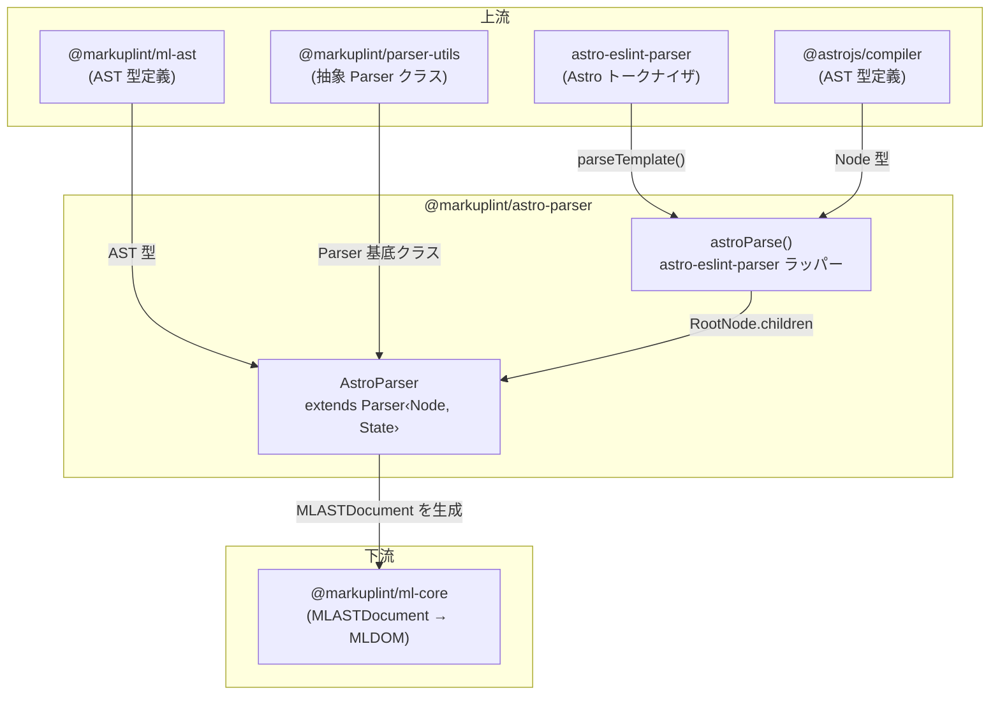

# @markuplint/astro-parser

## 概要

`@markuplint/astro-parser` は markuplint における Astro コンポーネントファイル（`.astro`）のパーサーです。`astro-eslint-parser`（`@astrojs/compiler` をラップ）を使用して Astro ソースコードをトークン化し、その結果の AST を markuplint の統一 AST 形式（`MLASTDocument`）に変換します。フロントマターブロック（`---...---`）、式コンテナ（`{expression}`）、テンプレートディレクティブ（例: `class:list`、`set:html`）、ショートハンド属性（`{prop}`）、名前空間対応の要素解決（XHTML vs SVG）など、Astro 固有の構文を処理します。

## ディレクトリ構成

```
src/
├── index.ts                — parser インスタンスを再エクスポート
├── parser.ts               — Parser<Node, State> を拡張する AstroParser クラス
├── astro-parser.ts         — astro-eslint-parser ラッパーと型の再エクスポート
├── parser.spec.ts          — AstroParser 統合テスト
└── astro-parser.spec.ts    — astro-eslint-parser ラッパーテスト
```

## アーキテクチャ図



## AstroParser クラス

### 継承関係

```
Parser<Node, State>  (@markuplint/parser-utils)
    └── AstroParser  (このパッケージ)
```

### コンストラクタ

コンストラクタは Astro 固有のオプションで基底 `Parser` を設定します:

| オプション             | 値           | 用途                                                                         |
| ---------------------- | ------------ | ---------------------------------------------------------------------------- |
| `endTagType`           | `'xml'`      | Astro は XML のように明示的な閉じタグを使用                                  |
| `selfCloseType`        | `'html+xml'` | HTML void 要素と XML スタイルの自己閉じ（`<Component />`）の両方を受け入れる |
| `tagNameCaseSensitive` | `true`       | コンポーネント（`<MyComp>`）と HTML 要素（`<div>`）を区別                    |

### State 型

パーサーは `State` 型を通じて内部状態を管理します:

| フィールド | 型       | 用途                                                            |
| ---------- | -------- | --------------------------------------------------------------- |
| `scopeNS`  | `string` | 現在の名前空間 URI、デフォルトは `http://www.w3.org/1999/xhtml` |

`scopeNS` 状態は `#updateScopeNS()` によってパーサーが要素を走査する際に更新され、`<svg>` 要素内で SVG 名前空間に切り替わり、`<foreignObject>` 内で XHTML に戻ります。

### オーバーライドメソッド

| メソッド              | 用途                                                                                                                           |
| --------------------- | ------------------------------------------------------------------------------------------------------------------------------ |
| `tokenize()`          | `astroParse()` を呼び出して Astro AST を取得し、`{ ast: rootNode.children, isFragment: true }` を返す                          |
| `nodeize()`           | Astro AST ノードを markuplint ノードに変換。ノードタイプ（frontmatter, doctype, text, comment, element, expression）で振り分け |
| `afterFlattenNodes()` | `{ exposeInvalidNode: false }` で親に委譲                                                                                      |
| `visitElement()`      | `parseCodeFragment()` で `namelessFragment: true` として生の HTML フラグメントをパースし、名前空間と終了タグ処理で親に委譲     |
| `visitChildren()`     | 親に委譲した後、予期しない兄弟ノードが残っていないことをアサート                                                               |
| `visitAttr()`         | 波括弧式の値、ショートハンド属性、テンプレートディレクティブを処理                                                             |
| `detectElementType()` | `/^[A-Z]/` パターンでコンポーネントと HTML 要素を検出（大文字始まりの名前はコンポーネント）                                    |

## フロントマター処理

Astro コンポーネントは `---` で区切られたフロントマターブロックを含むことができます:

```astro
---
const name = "World";
---
<div>{name}</div>
```

`astro-eslint-parser` は `type: 'frontmatter'` のノードを生成します。パーサーはこれを `nodeName: 'Frontmatter'` かつ `isFragment: false` の **psblock**（疑似ブロック）に変換します。区切り文字 `---` を含むブロック全体が単一の不透明ノードとしてキャプチャされます。フロントマター内のコンテンツは HTML としてパースされません。

## 式の処理

Astro の式（`{expression}`）は Astro AST で `type: 'expression'` ノードとして表現されます。パーサーはこれらを **MustacheTag** psblock ノードに変換します。

### 単純な式

`{name}` のような単純な式は単一のテキスト子ノードを持ちます。式全体が `isFragment: true` の1つの MustacheTag psblock として出力されます。

### HTML を含むネストされた式

式が HTML 要素を含む場合（例: `{list.map(item => <li>{item}</li>)}`）、パーサーは複数のノードに分割します:

1. **開始式フラグメント**: `{list.map(item => ` — 子ノードを含む MustacheTag psblock
2. **ネストされた HTML 要素**: `<li>{item}</li>` — 通常の要素として処理
3. **終了式フラグメント**: `)}` — `isFragment: false` の別の MustacheTag psblock

分割ロジックは式の children 配列で `firstChild !== lastChild` かどうかを確認します。該当する場合:

- 式の開始から最初の子の終了までの領域が開始フラグメントになる
- 最後の子の開始から式の終了までの領域が終了フラグメントになる
- 間の子は開始フラグメントの psblock 内で通常通り訪問される

## 名前空間スコーピング

`#updateScopeNS()` プライベートメソッドは、パーサーが要素を走査する際に名前空間コンテキストを管理します:

| 条件                                                  | アクション                                           |
| ----------------------------------------------------- | ---------------------------------------------------- |
| 現在の名前空間が XHTML で、ノードが `<svg>` 要素      | `scopeNS` を `http://www.w3.org/2000/svg` に切り替え |
| 現在の名前空間が SVG で、親ノードが `<foreignObject>` | `scopeNS` を `http://www.w3.org/1999/xhtml` に戻す   |

これは `nodeize()` のノードタイプ switch の前に呼び出されるため、すべての子ノードが正しい名前空間を継承します。名前空間は `visitElement()` 内で `overwriteProps: { namespace: this.state.scopeNS }` を通じて要素に適用されます。

名前空間解決の例:

```html
<div>
  <!-- XHTML -->
  <svg>
    <!-- SVG -->
    <text />
    <!-- SVG -->
    <foreignObject>
      <!-- SVG -->
      <div />
      <!-- XHTML（リセット） -->
    </foreignObject>
  </svg>
</div>
```

## 属性処理

### クォートセット

`visitAttr()` メソッドは式の値用に波括弧を含むカスタムクォートセットを使用します:

| 開始 | 終了 | タイプ   |
| ---- | ---- | -------- |
| `"`  | `"`  | `string` |
| `'`  | `'`  | `string` |
| `{`  | `}`  | `script` |

### ショートハンド属性

属性トークンが `{` で始まる場合（例: `{prop}`）、パーサーは `startState: AttrState.BeforeValue` を設定し、名前のパースをスキップして直接値の抽出に進みます。結果の属性は:

- `name.raw` = `''`（空）
- `value.raw` = `prop`
- `potentialName` = `prop`（値から推論）
- `isDynamicValue` = `true`

### テンプレートディレクティブ

Astro テンプレートディレクティブは `name:modifier` 構文を使用します。パーサーは正規表現 `/^([^:]+):([^:]+)$/` でこれらを検出します:

| ディレクティブ | `potentialName` | `isDirective` | 動作                                   |
| -------------- | --------------- | ------------- | -------------------------------------- |
| `class:list`   | `'class'`       | `undefined`   | 標準の `class` 属性にマッピング        |
| `set:html`     | `undefined`     | `true`        | Astro 固有ディレクティブとして扱われる |
| `set:text`     | `undefined`     | `true`        | Astro 固有ディレクティブとして扱われる |
| `is:raw`       | `undefined`     | `true`        | Astro 固有ディレクティブとして扱われる |
| `transition:*` | `undefined`     | `true`        | Astro 固有ディレクティブとして扱われる |

`class` ディレクティブは特別で、`potentialName: 'class'` を取得するため、`class` 属性に対する markuplint ルールが適用されます。その他すべてのディレクティブは `isDirective: true` を取得し、フレームワーク固有であり標準 HTML 属性として検証すべきでないことを markuplint に伝えます。

### 動的な値

開始クォートが `{` の属性はすべて `isDynamicValue: true` を取得します。以下に適用されます:

- 明示的な動的値: `prop={value}`
- ショートハンド属性: `{prop}`
- ネストされた式: `style={{ a: b }}`

## jsx-parser との比較

| 機能                           | `astro-parser`                         | `jsx-parser`                                      |
| ------------------------------ | -------------------------------------- | ------------------------------------------------- |
| **トークナイザ**               | `astro-eslint-parser`                  | TypeScript ESTree（`@typescript-eslint/parser`）  |
| **フロントマター**             | サポート（`---...---` psblock）        | 該当なし                                          |
| **式の構文**                   | `{expr}` を MustacheTag psblock として | `{expr}` を JSXExpressionContainer psblock として |
| **テンプレートディレクティブ** | `class:list`、`set:html` 等            | 該当なし                                          |
| **名前空間管理**               | `#updateScopeNS()` で手動管理          | html-parser の `getNamespace()` に委譲            |
| **コンポーネント検出**         | `/^[A-Z]/` パターン                    | `/^[A-Z]/` パターン                               |
| **自己閉じタイプ**             | `html+xml`                             | デフォルト（XML のみ）                            |
| **booleanish 属性**            | 未設定                                 | `booleanish: true`                                |
| **名前なしフラグメント**       | `<>...</>` サポート                    | `<>...</>` サポート                               |
| **スプレッド属性**             | 基底パーサーで処理                     | カスタム `visitSpreadAttr()` で IDL ルックアップ  |

## バージョン互換性

パースチェーンは以下に依存します:

```
astro-eslint-parser → @astrojs/compiler → Astro 構文サポート
```

`astro-eslint-parser` は `parseTemplate()` を提供するランタイム依存です。`@astrojs/compiler` は AST 型定義（`Node`、`RootNode`、`ElementNode` 等）にのみ使用される開発依存です。`astro-eslint-parser` を更新する際は、`@astrojs/compiler` 開発依存も `astro-eslint-parser` が内部で使用するバージョンに合わせて更新する必要があります。

## 主要ソースファイル

| ファイル          | 用途                                                                                  |
| ----------------- | ------------------------------------------------------------------------------------- |
| `parser.ts`       | `AstroParser` クラス — 全オーバーライドメソッドと名前空間スコーピング                 |
| `astro-parser.ts` | `astroParse()` ラッパー — `astro-eslint-parser` に委譲し、診断を `ParserError` に変換 |
| `index.ts`        | 公開 API — シングルトン `parser` インスタンスを再エクスポート                         |

## ドキュメントマップ

- [メンテナンスガイド](docs/maintenance.ja.md) -- コマンド、レシピ、トラブルシューティング
