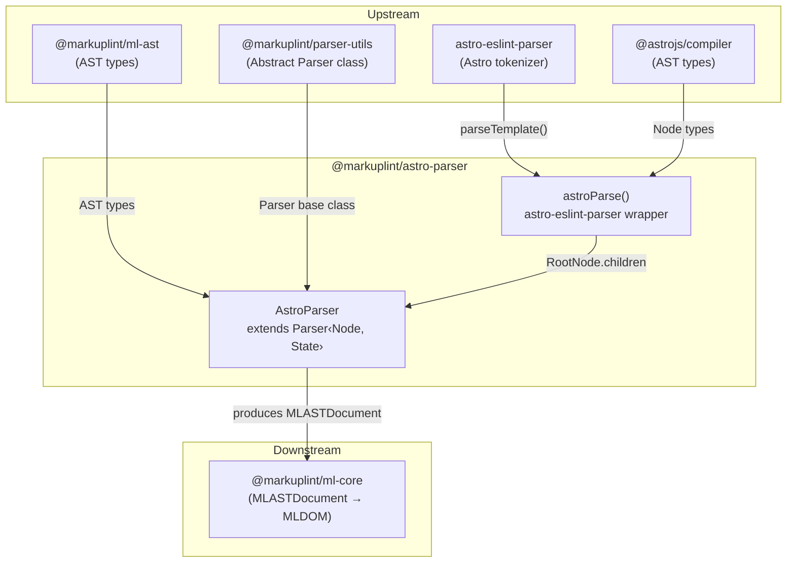

# @markuplint/astro-parser

## Overview

`@markuplint/astro-parser` is a parser for Astro component files (`.astro`) in markuplint. It uses `astro-eslint-parser` (which wraps `@astrojs/compiler`) to tokenize Astro source code, then converts the resulting AST into markuplint's unified AST format (`MLASTDocument`). The parser handles Astro-specific syntax including frontmatter blocks (`---...---`), expression containers (`{expression}`), template directives (e.g., `class:list`, `set:html`), shorthand attributes (`{prop}`), and namespace-aware element resolution (XHTML vs SVG).

## Directory Structure

```
src/
├── index.ts                — Re-exports parser instance
├── parser.ts               — AstroParser class extending Parser<Node, State>
├── astro-parser.ts         — astro-eslint-parser wrapper and type re-exports
├── parser.spec.ts          — AstroParser integration tests
└── astro-parser.spec.ts    — astro-eslint-parser wrapper tests
```

## Architecture Diagram



## AstroParser Class

### Inheritance

```
Parser<Node, State>  (from @markuplint/parser-utils)
    └── AstroParser  (this package)
```

### Constructor

The constructor configures the base `Parser` with Astro-specific options:

| Option                 | Value        | Purpose                                                                      |
| ---------------------- | ------------ | ---------------------------------------------------------------------------- |
| `endTagType`           | `'xml'`      | Astro uses explicit closing tags like XML                                    |
| `selfCloseType`        | `'html+xml'` | Accepts both HTML void elements and XML-style self-closing (`<Component />`) |
| `tagNameCaseSensitive` | `true`       | Distinguishes components (`<MyComp>`) from HTML elements (`<div>`)           |

### State Type

The parser maintains internal state through the `State` type:

| Field     | Type     | Purpose                                                           |
| --------- | -------- | ----------------------------------------------------------------- |
| `scopeNS` | `string` | Current namespace URI, defaults to `http://www.w3.org/1999/xhtml` |

The `scopeNS` state is updated by `#updateScopeNS()` as the parser traverses elements, switching to SVG namespace inside `<svg>` elements and back to XHTML inside `<foreignObject>`.

### Override Methods

| Method                | Purpose                                                                                                                                            |
| --------------------- | -------------------------------------------------------------------------------------------------------------------------------------------------- |
| `tokenize()`          | Calls `astroParse()` to get the Astro AST, returns `{ ast: rootNode.children, isFragment: true }`                                                  |
| `nodeize()`           | Converts Astro AST nodes to markuplint nodes, dispatching by node type (frontmatter, doctype, text, comment, element, expression)                  |
| `afterFlattenNodes()` | Delegates to parent with `{ exposeInvalidNode: false }`                                                                                            |
| `visitElement()`      | Parses the raw HTML fragment via `parseCodeFragment()` with `namelessFragment: true`, then delegates to parent with namespace and end tag handling |
| `visitChildren()`     | Delegates to parent, then asserts no unexpected sibling nodes remain                                                                               |
| `visitAttr()`         | Handles curly-brace expression values, shorthand attributes, and template directives                                                               |
| `detectElementType()` | Detects component vs HTML element using `/^[A-Z]/` pattern (capitalized names are components)                                                      |

## Frontmatter Handling

Astro components can include a frontmatter block delimited by `---`:

```astro
---
const name = "World";
---
<div>{name}</div>
```

The `astro-eslint-parser` produces a node with `type: 'frontmatter'`. The parser converts this to a **psblock** (pseudo-block) with `nodeName: 'Frontmatter'` and `isFragment: false`. The entire `---...---` block including delimiters is captured as a single opaque node. Content inside the frontmatter is not parsed as HTML.

## Expression Handling

Astro expressions (`{expression}`) are represented as `type: 'expression'` nodes in the Astro AST. The parser converts these to **MustacheTag** psblock nodes.

### Simple Expressions

A simple expression like `{name}` has a single text child. The entire expression is emitted as one MustacheTag psblock with `isFragment: true`.

### Nested Expressions with HTML

When an expression contains HTML elements (e.g., `{list.map(item => <li>{item}</li>)}`), the parser splits it into multiple nodes:

1. **Opening expression fragment**: `{list.map(item => ` — a MustacheTag psblock containing the child nodes
2. **Nested HTML elements**: `<li>{item}</li>` — processed as normal elements
3. **Closing expression fragment**: `)}` — a separate MustacheTag psblock with `isFragment: false`

The splitting logic checks whether `firstChild !== lastChild` in the expression's children array. If so:

- The region from the expression start to the first child's end becomes the opening fragment
- The region from the last child's start to the expression end becomes the closing fragment
- The children between are visited normally within the opening fragment's psblock

## Namespace Scoping

The `#updateScopeNS()` private method manages namespace context as the parser traverses elements:

| Condition                                                     | Action                                                  |
| ------------------------------------------------------------- | ------------------------------------------------------- |
| Current namespace is XHTML and node is `<svg>` element        | Switch `scopeNS` to `http://www.w3.org/2000/svg`        |
| Current namespace is SVG and parent node is `<foreignObject>` | Switch `scopeNS` back to `http://www.w3.org/1999/xhtml` |

This is called at the beginning of `nodeize()` before the node type switch, so all child nodes inherit the correct namespace. The namespace is applied to elements via `overwriteProps: { namespace: this.state.scopeNS }` in `visitElement()`.

Example namespace resolution:

```html
<div>
  <!-- XHTML -->
  <svg>
    <!-- SVG -->
    <text />
    <!-- SVG -->
    <foreignObject>
      <!-- SVG -->
      <div />
      <!-- XHTML (reset) -->
    </foreignObject>
  </svg>
</div>
```

## Attribute Processing

### Quote Set

The `visitAttr()` method uses a custom quote set that includes curly braces for expression values:

| Start | End | Type     |
| ----- | --- | -------- |
| `"`   | `"` | `string` |
| `'`   | `'` | `string` |
| `{`   | `}` | `script` |

### Shorthand Attributes

When an attribute token starts with `{` (e.g., `{prop}`), the parser sets `startState: AttrState.BeforeValue`, which skips name parsing and goes directly to value extraction. The resulting attribute has:

- `name.raw` = `''` (empty)
- `value.raw` = `prop`
- `potentialName` = `prop` (inferred from value)
- `isDynamicValue` = `true`

### Template Directives

Astro template directives use the `name:modifier` syntax. The parser detects these with the regex `/^([^:]+):([^:]+)$/`:

| Directive      | `potentialName` | `isDirective` | Behavior                            |
| -------------- | --------------- | ------------- | ----------------------------------- |
| `class:list`   | `'class'`       | `undefined`   | Maps to standard `class` attribute  |
| `set:html`     | `undefined`     | `true`        | Treated as Astro-specific directive |
| `set:text`     | `undefined`     | `true`        | Treated as Astro-specific directive |
| `is:raw`       | `undefined`     | `true`        | Treated as Astro-specific directive |
| `transition:*` | `undefined`     | `true`        | Treated as Astro-specific directive |

The `class` directive is special: it gets `potentialName: 'class'` so markuplint rules for the `class` attribute apply. All other directives get `isDirective: true`, which tells markuplint they are framework-specific and should not be validated as standard HTML attributes.

### Dynamic Values

Any attribute whose start quote is `{` gets `isDynamicValue: true`. This applies to:

- Explicit dynamic values: `prop={value}`
- Shorthand attributes: `{prop}`
- Nested expressions: `style={{ a: b }}`

## Comparison with jsx-parser

| Feature                   | `astro-parser`                  | `jsx-parser`                                    |
| ------------------------- | ------------------------------- | ----------------------------------------------- |
| **Tokenizer**             | `astro-eslint-parser`           | TypeScript ESTree (`@typescript-eslint/parser`) |
| **Frontmatter**           | Supported (`---...---` psblock) | Not applicable                                  |
| **Expression syntax**     | `{expr}` as MustacheTag psblock | `{expr}` as JSXExpressionContainer psblock      |
| **Template directives**   | `class:list`, `set:html`, etc.  | Not applicable                                  |
| **Namespace management**  | Manual via `#updateScopeNS()`   | Delegates to `getNamespace()` from html-parser  |
| **Component detection**   | `/^[A-Z]/` pattern              | `/^[A-Z]/` pattern                              |
| **Self-close type**       | `html+xml`                      | Default (XML-only)                              |
| **Booleanish attributes** | Not configured                  | `booleanish: true`                              |
| **Nameless fragments**    | `<>...</>` supported            | `<>...</>` supported                            |
| **Spread attributes**     | Handled by base parser          | Custom `visitSpreadAttr()` with IDL lookup      |

## Version Compatibility

The parsing chain depends on:

```
astro-eslint-parser → @astrojs/compiler → Astro syntax support
```

`astro-eslint-parser` is a runtime dependency that provides `parseTemplate()`. `@astrojs/compiler` is a dev dependency used only for AST type definitions (`Node`, `RootNode`, `ElementNode`, etc.). When updating `astro-eslint-parser`, the `@astrojs/compiler` dev dependency should also be updated to match the version that `astro-eslint-parser` uses internally.

## Key Source Files

| File              | Purpose                                                                                            |
| ----------------- | -------------------------------------------------------------------------------------------------- |
| `parser.ts`       | `AstroParser` class — all override methods and namespace scoping                                   |
| `astro-parser.ts` | `astroParse()` wrapper — delegates to `astro-eslint-parser`, converts diagnostics to `ParserError` |
| `index.ts`        | Public API — re-exports the singleton `parser` instance                                            |

## Documentation Map

- [Maintenance Guide](docs/maintenance.md) -- Commands, recipes, and troubleshooting
