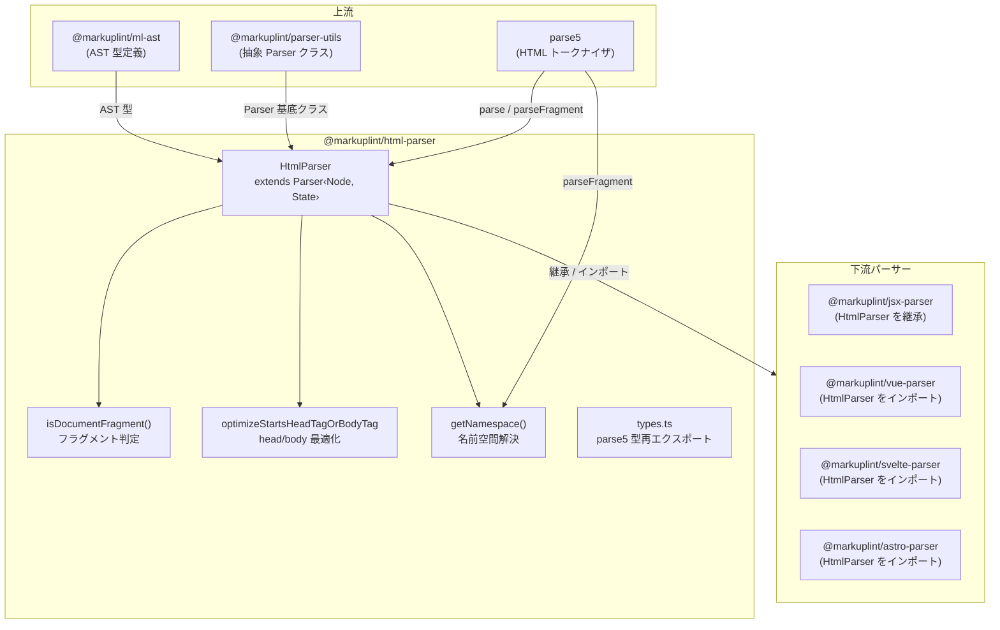
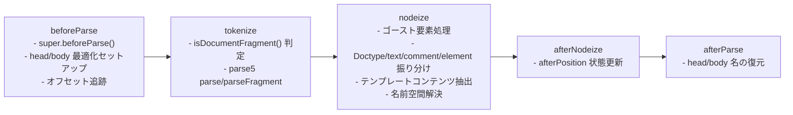
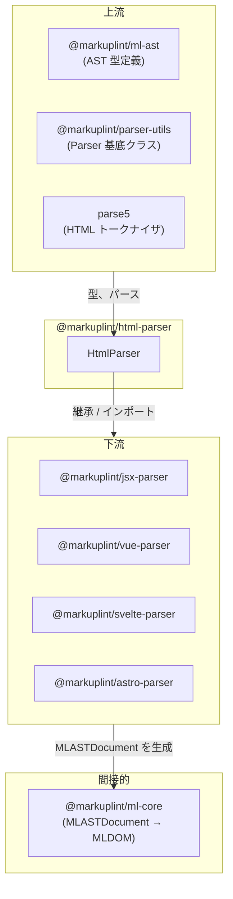

# @markuplint/html-parser

## 概要

`@markuplint/html-parser` は markuplint の標準 HTML パーサーです。parse5 の薄いラッパーとして構築されており、HTML ソースコードを統一された markuplint AST 形式（`MLASTDocument`）に変換します。完全なドキュメントと HTML フラグメントの両方を処理し、ゴースト要素（HTML 仕様により暗黙的に挿入されるタグ）の管理や、`<head>` / `<body>` タグパースの最適化を提供します。

## ディレクトリ構成

```
src/
├── index.ts                              — HtmlParser, parser, getNamespace を再エクスポート
├── parser.ts                             — Parser<Node, State> を拡張する HtmlParser クラス
├── types.ts                              — parse5 の型を再エクスポート（Node, Element 等）
├── get-namespace.ts                      — 名前空間 URI 解決（HTML/SVG/MathML）
├── is-document-fragment.ts               — 正規表現によるフラグメント/ドキュメント判定
└── optimize-starts-head-or-body.ts       — head/body タグのプレースホルダー最適化
```

## アーキテクチャ図



## HtmlParser クラス

### 継承関係

```
Parser<Node, State>  (@markuplint/parser-utils)
    └── HtmlParser   (このパッケージ)
```

### State 型

パーサーは `State` 型を通じて内部状態を管理します:

| フィールド               | 型                                      | 用途                                                                               |
| ------------------------ | --------------------------------------- | ---------------------------------------------------------------------------------- |
| `startsHeadTagOrBodyTag` | `Replacements \| null`                  | ソースが `<head>` または `<body>` で始まる場合のプレースホルダー置換を追跡         |
| `afterPosition`          | `{ endOffset, endLine, endCol, depth }` | 各深さレベルで最後に処理されたノードの終了位置を追跡。ゴースト要素の位置計算に使用 |

### オーバーライドメソッド

| メソッド            | 用途                                                                                              |
| ------------------- | ------------------------------------------------------------------------------------------------- |
| `tokenize()`        | フラグメント判定に基づき parse5 の `parse()` または `parseFragment()` を呼び出す                  |
| `beforeParse()`     | head/body 最適化のセットアップとオフセット追跡                                                    |
| `afterParse()`      | プレースホルダーから元の head/body タグ名を復元                                                   |
| `nodeize()`         | parse5 ノードを markuplint AST ノードに変換。ゴースト要素、テンプレートコンテンツ、名前空間を処理 |
| `afterNodeize()`    | ゴースト要素の位置計算用に `afterPosition` 状態を更新                                             |
| `visitText()`       | `researchTags: true` と `invalidTagAsText: true` で親に委譲                                       |
| `visitSpreadAttr()` | `null` を返す（HTML はスプレッド属性をサポートしない）                                            |

## パースパイプライン

HTML 固有のパイプラインは基底 `Parser` のパイプラインを拡張します:



## ゴースト要素処理

parse5 が HTML をパースする際、HTML 仕様に従ってソースコードに存在しない要素を暗黙的に挿入することがあります。これらは **ゴースト要素** と呼ばれ、`<html>`、`<head>`、`<body>` のようにソース位置を持たない要素です。

### 検出

ゴースト要素は parse5 の出力で `sourceCodeLocation` を持たないことで識別されます（`!location`）。

### 位置計算

ゴースト要素にはソース位置がないため、パーサーは `afterPosition` 状態を使用して位置を計算します:

1. `afterNodeize()` が各深さレベルで処理済みノードの終了位置を記録
2. `nodeize()` がゴースト要素に遭遇した際、深さが一致すれば `afterPosition` を使用し、そうでなければ親ノードの位置にフォールバック
3. ゴースト要素は空の `raw` 文字列と計算された開始位置で作成

これにより、実際の要素のソースマッピングを崩すことなく、ゴースト要素が AST 内で正しく配置されます。

## Head/Body タグ最適化

### 問題

HTML ソースが `<head>` または `<body>` で始まる場合（前に `<html>` タグがない場合）、parse5 はこれらをリテラルにパースするのではなく暗黙的な構造タグとして扱います。これにより不正な AST 出力が発生します。

### 解決策

この最適化はプレースホルダー置換戦略を使用します:

1. **セットアップ**（`optimizeStartsHeadTagOrBodyTagSetup`）: ソースが `<head>` または `<body>` で始まるかを検出。該当する場合、すべての `head`/`body` タグ名をユニークなプレースホルダー名（`x-\uFFFDh` / `x-\uFFFDb`）に置換し、元の名前を記録
2. **パース**: parse5 がプレースホルダータグ名の修正済みソースをカスタム要素として扱いパース
3. **復元**（`optimizeStartsHeadTagOrBodyTagResume`）: パース後、`parser.updateRaw()` と `parser.updateElement()` を使用して AST 内の元のタグ名を復元

## 名前空間解決

`getNamespace()` は要素の名前空間 URI を決定します:

- **デフォルト**: `http://www.w3.org/1999/xhtml`（HTML 名前空間）
- **SVG コンテキスト**: 親の名前空間が `http://www.w3.org/2000/svg` の場合、タグを `<svg>` で囲んでパースし解決された名前空間を判定
- **MathML コンテキスト**: 親の名前空間が `http://www.w3.org/1998/Math/MathML` の場合、`<math>` で囲んでパース
- **フォールバック**: フラグメントとしてノードが生成されないタグの場合、`parse()`（フルドキュメントモード）にフォールバック

## フラグメント vs ドキュメント判定

`isDocumentFragment()` は正規表現を使用して、入力をフラグメントとしてパースするかフルドキュメントとしてパースするかを判定します:

- **ドキュメント**: 入力が `<!doctype html...>` または `<html` で始まる
- **フラグメント**: それ以外すべて

この区別は重要です。parse5 の `parse()` はフルドキュメントパースアルゴリズムを適用し（暗黙の `<html>`、`<head>`、`<body>` を挿入）、`parseFragment()` はコンテンツをそのままパースするためです。

## 外部依存

| 依存パッケージ             | 用途                                                                |
| -------------------------- | ------------------------------------------------------------------- |
| `@markuplint/ml-ast`       | AST 型定義（`MLASTNodeTreeItem`、`MLASTParentNode` 等）             |
| `@markuplint/parser-utils` | 抽象 `Parser` クラス、`ChildToken`、`ParseOptions`、`ParserOptions` |
| `parse5`                   | HTML パース（`parse`、`parseFragment`、`DefaultTreeAdapterMap`）    |
| `type-fest`                | TypeScript ユーティリティ型                                         |

## 統合ポイント



### 上流

- **`@markuplint/ml-ast`** -- パーサー全体で使用される AST 型定義
- **`@markuplint/parser-utils`** -- `HtmlParser` が拡張する抽象 `Parser` クラスとユーティリティ型
- **`parse5`** -- トークン化とツリー構築を行う基盤 HTML パーサー

### 下流

4つのパーサーパッケージが `HtmlParser` に依存しています:

- **`@markuplint/jsx-parser`** -- `HtmlParser` を継承して JSX サポートを追加
- **`@markuplint/vue-parser`** -- Vue SFC の HTML 部分に `HtmlParser` をインポート
- **`@markuplint/svelte-parser`** -- Svelte コンポーネントの HTML 部分に `HtmlParser` をインポート
- **`@markuplint/astro-parser`** -- Astro コンポーネントの HTML 部分に `HtmlParser` をインポート

## ドキュメントマップ

- [メンテナンスガイド](docs/maintenance.ja.md) -- コマンド、レシピ、トラブルシューティング
