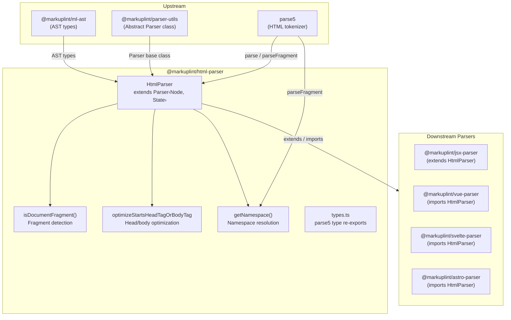
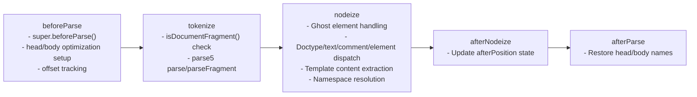
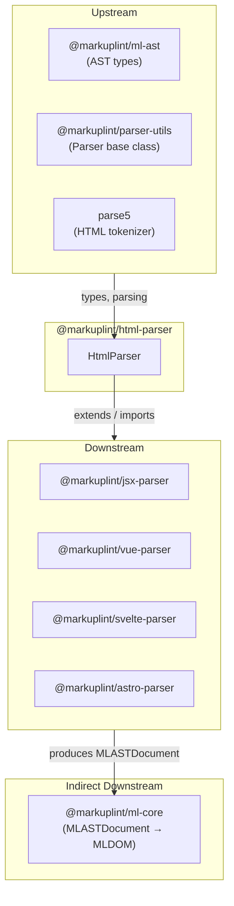

# @markuplint/html-parser

## Overview

`@markuplint/html-parser` is the standard HTML parser for markuplint. Built as a thin wrapper around parse5, it converts HTML source code into the unified markuplint AST format (`MLASTDocument`). The package handles both full documents and HTML fragments, manages ghost elements (tags implicitly inserted by the HTML spec), and provides optimizations for `<head>` / `<body>` tag parsing.

## Directory Structure

```
src/
├── index.ts                              — Re-exports HtmlParser, parser, getNamespace
├── parser.ts                             — HtmlParser class extending Parser<Node, State>
├── types.ts                              — Re-exports parse5 types (Node, Element, etc.)
├── get-namespace.ts                      — Namespace URI resolution (HTML/SVG/MathML)
├── is-document-fragment.ts               — Regex-based fragment vs document detection
└── optimize-starts-head-or-body.ts       — Head/body tag placeholder optimization
```

## Architecture Diagram



## HtmlParser Class

### Inheritance

```
Parser<Node, State>  (from @markuplint/parser-utils)
    └── HtmlParser   (this package)
```

### State Type

The parser maintains internal state through the `State` type:

| Field                    | Type                                    | Purpose                                                                                              |
| ------------------------ | --------------------------------------- | ---------------------------------------------------------------------------------------------------- |
| `startsHeadTagOrBodyTag` | `Replacements \| null`                  | Tracks head/body placeholder replacements when the source starts with `<head>` or `<body>`           |
| `afterPosition`          | `{ endOffset, endLine, endCol, depth }` | Tracks the end position of the last processed node at each depth, used for ghost element positioning |

### Override Methods

| Method              | Purpose                                                                                                  |
| ------------------- | -------------------------------------------------------------------------------------------------------- |
| `tokenize()`        | Invokes parse5 `parse()` or `parseFragment()` based on fragment detection                                |
| `beforeParse()`     | Sets up head/body optimization and offset tracking                                                       |
| `afterParse()`      | Restores original head/body tag names from placeholders                                                  |
| `nodeize()`         | Converts parse5 nodes to markuplint AST nodes, handling ghost elements, template content, and namespaces |
| `afterNodeize()`    | Updates `afterPosition` state for ghost element positioning                                              |
| `visitText()`       | Delegates to parent with `researchTags: true` and `invalidTagAsText: true`                               |
| `visitSpreadAttr()` | Returns `null` (HTML does not support spread attributes)                                                 |

## Parse Pipeline

The HTML-specific pipeline extends the base `Parser` pipeline:



## Ghost Element Handling

When parse5 parses HTML, it follows the HTML specification and may implicitly insert elements that are not present in the source code. These are called **ghost elements** — elements like `<html>`, `<head>`, and `<body>` that have no corresponding source location.

### Detection

Ghost elements are identified by having no `sourceCodeLocation` in the parse5 output (`!location`).

### Position Calculation

Since ghost elements have no source position, the parser calculates their position using the `afterPosition` state:

1. `afterNodeize()` records the end position of each processed node at its depth level
2. When `nodeize()` encounters a ghost element, it uses `afterPosition` if the depth matches, otherwise falls back to the parent node's position
3. The ghost element is created with an empty `raw` string and the calculated start position

This ensures ghost elements are positioned correctly in the AST without disrupting the source mapping of real elements.

## Head/Body Tag Optimization

### Problem

When HTML source starts with `<head>` or `<body>` (without a preceding `<html>` tag), parse5 treats them as implicit structural tags rather than parsing them literally. This causes incorrect AST output.

### Solution

The optimization uses a placeholder replacement strategy:

1. **Setup** (`optimizeStartsHeadTagOrBodyTagSetup`): Detects if the source starts with `<head>` or `<body>`. If so, replaces all `head`/`body` tag names with unique placeholder names (`x-\uFFFDh` / `x-\uFFFDb`) and records the original names
2. **Parse**: parse5 parses the modified source with placeholder tag names, treating them as custom elements
3. **Resume** (`optimizeStartsHeadTagOrBodyTagResume`): After parsing, restores the original tag names in the AST using `parser.updateRaw()` and `parser.updateElement()`

## Namespace Resolution

`getNamespace()` determines the namespace URI for an element:

- **Default**: `http://www.w3.org/1999/xhtml` (HTML namespace)
- **SVG context**: When the parent namespace is `http://www.w3.org/2000/svg`, wraps the tag in `<svg>` and parses to determine the resolved namespace
- **MathML context**: When the parent namespace is `http://www.w3.org/1998/Math/MathML`, wraps in `<math>` and parses
- **Fallback**: For tags that produce no nodes as fragments, falls back to `parse()` (full document mode)

## Fragment vs Document Detection

`isDocumentFragment()` uses a regex to determine whether the input should be parsed as a fragment or a full document:

- **Document**: Input starts with `<!doctype html...>` or `<html`
- **Fragment**: Everything else

This distinction matters because parse5's `parse()` applies the full document parsing algorithm (inserting implicit `<html>`, `<head>`, `<body>`), while `parseFragment()` parses content as-is.

## External Dependencies

| Dependency                 | Purpose                                                                |
| -------------------------- | ---------------------------------------------------------------------- |
| `@markuplint/ml-ast`       | AST type definitions (`MLASTNodeTreeItem`, `MLASTParentNode`, etc.)    |
| `@markuplint/parser-utils` | Abstract `Parser` class, `ChildToken`, `ParseOptions`, `ParserOptions` |
| `parse5`                   | HTML parsing (`parse`, `parseFragment`, `DefaultTreeAdapterMap`)       |
| `type-fest`                | TypeScript utility types                                               |

## Integration Points



### Upstream

- **`@markuplint/ml-ast`** -- AST type definitions used throughout the parser
- **`@markuplint/parser-utils`** -- Abstract `Parser` class that `HtmlParser` extends, plus utility types
- **`parse5`** -- The underlying HTML parser that performs tokenization and tree construction

### Downstream

Four parser packages depend on `HtmlParser`:

- **`@markuplint/jsx-parser`** -- Extends `HtmlParser` to add JSX support
- **`@markuplint/vue-parser`** -- Imports `HtmlParser` for HTML portions of Vue SFCs
- **`@markuplint/svelte-parser`** -- Imports `HtmlParser` for HTML portions of Svelte components
- **`@markuplint/astro-parser`** -- Imports `HtmlParser` for HTML portions of Astro components

## Documentation Map

- [Maintenance Guide](docs/maintenance.md) -- Commands, recipes, and troubleshooting
