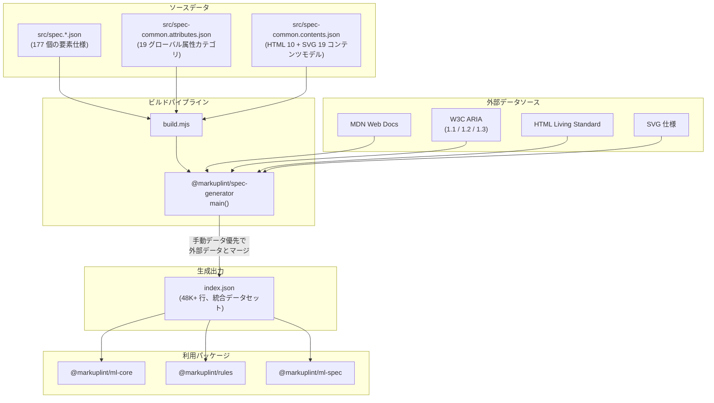
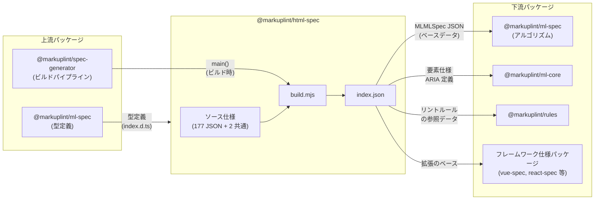

# @markuplint/html-spec

## 概要

`@markuplint/html-spec` は HTML Living Standard のデータセットプロバイダです。TypeScript ソースコードを含まない純粋なデータパッケージであり、177 個の要素 JSON 仕様ファイルと 2 個の共通定義ファイルから構成されます。

ビルド時に `@markuplint/spec-generator` が外部ソース（MDN、W3C ARIA 1.1/1.2/1.3、HTML Living Standard、SVG 仕様）からデータをフェッチし、手動で管理されたローカル仕様とマージして、統合された `index.json`（48,000 行以上、約 1.4MB）を生成します。手動データは常に外部データより優先され、仕様の正確性を保証します。

## ディレクトリ構成

```
src/
├── spec.a.json                       # <a> 要素の仕様
├── spec.abbr.json                    # <abbr> 要素の仕様
├── ... (計 177 個の要素仕様ファイル)
├── spec.svg_text.json                # <svg:text> 要素の仕様
├── spec-common.attributes.json       # 19 個のグローバル属性カテゴリ定義
└── spec-common.contents.json         # HTML 10 + SVG 19 のコンテンツモデルカテゴリ定義

build.mjs                             # @markuplint/spec-generator を呼び出すビルドスクリプト
index.json                            # 生成出力（48K 行以上、編集不可）
index.js                              # CommonJS エントリーポイント
index.d.ts                            # TypeScript 型宣言
test/
└── structure.spec.mjs                # スキーマ検証テスト
```

## アーキテクチャ図



## データ構造

`index.json` は 3 つのトップレベルキーで構成されます。

### `cites`

生成プロセス中にフェッチされた全 URL のソート済みリストです。データの出所を追跡するために使用されます。

### `def`

グローバル定義を格納するオブジェクトです。

| キー             | 内容                                                                 |
| ---------------- | -------------------------------------------------------------------- |
| `#globalAttrs`   | 19 個のグローバル属性カテゴリ（`#HTMLGlobalAttrs` 等）               |
| `#aria`          | バージョン別 ARIA 定義（1.1, 1.2, 1.3）                              |
| `#contentModels` | コンテンツモデルカテゴリマクロ（HTML 10 カテゴリ + SVG 19 カテゴリ） |

### `specs`

全要素仕様の配列です。各要素は `contentModel`、`globalAttrs`、`attributes`、`aria` などのフィールドを持ちます。

TypeScript 型は `index.d.ts` で以下のように宣言されます。

```typescript
import type { Cites, ElementSpec, SpecDefs } from '@markuplint/ml-spec';

declare const json: {
  cites: Cites;
  def: SpecDefs;
  specs: ElementSpec[];
};

export = json;
```

## 主要コンポーネント

| コンポーネント | ファイル                               | 説明                                                          |
| -------------- | -------------------------------------- | ------------------------------------------------------------- |
| ソース仕様     | `src/spec.*.json`（177 ファイル）      | 要素ごとの仕様定義（コンテンツモデル、属性、ARIA マッピング） |
| 共通定義       | `src/spec-common.*.json`（2 ファイル） | グローバル属性カテゴリとコンテンツモデルマクロの共有定義      |
| ビルドシステム | `build.mjs`                            | `@markuplint/spec-generator` の `main()` を呼び出すエントリー |
| 生成出力       | `index.json`                           | 統合データセット（48K 行以上、直接編集不可）                  |
| 型宣言         | `index.d.ts`                           | `@markuplint/ml-spec` からの型を再エクスポート                |
| スキーマ検証   | `test/structure.spec.mjs`              | Ajv ベースの JSON スキーマ検証テスト                          |

## 要素仕様のフォーマット

各 `src/spec.*.json` ファイルは以下の構造を持ちます（例: `spec.a.json`）。

```jsonc
// https://html.spec.whatwg.org/multipage/text-level-semantics.html#the-a-element
{
  "contentModel": {
    "contents": [
      {
        "transparent": ":not(:model(interactive), a, [tabindex])"
      }
    ]
  },
  "globalAttrs": {
    "#HTMLGlobalAttrs": true,
    "#GlobalEventAttrs": true,
    "#ARIAAttrs": true,
    "#HTMLLinkAndFetchingAttrs": ["href", "target", "download", "ping", "rel", "hreflang", "type", "referrerpolicy"]
  },
  "attributes": {},
  "aria": {
    "implicitRole": "link",
    "permittedRoles": ["button", "checkbox", "menuitem", ...],
    "properties": { ... },
    "conditions": { ... }
  }
}
```

主要フィールドの説明:

| フィールド     | 説明                                                                        |
| -------------- | --------------------------------------------------------------------------- |
| `contentModel` | 許可される子要素のパターン定義                                              |
| `globalAttrs`  | 使用するグローバル属性カテゴリのマッピング（`true` で全属性、配列で選択的） |
| `attributes`   | 要素固有の属性定義                                                          |
| `aria`         | ARIA マッピング（暗黙ロール、許可ロール、プロパティ、条件分岐）             |

## 共通定義ファイル

### `spec-common.attributes.json`

19 個のグローバル属性カテゴリを定義します。カテゴリキーは `#` プレフィックスで参照されます。

| カテゴリキー                | 内容                                               |
| --------------------------- | -------------------------------------------------- |
| `#HTMLGlobalAttrs`          | `accesskey`, `contenteditable`, `dir` 等の標準属性 |
| `#GlobalEventAttrs`         | `onclick`, `onload` 等のイベントハンドラ属性       |
| `#ARIAAttrs`                | `aria-*` 属性群                                    |
| `#HTMLLinkAndFetchingAttrs` | `href`, `target`, `download` 等のリンク関連属性    |

### `spec-common.contents.json`

コンテンツモデルカテゴリのマクロ定義です。

- **HTML カテゴリ**（10 個）: `#metadata`, `#flow`, `#sectioning`, `#heading`, `#phrasing`, `#embedded`, `#interactive`, `#palpable`, `#scriptSupporting`, `#formAssociated`
- **SVG カテゴリ**（19 個）: `#SVGAnimation`, `#SVGDescriptive`, `#SVGShape`, `#SVGStructural` 等

## ビルドパイプライン

ビルドは `build.mjs` を通じて `@markuplint/spec-generator` の `main()` 関数を呼び出します。

```javascript
import path from 'node:path';
import { main } from '@markuplint/spec-generator';

await main({
  outputFilePath: path.resolve(import.meta.dirname, 'index.json'),
  htmlFilePattern: path.resolve(import.meta.dirname, 'src', 'spec.*.json'),
  commonAttrsFilePath: path.resolve(import.meta.dirname, 'src', 'spec-common.attributes.json'),
  commonContentsFilePath: path.resolve(import.meta.dirname, 'src', 'spec-common.contents.json'),
});
```

ビルドプロセスの流れ:

1. `src/spec.*.json` と `src/spec-common.*.json` を読み込む
2. MDN、W3C ARIA（1.1/1.2/1.3）、HTML Living Standard、SVG 仕様から外部データをフェッチ
3. 手動仕様と外部データをマージ（手動データが優先）
4. 統合された `index.json` を出力

ビルドコマンド:

```bash
# 生成 + フォーマット
yarn gen

# 生成のみ
yarn gen:build

# フォーマットのみ
yarn gen:prettier
```

## テスト

`test/structure.spec.mjs` は以下の検証を行います。

1. **構造テスト**: 全要素仕様に対して `resolveNamespace()` と `getAttrSpecsByNames()` を呼び出し、属性仕様の整合性を確認
2. **スキーマ検証**: Ajv を使用して各ソース JSON ファイルが `@markuplint/ml-spec` の JSON スキーマに適合することを検証
   - `spec.*.json` → `element.schema.json`（+ 関連スキーマ）
   - `spec-common.attributes.json` → `global-attributes.schema.json`

## 外部依存パッケージ

| パッケージ                   | 種別 | 用途                                         |
| ---------------------------- | ---- | -------------------------------------------- |
| `@markuplint/ml-spec`        | 本番 | 型定義（`Cites`, `ElementSpec`, `SpecDefs`） |
| `@markuplint/spec-generator` | 開発 | ビルドパイプライン                           |
| `@markuplint/test-tools`     | 開発 | テストユーティリティ（`glob` 等）            |

## 他パッケージとの連携



### 上流

- **`@markuplint/ml-spec`** は `index.d.ts` で使用される型定義（`Cites`, `ElementSpec`, `SpecDefs`）を提供します。
- **`@markuplint/spec-generator`** はビルド時に外部仕様のフェッチとデータ統合を担当します。

### 下流

- **`@markuplint/ml-spec`** は生成された `index.json` をベース `MLMLSpec` データとして読み込み、ARIA/HTML アルゴリズムに供給します。
- **`@markuplint/ml-core`** は要素仕様と ARIA 定義を使用して、仕様認識を持つドキュメント表現を構築します。
- **`@markuplint/rules`** は仕様データを参照してリントルール（ロール検証、コンテンツモデルチェック等）を実装します。
- **フレームワーク仕様パッケージ**（`@markuplint/vue-spec`, `@markuplint/react-spec` 等）は `index.json` のデータをベースとして、フレームワーク固有の要素や属性を拡張します。

## ドキュメントマップ

- [要素仕様フォーマット](docs/element-spec-format.ja.md) -- 要素 JSON の構造、フィールド定義、条件分岐パターン
- [ビルドパイプライン](docs/build-pipeline.ja.md) -- spec-generator の動作、外部データフェッチ、マージ戦略
- [メンテナンスガイド](docs/maintenance.ja.md) -- 新規要素の追加、属性更新、外部仕様の変更対応
