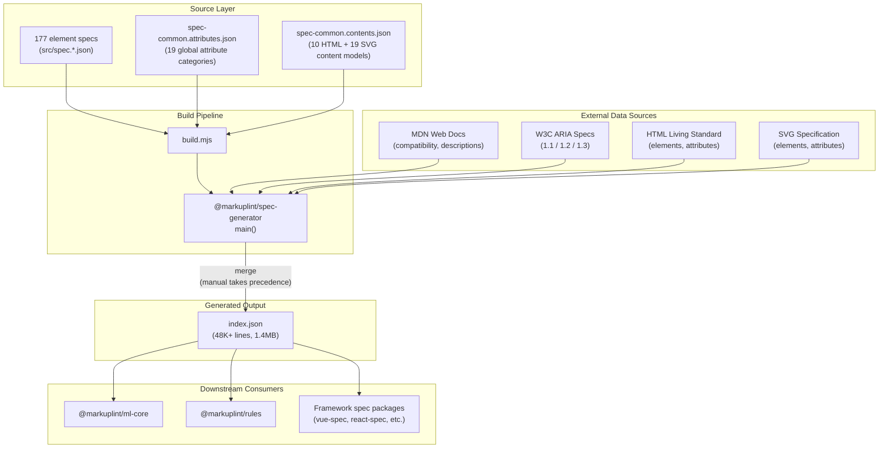
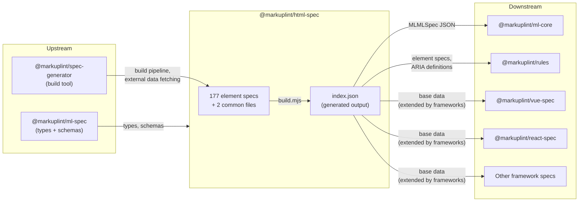

# @markuplint/html-spec

## Overview

`@markuplint/html-spec` is the canonical HTML Living Standard dataset provider for markuplint. It is a pure data package with no TypeScript source code. It contains 177 per-element JSON specification files and 2 common definition files that are processed by `@markuplint/spec-generator` to produce a single consolidated `index.json` (48K+ lines, 1.4MB).

During the build, `@markuplint/spec-generator` fetches live data from MDN, W3C ARIA specifications (1.1, 1.2, 1.3), the HTML Living Standard, and SVG specifications, then merges that external data with the hand-authored JSON files. Manual specifications always take precedence over fetched data, ensuring stable, curated definitions while still benefiting from automated enrichment.

## Directory Structure

```
src/
├── spec.a.json                       # <a> element specification
├── spec.abbr.json                    # <abbr> element specification
├── ... (177 element specification files total)
├── spec.svg_text.json                # <svg:text> element specification
├── spec-common.attributes.json       # 19 global attribute category definitions
└── spec-common.contents.json         # 10 HTML + 19 SVG content model category definitions

build.mjs                             # Build script invoking @markuplint/spec-generator
index.json                            # Generated output (48K+ lines, DO NOT EDIT)
index.js                              # CommonJS entry point (re-exports index.json)
index.d.ts                            # TypeScript type declarations
test/
└── structure.spec.mjs                # Schema validation tests
```

## Architecture Diagram



## Data Structure

The generated `index.json` contains three top-level keys:

### `cites`

A sorted list of all URLs fetched during generation. This provides traceability for every external data source that contributed to the output.

### `def`

Global definitions shared across all element specifications.

| Key              | Description                                                                                        |
| ---------------- | -------------------------------------------------------------------------------------------------- |
| `#globalAttrs`   | 19 global attribute categories defining attributes available on all or specific groups of elements |
| `#aria`          | ARIA role and property definitions per specification version (1.1, 1.2, 1.3)                       |
| `#contentModels` | Content model category macros mapping category names to their member elements                      |

**Global Attribute Categories** (`#globalAttrs`):

| Category                            | Scope                                 |
| ----------------------------------- | ------------------------------------- |
| `#HTMLGlobalAttrs`                  | HTML global attributes                |
| `#GlobalEventAttrs`                 | Global event handler attributes       |
| `#ARIAAttrs`                        | ARIA state and property attributes    |
| `#HTMLLinkAndFetchingAttrs`         | Link/fetch-related attributes         |
| `#HTMLEmbededAndMediaContentAttrs`  | Embedded and media content attributes |
| `#HTMLFormControlElementAttrs`      | Form control attributes               |
| `#HTMLTableCellElementAttrs`        | Table cell attributes                 |
| `#SVGAnimationAdditionAttrs`        | SVG animation addition attributes     |
| `#SVGAnimationAttributeTargetAttrs` | SVG animation attribute target attrs  |
| `#SVGAnimationEventAttrs`           | SVG animation event attributes        |
| `#SVGAnimationTargetElementAttrs`   | SVG animation target element attrs    |
| `#SVGAnimationTimingAttrs`          | SVG animation timing attributes       |
| `#SVGAnimationValueAttrs`           | SVG animation value attributes        |
| `#SVGConditionalProcessingAttrs`    | SVG conditional processing attributes |
| `#SVGCoreAttrs`                     | SVG core attributes                   |
| `#SVGFilterPrimitiveAttrs`          | SVG filter primitive attributes       |
| `#SVGPresentationAttrs`             | SVG presentation attributes           |
| `#SVGTransferFunctionAttrs`         | SVG transfer function attributes      |
| `#XLinkAttrs`                       | XLink attributes                      |

**Content Model Categories** (`#contentModels`):

- **HTML (10):** `#metadata`, `#flow`, `#sectioning`, `#heading`, `#phrasing`, `#embedded`, `#interactive`, `#palpable`, `#script-supporting`, plus one empty placeholder
- **SVG (19):** `#SVGAnimation`, `#SVGBasicShapes`, `#SVGContainer`, `#SVGDescriptive`, `#SVGFilterPrimitive`, `#SVGFont`, `#SVGGradient`, `#SVGGraphics`, `#SVGGraphicsReferencing`, `#SVGLightSource`, `#SVGNeverRendered`, `#SVGPaintServer`, `#SVGRenderable`, `#SVGShape`, `#SVGStructural`, `#SVGStructurallyExternal`, `#SVGTextContent`, `#SVGTextContentChild`, plus one empty placeholder

### `specs`

An array of element specifications. Each entry defines a single HTML or SVG element with its content model, permitted attributes, ARIA role mappings, and categorization.

## Core Components

| Component             | Files                                                      | Purpose                                                                        |
| --------------------- | ---------------------------------------------------------- | ------------------------------------------------------------------------------ |
| Source Specifications | 177 `src/spec.*.json` files                                | Per-element definitions: content models, attributes, ARIA mappings             |
| Common Definitions    | `spec-common.attributes.json`, `spec-common.contents.json` | Shared global attribute categories and content model category macros           |
| Build System          | `build.mjs`                                                | Invokes `@markuplint/spec-generator` to merge sources with external data       |
| Generated Output      | `index.json`                                               | Single consolidated dataset consumed by downstream packages                    |
| Type Declarations     | `index.d.ts`                                               | Re-exports `Cites`, `ElementSpec`, `SpecDefs` from `@markuplint/ml-spec`       |
| Schema Validation     | `test/structure.spec.mjs`                                  | Ajv-based validation of generated output against `@markuplint/ml-spec` schemas |

## External Dependencies

| Dependency                   | Type       | Purpose                                                      |
| ---------------------------- | ---------- | ------------------------------------------------------------ |
| `@markuplint/ml-spec`        | Production | Type definitions (`Cites`, `ElementSpec`, `SpecDefs`)        |
| `@markuplint/spec-generator` | Dev        | Build pipeline: merges manual specs with MDN/W3C/WHATWG data |
| `@markuplint/test-tools`     | Dev        | Test utilities (`glob` for file discovery)                   |

## Integration Points



### Upstream

- **`@markuplint/ml-spec`** provides the TypeScript type definitions (`MLMLSpec`, `ElementSpec`, `SpecDefs`) and JSON schemas used to validate the generated output. The `index.d.ts` re-exports these types.
- **`@markuplint/spec-generator`** is the build tool invoked by `build.mjs`. It reads the source JSON files, fetches live data from MDN Web Docs, W3C ARIA specifications (versions 1.1, 1.2, 1.3), the HTML Living Standard, and SVG specifications, then merges everything into `index.json`.

### Downstream

- **`@markuplint/ml-core`** loads the `MLMLSpec` JSON to build its internal representation of elements with spec awareness.
- **`@markuplint/rules`** consumes element specifications and ARIA definitions to implement lint rules for role validation, content model checking, and accessibility auditing.
- **Framework spec packages** (`@markuplint/vue-spec`, `@markuplint/react-spec`, etc.) extend this base dataset with framework-specific elements, attributes, and component definitions.

## Documentation Map

- [Element Specification Format](docs/element-spec-format.md) -- Structure and fields of per-element JSON files
- [Build Pipeline](docs/build-pipeline.md) -- How build.mjs and spec-generator produce index.json
- [Maintenance Guide](docs/maintenance.md) -- Adding elements, updating external sources, troubleshooting
