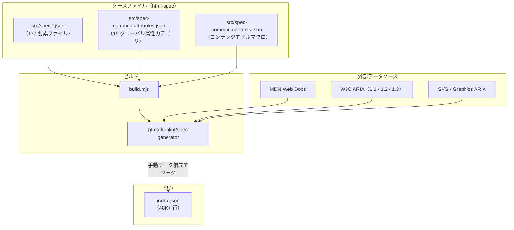

# ビルドパイプライン

ソースファイルと外部データから `index.json` がどのように生成されるかを解説します。

## 概要

`@markuplint/html-spec` は `@markuplint/spec-generator` を使用して、単一の統合 `index.json` ファイルを生成します。ビルドプロセス:

1. `src/` から 177 個の要素 JSON 仕様ファイルと 2 個の共通定義ファイルを読み込む
2. MDN Web Docs、W3C ARIA 仕様、HTML Living Standard から外部データをフェッチ
3. 手動仕様と外部データをマージ（手動データが常に優先）
4. 統合結果を `index.json` に出力（約 48K 行、約 1.4MB）

ビルドは外部データをライブでフェッチするため、ネットワーク依存です。クリーンな実行で数分かかります。

## ビルドフロー図



## ビルドエントリポイント

`build.mjs` が `@markuplint/spec-generator` の `main()` を呼び出します。

```javascript
import path from 'node:path';
import { main } from '@markuplint/spec-generator';

await main({
  outputFilePath: path.resolve(import.meta.dirname, 'index.json'),
  htmlFilePattern: path.resolve(import.meta.dirname, 'src', 'spec.*.json'),
  commonAttrsFilePath: path.resolve(import.meta.dirname, 'src', 'spec-common.attributes.json'),
  commonContentsFilePath: path.resolve(import.meta.dirname, 'src', 'spec-common.contents.json'),
});
```

| オプション               | 説明                                       |
| ------------------------ | ------------------------------------------ |
| `outputFilePath`         | `index.json` の出力先パス                  |
| `htmlFilePattern`        | 要素仕様ファイルにマッチする glob パターン |
| `commonAttrsFilePath`    | グローバル属性定義ファイルのパス           |
| `commonContentsFilePath` | コンテンツモデルマクロ定義ファイルのパス   |

## 外部データソース

spec-generator はビルド時に以下の外部ソースからデータをフェッチします。

| ソース                                    | 提供データ                                                   |
| ----------------------------------------- | ------------------------------------------------------------ |
| MDN Web Docs（HTML）                      | 要素の説明、コンテンツカテゴリ、属性メタデータ、互換性フラグ |
| MDN Web Docs（SVG）                       | SVG 要素の説明、非推奨要素リスト                             |
| WAI-ARIA 1.1（`w3.org/TR/wai-aria-1.1/`） | ロール定義、プロパティ、ステート                             |
| WAI-ARIA 1.2（`w3.org/TR/wai-aria-1.2/`） | 更新されたロール定義                                         |
| WAI-ARIA 1.3（`w3c.github.io/aria/`）     | 最新の Editor's Draft                                        |
| Graphics ARIA                             | グラフィックス固有 ARIA ロール                               |
| HTML-ARIA（`w3.org/TR/html-aria/`）       | HTML 属性から ARIA プロパティへのマッピング                  |

spec-generator の内部アーキテクチャ（スクレイピング、キャッシュ、モジュール構成）の詳細は `@markuplint/spec-generator` 自身のドキュメントを参照してください。

## データ優先順位ルール

手動仕様と外部データが重複する場合:

| データ         | ソース          | 優先度                     |
| -------------- | --------------- | -------------------------- |
| `contentModel` | 手動仕様のみ    | 最高（スクレイピングなし） |
| `aria`         | 手動仕様のみ    | 最高（スクレイピングなし） |
| `globalAttrs`  | 手動仕様のみ    | 最高（スクレイピングなし） |
| `attributes`   | 手動仕様 + MDN  | 手動が優先、MDN が補完     |
| `description`  | MDN のみ        | MDN のみ                   |
| `categories`   | MDN のみ        | MDN のみ                   |
| `cite`         | 手動仕様 or MDN | 手動仕様があれば優先       |
| 互換性フラグ   | 手動仕様 + MDN  | 手動が優先、MDN が補完     |

ポイント:

- **手動データが常に優先** -- MDN スクレイピングデータを上書きする
- `attributes` は、手動仕様に同名の属性がない場合のみ MDN データが追加される
- `contentModel` と `aria` はスクレイピングされない -- `src/spec.*.json` からのみ取得
- `cite` URL はデフォルトで MDN ページだが、要素ごとにオーバーライド可能

**属性マージの詳細動作:**

1. **仕様ファイルに属性定義あり** -- MDN データ（description、互換性フラグ）がマージ
   されるが、仕様ファイル側の値が優先される。例えば、仕様ファイルで `"deprecated": true`
   を設定し、MDN が deprecated フラグを付けていない場合、仕様ファイルの値が使われる。
2. **MDN にのみ属性あり** -- MDN のメタデータとともにそのまま追加される。
3. **仕様ファイルにのみ属性あり** -- MDN による補完なしにそのまま使用される。

## 生成出力構造

`index.json` は `@markuplint/ml-spec` の `ExtendedSpec` 型に従います。

```typescript
{
  cites: string[];           // フェッチされた全 URL のソート済みリスト
  def: {
    "#globalAttrs": { ... }, // 19 グローバル属性カテゴリ
    "#aria": {               // バージョン別 ARIA 定義
      "1.1": { roles, props, graphicsRoles },
      "1.2": { roles, props, graphicsRoles },
      "1.3": { roles, props, graphicsRoles }
    },
    "#contentModels": { ... } // コンテンツモデルカテゴリマクロ
  },
  specs: ElementSpec[]       // 要素仕様配列（アルファベット順、SVG は末尾）
}
```

- `cites` -- フェッチされた全 URL（トレーサビリティ用）
- `def["#globalAttrs"]` -- `spec-common.attributes.json` から
- `def["#aria"]` -- W3C ARIA 仕様からスクレイピング
- `def["#contentModels"]` -- `spec-common.contents.json` から
- `specs` -- マージ済み要素仕様の配列

## ビルドコマンド

| コマンド                                                | 説明                                           |
| ------------------------------------------------------- | ---------------------------------------------- |
| `yarn workspace @markuplint/html-spec run gen`          | フル生成（ビルド + Prettier フォーマット）     |
| `yarn workspace @markuplint/html-spec run gen:build`    | 生成のみ                                       |
| `yarn workspace @markuplint/html-spec run gen:prettier` | Prettier で `index.json` をフォーマット        |
| `yarn up:gen`                                           | リポジトリルートから全 spec パッケージを再生成 |

`gen` は `npm-run-all` を使用して `gen:build` → `gen:prettier` を順次実行します。

## エクスポート

パッケージは 2 通りの方法でデータをエクスポートします。

```json
{
  ".": { "import": { "default": "./index.js", "types": "./index.d.ts" } },
  "./json": "./index.json"
}
```

型付きラッパーのインポート、または `./json` サブパスによる生の JSON アクセスが可能です。
