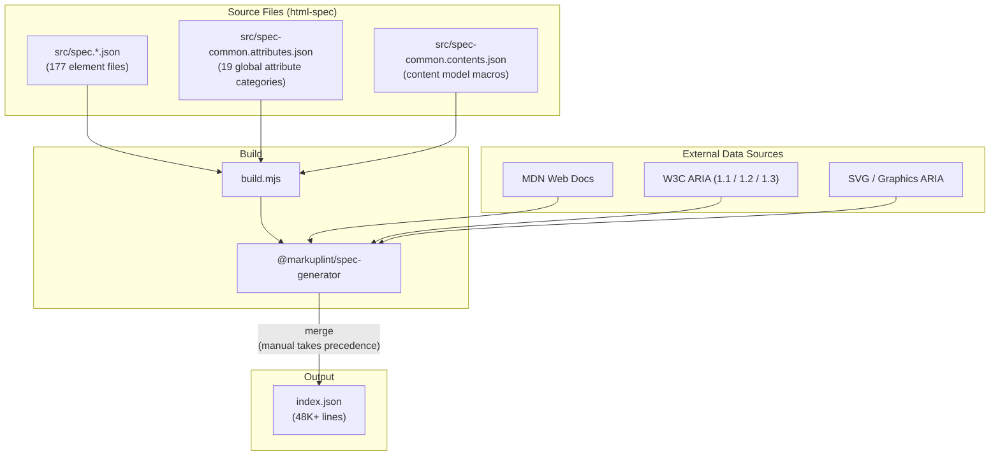

# Build Pipeline

This document describes how `index.json` is generated from the source files and external data.

## Overview

The `@markuplint/html-spec` package uses `@markuplint/spec-generator` to produce a single consolidated `index.json` file. The build process:

1. Reads 177 per-element JSON spec files and 2 common definition files from `src/`
2. Fetches external data from MDN Web Docs, W3C ARIA specifications, and the HTML Living Standard
3. Merges manual specifications with external data (manual data takes precedence)
4. Writes the consolidated output to `index.json` (~48K lines, ~1.4MB)

The build is network-dependent because external data is fetched live. Expect several minutes on a clean run.

## Build Flow Diagram



## Build Entry Point

The build is triggered via `build.mjs`:

```javascript
import path from 'node:path';
import { main } from '@markuplint/spec-generator';

await main({
  outputFilePath: path.resolve(import.meta.dirname, 'index.json'),
  htmlFilePattern: path.resolve(import.meta.dirname, 'src', 'spec.*.json'),
  commonAttrsFilePath: path.resolve(import.meta.dirname, 'src', 'spec-common.attributes.json'),
  commonContentsFilePath: path.resolve(import.meta.dirname, 'src', 'spec-common.contents.json'),
});
```

| Option                   | Description                                      |
| ------------------------ | ------------------------------------------------ |
| `outputFilePath`         | Absolute path where `index.json` will be written |
| `htmlFilePattern`        | Glob pattern matching per-element spec files     |
| `commonAttrsFilePath`    | Path to global attribute definitions             |
| `commonContentsFilePath` | Path to content model macro definitions          |

## External Data Sources

The spec-generator fetches live data from the following sources during the build:

| Source                                   | Data Provided                                                                     |
| ---------------------------------------- | --------------------------------------------------------------------------------- |
| MDN Web Docs (HTML)                      | Element descriptions, content categories, attribute metadata, compatibility flags |
| MDN Web Docs (SVG)                       | SVG element descriptions and deprecated element list                              |
| WAI-ARIA 1.1 (`w3.org/TR/wai-aria-1.1/`) | Role definitions, properties, states                                              |
| WAI-ARIA 1.2 (`w3.org/TR/wai-aria-1.2/`) | Updated role definitions                                                          |
| WAI-ARIA 1.3 (`w3c.github.io/aria/`)     | Latest editor's draft                                                             |
| Graphics ARIA                            | Graphics-specific ARIA roles                                                      |
| HTML-ARIA (`w3.org/TR/html-aria/`)       | HTML attribute to ARIA property mappings                                          |

For details on the spec-generator's internal architecture (scraping, caching, module structure), see `@markuplint/spec-generator`'s own documentation.

## Data Precedence Rules

When manual specifications and external data overlap:

| Data                | Source             | Precedence                  |
| ------------------- | ------------------ | --------------------------- |
| `contentModel`      | Manual spec only   | Highest (never scraped)     |
| `aria`              | Manual spec only   | Highest (never scraped)     |
| `globalAttrs`       | Manual spec only   | Highest (never scraped)     |
| `attributes`        | Manual spec + MDN  | Manual wins; MDN fills gaps |
| `description`       | MDN only           | MDN only                    |
| `categories`        | MDN only           | MDN only                    |
| `cite`              | Manual spec or MDN | Manual spec if provided     |
| Compatibility flags | Manual spec + MDN  | Manual wins; MDN fills gaps |

Key points:

- **Manual data always takes precedence** over MDN-scraped data
- For `attributes`, MDN-scraped attributes are added only when the manual spec does not define that attribute name
- Content models and ARIA mappings are never scraped -- they come exclusively from your `src/spec.*.json` files
- The `cite` URL defaults to the MDN page but can be overridden per element

**Attribute merge behavior in detail:**

1. **Attribute defined in spec file** -- MDN data (description, compatibility flags) is
   merged in, but spec-side values take precedence. For example, if the spec file sets
   `"deprecated": true` but MDN does not flag the attribute as deprecated, the spec
   value wins.
2. **Attribute exists only in MDN** -- Added to the element as-is with MDN metadata.
3. **Attribute exists only in spec file** -- Used as-is with no MDN augmentation.

## Generated Output Structure

The `index.json` follows the `ExtendedSpec` type from `@markuplint/ml-spec`:

```typescript
{
  cites: string[];           // Sorted list of all URLs fetched during generation
  def: {
    "#globalAttrs": { ... }, // 19 global attribute categories
    "#aria": {               // ARIA definitions per version
      "1.1": { roles, props, graphicsRoles },
      "1.2": { roles, props, graphicsRoles },
      "1.3": { roles, props, graphicsRoles }
    },
    "#contentModels": { ... } // Content model category macros
  },
  specs: ElementSpec[]       // Element specifications, sorted alphabetically (SVG after HTML)
}
```

- `cites` -- all fetched URLs, for traceability
- `def["#globalAttrs"]` -- from `spec-common.attributes.json`
- `def["#aria"]` -- scraped from W3C ARIA specifications
- `def["#contentModels"]` -- from `spec-common.contents.json`
- `specs` -- merged element specifications array

## Build Commands

| Command                                                 | Description                                       |
| ------------------------------------------------------- | ------------------------------------------------- |
| `yarn workspace @markuplint/html-spec run gen`          | Full generation (build + Prettier formatting)     |
| `yarn workspace @markuplint/html-spec run gen:build`    | Generation only                                   |
| `yarn workspace @markuplint/html-spec run gen:prettier` | Format `index.json` with Prettier                 |
| `yarn up:gen`                                           | Regenerate all spec packages from repository root |

The `gen` script runs `gen:build` then `gen:prettier` in sequence via `npm-run-all`.

## Exports

The package exports the data in two ways:

```json
{
  ".": { "import": { "default": "./index.js", "types": "./index.d.ts" } },
  "./json": "./index.json"
}
```

Consumers can import the typed wrapper or access the raw JSON via the `./json` subpath.
