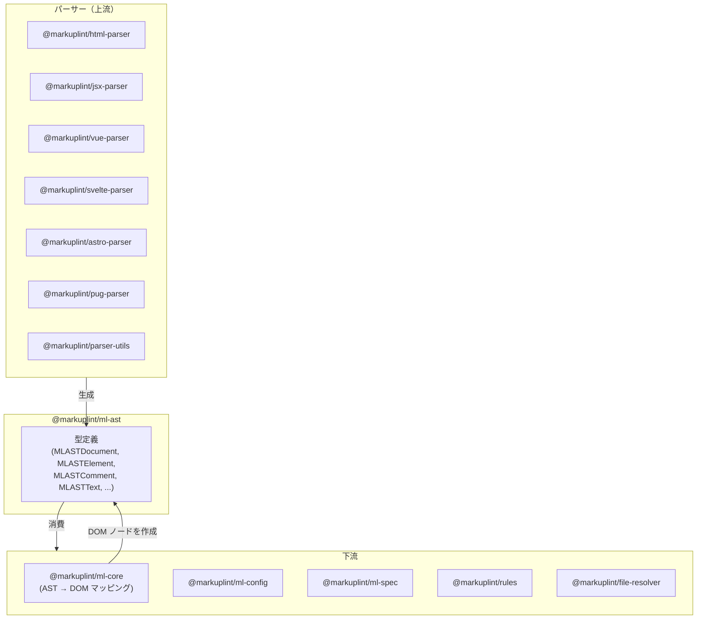
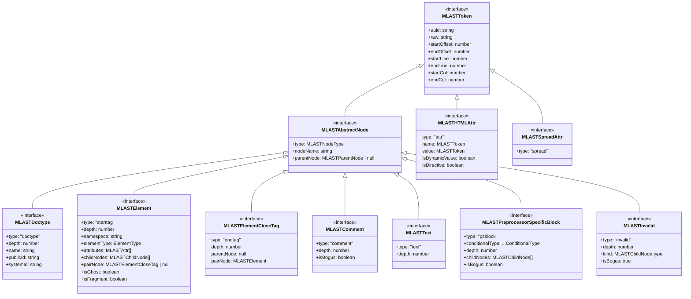
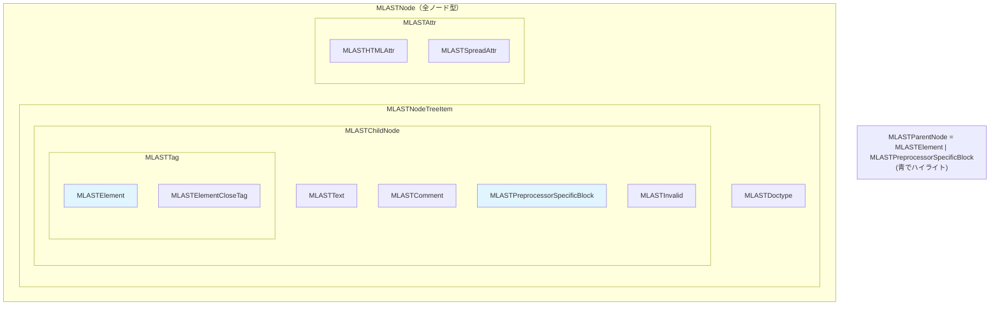
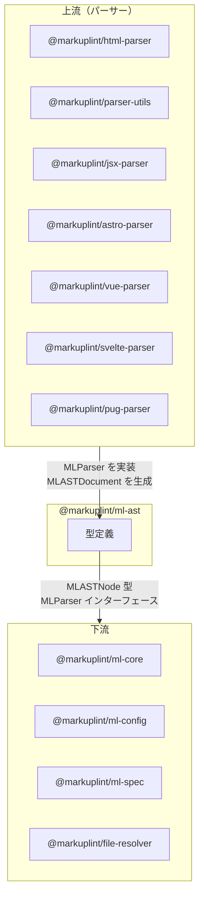

# @markuplint/ml-ast

## 概要

`@markuplint/ml-ast` は、markuplint の言語非依存な抽象構文木（AST）中間表現を定義する純粋な型定義パッケージです。**ランタイムコードはゼロ**、**依存関係もゼロ**で、すべてのパーサーが生成し、すべての下流パッケージが消費する TypeScript 型定義のみを含みます。

すべてのマークアップ言語パーサー（HTML、JSX、Vue、Svelte、Astro、Pug など）はソースコードをここで定義された型にパースし、markuplint のコアとルールがソース言語に関係なく統一された AST 上で動作できるようにします。

## ディレクトリ構成

```
src/
├── index.ts   — types.ts からすべての型を再エクスポート
└── types.ts   — すべての型定義（約470行）
```

## アーキテクチャ図



## 型継承図



## 共用体型



## ノード型一覧

| 型                               | `type` 値    | 代表例                 | 説明                                     |
| -------------------------------- | ------------ | ---------------------- | ---------------------------------------- |
| `MLASTDoctype`                   | `'doctype'`  | `<!DOCTYPE html>`      | DOCTYPE 宣言                             |
| `MLASTElement`                   | `'starttag'` | `<div class="foo">`    | 開始タグ。属性・子ノード・名前空間を保持 |
| `MLASTElementCloseTag`           | `'endtag'`   | `</div>`               | 閉じタグ。開始タグとペア                 |
| `MLASTComment`                   | `'comment'`  | `<!-- ... -->`         | HTML コメント。bogus フラグ付き          |
| `MLASTText`                      | `'text'`     | テキスト内容           | 要素間の文字データ                       |
| `MLASTPreprocessorSpecificBlock` | `'psblock'`  | `{#if}`, `<% %>`       | テンプレートエンジン構文                 |
| `MLASTInvalid`                   | `'invalid'`  | パース不能マークアップ | 不正ノード。意図された種別のヒント付き   |
| `MLASTHTMLAttr`                  | `'attr'`     | `class="foo"`          | 完全分解された HTML 属性                 |
| `MLASTSpreadAttr`                | `'spread'`   | `{...props}`           | JSX スプレッド属性                       |

各型の詳細は[ノードリファレンス](docs/node-reference.ja.md)を参照してください。

## AST から MLDOM へのマッピング

各 AST ノードは、最終的に `@markuplint/ml-core` によって **MLDOM** ノードに変換されます。MLDOM は [DOM Standard](https://dom.spec.whatwg.org/) に準拠しており、各クラスは対応する DOM インターフェース（`Node`、`Element`、`DocumentType`、`Comment`、`Text` など）を実装しているため、リントルールは標準 DOM API を使って検査できます。

| AST 型（`ml-ast`）                   | MLDOM クラス（`ml-core`）  | DOM インターフェース     | `nodeType` |
| ------------------------------------ | -------------------------- | ------------------------ | ---------- |
| `MLASTDoctype`                       | `MLDocumentType`           | `DocumentType`           | `10`       |
| `MLASTElement`                       | `MLElement`                | `Element`, `HTMLElement` | `1`        |
| `MLASTComment`                       | `MLComment`                | `Comment`                | `8`        |
| `MLASTText`                          | `MLText`                   | `Text`                   | `3`        |
| `MLASTPreprocessorSpecificBlock`     | `MLBlock`                  | _（markuplint 独自）_    | `101`      |
| `MLASTInvalid`（`kind: 'starttag'`） | `MLElement`（`x-invalid`） | `Element`, `HTMLElement` | `1`        |
| `MLASTInvalid`（その他）             | `MLText`                   | `Text`                   | `3`        |
| `MLASTHTMLAttr` / `MLASTSpreadAttr`  | `MLAttr`                   | `Attr`                   | `2`        |

**特殊なノード：**

- **`MLBlock`**（`nodeType: 101`）は DOM Standard に相当するものがない markuplint 独自の拡張です。透過的なコンテナとして機能し、子ノードはツリー走査時に親に属するものとして扱われます。
- **`MLElementCloseTag`** は `createNode()` で生成されません。代わりに `MLElement` が内部で `pairNode` 参照から生成します。ペアとなる要素の付属物としてのみ存在し、DOM ツリー走査の対象ではありません。
- **`MLASTInvalid`** はリカバリノードです。MLDOM にそのまま保持されることはなく、`kind` フィールドに応じて `MLElement`（タグ名 `x-invalid`）または `MLText` に変換されます。

詳細は[ノードリファレンス -- AST から MLDOM へのマッピング](docs/node-reference.ja.md#ast-から-mldom-へのマッピング)を参照してください。

## 属性分解モデル

`MLASTHTMLAttr` は各属性を完全な位置情報を持つ個別のトークンに分解します：

```
 ·class="container"
 ↑     ↑↑         ↑
 │     ││         └─ endQuote
 │     │└─ value
 │     └─ startQuote
 │        equal
 └─ spacesBeforeName
    name
```

これにより、リントルールは `=` 前後のホワイトスペース、引用符スタイル、属性命名規則を正確なソース位置で検証できます。完全なフィールドドキュメントは[ノードリファレンス](docs/node-reference.ja.md#mlasthtmlattr)を参照してください。

## パーサーインターフェース

| 型                       | 説明                                                     |
| ------------------------ | -------------------------------------------------------- |
| `MLParser`               | markuplint 互換パーサーのインターフェース                |
| `MLParserModule`         | パーサーインスタンスをエクスポートするモジュールラッパー |
| `MLMarkupLanguageParser` | 非推奨（v5 で削除予定）。代わりに `MLParser` を使用      |
| `Parse`                  | 非推奨。パース関数シグネチャの型エイリアス               |

`MLParser` は `MLASTDocument` を返す `parse(sourceCode, options?)` メソッドを必要とします。オプションフィールドには `endTag`（終了タグ処理戦略）、`booleanish`（ブール属性検出）、`tagNameCaseSensitive`（XHTML/JSX 用）があります。

## 設定型

| 型                                        | 説明                                                                   |
| ----------------------------------------- | ---------------------------------------------------------------------- |
| `MLASTNodeType`                           | ノード種別の判別共用体タグ                                             |
| `ElementType`                             | 要素分類：`'html' \| 'web-component' \| 'authored'`                    |
| `EndTagType`                              | 終了タグ戦略：`'xml' \| 'omittable' \| 'never'`                        |
| `Namespace`                               | 短い名前空間識別子：`'html' \| 'svg' \| 'mml' \| 'xlink'`              |
| `NamespaceURI`                            | HTML、SVG、MathML、XLink の完全な名前空間 URI                          |
| `ParserOptions`                           | パーサーに渡すオプション（`ignoreFrontMatter`、`authoredElementName`） |
| `ParserAuthoredElementNameDistinguishing` | 著者定義要素を区別するための設定                                       |
| `Walker<Node>`                            | AST ノードを走査するコールバック                                       |

## 外部依存関係

なし。このパッケージはランタイム依存関係がゼロです。TypeScript の型定義のみをエクスポートします。

## 統合ポイント



### 上流

すべてのパーサーは `MLParser` インターフェースを実装し、このパッケージで定義された AST ノード型を含む `MLASTDocument` インスタンスを生成します。

### 下流

- **`@markuplint/ml-core`** は AST ノードを消費し、`createNode()` を通じて DOM ノードにマッピングします。`MLASTElement` が `MLElement` に、`MLASTText` が `MLText` になるなど、主要な統合ポイントです。
- **`@markuplint/ml-config`** は設定スキーマ定義で AST 型を参照します。
- **`@markuplint/ml-spec`** は名前空間と要素型の定義を使用します。
- **`@markuplint/file-resolver`** はパーサー関連の型を参照します。

## ドキュメントマップ

- [ノードリファレンス](docs/node-reference.ja.md) -- 各 AST ノード型の詳細ドキュメント
- [メンテナンスガイド](docs/maintenance.ja.md) -- コマンド、レシピ、トラブルシューティング
