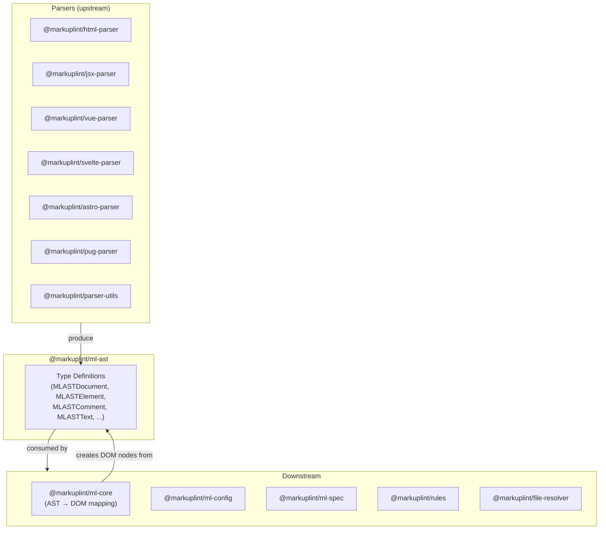
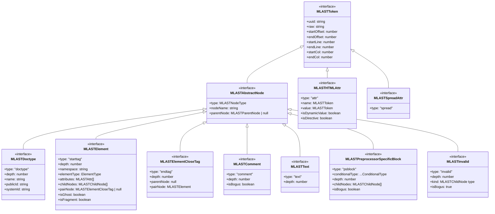
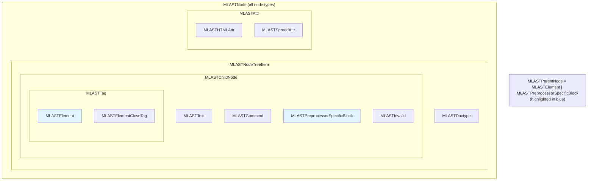
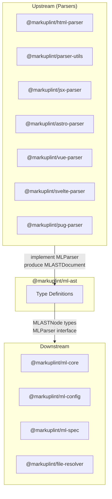

# @markuplint/ml-ast

## Overview

`@markuplint/ml-ast` is a pure type-definition package that defines the language-independent Abstract Syntax Tree (AST) intermediate representation for markuplint. It contains **zero runtime code** and **zero dependencies** -- only TypeScript type definitions that all parsers must produce and all downstream packages consume.

Every markup language parser (HTML, JSX, Vue, Svelte, Astro, Pug, etc.) parses source code into the types defined here, enabling markuplint's core and rules to operate on a unified AST regardless of the source language.

## Directory Structure

```
src/
├── index.ts   — Re-exports all types from types.ts
└── types.ts   — All type definitions (~470 lines)
```

## Architecture Diagram



## Type Inheritance Diagram



## Union Types



## Node Types at a Glance

| Type                             | `type` Value | Example             | Description                                              |
| -------------------------------- | ------------ | ------------------- | -------------------------------------------------------- |
| `MLASTDoctype`                   | `'doctype'`  | `<!DOCTYPE html>`   | DOCTYPE declaration                                      |
| `MLASTElement`                   | `'starttag'` | `<div class="foo">` | Opening element tag with attributes, children, namespace |
| `MLASTElementCloseTag`           | `'endtag'`   | `</div>`            | Closing element tag, paired with its opening tag         |
| `MLASTComment`                   | `'comment'`  | `<!-- ... -->`      | HTML comment, with bogus flag                            |
| `MLASTText`                      | `'text'`     | text content        | Character data between elements                          |
| `MLASTPreprocessorSpecificBlock` | `'psblock'`  | `{#if}`, `<% %>`    | Template engine constructs                               |
| `MLASTInvalid`                   | `'invalid'`  | unparsable markup   | Invalid node with intended kind hint                     |
| `MLASTHTMLAttr`                  | `'attr'`     | `class="foo"`       | Fully decomposed HTML attribute                          |
| `MLASTSpreadAttr`                | `'spread'`   | `{...props}`        | JSX spread attribute                                     |

See [Node Reference](docs/node-reference.md) for detailed documentation of each type.

## AST to MLDOM Mapping

Each AST node is ultimately converted into an **MLDOM** node by `@markuplint/ml-core`. MLDOM conforms to the [DOM Standard](https://dom.spec.whatwg.org/) -- each class implements the corresponding DOM interface (`Node`, `Element`, `DocumentType`, `Comment`, `Text`, etc.), so lint rules can use standard DOM APIs for inspection.

| AST Type (`ml-ast`)                 | MLDOM Class (`ml-core`)   | DOM Interface            | `nodeType` |
| ----------------------------------- | ------------------------- | ------------------------ | ---------- |
| `MLASTDoctype`                      | `MLDocumentType`          | `DocumentType`           | `10`       |
| `MLASTElement`                      | `MLElement`               | `Element`, `HTMLElement` | `1`        |
| `MLASTComment`                      | `MLComment`               | `Comment`                | `8`        |
| `MLASTText`                         | `MLText`                  | `Text`                   | `3`        |
| `MLASTPreprocessorSpecificBlock`    | `MLBlock`                 | _(markuplint-specific)_  | `101`      |
| `MLASTInvalid` (`kind: 'starttag'`) | `MLElement` (`x-invalid`) | `Element`, `HTMLElement` | `1`        |
| `MLASTInvalid` (other)              | `MLText`                  | `Text`                   | `3`        |
| `MLASTHTMLAttr` / `MLASTSpreadAttr` | `MLAttr`                  | `Attr`                   | `2`        |

**Special nodes:**

- **`MLBlock`** (`nodeType: 101`) is a markuplint-specific extension with no DOM Standard equivalent. It acts as a transparent container -- its children are treated as belonging to the parent for tree traversal.
- **`MLElementCloseTag`** is not created by `createNode()`. Instead, `MLElement` internally creates it from its `pairNode` reference. It exists only as a satellite of its paired element and is not part of the DOM tree traversal.
- **`MLASTInvalid`** is a recovery node -- it is never preserved as-is in MLDOM, but converted to either an `MLElement` (with tag name `x-invalid`) or an `MLText`, depending on its `kind` field.

See [Node Reference -- AST to MLDOM Mapping](docs/node-reference.md#ast-to-mldom-mapping) for details.

## Attribute Decomposition Model

`MLASTHTMLAttr` decomposes each attribute into individual tokens with full positional information:

```
 ·class="container"
 ↑     ↑↑         ↑
 │     ││         └─ endQuote
 │     │└─ value
 │     └─ startQuote
 │        equal
 └─ spacesBeforeName
    name
```

This enables lint rules to validate whitespace around `=`, quoting style, and attribute naming conventions with precise source locations. See [Node Reference](docs/node-reference.md#mlasthtmlattr) for complete field documentation.

## Parser Interface

| Type                     | Description                                            |
| ------------------------ | ------------------------------------------------------ |
| `MLParser`               | Interface for a markuplint-compatible parser           |
| `MLParserModule`         | Module wrapper that exports a parser instance          |
| `MLMarkupLanguageParser` | Deprecated (v5 removal). Use `MLParser` instead        |
| `Parse`                  | Deprecated type alias for the parse function signature |

`MLParser` requires a `parse(sourceCode, options?)` method that returns an `MLASTDocument`. Optional fields include `endTag` (end tag handling strategy), `booleanish` (boolean attribute detection), and `tagNameCaseSensitive` (for XHTML/JSX).

## Configuration Types

| Type                                      | Description                                                            |
| ----------------------------------------- | ---------------------------------------------------------------------- |
| `MLASTNodeType`                           | Discriminant union tag for node kinds                                  |
| `ElementType`                             | Element classification: `'html' \| 'web-component' \| 'authored'`      |
| `EndTagType`                              | End tag strategy: `'xml' \| 'omittable' \| 'never'`                    |
| `Namespace`                               | Short namespace identifiers: `'html' \| 'svg' \| 'mml' \| 'xlink'`     |
| `NamespaceURI`                            | Full namespace URIs for HTML, SVG, MathML, XLink                       |
| `ParserOptions`                           | Options passed to parsers (`ignoreFrontMatter`, `authoredElementName`) |
| `ParserAuthoredElementNameDistinguishing` | Configuration for distinguishing authored elements                     |
| `Walker<Node>`                            | Callback for walking AST nodes                                         |

## External Dependencies

None. This package has zero runtime dependencies. It exports only TypeScript type definitions.

## Integration Points



### Upstream

All parsers implement the `MLParser` interface and produce `MLASTDocument` instances containing the AST node types defined in this package.

### Downstream

- **`@markuplint/ml-core`** consumes AST nodes and maps them to DOM nodes via `createNode()`. This is the primary integration point where `MLASTElement` becomes `MLElement`, `MLASTText` becomes `MLText`, etc.
- **`@markuplint/ml-config`** references AST types in configuration schema definitions.
- **`@markuplint/ml-spec`** uses namespace and element type definitions.
- **`@markuplint/file-resolver`** references parser-related types.

## Documentation Map

- [Node Reference](docs/node-reference.md) -- Detailed documentation of each AST node type
- [Maintenance Guide](docs/maintenance.md) -- Commands, recipes, and troubleshooting
