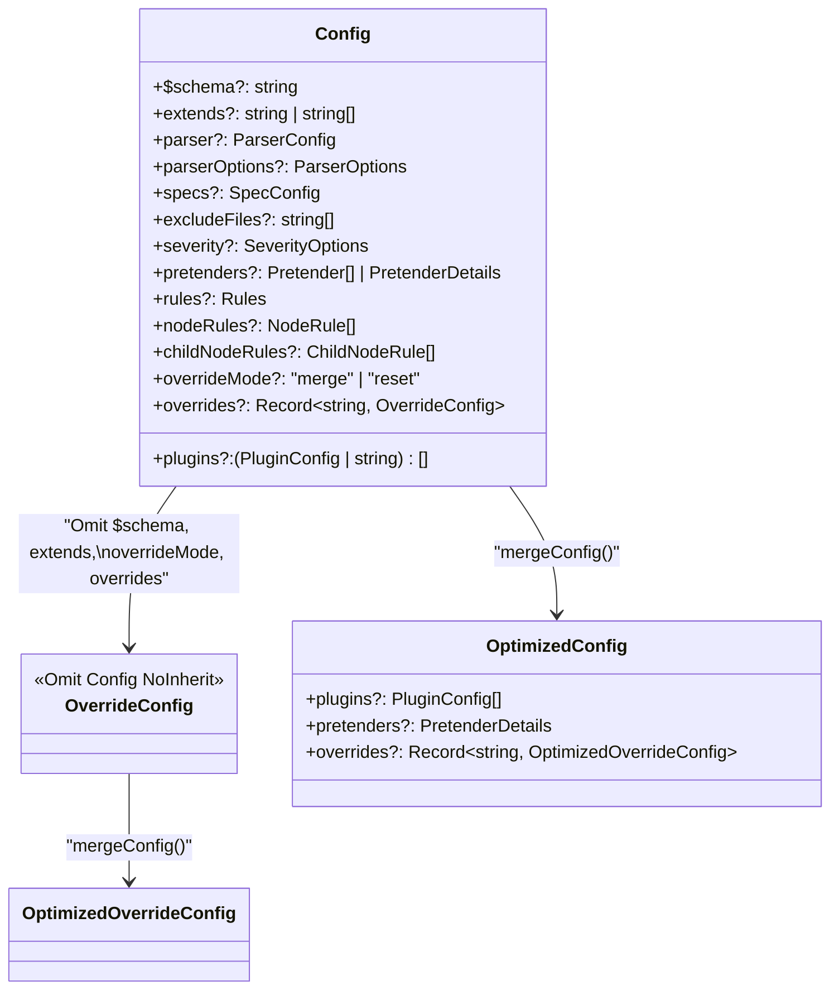
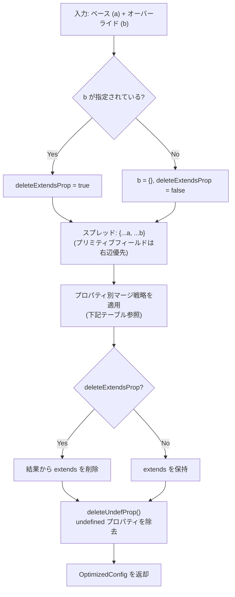
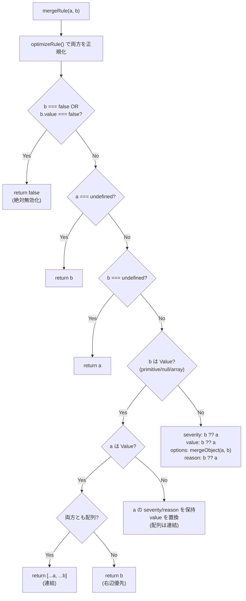
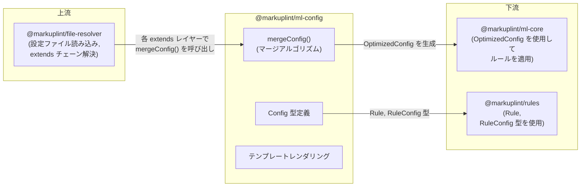

# @markuplint/ml-config

## 概要

`@markuplint/ml-config` は markuplint の設定システムの中核パッケージです。`Config` 型階層、複数の設定レイヤー（ベース、extends、overrides）を一つの最適化された設定にマージするアルゴリズム、キャプチャ変数をルール設定に注入する Mustache テンプレートレンダリングシステムを提供します。`@markuplint/file-resolver`（設定ファイルの読み込みと解決）と `@markuplint/ml-core`（マージ済み設定を使用してルールを適用）の間に位置します。

## ディレクトリ構成

```
src/
├── index.ts              — すべての公開 API を再エクスポート
├── types.ts              — 全型定義（Config, Rule, Pretender, Violation 等）
├── merge-config.ts       — マージアルゴリズム（mergeConfig, mergeRule, ヘルパー関数）
├── merge-config.spec.ts  — マージアルゴリズムのテスト
├── utils.ts              — テンプレートレンダリング、ルール正規化、型ガード
└── utils.spec.ts         — ユーティリティのテスト
```

## 型システム

### Config 型階層



### Config から OptimizedConfig への変換

| フィールド   | Config                            | OptimizedConfig                           | 変換                                   |
| ------------ | --------------------------------- | ----------------------------------------- | -------------------------------------- |
| `plugins`    | `(PluginConfig \| string)[]`      | `PluginConfig[]`                          | 文字列を `{name}` オブジェクトに正規化 |
| `pretenders` | `Pretender[] \| PretenderDetails` | `PretenderDetails`                        | 配列を `{data: [...]}` に変換          |
| `extends`    | `string \| string[]`              | 削除                                      | マージ後は不要                         |
| `$schema`    | `string`                          | 削除                                      | メタデータのみ                         |
| `overrides`  | `Record<string, OverrideConfig>`  | `Record<string, OptimizedOverrideConfig>` | 各値を再帰的にマージ                   |

### ルール型の3形式

ルールは3つの形式で設定できます:

| 形式    | 型                | 例                                   | 意味                        |
| ------- | ----------------- | ------------------------------------ | --------------------------- |
| Boolean | `boolean`         | `true` / `false`                     | デフォルトで有効化 / 無効化 |
| Value   | `RuleConfigValue` | `"always"`, `["a","b"]`, `null`      | ショートハンド値            |
| Object  | `RuleConfig<T,O>` | `{severity, value, options, reason}` | フル設定                    |

```ts
type Rule<T, O> = RuleConfig<T, O> | Readonly<T> | boolean;

type RuleConfig<T, O> = {
  severity?: Severity; // 'error' | 'warning' | 'info'
  value?: Readonly<T>;
  options?: Readonly<O>;
  reason?: string;
};
```

### NodeRule / ChildNodeRule

- `NodeRule` -- CSS セレクタ、正規表現セレクタ、ARIA ロール、カテゴリ、obsolete フラグで対象ノードを限定し、ルール設定をオーバーライド
- `ChildNodeRule` -- `NodeRule` と類似だが子ノードを対象とする。`inheritance` フラグで子孫への継承を制御

### Pretender 型

- `Pretender` -- CSS セレクタを使用してカスタム要素を標準要素に見せかける。`as` フィールドで要素名または詳細な `OriginalNode` を指定
- `OriginalNode` -- 要素名、スロット、名前空間、属性、継承属性、ARIA プロパティを定義
- `PretenderDetails` -- マージ後に使用される正規化形式 `{data?, files?, imports?}`

## マージアルゴリズム

このパッケージの中核です。`mergeConfig()` 関数はプロパティごとの戦略で2つの設定を統合します。

### mergeConfig() の全体フロー

```ts
mergeConfig(a: Config, b?: Config): OptimizedConfig
```



### プロパティ別マージ戦略テーブル

| プロパティ       | 戦略                    | ヘルパー関数                                         | 詳細                                          |
| ---------------- | ----------------------- | ---------------------------------------------------- | --------------------------------------------- |
| `plugins`        | 結合+重複排除+正規化    | `concatArray(uniquely=true, comparePropName='name')` | 同名プラグインは settings を deep merge       |
| `parser`         | オブジェクト deep merge | `mergeObject()`                                      | 右辺優先、deepmerge ライブラリ使用            |
| `parserOptions`  | オブジェクト deep merge | `mergeObject()`                                      | 同上                                          |
| `specs`          | オブジェクト deep merge | `mergeObject()`                                      | 同上                                          |
| `excludeFiles`   | 結合+重複排除           | `concatArray(uniquely=true)`                         | 単純な値の重複排除                            |
| `severity`       | オブジェクト deep merge | `mergeObject()`                                      | parser と同様                                 |
| `pretenders`     | 形式変換+deep merge     | `mergePretenders()`                                  | 配列を PretenderDetails に変換後にマージ      |
| `rules`          | ルール別マージ          | `mergeRules()` → `mergeRule()`                       | **最も複雑 -- 次節で詳述**                    |
| `nodeRules`      | 結合（重複排除なし）    | `concatArray()`                                      | 両配列を単純連結                              |
| `childNodeRules` | 結合（重複排除なし）    | `concatArray()`                                      | nodeRules と同様                              |
| `overrideMode`   | 右辺優先                | `b.overrideMode ?? a.overrideMode`                   | 単純な優先順位                                |
| `overrides`      | キー別再帰マージ        | `mergeOverrides()`                                   | 各キーに対して `mergeConfig()` を再帰呼び出し |
| `extends`        | 結合→削除               | `concatArray()`                                      | マージ後に結果から削除                        |

### mergeRule() -- ルールマージの詳細

```ts
mergeRule(a: Nullable<AnyRule>, b: AnyRule): AnyRule
```

最も複雑なマージロジックを処理する関数です。両方の入力はまず `optimizeRule()` で正規化されます（非推奨の `option` から `options` への移行を含む）。



**重要な設計判断:**

1. **`false` は絶対無効化** -- override が `false`（または `{value: false}`）なら、base が何であっても結果は常に `false`
2. **配列値は連結** -- `["a","b"]` + `["c","d"]` は `["a","b","c","d"]` になり、extends チェーンでルールを段階的に追加可能
3. **options は deep merge** -- severity、value、reason は右辺優先だが、options のみ `mergeObject()`（deepmerge ライブラリによる deep merge）を使用

### ヘルパー関数

#### concatArray(a, b, uniquely?, comparePropName?)

オプションの重複排除付きで2つの配列を連結:

- `uniquely=false` -- 単純な連結、重複排除なし
- `uniquely=true`、`comparePropName` なし -- 完全一致で重複排除
- `uniquely=true`、`comparePropName` あり -- 指定プロパティ名で重複排除。同名オブジェクトは `mergeObject()` でマージ（例: プラグインの settings）
- 空の結果には `undefined` を返す

#### mergeObject(a, b)

`deepmerge` ライブラリを使用した再帰的な deep merge。右辺の値が優先。結果から undefined プロパティを除去。

#### mergeOverrides(a, b)

両方の override レコードから全キーの集合を取得。各キーに対して `mergeConfig(a[key], b[key])` を再帰呼び出し。各結果から `$schema`、`extends`、`overrides` を削除（これらはトップレベル専用プロパティ）。

#### mergePretenders(a, b)

配列形式の pretenders を正規化形式 `PretenderDetails`（`{data: [...]}`）に変換してから `mergeObject()` で deep merge。

## テンプレートレンダリングシステム

### provideValue(template, data)

Mustache テンプレート文字列を提供されたデータでレンダリング:

- テンプレートに変数がない -- テンプレートをそのまま返す
- 変数があるが data にマッチするキーがない -- `undefined` を返す
- 変数があり data にマッチするキーがある -- レンダリング結果を返す

### exchangeValueOnRule(rule, data)

ルール設定内のすべての文字列値に Mustache テンプレートレンダリングを適用:

- **value** -- 文字列値はレンダリングされる。配列の各要素も個別にレンダリング
- **options** -- options オブジェクト内のすべての文字列値を再帰的にレンダリング
- **reason** -- 文字列としてレンダリング

この関数は `nodeRules` / `childNodeRules` の `regexSelector` で使用され、キャプチャグループ（`$0`、`$1`、`dataName` 等の名前付きキャプチャ）がテンプレート変数としてルール設定に注入されます。

## ユーティリティ関数

| 関数                  | 目的                                                                                                     |
| --------------------- | -------------------------------------------------------------------------------------------------------- |
| `cleanOptions()`      | 非推奨の `option` フィールドを `options` に正規化し、標準フィールドを抽出して undefined プロパティを除去 |
| `isRuleConfigValue()` | 型ガード: プリミティブ、`null`、配列（= `RuleConfig` オブジェクトではない）に対して `true` を返す        |
| `deleteUndefProp()`   | プレーンオブジェクトから `undefined` 値のプロパティをすべて in-place で削除                              |

## 主要ソースファイル

| ファイル              | 目的                                                                                                    |
| --------------------- | ------------------------------------------------------------------------------------------------------- |
| `src/types.ts`        | 全型定義（Config, Rule, Pretender, Violation 等）                                                       |
| `src/merge-config.ts` | `mergeConfig()`、`mergeRule()`、全ヘルパー関数                                                          |
| `src/utils.ts`        | `provideValue()`、`exchangeValueOnRule()`、`cleanOptions()`、`isRuleConfigValue()`、`deleteUndefProp()` |
| `src/index.ts`        | 全公開 API の再エクスポート                                                                             |

## 外部依存関係

| 依存パッケージ         | 用途                                                |
| ---------------------- | --------------------------------------------------- |
| `@markuplint/ml-ast`   | `ParserOptions` 型（型のみ）                        |
| `@markuplint/selector` | `RegexSelector` 型（再エクスポート）                |
| `@markuplint/shared`   | `Nullable` ユーティリティ型                         |
| `deepmerge`            | `mergeObject()` の deep merge 実装                  |
| `is-plain-object`      | `deleteUndefProp()` でのプレーンオブジェクト判定    |
| `mustache`             | `provideValue()` のテンプレートレンダリングエンジン |
| `type-fest`            | `Writable` ユーティリティ型                         |

## 統合ポイント



### 上流

- **`@markuplint/file-resolver`** -- 設定ファイルを読み込み、extends チェーンを解決し、`mergeConfig()` を呼び出してレイヤーを統合

### 下流

- **`@markuplint/ml-core`** -- マージ済みの `OptimizedConfig` を受け取り、パース済みドキュメントにルールを適用
- **`@markuplint/rules`** -- `Rule<T,O>` と `RuleConfig<T,O>` 型を使用してルール実装を定義

## ドキュメントマップ

- [メンテナンスガイド](docs/maintenance.ja.md) -- コマンド、レシピ、トラブルシューティング
