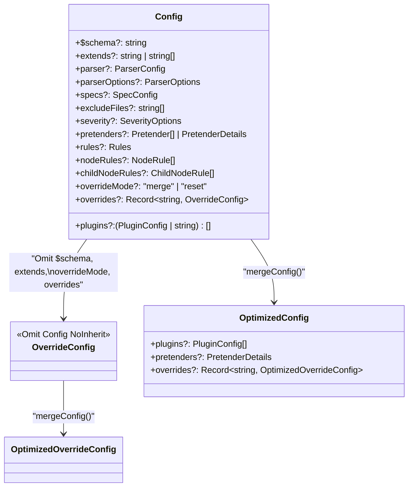
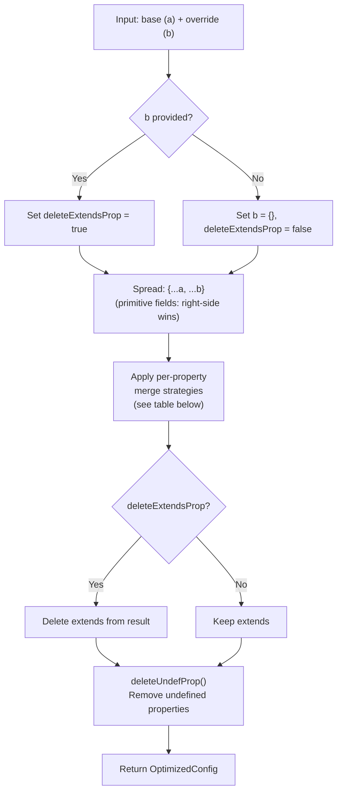
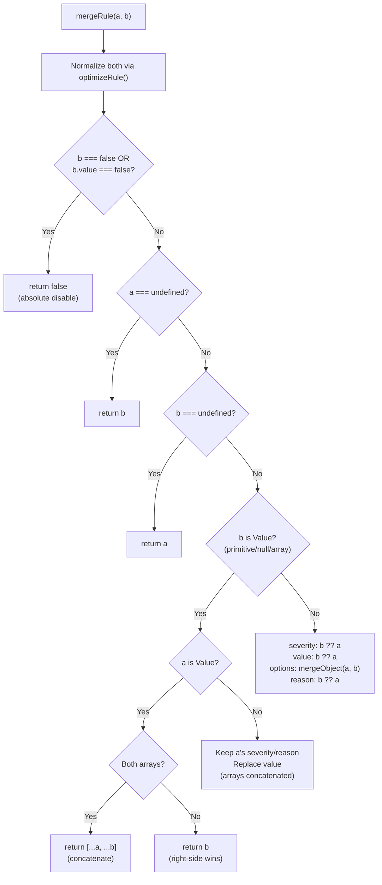
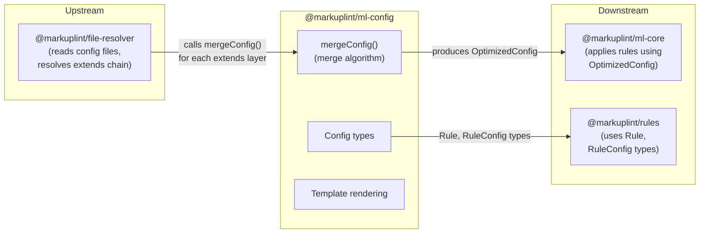

# @markuplint/ml-config

## Overview

`@markuplint/ml-config` is the configuration system core for markuplint. It provides the `Config` type hierarchy, the merge algorithm that combines multiple configuration layers (base, extends, overrides) into a single optimized config, and a Mustache template rendering system for injecting captured variables into rule settings. The package sits between `@markuplint/file-resolver` (which reads and resolves config files) and `@markuplint/ml-core` (which applies rules using the merged config).

## Directory Structure

```
src/
├── index.ts              — Re-exports all public APIs
├── types.ts              — All type definitions (Config, Rule, Pretender, Violation, etc.)
├── merge-config.ts       — Merge algorithm (mergeConfig, mergeRule, helpers)
├── merge-config.spec.ts  — Merge algorithm tests
├── utils.ts              — Template rendering, rule normalization, type guards
└── utils.spec.ts         — Utils tests
```

## Type System

### Config Type Hierarchy



### Config to OptimizedConfig Conversion

| Field        | Config                            | OptimizedConfig                           | Conversion                             |
| ------------ | --------------------------------- | ----------------------------------------- | -------------------------------------- |
| `plugins`    | `(PluginConfig \| string)[]`      | `PluginConfig[]`                          | Strings normalized to `{name}` objects |
| `pretenders` | `Pretender[] \| PretenderDetails` | `PretenderDetails`                        | Arrays converted to `{data: [...]}`    |
| `extends`    | `string \| string[]`              | Removed                                   | No longer needed after merging         |
| `$schema`    | `string`                          | Removed                                   | Metadata only                          |
| `overrides`  | `Record<string, OverrideConfig>`  | `Record<string, OptimizedOverrideConfig>` | Each value recursively merged          |

### Rule Type Forms

A rule can be configured in three forms:

| Form    | Type              | Example                              | Meaning                        |
| ------- | ----------------- | ------------------------------------ | ------------------------------ |
| Boolean | `boolean`         | `true` / `false`                     | Enable with defaults / disable |
| Value   | `RuleConfigValue` | `"always"`, `["a","b"]`, `null`      | Shorthand value                |
| Object  | `RuleConfig<T,O>` | `{severity, value, options, reason}` | Full configuration             |

```ts
type Rule<T, O> = RuleConfig<T, O> | Readonly<T> | boolean;

type RuleConfig<T, O> = {
  severity?: Severity; // 'error' | 'warning' | 'info'
  value?: Readonly<T>;
  options?: Readonly<O>;
  reason?: string;
};
```

### NodeRule / ChildNodeRule

- `NodeRule` -- Targets specific nodes by CSS selector, regex selector, ARIA roles, categories, or obsolete flag, then overrides their rule settings
- `ChildNodeRule` -- Similar to `NodeRule` but targets child nodes; includes an `inheritance` flag to control whether overrides propagate to descendants

### Pretender Types

- `Pretender` -- Uses a CSS selector to make custom elements appear as standard elements for linting purposes; the `as` field specifies the element name or a detailed `OriginalNode`
- `OriginalNode` -- Defines an element's name, slots, namespace, attributes, inherited attributes, and ARIA properties
- `PretenderDetails` -- Normalized form `{data?, files?, imports?}` used after merging

## Merge Algorithm

This is the core of the package. The `mergeConfig()` function combines two configurations with property-specific strategies.

### mergeConfig() Overall Flow

```ts
mergeConfig(a: Config, b?: Config): OptimizedConfig
```



### Per-Property Merge Strategy Table

| Property         | Strategy                         | Helper Function                                      | Details                                           |
| ---------------- | -------------------------------- | ---------------------------------------------------- | ------------------------------------------------- |
| `plugins`        | Concat + deduplicate + normalize | `concatArray(uniquely=true, comparePropName='name')` | Same-name plugins have their settings deep-merged |
| `parser`         | Object deep merge                | `mergeObject()`                                      | Right-side wins, uses deepmerge library           |
| `parserOptions`  | Object deep merge                | `mergeObject()`                                      | Same as above                                     |
| `specs`          | Object deep merge                | `mergeObject()`                                      | Same as above                                     |
| `excludeFiles`   | Concat + deduplicate             | `concatArray(uniquely=true)`                         | Simple value deduplication                        |
| `severity`       | Object deep merge                | `mergeObject()`                                      | Same as parser                                    |
| `pretenders`     | Format conversion + deep merge   | `mergePretenders()`                                  | Array converted to PretenderDetails, then merged  |
| `rules`          | Per-rule merge                   | `mergeRules()` then `mergeRule()`                    | **Most complex -- see next section**              |
| `nodeRules`      | Concat (no deduplicate)          | `concatArray()`                                      | Both arrays simply concatenated                   |
| `childNodeRules` | Concat (no deduplicate)          | `concatArray()`                                      | Same as nodeRules                                 |
| `overrideMode`   | Right-side wins                  | `b.overrideMode ?? a.overrideMode`                   | Simple precedence                                 |
| `overrides`      | Per-key recursive merge          | `mergeOverrides()`                                   | Calls `mergeConfig()` recursively for each key    |
| `extends`        | Concat then delete               | `concatArray()`                                      | Removed from result after merge                   |

### mergeRule() -- Rule Merge Details

```ts
mergeRule(a: Nullable<AnyRule>, b: AnyRule): AnyRule
```

This function handles the most complex merge logic. Both inputs are first normalized via `optimizeRule()` (which handles the deprecated `option` to `options` migration).



**Key Design Decisions:**

1. **`false` is absolute disable** -- If the override is `false` (or `{value: false}`), the result is always `false`, regardless of what the base config says
2. **Array values are concatenated** -- `["a","b"]` + `["c","d"]` results in `["a","b","c","d"]`, enabling incremental rule additions across extends chains
3. **options uses deep merge** -- While severity, value, and reason use right-side-wins precedence, options alone uses `mergeObject()` (deep merge via deepmerge library)

### Helper Functions

#### concatArray(a, b, uniquely?, comparePropName?)

Concatenates two arrays with optional deduplication:

- `uniquely=false` -- Simple concatenation, no deduplication
- `uniquely=true`, no `comparePropName` -- Exact-match deduplication
- `uniquely=true`, with `comparePropName` -- Deduplicates by the specified property name; when two objects share the same name, they are merged via `mergeObject()` (e.g., plugin settings)
- Returns `undefined` for empty results

#### mergeObject(a, b)

Deep merges two objects using the `deepmerge` library. Right-side values take precedence. Removes undefined properties from the result.

#### mergeOverrides(a, b)

Collects the union of all keys from both override records. For each key, calls `mergeConfig(a[key], b[key])` recursively. Removes `$schema`, `extends`, and `overrides` from each result (since these are top-level-only properties).

#### mergePretenders(a, b)

Converts array-form pretenders to the normalized `PretenderDetails` form (`{data: [...]}`) before deep merging with `mergeObject()`.

## Template Rendering System

### provideValue(template, data)

Renders a Mustache template string with the provided data:

- No variables in template -- Returns the template unchanged
- Variables present but no matching keys in data -- Returns `undefined`
- Variables present with matching keys -- Returns the rendered result

### exchangeValueOnRule(rule, data)

Applies Mustache template rendering to all string values within a rule configuration:

- **value** -- String values are rendered; array elements are individually rendered
- **options** -- Recursively renders all string values in the options object
- **reason** -- Rendered as a string

This function is used by `nodeRules` and `childNodeRules` with `regexSelector`, where captured groups (`$0`, `$1`, named captures like `dataName`) are injected as template variables into rule settings.

## Utility Functions

| Function              | Purpose                                                                                                   |
| --------------------- | --------------------------------------------------------------------------------------------------------- |
| `cleanOptions()`      | Normalizes deprecated `option` field to `options`, extracts standard fields, removes undefined properties |
| `isRuleConfigValue()` | Type guard: returns `true` for primitives, `null`, and arrays (i.e., not a `RuleConfig` object)           |
| `deleteUndefProp()`   | Removes all properties with `undefined` values from a plain object in-place                               |

## Key Source Files

| File                  | Purpose                                                                                                 |
| --------------------- | ------------------------------------------------------------------------------------------------------- |
| `src/types.ts`        | All type definitions (Config, Rule, Pretender, Violation, etc.)                                         |
| `src/merge-config.ts` | `mergeConfig()`, `mergeRule()`, and all helper functions                                                |
| `src/utils.ts`        | `provideValue()`, `exchangeValueOnRule()`, `cleanOptions()`, `isRuleConfigValue()`, `deleteUndefProp()` |
| `src/index.ts`        | Re-exports all public APIs                                                                              |

## External Dependencies

| Dependency             | Purpose                                           |
| ---------------------- | ------------------------------------------------- |
| `@markuplint/ml-ast`   | `ParserOptions` type (type-only)                  |
| `@markuplint/selector` | `RegexSelector` type (re-exported)                |
| `@markuplint/shared`   | `Nullable` utility type                           |
| `deepmerge`            | Deep merge implementation used by `mergeObject()` |
| `is-plain-object`      | Plain object detection in `deleteUndefProp()`     |
| `mustache`             | Template rendering engine for `provideValue()`    |
| `type-fest`            | `Writable` utility type                           |

## Integration Points



### Upstream

- **`@markuplint/file-resolver`** -- Reads configuration files, resolves the extends chain, and calls `mergeConfig()` to combine layers

### Downstream

- **`@markuplint/ml-core`** -- Receives the merged `OptimizedConfig` and applies rules to the parsed document
- **`@markuplint/rules`** -- Uses `Rule<T,O>` and `RuleConfig<T,O>` types to define rule implementations

## Documentation Map

- [Maintenance Guide](docs/maintenance.md) -- Commands, recipes, and troubleshooting
