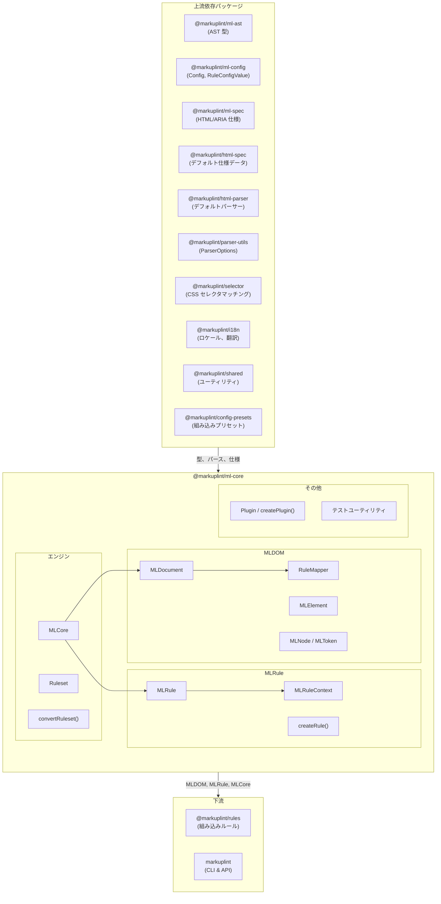
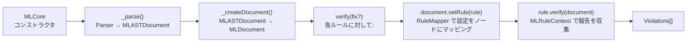
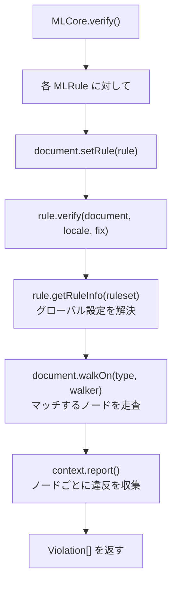
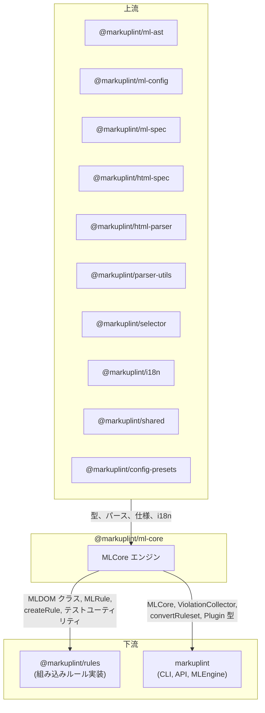

# @markuplint/ml-core

## 概要

`@markuplint/ml-core` は markuplint のコアリンティングエンジンです。パースされた AST（`MLASTDocument`）を DOM ツリー（`MLDOM`）に変換し、設定されたルールをノードに適用して違反を収集します。パッケージは 3 つのサブシステムで構成されます：**MLDOM**（DOM 抽象化レイヤー）、**MLRule**（ルール実行フレームワーク）、**MLCore**（オーケストレーションエンジン）。

## ディレクトリ構造

```
src/
├── index.ts                          — 公開 API の再エクスポート
├── ml-core.ts                        — MLCore エンジンクラス
├── types.ts                          — MLFabric, MLSchema 型定義
├── convert-ruleset.ts                — Config → Ruleset 変換
├── debug.ts                          — デバッグログユーティリティ
├── violation-collector.ts            — 複数ファイルの違反集約
├── ml-dom/
│   ├── index.ts                      — MLDOM 公開エクスポート
│   ├── node/
│   │   ├── document.ts               — MLDocument（ルートノード、ルールマッピング、pretender 初期化）
│   │   ├── element.ts                — MLElement（属性、セレクタ、名前空間）
│   │   ├── node.ts                   — MLNode（全ノードの抽象基底クラス）
│   │   ├── parent-node.ts            — MLParentNode（querySelector, children）
│   │   ├── character-data.ts         — MLCharacterData（テキスト系の抽象基底）
│   │   ├── text.ts                   — MLText
│   │   ├── comment.ts                — MLComment
│   │   ├── attr.ts                   — MLAttr（属性トークン）
│   │   ├── block.ts                  — MLBlock（プリプロセッサブロック）
│   │   ├── document-fragment.ts      — MLDocumentFragment
│   │   ├── document-type.ts          — MLDocumentType
│   │   ├── element-close-tag.ts      — MLElementCloseTag
│   │   ├── rule-mapper.ts            — RuleMapper（ルールセット → ノードマッピング）
│   │   ├── types.ts                  — ノード型定数、AccessibilityProperties
│   │   ├── node-list.ts              — NodeList/HTMLCollection ユーティリティ
│   │   └── unexpected-call-error.ts  — 未サポート DOM メソッドのエラー
│   ├── token/
│   │   └── token.ts                  — MLToken（位置情報付き基底トークン）
│   ├── helper/
│   │   ├── accname.ts                — アクセシブル名の計算
│   │   ├── create-node.ts            — AST → MLDOM ノードファクトリ
│   │   ├── walkers.ts                — ツリー走査（同期/非同期ウォーカー）
│   │   ├── get-indent.ts             — インデント解析
│   │   └── debug.ts                  — デバッグマップ生成
│   └── manipulations/
│       ├── child-node-methods.ts     — ChildNode インターフェーススタブ
│       └── get-children.ts           — 要素の子要素抽出
├── ml-rule/
│   ├── ml-rule.ts                    — MLRule クラス（ルール実行）
│   ├── ml-rule-context.ts            — MLRuleContext（レポート収集）
│   ├── create-rule.ts                — createRule ファクトリ
│   ├── create-test-rule.ts           — テスト用ルールファクトリ
│   └── types.ts                      — RuleSeed, Checker 型
├── ruleset/
│   └── index.ts                      — Ruleset クラス（rules + nodeRules + childNodeRules）
├── plugin/
│   ├── plugin.ts                     — createPlugin ファクトリ
│   ├── types.ts                      — Plugin, PluginCreator 型
│   └── index.ts                      — Plugin エクスポート
├── test/
│   └── index.ts                      — createTestDocument, createTestElement, dummySchemas
└── utils/
    ├── index.ts                      — ユーティリティエクスポート
    ├── get-location-from-chars.ts    — 文字位置解決
    └── string-splice.ts             — 文字列スプライスヘルパー
```

## アーキテクチャ図



## リンティングパイプライン

`MLCore.verify()` メソッドがリンティング全体を制御します：



### ステップごとの説明

1. **パース**: `MLCore` は設定されたパーサー（`MLParser`）を呼び出し、`MLASTDocument` を生成
2. **ドキュメント作成**: AST を `MLDocument` でラップし、`createNode()` ファクトリで MLDOM ツリー全体を構築。`RuleMapper` が各ノードのルール設定を解決
3. **検証**: 各 `MLRule` に対して、`document.setRule(rule)` を呼び出した後 `rule.verify(document)` を実行。ルールは `document.walkOn()` で対象ノードを走査し、`MLRuleContext` を通じて違反を報告
4. **修正**（オプション）: `fix=true` の場合、ルールが `node.fix()` でトークン内容を変更。`document.toString(true)` で修正後のソースを生成

## MLDOM クラス階層

```
MLToken<A extends MLASTToken>
  └── MLNode<T, O, A extends MLASTNode>
        ├── MLAttr<T, O>
        ├── MLCharacterData<T, O, A>  (abstract)
        │     ├── MLText<T, O>
        │     └── MLComment<T, O>
        ├── MLDocumentType<T, O>
        ├── MLBlock<T, O>
        ├── MLElementCloseTag<T, O>
        └── MLParentNode<T, O, A>  (abstract)
              ├── MLElement<T, O>
              ├── MLDocumentFragment<T, O>
              └── MLDocument<T, O>
```

### クラスの責務

| クラス               | DOM インターフェース | 主な責務                                                                             |
| -------------------- | -------------------- | ------------------------------------------------------------------------------------ |
| `MLToken`            | —                    | 位置情報付き基底トークン（`startLine`, `endCol`, `raw`, `fixed`）、`fix()` メソッド  |
| `MLNode`             | `Node`               | ツリー構造（`parentNode`, `childNodes`, `nextSibling`）、ルール格納、`is()` 型ガード |
| `MLAttr`             | `Attr`               | 属性名・値トークン、`isDynamicValue`, `isDirective`, `valueType`, `tokenList`        |
| `MLCharacterData`    | `CharacterData`      | テキスト内容ノードの抽象基底（`data`, `nodeValue`）                                  |
| `MLText`             | `Text`               | テキストノード、`isWhitespace()`, `isRawTextElementContent()`                        |
| `MLComment`          | `Comment`            | コメントノード（`textContent`）                                                      |
| `MLDocumentType`     | `DocumentType`       | `<!DOCTYPE>`（`name`, `publicId`, `systemId`）                                       |
| `MLBlock`            | —                    | プリプロセッサ固有ブロック（if/each/switch）、`conditionalType`, `isTransparent`     |
| `MLElementCloseTag`  | —                    | 開始タグ要素とペアになる閉じタグ                                                     |
| `MLParentNode`       | `ParentNode`         | `querySelector()`, `querySelectorAll()`, `children`, `childElementCount`             |
| `MLElement`          | `Element`            | 属性、セレクタ、名前空間、pretender コンテキスト、`elementType`, `closeTag`          |
| `MLDocumentFragment` | `DocumentFragment`   | フラグメントルートノード                                                             |
| `MLDocument`         | `Document`           | ルートノード、`nodeList`, `walkOn()`, `setRule()`, ルールマッピング、仕様アクセス    |

## MLDocument

`MLDocument` は MLDOM ツリーのルートであり、ルール実行の主要インターフェースです。

### コンストラクション

コンストラクタは `MLASTDocument`、`Ruleset`、`MLSchema` タプルを受け取ります。処理内容：

1. AST を走査し、各 AST ノードに対して `createNode()` を呼び出してフラットな `nodeList` を構築
2. `RuleMapper` を初期化して各ノードにルール設定を配布
3. pretender 定義が提供されている場合、pretender コンテキストをセットアップ

### 主要プロパティ

| プロパティ    | 型                      | 説明                                                    |
| ------------- | ----------------------- | ------------------------------------------------------- |
| `nodeList`    | `ReadonlyArray<MLNode>` | ドキュメント順の全ノードのフラットリスト                |
| `specs`       | `MLMLSpec`              | HTML/ARIA 仕様データ                                    |
| `isFragment`  | `boolean`               | ドキュメントがフラグメントかどうか                      |
| `currentRule` | `MLRule \| null`        | 現在評価中のルール                                      |
| `endTag`      | `EndTagType`            | 終了タグ処理モード（`'xml'`, `'omittable'`, `'never'`） |

### 主要メソッド

| メソッド                          | 説明                                                                                          |
| --------------------------------- | --------------------------------------------------------------------------------------------- |
| `walkOn(type, walker)`            | 指定した型（`'Element'`, `'Text'`, `'Comment'`, `'Attr'`, `'ElementCloseTag'`）のノードを走査 |
| `setRule(rule)`                   | 現在のルールを設定（検証時に `MLCore` が使用）                                                |
| `getTokenList()`                  | ソース再構築用の全トークンを返す                                                              |
| `searchNodeByLocation(line, col)` | 指定したソース位置のノードを検索                                                              |
| `getAccessibilityProp(node)`      | ARIA アクセシビリティプロパティを計算                                                         |
| `toString(fixed?)`                | ソースコードを再構築（オプションで修正適用）                                                  |

## MLElement

`MLElement` は HTML/SVG/MathML 要素を表し、属性アクセスとセレクタマッチングを完全にサポートします。

### 主要プロパティ

| プロパティ         | 型                          | 説明                                             |
| ------------------ | --------------------------- | ------------------------------------------------ |
| `localName`        | `string`                    | 小文字のタグ名（HTML の場合）                    |
| `namespaceURI`     | `NamespaceURI`              | 要素の名前空間（HTML, SVG, MathML）              |
| `attributes`       | `MLNamedNodeMap`            | 名前付き属性コレクション                         |
| `elementType`      | `ElementType`               | `'html'`, `'web-component'`, または `'authored'` |
| `closeTag`         | `MLElementCloseTag \| null` | ペアの閉じタグ                                   |
| `pretenderContext` | `PretenderContext \| null`  | pretender マッピングコンテキスト                 |
| `isForeignElement` | `boolean`                   | SVG/MathML 要素の場合 `true`                     |
| `isOmitted`        | `boolean`                   | 暗黙的に挿入された要素の場合 `true`              |

### 主要メソッド

| メソッド                     | 説明                                                           |
| ---------------------------- | -------------------------------------------------------------- |
| `getAttribute(name)`         | 属性値または `null` を返す                                     |
| `getAttributeToken(name)`    | 名前付き属性の `MLAttr[]` を返す                               |
| `hasAttribute(name)`         | 属性の存在を確認                                               |
| `matches(selector)`          | CSS セレクタマッチング                                         |
| `matchMLSelector(selector)`  | 拡張 markuplint セレクタマッチング（`RegexSelector` サポート） |
| `querySelector(selector)`    | 最初にマッチする子孫を検索                                     |
| `querySelectorAll(selector)` | マッチするすべての子孫を検索                                   |

## ルールシステム

### MLRule

`MLRule<T, O>` はリンティングルールを検証およびオプションの修正ロジックとともにカプセル化します。

| プロパティ/メソッド               | 説明                                     |
| --------------------------------- | ---------------------------------------- |
| `name`                            | ルール識別子（例：`"attr-duplication"`） |
| `defaultSeverity`                 | デフォルトの重大度レベル                 |
| `defaultValue` / `defaultOptions` | デフォルト設定                           |
| `verify(document, locale, fix)`   | ルールを実行して違反を返す               |
| `optimizeOption(settings)`        | 生のルール設定を `RuleInfo` に正規化     |

### RuleSeed

`RuleSeed<T, O>` 型はルールの実装を定義します：

```typescript
type RuleSeed<T, O> = {
  meta?: {
    category?: 'validation' | 'style' | 'naming-convention' | 'a11y' | 'maintainability';
  };
  defaultSeverity?: Severity;
  defaultValue?: T;
  defaultOptions?: O;
  verify(context): void | Promise<void>;
  fix?(context): void | Promise<void>;
};
```

### createRule

`createRule(seed)` は型安全なルールシード作成のためのファクトリ関数です。シードをそのまま返し、主に型ヘルパーとして機能します。

### MLRuleContext

`MLRuleContext<T, O>` はルールの実行コンテキストを提供します：

- `document` — 現在の `MLDocument`
- `translate` / `t` — ロケール対応のメッセージ翻訳
- `report(report)` — ノード、メッセージ、オプションの修正とともに違反を報告

`provide()` メソッドは `RuleSeed.verify()` と `RuleSeed.fix()` に渡されるコンテキストオブジェクトを返します。

### ルール設定の解決

ルールは `RuleMapper` によって 3 つのレベルで設定されます：

1. **グローバルルール**（`rules`）— すべてのノードに適用。最低優先度
2. **ノードルール**（`nodeRules`）— セレクタにマッチするノードに適用。中優先度
3. **子ノードルール**（`childNodeRules`）— セレクタにマッチするノードの子に適用。最高優先度

複数のルールがマッチする場合、`RuleMapper` は CSS セレクタの詳細度を使って競合を解決します。マッピングは `MLDocument` の構築時に一度計算され、各 `MLNode.rules` に格納されます。

### ルール実行フロー



## Pretender システム

pretender システムにより、コンポーネントをリンティング時にセマンティック HTML 要素として扱うことができます。これにより、ルールがカスタムコンポーネント（例：`<MyButton>`）を標準要素（例：`<button>`）として検証できます。

### 設定

pretender は markuplint 設定で `Pretender` オブジェクトの配列として定義されます：

```typescript
type Pretender = {
  selector: string; // コンポーネントにマッチする CSS セレクタ
  as: string; // 偽装する HTML 要素
  aria?: PretenderARIA; // オプションの ARIA オーバーライド
};
```

### 動作の仕組み

1. `MLDocument` の構築時に pretender 定義が処理される
2. pretender セレクタにマッチする各 `MLElement` は `type: 'pretender'` の `pretenderContext` を取得
3. 対象の HTML 要素は `type: 'origin'` の `pretenderContext` を取得
4. ルールは `element.pretenderContext` にアクセスしてセマンティックマッピングを確認可能
5. アクセシビリティ計算はロール/名前の解決に pretender コンテキストを使用

## 条件付き子ノード

テンプレートエンジン（Pug, EJS, Nunjucks など）はプリプロセッサ固有のブロックを生成し、`MLBlock` ノードで表現されます。これらのブロックは子ノードを条件付きでラップできます：

| `conditionalType` | テンプレート構文  | 説明               |
| ----------------- | ----------------- | ------------------ |
| `'if:start'`      | ``        | 条件ブロックの開始 |
| `'if:else'`       | ``      | 代替分岐           |
| `'if:end'`        | ``     | 条件ブロックの終了 |
| `'each:start'`    | ``       | ループの開始       |
| `'each:end'`      | ``    | ループの終了       |
| `'switch:start'`  | ``    | switch の開始      |
| `'switch:case'`   | ``      | switch ケース      |
| `'switch:end'`    | `` | switch の終了      |

`MLNode.conditionalChildNodes()` は `NodeListOf` 配列の配列を返します（条件分岐ごとに 1 つ）。これにより、ルールは各分岐を独立して分析できます。

## プラグインシステム

プラグインはカスタムルールと共有設定で markuplint を拡張します。

### Plugin 型

```typescript
type Plugin = {
  readonly name: string;
  readonly rules?: Record<string, RuleSeed<any, any>>;
  readonly configs?: Record<string, Config>;
};
```

### PluginCreator

設定を受け付けるプラグイン用：

```typescript
type PluginCreator<S> = {
  readonly name: string;
  create(setting: S): Omit<Plugin, 'name'>;
};
```

`createPlugin(creator)` は型安全なプラグインクリエーター定義のためのファクトリ関数です。

## テストユーティリティ

`test/` モジュールはルールテスト用のヘルパーを提供します：

| 関数                                        | 説明                                             |
| ------------------------------------------- | ------------------------------------------------ |
| `createTestDocument(sourceCode, options?)`  | ソースをテスト用 `MLDocument` にパース           |
| `createTestElement(sourceCode, options?)`   | ソースをパースして最初の `MLElement` を返す      |
| `createTestNodeList(sourceCode, options?)`  | パースされたソースのフラットノードリストを返す   |
| `createTestTokenList(sourceCode, options?)` | パースされたソースのフラットトークンリストを返す |
| `dummySchemas()`                            | デフォルト HTML 仕様をスキーマタプルとして返す   |

`CreateTestOptions` は `config`, `parser`, `specs`, `pretenders` のオーバーライドを受け付けます。

## 外部依存パッケージ

| 依存パッケージ               | 用途                                                   |
| ---------------------------- | ------------------------------------------------------ |
| `@markuplint/ml-ast`         | AST 型定義（`MLASTDocument`, `MLASTNode` など）        |
| `@markuplint/ml-config`      | 設定型（`Config`, `RuleConfigValue`, `Pretender`）     |
| `@markuplint/ml-spec`        | HTML/ARIA 仕様アクセス（`MLMLSpec`, ロール/属性仕様）  |
| `@markuplint/html-spec`      | デフォルト HTML 仕様データ                             |
| `@markuplint/html-parser`    | デフォルト HTML パーサー（テストユーティリティで使用） |
| `@markuplint/parser-utils`   | パーサーオプションと型                                 |
| `@markuplint/selector`       | CSS および拡張セレクタマッチング                       |
| `@markuplint/i18n`           | 国際化（`LocaleSet`, `Translator`）                    |
| `@markuplint/shared`         | 共有ユーティリティ                                     |
| `@markuplint/config-presets` | 組み込み設定プリセット                                 |
| `debug`                      | デバッグログ                                           |
| `is-plain-object`            | プレーンオブジェクト型チェック                         |
| `type-fest`                  | TypeScript ユーティリティ型                            |

## 統合ポイント



### 上流

- **`@markuplint/ml-ast`** — MLDOM ツリー構築に使用される AST 型
- **`@markuplint/ml-config`** — 設定およびルール設定型
- **`@markuplint/ml-spec`** — 要素検証、ロール計算用の HTML/ARIA 仕様
- **`@markuplint/html-spec`** — デフォルト仕様データバンドル
- **`@markuplint/html-parser`** — テストユーティリティで使用されるデフォルトパーサー
- **`@markuplint/parser-utils`** — パーサーオプション型
- **`@markuplint/selector`** — `querySelector`, `matches`, `RegexSelector` 用の CSS セレクタエンジン
- **`@markuplint/i18n`** — ルールメッセージ用のロケールセットと翻訳
- **`@markuplint/shared`** — 共有ユーティリティ関数
- **`@markuplint/config-presets`** — 組み込み設定プリセット

### 下流

- **`@markuplint/rules`** — 組み込みルール実装のために MLDOM クラス、`createRule`, `MLRuleContext`, テストユーティリティをインポート
- **`markuplint`** — CLI と API を提供するために `MLCore`, `ViolationCollector`, `convertRuleset`, プラグイン型をインポート

## ドキュメントマップ

- [MLDOM リファレンス](docs/ml-dom.ja.md) ([English](docs/ml-dom.md)) — クラス階層、ノードプロパティ、ツリー走査
- [ルールシステム](docs/rule-system.ja.md) ([English](docs/rule-system.md)) — MLRule、RuleSeed、MLRuleContext、設定解決
- [リンティングパイプライン](docs/linting-pipeline.ja.md) ([English](docs/linting-pipeline.md)) — MLCore エンジン、verify フロー、pretender、プラグインシステム
- [メンテナンスガイド](docs/maintenance.ja.md) ([English](docs/maintenance.md)) — コマンド、レシピ、トラブルシューティング
