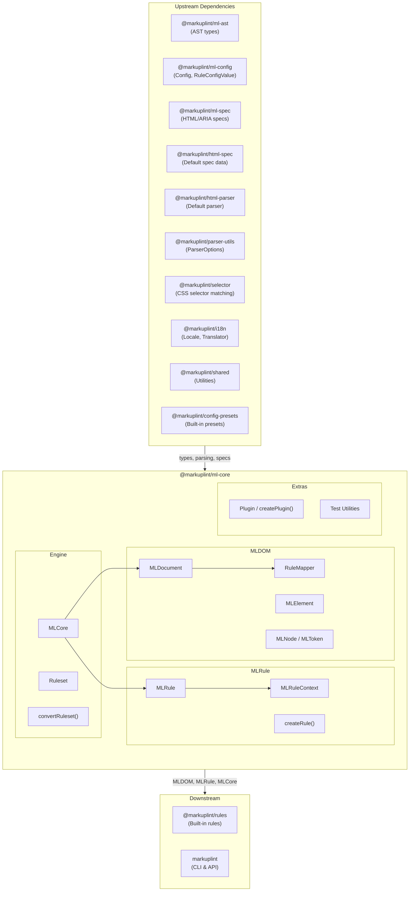
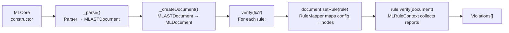
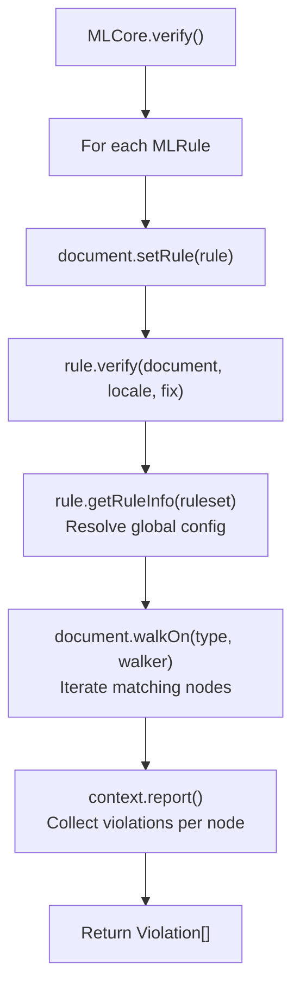
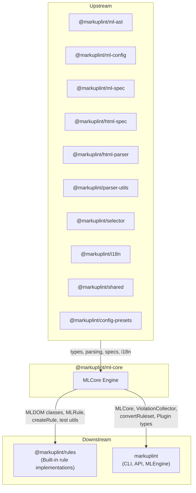

# @markuplint/ml-core

## Overview

`@markuplint/ml-core` is the core linting engine of markuplint. It converts a parsed AST (`MLASTDocument`) into a DOM tree (`MLDOM`), applies configured rules against nodes, and collects violations. The package comprises three subsystems: **MLDOM** (DOM abstraction layer), **MLRule** (rule execution framework), and **MLCore** (orchestration engine).

## Directory Structure

```
src/
├── index.ts                          — Public API re-exports
├── ml-core.ts                        — MLCore engine class
├── types.ts                          — MLFabric, MLSchema type definitions
├── convert-ruleset.ts                — Config → Ruleset converter
├── debug.ts                          — Debug logging utilities
├── violation-collector.ts            — Multi-file violation aggregator
├── ml-dom/
│   ├── index.ts                      — MLDOM public exports
│   ├── node/
│   │   ├── document.ts               — MLDocument (root node, rule mapping, pretender init)
│   │   ├── element.ts                — MLElement (attributes, selectors, namespaces)
│   │   ├── node.ts                   — MLNode (abstract base for all nodes)
│   │   ├── parent-node.ts            — MLParentNode (querySelector, children)
│   │   ├── character-data.ts         — MLCharacterData (abstract text base)
│   │   ├── text.ts                   — MLText
│   │   ├── comment.ts                — MLComment
│   │   ├── attr.ts                   — MLAttr (attribute tokens)
│   │   ├── block.ts                  — MLBlock (preprocessor blocks)
│   │   ├── document-fragment.ts      — MLDocumentFragment
│   │   ├── document-type.ts          — MLDocumentType
│   │   ├── element-close-tag.ts      — MLElementCloseTag
│   │   ├── rule-mapper.ts            — RuleMapper (ruleset → node mapping)
│   │   ├── types.ts                  — Node type constants, AccessibilityProperties
│   │   ├── node-list.ts              — NodeList/HTMLCollection utilities
│   │   └── unexpected-call-error.ts  — Error for unsupported DOM methods
│   ├── token/
│   │   └── token.ts                  — MLToken (base positional token)
│   ├── helper/
│   │   ├── accname.ts                — Accessible name computation
│   │   ├── create-node.ts            — AST → MLDOM node factory
│   │   ├── walkers.ts                — Tree traversal (sync/async walkers)
│   │   ├── get-indent.ts             — Indentation analysis
│   │   └── debug.ts                  — Debug map generation
│   └── manipulations/
│       ├── child-node-methods.ts     — ChildNode interface stubs
│       └── get-children.ts           — Element children extraction
├── ml-rule/
│   ├── ml-rule.ts                    — MLRule class (rule execution)
│   ├── ml-rule-context.ts            — MLRuleContext (report collection)
│   ├── create-rule.ts                — createRule factory
│   ├── create-test-rule.ts           — Test rule factory
│   └── types.ts                      — RuleSeed, Checker types
├── ruleset/
│   └── index.ts                      — Ruleset class (rules + nodeRules + childNodeRules)
├── plugin/
│   ├── plugin.ts                     — createPlugin factory
│   ├── types.ts                      — Plugin, PluginCreator types
│   └── index.ts                      — Plugin exports
├── test/
│   └── index.ts                      — createTestDocument, createTestElement, dummySchemas
└── utils/
    ├── index.ts                      — Utility exports
    ├── get-location-from-chars.ts    — Character location resolver
    └── string-splice.ts             — String splice helper
```

## Architecture Diagram



## Linting Pipeline

The `MLCore.verify()` method orchestrates the full linting flow:



### Step-by-step

1. **Parse**: `MLCore` invokes the configured parser (`MLParser`) to produce an `MLASTDocument`
2. **Create Document**: The AST is wrapped in an `MLDocument`, which builds the full MLDOM tree via `createNode()` factory. `RuleMapper` resolves rule configuration for every node
3. **Verify**: For each `MLRule`, the engine calls `document.setRule(rule)` then `rule.verify(document)`. The rule walks relevant nodes via `document.walkOn()` and reports violations through `MLRuleContext`
4. **Fix** (optional): When `fix=true`, rules may call `node.fix()` to modify token content. `document.toString(true)` produces the fixed source

## MLDOM Class Hierarchy

```
MLToken<A extends MLASTToken>
  └── MLNode<T, O, A extends MLASTNode>
        ├── MLAttr<T, O>
        ├── MLCharacterData<T, O, A>  (abstract)
        │     ├── MLText<T, O>
        │     └── MLComment<T, O>
        ├── MLDocumentType<T, O>
        ├── MLBlock<T, O>
        ├── MLElementCloseTag<T, O>
        └── MLParentNode<T, O, A>  (abstract)
              ├── MLElement<T, O>
              ├── MLDocumentFragment<T, O>
              └── MLDocument<T, O>
```

### Class Responsibilities

| Class                | DOM Interface      | Key Responsibility                                                                          |
| -------------------- | ------------------ | ------------------------------------------------------------------------------------------- |
| `MLToken`            | —                  | Base token with position tracking (`startLine`, `endCol`, `raw`, `fixed`), `fix()` method   |
| `MLNode`             | `Node`             | Tree structure (`parentNode`, `childNodes`, `nextSibling`), rule storage, `is()` type guard |
| `MLAttr`             | `Attr`             | Attribute name/value tokens, `isDynamicValue`, `isDirective`, `valueType`, `tokenList`      |
| `MLCharacterData`    | `CharacterData`    | Abstract base for text content nodes (`data`, `nodeValue`)                                  |
| `MLText`             | `Text`             | Text nodes, `isWhitespace()`, `isRawTextElementContent()`                                   |
| `MLComment`          | `Comment`          | Comment nodes with `textContent`                                                            |
| `MLDocumentType`     | `DocumentType`     | `<!DOCTYPE>` with `name`, `publicId`, `systemId`                                            |
| `MLBlock`            | —                  | Preprocessor-specific blocks (if/each/switch), `conditionalType`, `isTransparent`           |
| `MLElementCloseTag`  | —                  | Close tag paired with its open tag element                                                  |
| `MLParentNode`       | `ParentNode`       | `querySelector()`, `querySelectorAll()`, `children`, `childElementCount`                    |
| `MLElement`          | `Element`          | Attributes, selectors, namespaces, pretender context, `elementType`, `closeTag`             |
| `MLDocumentFragment` | `DocumentFragment` | Fragment root node                                                                          |
| `MLDocument`         | `Document`         | Root node, `nodeList`, `walkOn()`, `setRule()`, rule mapping, spec access                   |

## MLDocument

`MLDocument` is the root of the MLDOM tree and the primary interface for rule execution.

### Construction

The constructor receives an `MLASTDocument`, a `Ruleset`, and an `MLSchema` tuple. It:

1. Builds the flat `nodeList` by traversing the AST and calling `createNode()` for each AST node
2. Initializes `RuleMapper` to distribute rule configuration across nodes
3. Sets up pretender contexts when pretender definitions are provided

### Key Properties

| Property      | Type                    | Description                                               |
| ------------- | ----------------------- | --------------------------------------------------------- |
| `nodeList`    | `ReadonlyArray<MLNode>` | Flat list of all nodes in document order                  |
| `specs`       | `MLMLSpec`              | HTML/ARIA specification data                              |
| `isFragment`  | `boolean`               | Whether the document is a fragment                        |
| `currentRule` | `MLRule \| null`        | The rule currently being evaluated                        |
| `endTag`      | `EndTagType`            | End tag handling mode (`'xml'`, `'omittable'`, `'never'`) |

### Key Methods

| Method                            | Description                                                                                     |
| --------------------------------- | ----------------------------------------------------------------------------------------------- |
| `walkOn(type, walker)`            | Walks nodes of a given type (`'Element'`, `'Text'`, `'Comment'`, `'Attr'`, `'ElementCloseTag'`) |
| `setRule(rule)`                   | Sets the current rule, used by `MLCore` during verification                                     |
| `getTokenList()`                  | Returns all tokens for source reconstruction                                                    |
| `searchNodeByLocation(line, col)` | Finds the node at a given source position                                                       |
| `getAccessibilityProp(node)`      | Computes ARIA accessibility properties                                                          |
| `toString(fixed?)`                | Reconstructs source code, optionally with fixes applied                                         |

## MLElement

`MLElement` represents an HTML/SVG/MathML element with full attribute access and selector matching.

### Key Properties

| Property           | Type                        | Description                                  |
| ------------------ | --------------------------- | -------------------------------------------- |
| `localName`        | `string`                    | Lowercase tag name (for HTML)                |
| `namespaceURI`     | `NamespaceURI`              | Element namespace (HTML, SVG, MathML)        |
| `attributes`       | `MLNamedNodeMap`            | Named attribute collection                   |
| `elementType`      | `ElementType`               | `'html'`, `'web-component'`, or `'authored'` |
| `closeTag`         | `MLElementCloseTag \| null` | Paired close tag                             |
| `pretenderContext` | `PretenderContext \| null`  | Pretender mapping context                    |
| `isForeignElement` | `boolean`                   | `true` for SVG/MathML elements               |
| `isOmitted`        | `boolean`                   | `true` for implicitly inserted elements      |

### Key Methods

| Method                       | Description                                                      |
| ---------------------------- | ---------------------------------------------------------------- |
| `getAttribute(name)`         | Returns attribute value or `null`                                |
| `getAttributeToken(name)`    | Returns `MLAttr[]` for the named attribute                       |
| `hasAttribute(name)`         | Checks attribute existence                                       |
| `matches(selector)`          | CSS selector matching                                            |
| `matchMLSelector(selector)`  | Extended markuplint selector matching (supports `RegexSelector`) |
| `querySelector(selector)`    | Finds first matching descendant                                  |
| `querySelectorAll(selector)` | Finds all matching descendants                                   |

## Rule System

### MLRule

`MLRule<T, O>` encapsulates a linting rule with verification and optional fix logic.

| Property/Method                   | Description                                       |
| --------------------------------- | ------------------------------------------------- |
| `name`                            | Rule identifier (e.g., `"attr-duplication"`)      |
| `defaultSeverity`                 | Default severity level                            |
| `defaultValue` / `defaultOptions` | Default configuration                             |
| `verify(document, locale, fix)`   | Executes the rule and returns violations          |
| `optimizeOption(settings)`        | Normalizes raw rule configuration into `RuleInfo` |

### RuleSeed

The `RuleSeed<T, O>` type defines the rule implementation:

```typescript
type RuleSeed<T, O> = {
  meta?: {
    category?: 'validation' | 'style' | 'naming-convention' | 'a11y' | 'maintainability';
  };
  defaultSeverity?: Severity;
  defaultValue?: T;
  defaultOptions?: O;
  verify(context): void | Promise<void>;
  fix?(context): void | Promise<void>;
};
```

### createRule

`createRule(seed)` is a factory function for type-safe rule seed creation. It returns the seed as-is, serving primarily as a type helper.

### MLRuleContext

`MLRuleContext<T, O>` provides the execution context for rules:

- `document` — The current `MLDocument`
- `translate` / `t` — Locale-aware message translator
- `report(report)` — Reports a violation with node, message, and optional fix

The `provide()` method returns the context object passed to `RuleSeed.verify()` and `RuleSeed.fix()`.

### Rule Configuration Resolution

Rules are configured at three levels, resolved by `RuleMapper`:

1. **Global rules** (`rules`) — Apply to all nodes; lowest priority
2. **Node rules** (`nodeRules`) — Apply to nodes matching a selector; medium priority
3. **Child node rules** (`childNodeRules`) — Apply to children of nodes matching a selector; highest priority

When multiple rules match, `RuleMapper` resolves conflicts using CSS selector specificity. The mapping is computed once during `MLDocument` construction and stored on each `MLNode.rules`.

### Rule Execution Flow



## Pretender System

The pretender system allows components to be treated as semantic HTML elements during linting. This enables rules to validate custom components (e.g., `<MyButton>`) as if they were standard elements (e.g., `<button>`).

### Configuration

Pretenders are defined in the markuplint config as an array of `Pretender` objects:

```typescript
type Pretender = {
  selector: string; // CSS selector matching the component
  as: string; // HTML element to pretend as
  aria?: PretenderARIA; // Optional ARIA overrides
};
```

### How It Works

1. During `MLDocument` construction, pretender definitions are processed
2. Each `MLElement` matching a pretender selector gets a `pretenderContext` with `type: 'pretender'`
3. The target HTML element gets a `pretenderContext` with `type: 'origin'`
4. Rules can access `element.pretenderContext` to check the semantic mapping
5. Accessibility computations use pretender context for role/name resolution

## Conditional Child Nodes

Template engines (Pug, EJS, Nunjucks, etc.) produce preprocessor-specific blocks represented by `MLBlock` nodes. These blocks can wrap child nodes conditionally:

| `conditionalType` | Template Construct | Description                |
| ----------------- | ------------------ | -------------------------- |
| `'if:start'`      | ``         | Start of conditional block |
| `'if:else'`       | ``       | Alternative branch         |
| `'if:end'`        | ``      | End of conditional block   |
| `'each:start'`    | ``        | Start of loop              |
| `'each:end'`      | ``     | End of loop                |
| `'switch:start'`  | ``     | Start of switch            |
| `'switch:case'`   | ``       | Switch case                |
| `'switch:end'`    | ``  | End of switch              |

`MLNode.conditionalChildNodes()` returns an array of `NodeListOf` arrays — one per conditional branch — so rules can analyze each branch independently.

## Plugin System

Plugins extend markuplint with custom rules and shared configurations.

### Plugin Type

```typescript
type Plugin = {
  readonly name: string;
  readonly rules?: Record<string, RuleSeed<any, any>>;
  readonly configs?: Record<string, Config>;
};
```

### PluginCreator

For plugins that accept settings:

```typescript
type PluginCreator<S> = {
  readonly name: string;
  create(setting: S): Omit<Plugin, 'name'>;
};
```

`createPlugin(creator)` is a factory function for type-safe plugin creator definitions.

## Test Utilities

The `test/` module provides helpers for rule testing:

| Function                                    | Description                                     |
| ------------------------------------------- | ----------------------------------------------- |
| `createTestDocument(sourceCode, options?)`  | Parses source into an `MLDocument` for testing  |
| `createTestElement(sourceCode, options?)`   | Parses source and returns the first `MLElement` |
| `createTestNodeList(sourceCode, options?)`  | Returns the flat node list from parsed source   |
| `createTestTokenList(sourceCode, options?)` | Returns the flat token list from parsed source  |
| `dummySchemas()`                            | Returns the default HTML spec as a schema tuple |

`CreateTestOptions` accepts `config`, `parser`, `specs`, and `pretenders` overrides.

## External Dependencies

| Dependency                   | Purpose                                                           |
| ---------------------------- | ----------------------------------------------------------------- |
| `@markuplint/ml-ast`         | AST type definitions (`MLASTDocument`, `MLASTNode`, etc.)         |
| `@markuplint/ml-config`      | Configuration types (`Config`, `RuleConfigValue`, `Pretender`)    |
| `@markuplint/ml-spec`        | HTML/ARIA specification access (`MLMLSpec`, role/attribute specs) |
| `@markuplint/html-spec`      | Default HTML specification data                                   |
| `@markuplint/html-parser`    | Default HTML parser (used in test utilities)                      |
| `@markuplint/parser-utils`   | Parser options and types                                          |
| `@markuplint/selector`       | CSS and extended selector matching                                |
| `@markuplint/i18n`           | Internationalization (`LocaleSet`, `Translator`)                  |
| `@markuplint/shared`         | Shared utilities                                                  |
| `@markuplint/config-presets` | Built-in configuration presets                                    |
| `debug`                      | Debug logging                                                     |
| `is-plain-object`            | Plain object type checking                                        |
| `type-fest`                  | TypeScript utility types                                          |

## Integration Points



### Upstream

- **`@markuplint/ml-ast`** — AST types used to construct the MLDOM tree
- **`@markuplint/ml-config`** — Config and rule configuration types
- **`@markuplint/ml-spec`** — HTML/ARIA specification for element validation, role computation
- **`@markuplint/html-spec`** — Default spec data bundle
- **`@markuplint/html-parser`** — Default parser used in test utilities
- **`@markuplint/parser-utils`** — Parser option types
- **`@markuplint/selector`** — CSS selector engine for `querySelector`, `matches`, and `RegexSelector`
- **`@markuplint/i18n`** — Locale sets and translation for rule messages
- **`@markuplint/shared`** — Shared utility functions
- **`@markuplint/config-presets`** — Built-in configuration presets

### Downstream

- **`@markuplint/rules`** — Imports MLDOM classes, `createRule`, `MLRuleContext`, and test utilities to implement built-in rules
- **`markuplint`** — Imports `MLCore`, `ViolationCollector`, `convertRuleset`, and plugin types to provide the CLI and API

## Documentation Map

- [MLDOM Reference](docs/ml-dom.md) ([日本語](docs/ml-dom.ja.md)) — Class hierarchy, node properties, tree traversal
- [Rule System](docs/rule-system.md) ([日本語](docs/rule-system.ja.md)) — MLRule, RuleSeed, MLRuleContext, configuration resolution
- [Linting Pipeline](docs/linting-pipeline.md) ([日本語](docs/linting-pipeline.ja.md)) — MLCore engine, verify flow, pretender, plugin system
- [Maintenance Guide](docs/maintenance.md) ([日本語](docs/maintenance.ja.md)) — Commands, recipes, and troubleshooting
