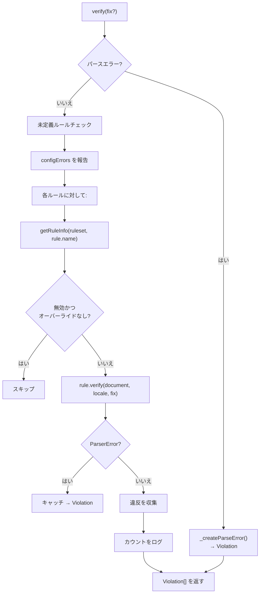

# リンティングパイプライン

`@markuplint/ml-core` の MLCore リンティングエンジンの詳細リファレンスです。

## 概要

`MLCore` はパース、DOM 構築、ルール実行、違反収集を接続するオーケストレーションエンジンです。パイプラインのフロー：

```
ソースコード → パーサー → MLASTDocument → MLDocument → ルール検証 → 違反
```

## MLCore クラス

ソース: `src/ml-core.ts`

### コンストラクタ

```typescript
constructor(params: MLCoreParams)
```

`MLCoreParams` は `MLFabric` を以下で拡張します：

| パラメータ   | 型        | 説明                   |
| ------------ | --------- | ---------------------- |
| `sourceCode` | `string`  | リントするソースコード |
| `filename`   | `string`  | ソースファイル名       |
| `debug`      | `boolean` | デバッグログの有効化   |

### MLFabric

`MLFabric` 型はリンティング設定全体を定義します：

| フィールド      | 型                                | 説明                                                  |
| --------------- | --------------------------------- | ----------------------------------------------------- |
| `parser`        | `MLParser`                        | パーサーインスタンス（例：`@markuplint/html-parser`） |
| `ruleset`       | `Ruleset`                         | 解決済みルール設定                                    |
| `rules`         | `readonly MLRule[]`               | ルールインスタンスの配列                              |
| `locale`        | `LocaleSet`                       | 違反メッセージのロケール                              |
| `schemas`       | `MLSchema`                        | HTML/ARIA 仕様タプル                                  |
| `parserOptions` | `ParserOptions`                   | パーサー設定オプション                                |
| `severity`      | `{ parseError?: SeverityOption }` | 重大度オーバーライド                                  |
| `pretenders`    | `readonly Pretender[]`            | コンポーネントから HTML へのマッピング                |
| `configErrors`  | `readonly ConfigError[]`          | 報告する設定エラー                                    |

### プロパティ

| プロパティ | 型                          | 説明                                       |
| ---------- | --------------------------- | ------------------------------------------ |
| `document` | `MLDocument \| ParserError` | パースされたドキュメントまたはパースエラー |

### 構築フロー

1. `_parse()` — `parser.parse(sourceCode, parserOptions)` を呼び出して `MLASTDocument` を生成
2. `_createDocument()` — AST を `MLDocument` でラップ（ruleset、schemas、オプション付き）

パースが失敗した場合、`document` は `MLDocument` の代わりに `ParserError` を保持します。

## パースフェーズ

### `_parse()`

`parser.parse(sourceCode, parserOptions)` を呼び出し、`MLASTDocument` を返します。

パーサーがスローした場合：

- エラーが `ParserError` としてキャッチされる
- `document` に `ParserError` オブジェクトが設定される
- `verify()` が後でこれを `Violation` に変換

## ドキュメント作成フェーズ

### `_createDocument()`

パースされた AST から `MLDocument` を作成します：

```typescript
new Document(ast, ruleset, schemas, {
  filename,
  endTag,
  booleanish,
  tagNameCaseSensitive,
  pretenders,
});
```

構築時に `MLDocument` は：

1. AST を走査してフラットな `nodeList` を構築
2. `RuleMapper` を初期化してルール設定を配布
3. pretender 定義が存在する場合、pretender コンテキストをセットアップ

## 検証フェーズ

### `verify(fix?): Promise<Violation[]>`

メインのリンティングメソッド。違反の配列を返します。

**フロー:**



### ステップごとの説明

1. **パースエラーチェック**: `document` が `ParserError` の場合、単一の違反を作成して返す
2. **未定義ルールの検出**: `setRuleNames`（設定内のルール）と `definedRuleName`（実際にロードされたルール）を比較。未定義ルールに対して `config-error` 警告を報告
3. **設定エラー**: `configErrors` 配列を違反に変換
4. **ルールループ**: 各ルールに対して：
   - `rule.getRuleInfo(ruleset, rule.name)` で有効性をチェック
   - `disabled && nodeRules.length === 0 && childNodeRules.length === 0` → スキップ
   - `rule.verify(document, locale, fix)` — ルールを実行
   - 検証中にスローされた `ParserError` をキャッチ
5. **結果ログ**: デバッグ経由で error/warning/info カウントをログ出力

### パースエラーの重大度

`severity.parseError` が設定されている場合：

| 設定                   | 動作                           |
| ---------------------- | ------------------------------ |
| `false` または `'off'` | パースエラーを抑制（違反なし） |
| `true` または `null`   | `'error'` 重大度として報告     |
| Severity 値            | その重大度で報告               |

## 更新と再パース

### `setCode(sourceCode)`

新しいソースコードで再パース：

1. 保存されたソースコードを更新
2. `_parse()` を呼び出して新しい AST を生成
3. `_createDocument()` を呼び出して MLDOM を再構築

### `update(partial<MLFabric>)`

リンティング設定の部分更新：

- `parserOptions` が変更された場合 → 完全な再パース（`_parse()` + `_createDocument()`）
- それ以外 → `_createDocument()` のみ（既存の AST を再利用）

この最適化により、ルールや設定のみの変更時に不要な再パースを回避します。

## ViolationCollector

ソース: `src/violation-collector.ts`

オプションの最大数制限付きで複数ファイルの違反を集約します。

### コンストラクタ

```typescript
constructor(maxCount?: number)
```

### メソッド

| メソッド                                | 戻り値                     | 説明                                    |
| --------------------------------------- | -------------------------- | --------------------------------------- |
| `pushWithFile(filePath, ...violations)` | `void`                     | ファイルの違反を追加（maxCount を尊重） |
| `isLocked()`                            | `boolean`                  | maxCount に到達した場合 `true`          |
| `toArray()`                             | `FileViolation[]`          | すべての違反をフラット配列として返す    |
| `groupByFile()`                         | `Map<string, Violation[]>` | ファイルパスでグループ化された違反      |

### プロパティ

| プロパティ | 型       | 説明       |
| ---------- | -------- | ---------- |
| `length`   | `number` | 違反の総数 |

### maxCount の動作

`maxCount` が設定されている場合：

- `pushWithFile()` は `length >= maxCount` に到達すると違反の受け入れを停止
- `isLocked()` は制限到達後に `true` を返す
- 既に追加された違反は保持される

## Pretender システム

ソース: `src/ml-dom/node/document.ts`、要素の pretending メソッド

### Pretender 型

```typescript
type Pretender = {
  selector: string; // コンポーネントにマッチする CSS セレクタ
  as: string; // 偽装する HTML 要素
  aria?: PretenderARIA; // オプションの ARIA オーバーライド
};
```

### 動作の仕組み

1. `MLDocument` の構築時に `_pretending()` が pretender 定義を処理
2. pretender セレクタにマッチする各 `MLElement` が `element.pretending(pretenders)` を呼び出す
3. マッチした要素が `PretenderContext` を取得：
   - コンポーネント要素に `type: 'pretender'`
   - 対象 HTML 要素参照に `type: 'origin'`
4. ルールが `element.pretenderContext` にアクセスしてセマンティックマッピングを確認
5. アクセシブル名の計算（`getAccname()`）がロール/名前の解決に pretender コンテキストを使用

### PretenderContext

```typescript
type PretenderContext =
  | { type: 'pretender'; as: MLElement; aria?: PretenderARIA }
  | { type: 'origin'; pretender: MLElement };
```

## プラグインシステム

ソース: `src/plugin/types.ts`, `src/plugin/plugin.ts`

### Plugin 型

```typescript
type Plugin = {
  readonly name: string;
  readonly rules?: Record<string, RuleSeed<any, any>>;
  readonly configs?: Record<string, Config>;
};
```

### PluginCreator

設定を受け付けるプラグイン用：

```typescript
type PluginCreator<S> = {
  readonly name: string;
  create(setting: S): Omit<Plugin, 'name'>;
};
```

### createPlugin

```typescript
function createPlugin<S>(creator: PluginCreator<S>): PluginCreator<S>;
```

型安全なプラグインクリエーター定義のためのファクトリ関数。クリエーターをそのまま返し、型ヘルパーとして機能します。

### プラグインの利用

プラグインが提供するもの：

- **カスタムルール** — 名前で登録される追加のルールシード
- **共有設定** — 再利用可能な設定プリセット

## MLSchema

ソース: `src/types.ts`

```typescript
type MLSchema = [MLMLSpec, ...ExtendedSpec[]];
```

タプル構造：

- 最初の要素: ベースの HTML/ARIA 仕様（`MLMLSpec`）
- 残り: 拡張仕様（例：フレームワーク固有の要素定義）

### schemaToSpec()

スキーマタプルを単一の仕様オブジェクトに解決します。MLDOM が要素/属性の検証に使用します。

## デバッグ

ソース: `src/debug.ts`

### enableDebug()

ml-core パッケージと CLI のデバッグログを有効化します。

### デバッグ名前空間

| 名前空間                  | 説明                   |
| ------------------------- | ---------------------- |
| `ml-core`                 | コアエンジンの操作     |
| `ml-core:ml-dom`          | MLDOM ツリーの操作     |
| `ml-core:ml-dom:document` | ドキュメント構築の詳細 |
| `ml-core:rule-mapper`     | ルールマッピングの操作 |

デバッグ出力は `debug` npm パッケージで制御されます。環境変数 `DEBUG=ml-core*` で有効化できます。
