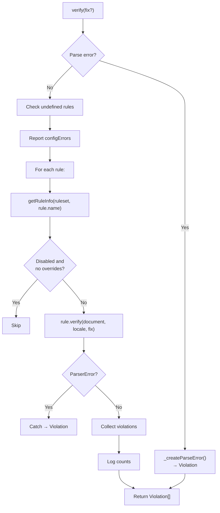

# Linting Pipeline

Detailed reference for the MLCore linting engine in `@markuplint/ml-core`.

## Overview

`MLCore` is the orchestration engine that connects parsing, DOM construction, rule execution, and violation collection. The pipeline flows:

```
Source Code → Parser → MLASTDocument → MLDocument → Rule Verification → Violations
```

## MLCore Class

Source: `src/ml-core.ts`

### Constructor

```typescript
constructor(params: MLCoreParams)
```

Where `MLCoreParams` extends `MLFabric` with:

| Parameter    | Type      | Description             |
| ------------ | --------- | ----------------------- |
| `sourceCode` | `string`  | The source code to lint |
| `filename`   | `string`  | Source filename         |
| `debug`      | `boolean` | Enable debug logging    |

### MLFabric

The `MLFabric` type defines the full linting configuration:

| Field           | Type                              | Description                                       |
| --------------- | --------------------------------- | ------------------------------------------------- |
| `parser`        | `MLParser`                        | Parser instance (e.g., `@markuplint/html-parser`) |
| `ruleset`       | `Ruleset`                         | Resolved rule configuration                       |
| `rules`         | `readonly MLRule[]`               | Array of rule instances                           |
| `locale`        | `LocaleSet`                       | Locale for violation messages                     |
| `schemas`       | `MLSchema`                        | HTML/ARIA specification tuple                     |
| `parserOptions` | `ParserOptions`                   | Parser configuration options                      |
| `severity`      | `{ parseError?: SeverityOption }` | Severity overrides                                |
| `pretenders`    | `readonly Pretender[]`            | Component-to-HTML mappings                        |
| `configErrors`  | `readonly ConfigError[]`          | Configuration errors to report                    |

### Properties

| Property   | Type                        | Description                    |
| ---------- | --------------------------- | ------------------------------ |
| `document` | `MLDocument \| ParserError` | Parsed document or parse error |

### Construction Flow

1. `_parse()` — Invokes `parser.parse(sourceCode, parserOptions)` to produce `MLASTDocument`
2. `_createDocument()` — Wraps AST in `MLDocument` with ruleset, schemas, and options

If parsing fails, `document` holds a `ParserError` instead of `MLDocument`.

## Parse Phase

### `_parse()`

Calls `parser.parse(sourceCode, parserOptions)` which returns an `MLASTDocument`.

If the parser throws:

- The error is caught as a `ParserError`
- `document` is set to the `ParserError` object
- `verify()` will later convert this to a `Violation`

## Document Creation Phase

### `_createDocument()`

Creates `MLDocument` from the parsed AST:

```typescript
new Document(ast, ruleset, schemas, {
  filename,
  endTag,
  booleanish,
  tagNameCaseSensitive,
  pretenders,
});
```

During construction, `MLDocument`:

1. Builds the flat `nodeList` by traversing the AST
2. Initializes `RuleMapper` to distribute rule configuration
3. Sets up pretender contexts when pretender definitions exist

## Verification Phase

### `verify(fix?): Promise<Violation[]>`

The main linting method. Returns an array of violations.

**Flow:**



### Step-by-step

1. **Parse error check**: If `document` is a `ParserError`, creates a single violation and returns
2. **Undefined rule detection**: Compares `setRuleNames` (rules in config) vs `definedRuleName` (rules actually loaded). Reports `config-error` warnings for undefined rules
3. **Config errors**: Converts `configErrors` array to violations
4. **Rule loop**: For each rule:
   - `rule.getRuleInfo(ruleset, rule.name)` checks enablement
   - If `disabled && nodeRules.length === 0 && childNodeRules.length === 0` → skip
   - `rule.verify(document, locale, fix)` — executes the rule
   - Catches `ParserError` if thrown during verification
5. **Result logging**: Logs error/warning/info counts via debug

### Parse Error Violation

When `severity.parseError` is configured:

| Setting            | Behavior                              |
| ------------------ | ------------------------------------- |
| `false` or `'off'` | Parse error suppressed (no violation) |
| `true` or `null`   | Reported as `'error'` severity        |
| Severity value     | Reported with that severity           |

## Update and Re-parse

### `setCode(sourceCode)`

Re-parses with new source code:

1. Updates stored source code
2. Calls `_parse()` to produce new AST
3. Calls `_createDocument()` to rebuild MLDOM

### `update(partial<MLFabric>)`

Partially updates the linting configuration:

- If `parserOptions` changed → full re-parse (`_parse()` + `_createDocument()`)
- Otherwise → only `_createDocument()` (reuses existing AST)

This optimization avoids unnecessary re-parsing when only rules or config change.

## ViolationCollector

Source: `src/violation-collector.ts`

Aggregates violations across multiple files with an optional maximum count.

### Constructor

```typescript
constructor(maxCount?: number)
```

### Methods

| Method                                  | Returns                    | Description                                   |
| --------------------------------------- | -------------------------- | --------------------------------------------- |
| `pushWithFile(filePath, ...violations)` | `void`                     | Add violations for a file (respects maxCount) |
| `isLocked()`                            | `boolean`                  | `true` if maxCount reached                    |
| `toArray()`                             | `FileViolation[]`          | All violations as flat array                  |
| `groupByFile()`                         | `Map<string, Violation[]>` | Violations grouped by file path               |

### Properties

| Property | Type     | Description           |
| -------- | -------- | --------------------- |
| `length` | `number` | Total violation count |

### maxCount Behavior

When `maxCount` is set:

- `pushWithFile()` stops accepting violations once `length >= maxCount`
- `isLocked()` returns `true` after reaching the limit
- Already-added violations are preserved

## Pretender System

Source: `src/ml-dom/node/document.ts`, element pretending methods

### Pretender Type

```typescript
type Pretender = {
  selector: string; // CSS selector matching the component
  as: string; // HTML element to pretend as
  aria?: PretenderARIA; // Optional ARIA overrides
};
```

### How It Works

1. During `MLDocument` construction, `_pretending()` processes pretender definitions
2. Each `MLElement` matching a pretender selector calls `element.pretending(pretenders)`
3. Matched elements get a `PretenderContext`:
   - `type: 'pretender'` on the component element
   - `type: 'origin'` on the target HTML element reference
4. Rules access `element.pretenderContext` to check semantic mappings
5. Accessible name computation (`getAccname()`) uses pretender context for role/name resolution

### PretenderContext

```typescript
type PretenderContext =
  | { type: 'pretender'; as: MLElement; aria?: PretenderARIA }
  | { type: 'origin'; pretender: MLElement };
```

## Plugin System

Source: `src/plugin/types.ts`, `src/plugin/plugin.ts`

### Plugin Type

```typescript
type Plugin = {
  readonly name: string;
  readonly rules?: Record<string, RuleSeed<any, any>>;
  readonly configs?: Record<string, Config>;
};
```

### PluginCreator

For plugins that accept settings:

```typescript
type PluginCreator<S> = {
  readonly name: string;
  create(setting: S): Omit<Plugin, 'name'>;
};
```

### createPlugin

```typescript
function createPlugin<S>(creator: PluginCreator<S>): PluginCreator<S>;
```

Factory function for type-safe plugin creator definitions. Returns the creator as-is, serving as a type helper.

### Plugin Usage

Plugins provide:

- **Custom rules** — Additional rule seeds registered by name
- **Shared configurations** — Reusable config presets

## MLSchema

Source: `src/types.ts`

```typescript
type MLSchema = [MLMLSpec, ...ExtendedSpec[]];
```

A tuple where:

- First element: The base HTML/ARIA specification (`MLMLSpec`)
- Rest: Extended specifications (e.g., framework-specific element definitions)

### schemaToSpec()

Resolves the schema tuple into a single spec object used by MLDOM for element/attribute validation.

## Debug

Source: `src/debug.ts`

### enableDebug()

Enables debug logging for the ml-core package and CLI.

### Debug Namespaces

| Namespace                 | Description                   |
| ------------------------- | ----------------------------- |
| `ml-core`                 | Core engine operations        |
| `ml-core:ml-dom`          | MLDOM tree operations         |
| `ml-core:ml-dom:document` | Document construction details |
| `ml-core:rule-mapper`     | Rule mapping operations       |

Debug output is controlled via the `debug` npm package. Enable with `DEBUG=ml-core*` environment variable.
