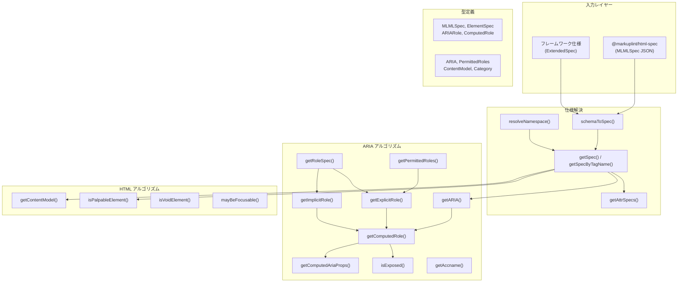
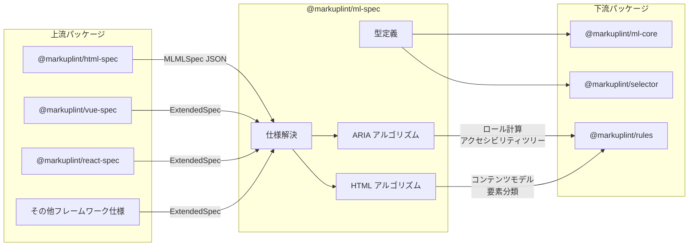

# @markuplint/ml-spec

## 概要

`@markuplint/ml-spec` は markuplint の仕様基盤レイヤーです。型定義、W3C 仕様アルゴリズム（ARIA/HTML）、JSON スキーマ、ランタイムユーティリティを提供し、Web 標準の生データと markuplint のリントルールを橋渡しします。

`@markuplint/html-spec`（およびフレームワーク固有の仕様パッケージ）から要素仕様・ARIA ロール/プロパティ定義・コンテンツモデルデータを読み込み、ARIA ロール計算・要素仕様の解決・コンテンツモデル評価・アクセシビリティツリー包含判定のアルゴリズムを公開します。15 以上の下流パッケージが依存しています。

## ディレクトリ構成

```
src/
├── index.ts                                      # エントリーポイント。全公開 API を再エクスポート
├── types/
│   ├── index.ts                                  # 手書きのコア型（MLMLSpec, ElementSpec, ARIARole 等）
│   ├── aria.ts                                   # aria.schema.json から生成（ARIA, PermittedRoles, ImplicitRole）
│   ├── attributes.ts                             # attributes.schema.json から生成（AttributeType, GlobalAttributes）
│   └── permitted-structures.ts                   # content-models.schema.json から生成（ContentModel, Category）
├── algorithm/
│   ├── aria/
│   │   ├── accname-computation.ts                # dom-accessibility-api によるアクセシブルネーム計算
│   │   ├── aria-specs.ts                         # バージョン別 ARIA 仕様データの取得
│   │   ├── get-aria.ts                           # 要素レベルの ARIA 仕様解決（条件付き）
│   │   ├── get-computed-aria-props.ts            # ARIA プロパティ解決（明示 → HTML → デフォルト）
│   │   ├── get-computed-role.ts                  # 中核：最終ロール計算と競合解決
│   │   ├── get-explicit-role.ts                  # role 属性からの明示ロール（著者エラー処理）
│   │   ├── get-implicit-role.ts                  # HTML-AAM による暗黙ロール
│   │   ├── get-implicit-role-spec.ts             # 暗黙ロール名の低レベル検索
│   │   ├── get-non-presentational-ancestor.ts    # プレゼンテーショナルロールをスキップする祖先探索
│   │   ├── get-permitted-roles.ts                # DOM 要素の許可ロール
│   │   ├── get-permitted-roles-spec.ts           # タグ名/名前空間による許可ロール（低レベル）
│   │   ├── get-role-spec.ts                      # スーパークラスチェーン付きロール仕様
│   │   ├── has-required-owned-elements.ts        # 必須所有要素の検証
│   │   ├── is-exposed.ts                         # アクセシビリティツリー包含/除外
│   │   ├── is-presentational.ts                  # プレゼンテーショナルロール判定（presentation/none）
│   │   └── matches-context-role.ts               # 必須コンテキストロールの検証
│   └── html/
│       ├── content-model-category-to-tag-names.ts  # カテゴリ → タグ名配列（キャッシュ付き）
│       ├── get-content-model.ts                    # 条件付きコンテンツモデル評価
│       ├── get-selectors-by-content-model-category.ts  # カテゴリ → CSS セレクタ配列
│       ├── is-nothing-content-model.ts             # 「Nothing」コンテンツモデル判定
│       ├── is-palpable-elements.ts                 # パルパブルコンテンツ検出
│       ├── is-void-element.ts                      # ボイド要素判定（13 要素）
│       └── may-be-focusable.ts                     # フォーカス可能性ヒューリスティック
└── utils/
    ├── aria-version.ts                           # ARIA バージョン定数（'1.1', '1.2', '1.3'）
    ├── get-attr-specs.ts                         # DOM 要素の属性仕様（ラッパー）
    ├── get-attr-specs-spec.ts                    # タグ名/名前空間による属性仕様（コア）
    ├── get-ns.ts                                 # 名前空間 URI → 短縮名マッピング
    ├── get-spec.ts                               # DOM 要素の要素仕様（ラッパー）
    ├── get-spec-by-tag-name.ts                   # タグ名/名前空間による要素仕様（キャッシュ付き）
    ├── merge-array.ts                            # 名前ベースの配列マージユーティリティ
    ├── resolve-namespace.ts                      # 名前空間解決とプレフィックス正規化
    ├── resolve-version.ts                        # ARIA バージョン固有プロパティの解決
    ├── schema-to-spec.ts                         # スキーママージパイプライン（ベース + 拡張）
    └── validate-aria-version.ts                  # ARIA バージョン文字列の型ガード

schemas/
├── element.schema.json                           # トップレベル要素仕様スキーマ（11 行）
├── aria.schema.json                              # ARIA ロール/プロパティスキーマ（291 行）
├── attributes.schema.json                        # 属性型スキーマ（190 行）
├── content-models.schema.json                    # コンテンツモデルパターンスキーマ（215 行）
└── global-attributes.schema.json                 # グローバル属性カテゴリスキーマ（787 行）

gen/
├── gen.ts                                        # global-attributes.schema.json のスキーマジェネレータ
└── global-attribute.data.ts                      # グローバル属性カテゴリ定義
```

## アーキテクチャ図



## 主要コンポーネント

### 1. 型定義

型システムは、マークアップ言語仕様・要素仕様・ARIA ロール・属性の構造を定義します。

| ファイル                        | 役割                                                                                              |
| ------------------------------- | ------------------------------------------------------------------------------------------------- |
| `types/index.ts`                | 手書き型: `MLMLSpec`, `ElementSpec`, `ExtendedSpec`, `ARIARole`, `ComputedRole` 等                |
| `types/aria.ts`                 | 生成型: `ARIA`, `PermittedRoles`, `ImplicitRole`, `PermittedARIAProperties`, `ImplicitProperties` |
| `types/attributes.ts`           | 生成型: `AttributeType`, `GlobalAttributes`, `AttributeJSON`, `List`, `Enum`, `Number`            |
| `types/permitted-structures.ts` | 生成型: `PermittedContentPattern`, `ContentModel`, `Category`（HTML 13 + SVG 19 カテゴリ）        |

### 2. ARIA アルゴリズム

ARIA アルゴリズムは WAI-ARIA, HTML-AAM, SVG-AAM, AccName 1.1 仕様に基づくロール計算とアクセシビリティツリー管理を実装します。

| ファイル                         | 役割                                                                            |
| -------------------------------- | ------------------------------------------------------------------------------- |
| `get-computed-role.ts`           | 中核アルゴリズム: Presentational Roles Conflict Resolution による最終ロール計算 |
| `get-explicit-role.ts`           | `role` 属性からの明示ロール解決（著者エラー処理付き）                           |
| `get-implicit-role.ts`           | HTML-AAM に基づく暗黙（ネイティブ）ARIA ロールの決定                            |
| `get-computed-aria-props.ts`     | ARIA プロパティ解決: 明示 `aria-*` → HTML 等価属性 → 仕様デフォルト             |
| `is-exposed.ts`                  | WAI-ARIA ルールに基づくアクセシビリティツリーの包含/除外判定                    |
| `get-permitted-roles.ts`         | 要素の許可ロール一覧（Any/No/具体的リスト）                                     |
| `get-role-spec.ts`               | スーパークラスロールチェーン付き完全ロール仕様の取得                            |
| `has-required-owned-elements.ts` | 必須所有要素制約の検証                                                          |
| `matches-context-role.ts`        | 祖先チェーンにおける必須コンテキストロール条件の検証                            |
| `accname-computation.ts`         | `dom-accessibility-api` によるアクセシブルネーム計算                            |
| `get-aria.ts`                    | バージョンと条件の解決を含む要素レベル ARIA 仕様                                |
| `is-presentational.ts`           | ロールが `presentation` または `none` かどうかの判定                            |

### 3. HTML アルゴリズム

HTML アルゴリズムは HTML Living Standard に基づくコンテンツモデル評価と要素分類を実装します。

| ファイル                                     | 役割                                                                           |
| -------------------------------------------- | ------------------------------------------------------------------------------ |
| `get-content-model.ts`                       | 条件付きパターン評価を含むコンテンツモデルの取得                               |
| `content-model-category-to-tag-names.ts`     | コンテンツモデルカテゴリをソート済みタグ名配列に変換                           |
| `get-selectors-by-content-model-category.ts` | コンテンツモデルカテゴリを CSS セレクタにマッピング                            |
| `is-palpable-elements.ts`                    | SVG/露出可能要素拡張付きパルパブルコンテンツ検出                               |
| `is-void-element.ts`                         | ボイド要素判定（13 の HTML ボイド要素）                                        |
| `is-nothing-content-model.ts`                | 「Nothing」コンテンツモデル判定（void + iframe + template）                    |
| `may-be-focusable.ts`                        | フォーカス可能性ヒューリスティック（interactive + tabindex + contenteditable） |

### 4. 仕様解決ユーティリティ

仕様のマージ・解決・キャッシュのためのユーティリティです。

| ファイル                   | 役割                                                                         |
| -------------------------- | ---------------------------------------------------------------------------- |
| `schema-to-spec.ts`        | ベース `MLMLSpec` と `ExtendedSpec[]` のマージ（グローバル属性, ARIA, 要素） |
| `get-spec-by-tag-name.ts`  | タグ名 + 名前空間による要素仕様の検索（キャッシュ付き）                      |
| `get-attr-specs-spec.ts`   | マージ済み属性仕様の取得（グローバル + 要素固有）                            |
| `resolve-namespace.ts`     | 名前空間プレフィックスを含む要素名の正規化                                   |
| `resolve-version.ts`       | ARIA バージョン固有のオーバーライドをフォールバック付きで解決                |
| `merge-array.ts`           | 名前ベースの配列マージ（`name` プロパティによる追加/上書き）                 |
| `validate-aria-version.ts` | 有効な ARIA バージョン文字列の型ガード                                       |

## 外部依存パッケージ

| パッケージ              | 用途                                               | 使用箇所                      |
| ----------------------- | -------------------------------------------------- | ----------------------------- |
| `@markuplint/ml-ast`    | XML 名前空間処理のための `NamespaceURI` 型         | `types/index.ts`, utils       |
| `@markuplint/types`     | 属性値の型定義のための `Type` 共用体               | `types/attributes.ts` 経由    |
| `dom-accessibility-api` | AccName 計算（WAI-ARIA アルゴリズム）              | `accname-computation.ts`      |
| `is-plain-object`       | AAM 情報のプレーンオブジェクト検出                 | `get-permitted-roles-spec.ts` |
| `type-fest`             | 深い不変性のための `ReadonlyDeep` ユーティリティ型 | 複数ファイル                  |

## 他パッケージとの連携



### 上流

`@markuplint/html-spec` は、全 HTML 要素仕様・ARIA 定義・コンテンツモデルデータを含むベース `MLMLSpec` JSON を提供します。フレームワーク固有パッケージ（`@markuplint/vue-spec`, `@markuplint/react-spec` 等）は、要素・属性・ARIA マッピングを追加またはオーバーライドする `ExtendedSpec` オブジェクトを提供します。

### 下流

- **`@markuplint/ml-core`** は型定義を使用して、仕様認識を持つパース済みドキュメント要素を表現します。
- **`@markuplint/rules`** は ARIA および HTML アルゴリズムを呼び出して、リントルール（ロール検証、コンテンツモデルチェック、アクセシビリティチェック）を実装します。
- **`@markuplint/selector`** は要素マッチングのために型定義を使用します。

## ドキュメントマップ

- [ARIA アルゴリズム](docs/aria-algorithms.ja.md) -- ロール計算、アクセシビリティツリー、ARIA プロパティ解決
- [HTML アルゴリズム](docs/html-algorithms.ja.md) -- コンテンツモデル、要素分類、ボイド要素
- [型定義](docs/type-definitions.ja.md) -- コア型、生成型、JSON スキーマ
- [仕様解決](docs/spec-resolution.ja.md) -- スキーママージ、名前空間解決、キャッシュ
- [メンテナンスガイド](docs/maintenance.ja.md) -- スキーマ生成、依存関係管理、レシピ、トラブルシューティング
