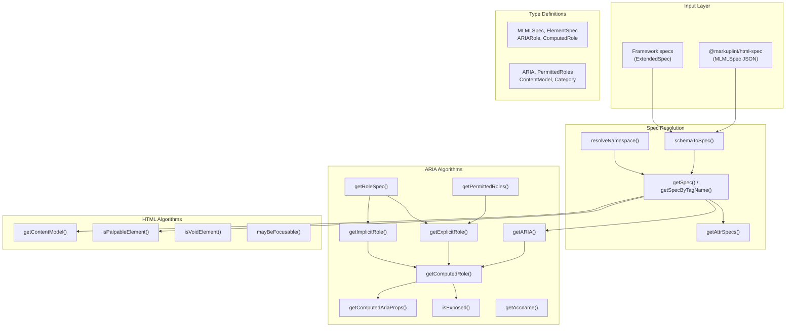
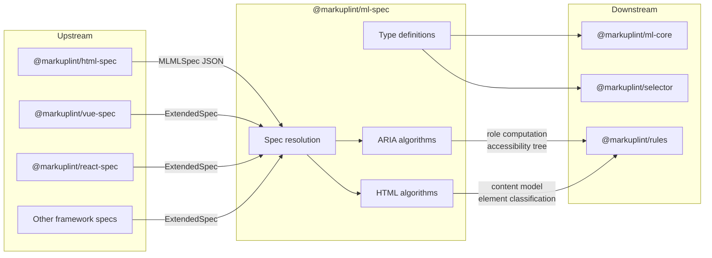

# @markuplint/ml-spec

## Overview

`@markuplint/ml-spec` is the specification foundation layer for markuplint. It provides type definitions, W3C specification algorithms (ARIA/HTML), JSON schemas, and runtime utilities that form the bridge between raw web standard data and markuplint's lint rules.

The package reads element specifications, ARIA role/property definitions, and content model data from `@markuplint/html-spec` (and framework-specific spec packages), then exposes algorithms for computing ARIA roles, resolving element specifications, evaluating content models, and determining accessibility tree inclusion. Over 15 downstream packages depend on `@markuplint/ml-spec`.

## Directory Structure

```
src/
├── index.ts                                      # Package entry point; re-exports all public APIs
├── types/
│   ├── index.ts                                  # Hand-written core types (MLMLSpec, ElementSpec, ARIARole, etc.)
│   ├── aria.ts                                   # Generated types from aria.schema.json (ARIA, PermittedRoles, ImplicitRole)
│   ├── attributes.ts                             # Generated types from attributes.schema.json (AttributeType, GlobalAttributes)
│   └── permitted-structures.ts                   # Generated types from content-models.schema.json (ContentModel, Category)
├── algorithm/
│   ├── aria/
│   │   ├── accname-computation.ts                # Accessible name computation via dom-accessibility-api
│   │   ├── aria-specs.ts                         # Version-specific ARIA spec data retrieval
│   │   ├── get-aria.ts                           # Element-level ARIA spec resolution with conditions
│   │   ├── get-computed-aria-props.ts            # ARIA property resolution (explicit → HTML → default)
│   │   ├── get-computed-role.ts                  # Core: final role computation with conflict resolution
│   │   ├── get-explicit-role.ts                  # Explicit role from role attribute with author error handling
│   │   ├── get-implicit-role.ts                  # Implicit (native) role from HTML-AAM
│   │   ├── get-implicit-role-spec.ts             # Low-level implicit role name lookup
│   │   ├── get-non-presentational-ancestor.ts    # Ancestor traversal skipping presentational roles
│   │   ├── get-permitted-roles.ts                # Permitted roles for a DOM element
│   │   ├── get-permitted-roles-spec.ts           # Permitted roles from tag name/namespace (low-level)
│   │   ├── get-role-spec.ts                      # Full role spec with super-class chain
│   │   ├── has-required-owned-elements.ts        # Required owned elements validation
│   │   ├── is-exposed.ts                         # Accessibility tree inclusion/exclusion
│   │   ├── is-presentational.ts                  # Presentational role check (presentation/none)
│   │   └── matches-context-role.ts               # Required context role validation
│   └── html/
│       ├── content-model-category-to-tag-names.ts  # Category → tag name array (cached)
│       ├── get-content-model.ts                    # Content model with conditional evaluation
│       ├── get-selectors-by-content-model-category.ts  # Category → CSS selector array
│       ├── is-nothing-content-model.ts             # "Nothing" content model check
│       ├── is-palpable-elements.ts                 # Palpable content detection
│       ├── is-void-element.ts                      # Void element check (13 elements)
│       └── may-be-focusable.ts                     # Focusability heuristic
└── utils/
    ├── aria-version.ts                           # ARIA version constants ('1.1', '1.2', '1.3')
    ├── get-attr-specs.ts                         # Attribute specs for a DOM element (wrapper)
    ├── get-attr-specs-spec.ts                    # Attribute specs by tag name/namespace (core)
    ├── get-ns.ts                                 # Namespace URI → shorthand mapping
    ├── get-spec.ts                               # Element spec for a DOM element (wrapper)
    ├── get-spec-by-tag-name.ts                   # Element spec by tag name/namespace (cached)
    ├── merge-array.ts                            # Name-based array merge utility
    ├── resolve-namespace.ts                      # Namespace resolution and prefix normalization
    ├── resolve-version.ts                        # ARIA version-specific property resolution
    ├── schema-to-spec.ts                         # Schema merge pipeline (base + extensions)
    └── validate-aria-version.ts                  # ARIA version string type guard

schemas/
├── element.schema.json                           # Top-level element spec schema (11 lines)
├── aria.schema.json                              # ARIA role/property schema (291 lines)
├── attributes.schema.json                        # Attribute type schema (190 lines)
├── content-models.schema.json                    # Content model pattern schema (215 lines)
└── global-attributes.schema.json                 # Global attribute categories schema (787 lines)

gen/
├── gen.ts                                        # Schema generator for global-attributes.schema.json
└── global-attribute.data.ts                      # Global attribute category definitions
```

## Architecture Diagram



## Core Components

### 1. Type Definitions

The type system defines the structure of markup language specifications, element specs, ARIA roles, and attributes.

| File                            | Purpose                                                                                              |
| ------------------------------- | ---------------------------------------------------------------------------------------------------- |
| `types/index.ts`                | Hand-written types: `MLMLSpec`, `ElementSpec`, `ExtendedSpec`, `ARIARole`, `ComputedRole`, etc.      |
| `types/aria.ts`                 | Generated: `ARIA`, `PermittedRoles`, `ImplicitRole`, `PermittedARIAProperties`, `ImplicitProperties` |
| `types/attributes.ts`           | Generated: `AttributeType`, `GlobalAttributes`, `AttributeJSON`, `List`, `Enum`, `Number`            |
| `types/permitted-structures.ts` | Generated: `PermittedContentPattern`, `ContentModel`, `Category` (HTML 13 + SVG 19 categories)       |

### 2. ARIA Algorithms

ARIA algorithms implement WAI-ARIA, HTML-AAM, SVG-AAM, and AccName 1.1 specifications for role computation and accessibility tree management.

| File                             | Purpose                                                                           |
| -------------------------------- | --------------------------------------------------------------------------------- |
| `get-computed-role.ts`           | Core algorithm: computes final role with Presentational Roles Conflict Resolution |
| `get-explicit-role.ts`           | Resolves explicit roles from `role` attribute with author error handling          |
| `get-implicit-role.ts`           | Determines implicit (native) ARIA role from HTML-AAM                              |
| `get-computed-aria-props.ts`     | Resolves ARIA properties: explicit `aria-*` → HTML equivalent → spec defaults     |
| `is-exposed.ts`                  | Determines accessibility tree inclusion/exclusion per WAI-ARIA rules              |
| `get-permitted-roles.ts`         | Lists permitted roles for an element (Any/No/specific list)                       |
| `get-role-spec.ts`               | Retrieves full role spec with super-class role chain                              |
| `has-required-owned-elements.ts` | Validates required owned element constraints                                      |
| `matches-context-role.ts`        | Validates required context role conditions in ancestor chain                      |
| `accname-computation.ts`         | Accessible name computation via `dom-accessibility-api`                           |
| `get-aria.ts`                    | Element-level ARIA spec with version and condition resolution                     |
| `is-presentational.ts`           | Checks if a role is `presentation` or `none`                                      |

### 3. HTML Algorithms

HTML algorithms implement content model evaluation and element classification from the HTML Living Standard.

| File                                         | Purpose                                                           |
| -------------------------------------------- | ----------------------------------------------------------------- |
| `get-content-model.ts`                       | Retrieves content model with conditional pattern evaluation       |
| `content-model-category-to-tag-names.ts`     | Converts content model category to sorted tag name array          |
| `get-selectors-by-content-model-category.ts` | Maps content model category to CSS selectors                      |
| `is-palpable-elements.ts`                    | Palpable content detection with SVG/exposable extensions          |
| `is-void-element.ts`                         | Void element check (13 HTML void elements)                        |
| `is-nothing-content-model.ts`                | "Nothing" content model check (void + iframe + template)          |
| `may-be-focusable.ts`                        | Focusability heuristic (interactive + tabindex + contenteditable) |

### 4. Spec Resolution Utilities

Utilities for merging, resolving, and caching specifications.

| File                       | Purpose                                                                     |
| -------------------------- | --------------------------------------------------------------------------- |
| `schema-to-spec.ts`        | Merges base `MLMLSpec` with `ExtendedSpec[]` (global attrs, ARIA, elements) |
| `get-spec-by-tag-name.ts`  | Looks up element spec by tag name + namespace (cached)                      |
| `get-attr-specs-spec.ts`   | Retrieves merged attribute specs (global + element-specific)                |
| `resolve-namespace.ts`     | Normalizes element names with namespace prefixes                            |
| `resolve-version.ts`       | Resolves ARIA version-specific overrides with fallback                      |
| `merge-array.ts`           | Name-based array merging (add/override by `name` property)                  |
| `validate-aria-version.ts` | Type guard for valid ARIA version strings                                   |

## External Dependencies

| Dependency              | Purpose                                           | Where Used                    |
| ----------------------- | ------------------------------------------------- | ----------------------------- |
| `@markuplint/ml-ast`    | `NamespaceURI` type for XML namespace handling    | `types/index.ts`, utils       |
| `@markuplint/types`     | `Type` union for attribute value type definitions | via `types/attributes.ts`     |
| `dom-accessibility-api` | AccName computation (WAI-ARIA algorithm)          | `accname-computation.ts`      |
| `is-plain-object`       | Plain object detection for AAM info               | `get-permitted-roles-spec.ts` |
| `type-fest`             | `ReadonlyDeep` utility type for deep immutability | Multiple files                |

## Integration Points



### Upstream

`@markuplint/html-spec` provides the base `MLMLSpec` JSON containing all HTML element specifications, ARIA definitions, and content model data. Framework-specific packages (`@markuplint/vue-spec`, `@markuplint/react-spec`, etc.) provide `ExtendedSpec` objects that add or override elements, attributes, and ARIA mappings.

### Downstream

- **`@markuplint/ml-core`** uses the type definitions to represent parsed document elements with spec awareness.
- **`@markuplint/rules`** calls ARIA and HTML algorithms to implement lint rules (role validation, content model checking, accessibility checks).
- **`@markuplint/selector`** uses type definitions for element matching.

## Documentation Map

- [ARIA Algorithms](docs/aria-algorithms.md) -- Role computation, accessibility tree, ARIA property resolution
- [HTML Algorithms](docs/html-algorithms.md) -- Content models, element classification, void elements
- [Type Definitions](docs/type-definitions.md) -- Core types, generated types, JSON schemas
- [Spec Resolution](docs/spec-resolution.md) -- Schema merging, namespace resolution, caching
- [Maintenance Guide](docs/maintenance.md) -- Schema generation, dependency management, recipes, troubleshooting
