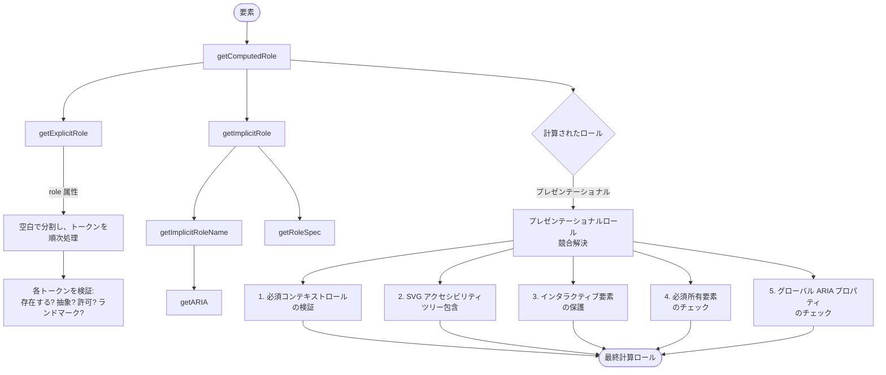

# ARIA アルゴリズム関数

## 概要

`@markuplint/ml-spec` パッケージは、W3C 仕様に忠実に従った ARIA（Accessible Rich Internet Applications）アルゴリズム関数群を実装しています。これらのアルゴリズムは、HTML および SVG 要素の ARIA ロール、プロパティ、アクセシブル名、アクセシビリティツリーへの公開状態を計算します。

実装は以下の仕様に基づいています：

- **WAI-ARIA 1.1 / 1.2 / 1.3** -- ロール定義、ステート、プロパティ
- **HTML-AAM**（HTML Accessibility API Mappings）-- HTML 要素の暗黙のロールマッピング
- **SVG-AAM**（SVG Accessibility API Mappings）-- SVG のアクセシビリティツリー包含ルール
- **AccName 1.1**（Accessible Name and Description Computation）-- アクセシブル名の計算
- **ARIA in HTML** -- 要素ごとの許可されたロールと ARIA 属性の制約

### 設計方針

すべての ARIA アルゴリズム関数は一貫した設計に従っています：

- 標準的な DOM `Element` インターフェースで動作し、markuplint 固有のノード型を必要としません。
- マークアップ言語仕様データ全体を含む `MLMLSpec` パラメータを受け取ります。
- バージョン固有の動作を選択するために `ARIAVersion` パラメータ（`'1.1'`、`'1.2'`、または `'1.3'`）を受け取ります。
- 純粋関数であり、副作用はありません（`getARIA` の内部キャッシュを除く）。

## ロール計算パイプライン

ロール計算パイプラインは、任意の要素の最終的な ARIA ロールを決定します。中心となる関数 `getComputedRole()` が複数のサブアルゴリズムを統括します：



パイプラインは以下の順序で処理を行います：

1. `role` 属性から**明示的ロール**の解決を試みます。
2. 有効な明示的ロールが見つからない場合、HTML-AAM マッピングから**暗黙のロール**を解決します。
3. 解決されたロールがプレゼンテーショナル（`presentation` または `none`）である場合、**プレゼンテーショナルロール競合解決**アルゴリズムを適用して、プレゼンテーショナルロールを上書きすべきかどうかを判定します。

## 関数リファレンス

### 1. `getComputedRole(specs, el, version, assumeSingleNode?): ComputedRole`

**ソース:** `src/algorithm/aria/get-computed-role.ts`

ARIA アルゴリズム群の中核となる関数です。明示的ロール解決、暗黙のロール解決、およびプレゼンテーショナルロール競合解決アルゴリズムを組み合わせて、要素の最終的な ARIA ロールを計算します。

**パラメータ:**

| パラメータ         | 型                               | 説明                                                                     |
| ------------------ | -------------------------------- | ------------------------------------------------------------------------ |
| `specs`            | `MLMLSpec`                       | マークアップ言語仕様全体                                                 |
| `el`               | `Element`                        | ロールを計算する DOM 要素                                                |
| `version`          | `ARIAVersion`                    | 使用する ARIA 仕様バージョン                                             |
| `assumeSingleNode` | `boolean`（デフォルト: `false`） | `true` の場合、親コンテキストの検証をスキップし、`NO_OWNER` エラーを返す |

**戻り値:** `ComputedRole` -- `el`、`role`（解決されたロール仕様または `null`）、およびオプションの `errorType` を含みます。

**アルゴリズムの手順:**

1. **明示的ロール解決:** `getExplicitRole()` を呼び出して `role` 属性を解析します。
2. **暗黙のロールへのフォールバック:** 有効な明示的ロールが見つからない場合、`getImplicitRole()` を呼び出します。暗黙のロールにフォールバックする際、`NO_EXPLICIT` エラーは抑制されます。
3. **単一ノードのショートカット:** `assumeSingleNode` が `true` の場合、`NO_OWNER` エラータイプとともに即座にリターンし、すべての親コンテキストチェックをスキップします。
4. **プレゼンテーショナルロール競合解決**（解決されたロールがプレゼンテーショナルの場合に適用）：

**競合解決チェック（順序通り）:**

1. **必須コンテキストロールの検証** -- ロールに `requiredContextRole` エントリがある場合、親階層をチェックします。親要素が存在しない場合は `NO_OWNER` を返します。親階層がコンテキストロール条件を満たさない場合（`matchesContextRole()` 経由）、`INVALID_REQUIRED_CONTEXT_ROLE` を返します。プレゼンテーショナルな祖先は `getNonPresentationalAncestor()` 経由で透過的に走査されます。

2. **SVG アクセシビリティツリー包含** -- 有効な明示的ロールを持たない SVG 名前空間要素について、アクセシブル名があるか（`getAccname()` 経由）、または `<title>`/`<desc>` 子要素があるかをチェックします。どちらも存在しない場合、その SVG 要素はアクセシビリティツリーから除外されます（`role: null` を返す）。これは、通常省略される SVG 要素を含めるための SVG-AAM ルールを実装しています。

3. **インタラクティブ要素の保護** -- フォーカス可能な要素はプレゼンテーショナルになれません。`mayBeFocusable()` をチェックし、要素が `disabled`、`inert`、`hidden` でないことを確認します（各属性について祖先を走査）。要素がインタラクティブで disabled/inert/hidden でない場合、プレゼンテーショナルロールは暗黙のロールで上書きされ、`INTERACTIVE_ELEMENT_MUST_NOT_BE_PRESENTATIONAL` エラーが返されます。

4. **必須所有要素のチェック** -- 非プレゼンテーショナルな祖先が `requiredOwnedElements` を持ち、現在の要素の暗黙のロールがその必須所有要素のいずれかに一致する場合、プレゼンテーショナルロールは上書きされます。`REQUIRED_OWNED_ELEMENT_MUST_NOT_BE_PRESENTATIONAL` を返します。

5. **グローバル ARIA プロパティのチェック** -- 要素がグローバル ARIA プロパティ（例: `aria-label`、`aria-describedby`）を持つ場合、プレゼンテーショナルロールは暗黙のロールで上書きされます。`GLOBAL_PROP_MUST_NOT_BE_PRESENTATIONAL` を返します。

**例:**

```ts
import { getComputedRole } from '@markuplint/ml-spec';

const result = getComputedRole(specs, element, '1.2');
if (result.role) {
  console.log(`ロール: ${result.role.name}, 暗黙: ${result.role.isImplicit}`);
} else {
  console.log(`ロールなし。エラー: ${result.errorType}`);
}
```

---

### 2. `getExplicitRole(specs, el, version): ComputedRole`

**ソース:** `src/algorithm/aria/get-explicit-role.ts`

`role` 属性値から ARIA ロールを解決します。WAI-ARIA の「著者エラーの処理」アルゴリズムを実装しています。

**パラメータ:**

| パラメータ | 型            | 説明                            |
| ---------- | ------------- | ------------------------------- |
| `specs`    | `MLMLSpec`    | マークアップ言語仕様全体        |
| `el`       | `Element`     | 明示的ロールを解決する DOM 要素 |
| `version`  | `ARIAVersion` | 使用する ARIA 仕様バージョン    |

**戻り値:** `ComputedRole` -- 最初に見つかった有効なロール、またはエラータイプ付きの `null`。

**アルゴリズム:**

1. `role` 属性を読み取り、小文字に変換し、空白で分割してトークン化します。
2. `getPermittedRoles()` 経由で要素の許可されたロールリストを取得します。
3. `resolveNamespace()` 経由で要素の名前空間を解決します。
4. 各ロールトークンを順次処理し、著者エラーチェックを行います：

| チェック                                   | エラーコード       | WAI-ARIA ルール                                                                                                  |
| ------------------------------------------ | ------------------ | ---------------------------------------------------------------------------------------------------------------- |
| ロール名が仕様に存在しない                 | `ROLE_NO_EXISTS`   | 「role 属性に非抽象 WAI-ARIA ロール名と一致するトークンがない場合...」                                           |
| 抽象ロールが使用された                     | `ABSTRACT`         | 「コンテンツで抽象ロールを使用することは著者エラーとみなされます。」                                             |
| ロールが許可ロールリストにない             | `NO_PERMITTED`     | ARIA in HTML により、要素には許可されたロールリストの制約があります。                                            |
| 必須アクセシブル名のないランドマークロール | `INVALID_LANDMARK` | 「特定のランドマークロールは著者による名前が必要です。」`aria-label` および `aria-labelledby` をチェックします。 |

5. すべてのチェックに合格した最初のロールを `isImplicit: false` とともに返します。
6. 有効なロールが見つからない場合、最後に検出されたエラータイプとともに `role: null` を返します。

---

### 3. `getImplicitRole(specs, el, version): ComputedRole`

**ソース:** `src/algorithm/aria/get-implicit-role.ts`

タグ名、名前空間、および HTML-ARIA で定義されたマッチング条件に基づいて、要素の暗黙の（ネイティブ）ARIA ロールを決定します。

**パラメータ:**

| パラメータ | 型            | 説明                            |
| ---------- | ------------- | ------------------------------- |
| `specs`    | `MLMLSpec`    | マークアップ言語仕様全体        |
| `el`       | `Element`     | 暗黙のロールを決定する DOM 要素 |
| `version`  | `ARIAVersion` | 使用する ARIA 仕様バージョン    |

**戻り値:** `ComputedRole`

**アルゴリズム:**

1. `getImplicitRoleName()` を呼び出してロール名文字列を取得します。
2. 戻り値が `false`（対応するロールなし）の場合、`{ el, role: null }` を返します。
3. `resolveNamespace()` 経由で要素の名前空間を解決します。
4. `getRoleSpec()` を呼び出して完全なロール仕様を取得します。
5. ロール仕様が見つからない場合（名前空間解決の失敗）、`{ el, role: null, errorType: 'IMPLICIT_ROLE_NAMESPACE_ERROR' }` を返します。
6. `{ el, role: { ...spec, isImplicit: true } }` を返します。

---

### 4. `getImplicitRoleName(el, version, specs): ImplicitRole`

**ソース:** `src/algorithm/aria/get-implicit-role.ts`

完全なロール仕様を解決せずに、要素の暗黙のロール名文字列を取得します。

**パラメータ:**

| パラメータ | 型            | 説明                         |
| ---------- | ------------- | ---------------------------- |
| `el`       | `Element`     | ロール名を検索する DOM 要素  |
| `version`  | `ARIAVersion` | 使用する ARIA 仕様バージョン |
| `specs`    | `MLMLSpec`    | マークアップ言語仕様全体     |

**戻り値:** `ImplicitRole` -- ロール名文字列（例: `"button"`、`"textbox"`）、または要素に対応するロールがない場合は `false`。

**実装の詳細:**

- `get-implicit-role-spec.ts` の低レベル `getImplicitRole()` 関数に委譲します。
- CSS セレクタベースの条件付きロール解決を可能にするため、`el.matches.bind(el)` を条件評価関数として渡します（例: `input[type=checkbox]` は `"checkbox"` ロールにマッピング）。

---

### 5. `getPermittedRoles(el, version, specs)`（DOM レベル）

**ソース:** `src/algorithm/aria/get-permitted-roles.ts`

要素に対して許可された ARIA ロールのリストを取得する DOM レベルのラッパーです。

**パラメータ:**

| パラメータ | 型            | 説明                     |
| ---------- | ------------- | ------------------------ |
| `el`       | `Element`     | DOM 要素                 |
| `version`  | `ARIAVersion` | ARIA 仕様バージョン      |
| `specs`    | `MLMLSpec`    | マークアップ言語仕様全体 |

**戻り値:** `readonly { readonly name: string; readonly deprecated?: boolean }[]`

**実装:** 仕様レベルの `getPermittedRoles()` 関数に委譲し、`el.matches.bind(el)` を条件評価関数として渡します。

---

### 6. `getPermittedRoles(specs, localName, namespace, version, matches)`（仕様レベル）

**ソース:** `src/algorithm/aria/get-permitted-roles-spec.ts`

許可された ARIA ロールを計算するための仕様レベルの実装です。DOM 要素ではなく、タグ名と名前空間で動作します。

**パラメータ:**

| パラメータ  | 型               | 説明                               |
| ----------- | ---------------- | ---------------------------------- |
| `specs`     | `MLMLSpec`       | マークアップ言語仕様全体           |
| `localName` | `string`         | 要素のローカルタグ名               |
| `namespace` | `string \| null` | 要素の名前空間 URI                 |
| `version`   | `ARIAVersion`    | ARIA 仕様バージョン                |
| `matches`   | `Matches`        | CSS セレクタマッチをテストする関数 |

**戻り値:** `readonly { readonly name: string; readonly deprecated?: boolean }[]`

**アルゴリズム:**

1. `getARIA()` を呼び出して要素の ARIA 仕様を取得します。
2. 仕様から `implicitRole` と `permittedRoles` を読み取ります。
3. `permittedRoles` の値に基づいて許可ロールリストを構築します：

| `permittedRoles` の値               | 動作                                                                                                                                 |
| ----------------------------------- | ------------------------------------------------------------------------------------------------------------------------------------ |
| `true`                              | ARIA 仕様のすべての非抽象ロールが許可されます。                                                                                      |
| `PermittedARIAAAMInfo` オブジェクト | `core-aam` が `true` の場合、すべての非抽象ロールを追加。`graphics-aam` が `true` の場合、すべての非抽象グラフィックスロールを追加。 |
| 文字列/オブジェクトの配列           | リストに記載された特定のロールが許可されます。                                                                                       |
| `false`                             | ロールは許可されません（暗黙のロール追加前は空リスト）。                                                                             |

4. 結果には常に暗黙のロールを含めます。暗黙のロールが `"presentation"` または `"none"` の場合、両方の等価ロールが含まれます。
5. マージおよび重複排除されたリストを返します。

---

### 7. `getRoleSpec(specs, roleName, namespace, version)`

**ソース:** `src/algorithm/aria/get-role-spec.ts`

指定されたロール名の完全な ARIA ロール仕様を、スーパークラスロールの完全なチェーンを含めて取得します。

**パラメータ:**

| パラメータ  | 型             | 説明                           |
| ----------- | -------------- | ------------------------------ |
| `specs`     | `MLMLSpec`     | マークアップ言語仕様全体       |
| `roleName`  | `string`       | 検索する ARIA ロール名         |
| `namespace` | `NamespaceURI` | 要素コンテキストの名前空間 URI |
| `version`   | `ARIAVersion`  | ARIA 仕様バージョン            |

**戻り値:** `(ARIARole & { superClassRoles: ARIARoleInSchema[] }) | null`

**アルゴリズム:**

1. 指定されたバージョンの ARIA ロールリストからロール名で検索します。
2. SVG 名前空間（`http://www.w3.org/2000/svg`）の場合、コアロールで見つからなければ `graphicsRoles` も検索します。
3. `generalization` プロパティ経由でスーパークラスロールを再帰的に走査し、完全な継承チェーンを構築します。
4. すべてのオプションフィールドを未定義でないデフォルト値に正規化します（例: `!!role.isAbstract`、`role.requiredContextRole ?? []`）。
5. ロール名が仕様に存在しない場合は `null` を返します。

**戻り値の正規化されたフィールド:**

```ts
{
  name: string;
  isAbstract: boolean;          // デフォルト: false
  deprecated: boolean;          // デフォルト: false
  requiredContextRole: string[];     // デフォルト: []
  requiredOwnedElements: string[];   // デフォルト: []
  accessibleNameRequired: boolean;   // デフォルト: false
  accessibleNameFromAuthor: boolean; // デフォルト: false
  accessibleNameFromContent: boolean;// デフォルト: false
  accessibleNameProhibited: boolean; // デフォルト: false
  childrenPresentational: boolean;   // デフォルト: false
  ownedProperties: ARIARoleOwnedProperties[]; // デフォルト: []
  prohibitedProperties: string[];    // デフォルト: []
  superClassRoles: ARIARoleInSchema[];
}
```

---

### 8. `getARIA(specs, localName, namespace, version, matches)`

**ソース:** `src/algorithm/aria/get-aria.ts`

バージョン解決済みの ARIA 仕様を要素に対して取得し、条件付きオーバーライドを評価します。

**パラメータ:**

| パラメータ  | 型               | 説明                               |
| ----------- | ---------------- | ---------------------------------- |
| `specs`     | `MLMLSpec`       | マークアップ言語仕様全体           |
| `localName` | `string`         | 要素のローカルタグ名               |
| `namespace` | `string \| null` | 要素の名前空間 URI                 |
| `version`   | `ARIAVersion`    | ARIA 仕様バージョン                |
| `matches`   | `Matches`        | CSS セレクタマッチをテストする関数 |

**戻り値:** `Omit<ReadonlyDeep<ARIA>, ARIAVersion | 'conditions'> | null`

**アルゴリズム:**

1. `getVersionResolvedARIA()` を呼び出します。この関数は：
   - タグ名と名前空間で要素仕様を検索します。
   - `resolveVersion()` を適用して、ベース ARIA 仕様の上にバージョン固有のオーバーライドをマージします。
   - 許可ロールの最適化：許可ロール配列に `"presentation"` がある場合は `"none"` を追加し、逆も同様です（WAI-ARIA 1.2 の `none` ロールに関する注記に準拠）。
   - 結果を `localName + namespace + version` をキーとしてキャッシュします。

2. 条件付きオーバーライド（ARIA 仕様の `conditions` ブロック）を評価します：
   - 条件キー（CSS セレクタ、例: `[type=checkbox]`）を順次処理します。
   - マッチする条件ごとに、`implicitRole`、`permittedRoles`、`implicitProperties`、`properties`、`namingProhibited` を上書きします。
   - 後の条件は前の条件よりも優先されます。

3. 最終的に解決された ARIA 仕様を返します。要素の仕様が存在しない場合は `null` を返します。

**例:** `<input>` の場合、ベース仕様は汎用的な暗黙のロールを定義しますが、条件 `[type=checkbox]` がそれを `"checkbox"` ロールに上書きします。

---

### 9. `getComputedAriaProps(specs, el, version): Record<string, ARIAProp>`

**ソース:** `src/algorithm/aria/get-computed-aria-props.ts`

要素の計算されたロールに基づいて、解決済みの ARIA プロパティを計算します。

**パラメータ:**

| パラメータ | 型            | 説明                     |
| ---------- | ------------- | ------------------------ |
| `specs`    | `MLMLSpec`    | マークアップ言語仕様全体 |
| `el`       | `Element`     | DOM 要素                 |
| `version`  | `ARIAVersion` | ARIA 仕様バージョン      |

**戻り値:** `Record<string, ARIAProp>`（各 `ARIAProp` の構造）:

```ts
{
  name: string;
  value: string | undefined;
  required: boolean;
  deprecated: boolean;
  from: 'aria-attr' | 'html-attr' | 'default';
}
```

**各所有プロパティの解決優先順位:**

1. **明示的な `aria-*` 属性** (`from: 'aria-attr'`): 要素に対応する `aria-*` 属性があり、その値が `isValidAriaValue()` による検証に合格する場合。
2. **等価な HTML 属性** (`from: 'html-attr'`): 最初の `equivalentHtmlAttrs` エントリが存在し、要素がその HTML 属性を持つ場合。値は HTML 属性の値か、固定のマッピング値のいずれかです。
3. **仕様のデフォルト値** (`from: 'default'`): ARIA 仕様のプロパティの `defaultValue` にフォールバックします。

**特殊なケース:** `<h1>` から `<h6>` 要素の `aria-level` については、デフォルト値が見出しレベル番号から導出されます（例: `<h2>` の場合は `"2"`）。

**値の検証（`isValidAriaValue`）:**

| 値の型                                     | 検証ルール                                                 |
| ------------------------------------------ | ---------------------------------------------------------- |
| `string`                                   | 常に有効                                                   |
| `ID reference`、`ID reference list`、`URI` | 空でないこと                                               |
| `integer`、`number`                        | 有効な数値として解析可能であること                         |
| `token`、`token list`                      | 列挙値のいずれかに一致すること（大文字小文字を区別しない） |
| `tristate`                                 | `"true"`、`"false"`、または `"mixed"` であること           |
| `true/false`                               | `"true"` または `"false"` であること                       |
| `true/false/undefined`                     | `"true"`、`"false"`、または `"undefined"` であること       |

要素に計算されたロールがない場合、空のレコードを返します。

---

### 10. `getAccname(el): string`

**ソース:** `src/algorithm/aria/accname-computation.ts`

WAI-ARIA アクセシブル名計算アルゴリズムを使用して、要素のアクセシブル名を計算します。

**パラメータ:**

| パラメータ | 型        | 説明     |
| ---------- | --------- | -------- |
| `el`       | `Element` | DOM 要素 |

**戻り値:** `string` -- 計算されたアクセシブル名、または見つからない場合は空文字列。

**アルゴリズム:**

1. AccName 1.1 アルゴリズムを完全に実装した `dom-accessibility-api` ライブラリの `computeAccessibleName()` に委譲します。
2. **`<input>` 要素のフォールバック:** 計算された名前がトリム後に空の場合、`placeholder` 属性の値（トリム済み）を返します。
3. いずれの方法でも名前が見つからない場合、空文字列を返します。

---

### 11. `isExposed(el, specs, version): boolean`

**ソース:** `src/algorithm/aria/is-exposed.ts`

要素がアクセシビリティツリーに含まれる（公開される）かどうかを判定します。

**パラメータ:**

| パラメータ | 型            | 説明                     |
| ---------- | ------------- | ------------------------ |
| `el`       | `Element`     | チェックする DOM 要素    |
| `specs`    | `MLMLSpec`    | マークアップ言語仕様全体 |
| `version`  | `ARIAVersion` | ARIA 仕様バージョン      |

**戻り値:** `boolean` -- 要素がアクセシビリティツリーに公開されるべき場合は `true`。

**除外チェック（`false` を返す）:**

1. **`display:none` / `visibility:hidden` / `hidden` 属性**: すべての祖先を走査します。要素自身を含むいずれかの祖先の `style` 属性に `display:none` または `visibility:hidden` がある場合、あるいは `hidden` 属性を持つ場合、要素は除外されます。
2. **プレゼンテーショナルな最初のロール**: `role` 属性の最初のトークンが `presentation` または `none` である場合、要素は除外されます。
3. **`aria-hidden="true"`**: すべての祖先を走査します。いずれかの祖先が `aria-hidden="true"` を持つ場合、要素は除外されます。親の `aria-hidden="true"` は子孫の `aria-hidden="false"` を上書きすることに注意してください。
4. **`childrenPresentational` 要素の子**: いずれかの祖先が `childrenPresentational: true` を持つ計算ロールを持つ場合、要素は除外されます。

**要素レベルのチェック:**

5. **SVG レンダリングルール**: `#SVGRenderable` コンテンツモデルに対してチェックし、SVG 要素がレンダリングされるかどうかを判定します。
6. **HTML メタデータ要素のフィルタリング**: `#metadata` コンテンツモデルカテゴリに一致する要素（例: `<meta>`、`<link>`、`<style>`）は除外されます。`<input type="hidden">` も同様です。

**包含チェック（`true` を返す）:**

7. **明示的ロールまたはグローバル ARIA 属性**: 要素が `aria-hidden="true"` でない場合、明示的な（暗黙でない）ロールまたはグローバル ARIA 属性を持つことで包含が強制されます。

**デフォルト:** いずれの除外ルールにも一致しない要素に対しては `true` を返します。

---

### 12. `hasRequiredOwnedElement(el, specs, version): boolean` / `isRequiredOwnedElement(el, role, query, specs, version): boolean`

**ソース:** `src/algorithm/aria/has-required-owned-elements.ts`

「必須所有要素」制約を検証するための関連する 2 つの関数です。

#### `hasRequiredOwnedElement`

要素がその計算ロールで定義された必須所有要素の制約を満たしているかどうかをチェックします。

**アルゴリズム:**

1. 要素が `aria-owns` 属性を持つ場合、`true` を返します（部分的サポート -- 参照される要素は検証されません）。
2. `getComputedRole()` 経由で要素のロールを計算します。
3. ロールに `requiredOwnedElements` がない場合、`true` を返します。
4. 要素の最も近い非プレゼンテーショナルな子孫を走査します（子要素を対象とし、プレゼンテーショナルな要素は透過的に通過）。
5. 各必須所有要素パターンについて、いずれかの子孫が `isRequiredOwnedElement()` 経由でマッチするかをチェックします。

#### `isRequiredOwnedElement`

要素が必須所有要素クエリにマッチするかどうかを判定します。

**パラメータ:**

| パラメータ | 型                     | 説明                                                               |
| ---------- | ---------------------- | ------------------------------------------------------------------ |
| `el`       | `Element`              | テストする DOM 要素                                                |
| `role`     | `ComputedRole['role']` | 要素の計算ロール                                                   |
| `query`    | `string`               | 必須所有要素クエリ（例: `"listitem"` または `"group > listitem"`） |
| `specs`    | `MLMLSpec`             | マークアップ言語仕様全体                                           |
| `version`  | `ARIAVersion`          | ARIA 仕様バージョン                                                |

**クエリ構文:** `>` 記法によるチェーンをサポートします。例えば、`"group > listitem"` は要素がロール `"group"` を持ち、ロール `"listitem"` を持つ子孫を含む必要があることを意味します。

**仕様上の課題:** WAI-ARIA 仕様は「所有（owned）」が子か子孫かを決定していません。この実装では HTML セマンティクスに合わせるため、「所有」を**子**（子孫ではなく）として解釈しています。プレゼンテーショナルな子は透過的に走査されます。

---

### 13. `matchesContextRole(conditions, ownedEl, specs, version): boolean`

**ソース:** `src/algorithm/aria/matches-context-role.ts`

要素の親階層が、必須コンテキストロール条件の少なくとも 1 つを満たしているかどうかを検証します。

**パラメータ:**

| パラメータ   | 型                  | 説明                             |
| ------------ | ------------------- | -------------------------------- |
| `conditions` | `readonly string[]` | 必須コンテキストロール条件文字列 |
| `ownedEl`    | `Element`           | 親コンテキストを検証する所有要素 |
| `specs`      | `MLMLSpec`          | マークアップ言語仕様全体         |
| `version`    | `ARIAVersion`       | ARIA 仕様バージョン              |

**戻り値:** `boolean` -- いずれかの条件が満たされている場合は `true`。

**アルゴリズム:**

1. 各条件文字列を順次処理します。
2. 各条件は `>` で区切られた祖先ロールのチェーンを記述できます（例: `"list > group"`）。
3. 条件文字列を分割・反転し、直近の親から上方に向かって親階層と照合します。
4. 各レベルで、`getComputedRole()` を `assumeSingleNode = true` として呼び出し、親のロールを独立して取得します。
5. いずれかの条件文字列が祖先チェーンと完全に一致すれば `true` を返します。

**例:** `requiredContextRole: ["list", "list > group"]` を持つ `listitem` ロールの場合：

- `"list"` は親が `list` ロールを持つ場合にマッチします。
- `"list > group"` は親が `group` ロールを持ち、かつ祖父母が `list` ロールを持つ場合にマッチします。

---

### 14. `isPresentational(roleName?): boolean`

**ソース:** `src/algorithm/aria/is-presentational.ts`

ロール名がプレゼンテーショナルロールに対応するかどうかをチェックする単純な述語関数です。

**パラメータ:**

| パラメータ | 型                    | 説明                       |
| ---------- | --------------------- | -------------------------- |
| `roleName` | `string \| undefined` | チェックする ARIA ロール名 |

**戻り値:** ロール名が `"presentation"` または `"none"` の場合は `true`、それ以外は `false`（`roleName` が `undefined` または空の場合を含む）。

---

### 15. `getNonPresentationalAncestor(el, specs, version)`

**ソース:** `src/algorithm/aria/get-non-presentational-ancestor.ts`

親要素チェーンを走査し、非プレゼンテーショナルなロールを持つ最も近い祖先を見つけます。

**パラメータ:**

| パラメータ | 型            | 説明                     |
| ---------- | ------------- | ------------------------ |
| `el`       | `Element`     | 祖先を走査する DOM 要素  |
| `specs`    | `MLMLSpec`    | マークアップ言語仕様全体 |
| `version`  | `ARIAVersion` | ARIA 仕様バージョン      |

**戻り値:** `ComputedRole` -- 最も近い非プレゼンテーショナルな祖先の計算ロール、またはそのような祖先が存在しない場合は `{ el: null, role: null }`。

**バージョン依存の動作:**

| ARIA バージョン  | `assumeSingleNode` | 動作                                                                                                       |
| ---------------- | ------------------ | ---------------------------------------------------------------------------------------------------------- |
| `'1.1'`、`'1.2'` | `false`            | 祖先のロールが現在の要素のロール計算に影響する可能性があります（祖先のロールは完全なコンテキストで計算）。 |
| `'1.3'` 以降     | `true`             | 各祖先のロールは自身の親コンテキストなしに独立して計算され、無限再帰を防止します。                         |

**アルゴリズム:**

1. `el.parentElement` から開始します。
2. 各祖先について、`getComputedRole()` 経由でロールを計算します。
3. 祖先のロールがプレゼンテーショナルでない場合、その祖先の計算ロールを返します。
4. そうでなければ、次の親へ続行します。
5. 非プレゼンテーショナルな祖先が見つからない場合、`{ el: null, role: null }` を返します。

---

### 16. `ariaSpecs(specs, version)`

**ソース:** `src/algorithm/aria/aria-specs.ts`

特定のバージョンの ARIA 仕様データを取得するシンプルなアクセサ関数です。

**パラメータ:**

| パラメータ | 型            | 説明                     |
| ---------- | ------------- | ------------------------ |
| `specs`    | `MLMLSpec`    | マークアップ言語仕様全体 |
| `version`  | `ARIAVersion` | ARIA 仕様バージョン      |

**戻り値:** `{ roles: ARIARoleInSchema[], graphicsRoles: ARIARoleInSchema[], props: ARIAProperty[] }`

**実装:** `specs.def['#aria'][version]` を返し、リクエストされた ARIA バージョンに定義されたロール、グラフィックスロール、およびプロパティへの直接アクセスを提供します。

## RoleComputationError リファレンス

ロール計算で問題が発生した場合、`ComputedRole` の `errorType` フィールドにエラーコードが返されます。これらのエラーは WAI-ARIA 仕様に基づく具体的な問題を示します：

| エラーコード                                        | 意味                                                                                                                                                                            | 生成元            |
| --------------------------------------------------- | ------------------------------------------------------------------------------------------------------------------------------------------------------------------------------- | ----------------- |
| `ABSTRACT`                                          | 抽象ロール（例: `widget`、`landmark`）がコンテンツで使用されました。抽象ロールは基底クラスとして機能し、要素に適用してはなりません。                                            | `getExplicitRole` |
| `GLOBAL_PROP_MUST_NOT_BE_PRESENTATIONAL`            | 要素にグローバル ARIA プロパティ（例: `aria-label`）があるため、プレゼンテーショナルロールの適用が妨げられます。代わりに暗黙のロールが使用されます。                            | `getComputedRole` |
| `IMPLICIT_ROLE_NAMESPACE_ERROR`                     | 暗黙のロール名は解決されましたが、完全なロール仕様が見つかりませんでした。通常、名前空間の不一致が原因です。                                                                    | `getImplicitRole` |
| `INTERACTIVE_ELEMENT_MUST_NOT_BE_PRESENTATIONAL`    | フォーカス可能な（インタラクティブな）要素はプレゼンテーショナルロールを持てません。代わりに暗黙のロールが使用されます。要素が disabled、inert、hidden でないことを確認します。 | `getComputedRole` |
| `INVALID_LANDMARK`                                  | ランドマークロール（例: `region`）が必須アクセシブル名なしで割り当てられました。名前が必要なランドマークロールには `aria-label` または `aria-labelledby` が必要です。           | `getExplicitRole` |
| `INVALID_REQUIRED_CONTEXT_ROLE`                     | 要素の必須コンテキストロールが親階層に見つかりませんでした。例えば、`listitem` は `list` に所有される必要があります。                                                           | `getComputedRole` |
| `NO_EXPLICIT`                                       | 要素に明示的な `role` 属性が存在しません。これは情報提供目的であり、暗黙のロールにフォールバックする際に抑制されます。                                                          | `getExplicitRole` |
| `NO_OWNER`                                          | 要素に親要素がありません（フラグメントルート）。そのため、親コンテキストの検証を実行できません。                                                                                | `getComputedRole` |
| `NO_PERMITTED`                                      | `role` 属性に指定されたロールが、要素の許可ロールリスト（ARIA in HTML で定義）に含まれていません。                                                                              | `getExplicitRole` |
| `REQUIRED_OWNED_ELEMENT_MUST_NOT_BE_PRESENTATIONAL` | 要素の非プレゼンテーショナルな祖先が特定の所有要素を必要としており、この要素がその要件に一致します。プレゼンテーショナルロールは上書きされます。                                | `getComputedRole` |
| `ROLE_NO_EXISTS`                                    | `role` 属性に指定されたロール名が、指定されたバージョンの ARIA 仕様に存在しません。                                                                                             | `getExplicitRole` |

## ARIA バージョン処理

ARIA アルゴリズム関数は 3 つの仕様バージョンをサポートしています：

```ts
type ARIAVersion = '1.1' | '1.2' | '1.3';

const ARIA_RECOMMENDED_VERSION = '1.2';
```

### バージョン解決（`resolveVersion`）

**ソース:** `src/utils/resolve-version.ts`

スキーマ内の各要素の ARIA 仕様は、ベースプロパティとバージョン固有のオーバーライドブロック（`'1.1'`、`'1.2'`、`'1.3'`）を持つことができます。`resolveVersion()` 関数はこれらをマージします：

```ts
function resolveVersion(aria: ARIA, version: ARIAVersion): ResolvedARIA {
  // 各プロパティについて、バージョン固有の値が優先されます:
  implicitRole: aria[version]?.implicitRole ?? aria.implicitRole;
  permittedRoles: aria[version]?.permittedRoles ?? aria.permittedRoles;
  implicitProperties: aria[version]?.implicitProperties ?? aria.implicitProperties;
  properties: aria[version]?.properties ?? aria.properties;
  conditions: aria[version]?.conditions ?? aria.conditions;

  // namingProhibited の特殊なケース:
  // ARIA 1.1 は常にベース値を使用します（namingProhibited は 1.2 で導入されたため）
  namingProhibited: version === '1.1'
    ? aria.namingProhibited
    : (aria[version]?.namingProhibited ?? aria.namingProhibited);
}
```

この設計により、スキーマはバージョン間で機能するベース ARIA 仕様を定義し、バージョン固有の差異に対してターゲットを絞ったオーバーライドを行うことができます。

### バージョンが動作に与える影響

- **`getNonPresentationalAncestor`**: ARIA 1.1/1.2 では、祖先のロール計算に完全なコンテキストを使用します（`assumeSingleNode = false`）。ARIA 1.3 以降では、各祖先が独立して計算されます（`assumeSingleNode = true`）。
- **`namingProhibited`**: ARIA 1.2 以降でのみ適用されます。バージョン 1.1 は常にベース値を使用します。
- **ロールとプロパティの定義**: 利用可能なロールとそのプロパティはバージョン間で異なる場合があります（例: 1.2 や 1.3 で追加された新しいロール）。

## W3C 仕様リファレンス

ARIA アルゴリズムは以下の W3C 仕様で定義された動作を実装しています：

- [WAI-ARIA 1.2](https://www.w3.org/TR/wai-aria-1.2/) -- Accessible Rich Internet Applications、主要リファレンス
- [WAI-ARIA 1.1](https://www.w3.org/TR/wai-aria-1.1/) -- 以前のバージョン、引き続きサポート
- [HTML-AAM 1.0](https://www.w3.org/TR/html-aam-1.0/) -- HTML Accessibility API Mappings（暗黙のロールマッピング）
- [AccName 1.1](https://www.w3.org/TR/accname-1.1/) -- Accessible Name and Description Computation
- [SVG-AAM 1.0](https://www.w3.org/TR/svg-aam-1.0/) -- SVG Accessibility API Mappings
- [ARIA in HTML](https://www.w3.org/TR/html-aria/) -- HTML 要素ごとの許可されたロールと ARIA 属性の制約
