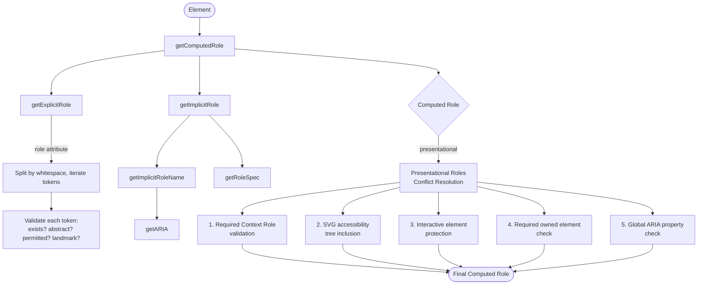

# ARIA Algorithm Functions

## Overview

The `@markuplint/ml-spec` package implements a suite of ARIA (Accessible Rich Internet Applications) algorithm functions that faithfully follow the W3C specifications. These algorithms compute ARIA roles, properties, accessible names, and accessibility tree exposure for HTML and SVG elements.

The implementation covers algorithms from the following specifications:

- **WAI-ARIA 1.1 / 1.2 / 1.3** -- Role definitions, states, and properties
- **HTML-AAM** (HTML Accessibility API Mappings) -- Implicit role mappings for HTML elements
- **SVG-AAM** (SVG Accessibility API Mappings) -- Accessibility tree inclusion rules for SVG
- **AccName 1.1** (Accessible Name and Description Computation) -- Accessible name computation
- **ARIA in HTML** -- Permitted roles and ARIA attribute constraints per element

### Design Principles

All ARIA algorithm functions share a consistent design:

- They operate on the standard DOM `Element` interface, requiring no markuplint-specific node types.
- They accept an `MLMLSpec` parameter containing the full markup language specification data.
- They accept an `ARIAVersion` parameter (`'1.1'`, `'1.2'`, or `'1.3'`) to select version-specific behavior.
- They are pure functions with no side effects (aside from internal caching in `getARIA`).

## Role Computation Pipeline

The role computation pipeline determines the final ARIA role for any element. The central function `getComputedRole()` orchestrates multiple sub-algorithms:



The pipeline follows this order of operations:

1. Attempt to resolve the **explicit role** from the `role` attribute.
2. If no valid explicit role is found, resolve the **implicit role** from HTML-AAM mappings.
3. If the resolved role is presentational (`presentation` or `none`), apply the **Presentational Roles Conflict Resolution** algorithm to determine whether the presentational role should be overridden.

## Function Reference

### 1. `getComputedRole(specs, el, version, assumeSingleNode?): ComputedRole`

**Source:** `src/algorithm/aria/get-computed-role.ts`

The core function of the ARIA algorithm suite. It computes the final ARIA role for an element by combining explicit role resolution, implicit role resolution, and the Presentational Roles Conflict Resolution algorithm.

**Parameters:**

| Parameter          | Type                         | Description                                                               |
| ------------------ | ---------------------------- | ------------------------------------------------------------------------- |
| `specs`            | `MLMLSpec`                   | The full markup language specification                                    |
| `el`               | `Element`                    | The DOM element to compute the role for                                   |
| `version`          | `ARIAVersion`                | The ARIA specification version to use                                     |
| `assumeSingleNode` | `boolean` (default: `false`) | When `true`, skips parent context validation and returns `NO_OWNER` error |

**Returns:** `ComputedRole` -- contains `el`, `role` (the resolved role spec or `null`), and optional `errorType`.

**Algorithm steps:**

1. **Explicit role resolution:** Calls `getExplicitRole()` to parse the `role` attribute.
2. **Implicit role fallback:** If no valid explicit role is found, calls `getImplicitRole()`. The `NO_EXPLICIT` error is suppressed when falling back to an implicit role.
3. **Single node short-circuit:** If `assumeSingleNode` is `true`, returns immediately with `NO_OWNER` error type, skipping all parent context checks.
4. **Presentational Roles Conflict Resolution** (applied when the resolved role is presentational):

**Conflict Resolution checks (in order):**

1. **Required context role validation** -- If the role has `requiredContextRole` entries, the function checks the parent hierarchy. If no parent element exists, returns `NO_OWNER`. If the parent hierarchy does not satisfy the context role conditions (via `matchesContextRole()`), returns `INVALID_REQUIRED_CONTEXT_ROLE`. Presentational ancestors are traversed transparently via `getNonPresentationalAncestor()`.

2. **SVG accessibility tree inclusion** -- For SVG namespace elements without a valid explicit role, the function checks whether the element has an accessible name (via `getAccname()`) or a `<title>`/`<desc>` child element. If neither exists, the SVG element is excluded from the accessibility tree (returns `role: null`). This implements the SVG-AAM rules for including normally-omitted SVG elements.

3. **Interactive element protection** -- Focusable elements cannot be presentational. The function checks `mayBeFocusable()` and ensures the element is not `disabled`, `inert`, or `hidden` (traversing ancestors for each attribute). If the element is interactive and not disabled/inert/hidden, the presentational role is overridden with the implicit role and `INTERACTIVE_ELEMENT_MUST_NOT_BE_PRESENTATIONAL` error.

4. **Required owned element check** -- If a non-presentational ancestor has `requiredOwnedElements` and the current element's implicit role matches one of those required owned elements, the presentational role is overridden. Returns `REQUIRED_OWNED_ELEMENT_MUST_NOT_BE_PRESENTATIONAL`.

5. **Global ARIA property check** -- If the element has any global ARIA properties (e.g., `aria-label`, `aria-describedby`), the presentational role is overridden with the implicit role. Returns `GLOBAL_PROP_MUST_NOT_BE_PRESENTATIONAL`.

**Example:**

```ts
import { getComputedRole } from '@markuplint/ml-spec';

const result = getComputedRole(specs, element, '1.2');
if (result.role) {
  console.log(`Role: ${result.role.name}, implicit: ${result.role.isImplicit}`);
} else {
  console.log(`No role. Error: ${result.errorType}`);
}
```

---

### 2. `getExplicitRole(specs, el, version): ComputedRole`

**Source:** `src/algorithm/aria/get-explicit-role.ts`

Resolves the ARIA role from the `role` attribute value. Implements the WAI-ARIA "Handling Author Errors" algorithm.

**Parameters:**

| Parameter | Type          | Description                                      |
| --------- | ------------- | ------------------------------------------------ |
| `specs`   | `MLMLSpec`    | The full markup language specification           |
| `el`      | `Element`     | The DOM element to resolve the explicit role for |
| `version` | `ARIAVersion` | The ARIA specification version to use            |

**Returns:** `ComputedRole` -- the first valid role found, or `null` with an error type.

**Algorithm:**

1. Reads the `role` attribute, converts to lowercase, and splits by whitespace into tokens.
2. Retrieves the list of permitted roles for the element via `getPermittedRoles()`.
3. Resolves the element's namespace via `resolveNamespace()`.
4. Iterates through each role token, performing author error checks:

| Check                                          | Error Code         | WAI-ARIA Rule                                                                                   |
| ---------------------------------------------- | ------------------ | ----------------------------------------------------------------------------------------------- |
| Role name not found in spec                    | `ROLE_NO_EXISTS`   | "If the role attribute contains no tokens matching the name of a non-abstract WAI-ARIA role..." |
| Abstract role used                             | `ABSTRACT`         | "It is considered an authoring error to use abstract roles in content."                         |
| Role not in permitted roles list               | `NO_PERMITTED`     | Per ARIA in HTML, elements have constrained permitted role lists.                               |
| Landmark role without required accessible name | `INVALID_LANDMARK` | "Certain landmark roles require names from authors." Checks `aria-label` and `aria-labelledby`. |

5. Returns the first role that passes all checks, with `isImplicit: false`.
6. If no valid role is found, returns `role: null` with the last encountered error type.

---

### 3. `getImplicitRole(specs, el, version): ComputedRole`

**Source:** `src/algorithm/aria/get-implicit-role.ts`

Determines the implicit (native) ARIA role for an element based on its tag name, namespace, and matching conditions defined in HTML-ARIA.

**Parameters:**

| Parameter | Type          | Description                                        |
| --------- | ------------- | -------------------------------------------------- |
| `specs`   | `MLMLSpec`    | The full markup language specification             |
| `el`      | `Element`     | The DOM element to determine the implicit role for |
| `version` | `ARIAVersion` | The ARIA specification version to use              |

**Returns:** `ComputedRole`

**Algorithm:**

1. Calls `getImplicitRoleName()` to obtain the role name string.
2. If the return value is `false` (no corresponding role), returns `{ el, role: null }`.
3. Resolves the element's namespace via `resolveNamespace()`.
4. Calls `getRoleSpec()` to obtain the full role specification.
5. If the role spec is not found (namespace resolution failure), returns `{ el, role: null, errorType: 'IMPLICIT_ROLE_NAMESPACE_ERROR' }`.
6. Returns `{ el, role: { ...spec, isImplicit: true } }`.

---

### 4. `getImplicitRoleName(el, version, specs): ImplicitRole`

**Source:** `src/algorithm/aria/get-implicit-role.ts`

Retrieves the implicit role name string for an element without resolving the full role specification.

**Parameters:**

| Parameter | Type          | Description                            |
| --------- | ------------- | -------------------------------------- |
| `el`      | `Element`     | The DOM element to look up             |
| `version` | `ARIAVersion` | The ARIA specification version to use  |
| `specs`   | `MLMLSpec`    | The full markup language specification |

**Returns:** `ImplicitRole` -- a role name string (e.g., `"button"`, `"textbox"`), or `false` if the element has no corresponding role.

**Implementation details:**

- Delegates to the lower-level `getImplicitRole()` function in `get-implicit-role-spec.ts`.
- Passes `el.matches.bind(el)` as the condition evaluator, enabling CSS selector-based conditional role resolution (e.g., `input[type=checkbox]` maps to `"checkbox"` role).

---

### 5. `getPermittedRoles(el, version, specs)` (DOM-level)

**Source:** `src/algorithm/aria/get-permitted-roles.ts`

A DOM-level wrapper that retrieves the list of permitted ARIA roles for an element.

**Parameters:**

| Parameter | Type          | Description                            |
| --------- | ------------- | -------------------------------------- |
| `el`      | `Element`     | The DOM element                        |
| `version` | `ARIAVersion` | The ARIA specification version         |
| `specs`   | `MLMLSpec`    | The full markup language specification |

**Returns:** `readonly { readonly name: string; readonly deprecated?: boolean }[]`

**Implementation:** Delegates to the spec-level `getPermittedRoles()` function, passing `el.matches.bind(el)` as the condition evaluator.

---

### 6. `getPermittedRoles(specs, localName, namespace, version, matches)` (Spec-level)

**Source:** `src/algorithm/aria/get-permitted-roles-spec.ts`

The spec-level implementation for computing permitted ARIA roles. Operates on tag name and namespace rather than a DOM element.

**Parameters:**

| Parameter   | Type             | Description                                |
| ----------- | ---------------- | ------------------------------------------ |
| `specs`     | `MLMLSpec`       | The full markup language specification     |
| `localName` | `string`         | The element's local tag name               |
| `namespace` | `string \| null` | The element's namespace URI                |
| `version`   | `ARIAVersion`    | The ARIA specification version             |
| `matches`   | `Matches`        | A function that tests CSS selector matches |

**Returns:** `readonly { readonly name: string; readonly deprecated?: boolean }[]`

**Algorithm:**

1. Calls `getARIA()` to get the element's ARIA spec.
2. Reads `implicitRole` and `permittedRoles` from the spec.
3. Builds the permitted role list based on the `permittedRoles` value:

| `permittedRoles` value        | Behavior                                                                                                                 |
| ----------------------------- | ------------------------------------------------------------------------------------------------------------------------ |
| `true`                        | All non-abstract roles from the ARIA spec are permitted.                                                                 |
| `PermittedARIAAAMInfo` object | If `core-aam` is `true`, adds all non-abstract roles. If `graphics-aam` is `true`, adds all non-abstract graphics roles. |
| Array of strings/objects      | The specific listed roles are permitted.                                                                                 |
| `false`                       | No roles are permitted (empty list before implicit role).                                                                |

4. Always includes the implicit role in the result. If the implicit role is `"presentation"` or `"none"`, both equivalents are included.
5. Returns the merged, deduplicated list.

---

### 7. `getRoleSpec(specs, roleName, namespace, version)`

**Source:** `src/algorithm/aria/get-role-spec.ts`

Retrieves the full ARIA role specification for a given role name, including the complete chain of super-class roles.

**Parameters:**

| Parameter   | Type           | Description                              |
| ----------- | -------------- | ---------------------------------------- |
| `specs`     | `MLMLSpec`     | The full markup language specification   |
| `roleName`  | `string`       | The ARIA role name to look up            |
| `namespace` | `NamespaceURI` | The namespace URI of the element context |
| `version`   | `ARIAVersion`  | The ARIA specification version           |

**Returns:** `(ARIARole & { superClassRoles: ARIARoleInSchema[] }) | null`

**Algorithm:**

1. Searches for the role by name in the ARIA roles list for the given version.
2. For SVG namespace (`http://www.w3.org/2000/svg`), also searches `graphicsRoles` if not found in core roles.
3. Recursively traverses super-class roles via the `generalization` property, building the complete inheritance chain.
4. Normalizes all optional fields to non-undefined defaults (e.g., `!!role.isAbstract`, `role.requiredContextRole ?? []`).
5. Returns `null` if the role name does not exist in the spec.

**Normalized fields in the return value:**

```ts
{
  name: string;
  isAbstract: boolean;          // default: false
  deprecated: boolean;          // default: false
  requiredContextRole: string[];     // default: []
  requiredOwnedElements: string[];   // default: []
  accessibleNameRequired: boolean;   // default: false
  accessibleNameFromAuthor: boolean; // default: false
  accessibleNameFromContent: boolean;// default: false
  accessibleNameProhibited: boolean; // default: false
  childrenPresentational: boolean;   // default: false
  ownedProperties: ARIARoleOwnedProperties[]; // default: []
  prohibitedProperties: string[];    // default: []
  superClassRoles: ARIARoleInSchema[];
}
```

---

### 8. `getARIA(specs, localName, namespace, version, matches)`

**Source:** `src/algorithm/aria/get-aria.ts`

Gets the version-resolved ARIA specification for an element, evaluating conditional overrides.

**Parameters:**

| Parameter   | Type             | Description                                |
| ----------- | ---------------- | ------------------------------------------ |
| `specs`     | `MLMLSpec`       | The full markup language specification     |
| `localName` | `string`         | The element's local tag name               |
| `namespace` | `string \| null` | The element's namespace URI                |
| `version`   | `ARIAVersion`    | The ARIA specification version             |
| `matches`   | `Matches`        | A function that tests CSS selector matches |

**Returns:** `Omit<ReadonlyDeep<ARIA>, ARIAVersion | 'conditions'> | null`

**Algorithm:**

1. Calls `getVersionResolvedARIA()` which:
   - Looks up the element spec by tag name and namespace.
   - Applies `resolveVersion()` to merge version-specific overrides on top of the base ARIA spec.
   - Optimizes permitted roles: if `"presentation"` is in the permitted roles array, `"none"` is added, and vice versa (per WAI-ARIA 1.2 note on the `none` role).
   - Caches results by `localName + namespace + version`.

2. Evaluates conditional overrides (the `conditions` block in the ARIA spec):
   - Iterates through condition keys (CSS selectors like `[type=checkbox]`).
   - For each matching condition, overrides `implicitRole`, `permittedRoles`, `implicitProperties`, `properties`, and `namingProhibited`.
   - Later conditions take precedence over earlier ones.

3. Returns the final resolved ARIA spec, or `null` if no spec exists for the element.

**Example:** For `<input>`, the base spec may define a generic implicit role, but the condition `[type=checkbox]` overrides it to `"checkbox"`.

---

### 9. `getComputedAriaProps(specs, el, version): Record<string, ARIAProp>`

**Source:** `src/algorithm/aria/get-computed-aria-props.ts`

Computes the resolved ARIA properties for an element based on its computed role.

**Parameters:**

| Parameter | Type          | Description                            |
| --------- | ------------- | -------------------------------------- |
| `specs`   | `MLMLSpec`    | The full markup language specification |
| `el`      | `Element`     | The DOM element                        |
| `version` | `ARIAVersion` | The ARIA specification version         |

**Returns:** `Record<string, ARIAProp>` where each `ARIAProp` contains:

```ts
{
  name: string;
  value: string | undefined;
  required: boolean;
  deprecated: boolean;
  from: 'aria-attr' | 'html-attr' | 'default';
}
```

**Resolution priority for each owned property:**

1. **Explicit `aria-*` attribute** (`from: 'aria-attr'`): If the element has the corresponding `aria-*` attribute and the value passes `isValidAriaValue()` validation.
2. **Equivalent HTML attribute** (`from: 'html-attr'`): If the first `equivalentHtmlAttrs` entry exists and the element has that HTML attribute. The value is either the HTML attribute's value or a fixed mapped value.
3. **Spec default value** (`from: 'default'`): Falls back to the property's `defaultValue` from the ARIA spec.

**Special case:** For `aria-level` on `<h1>` through `<h6>` elements, the default value is derived from the heading level number (e.g., `"2"` for `<h2>`).

**Value validation (`isValidAriaValue`):**

| Value Type                                 | Validation Rule                                      |
| ------------------------------------------ | ---------------------------------------------------- |
| `string`                                   | Always valid                                         |
| `ID reference`, `ID reference list`, `URI` | Must be non-empty                                    |
| `integer`, `number`                        | Must parse as a valid number                         |
| `token`, `token list`                      | Must match one of the enum values (case-insensitive) |
| `tristate`                                 | Must be `"true"`, `"false"`, or `"mixed"`            |
| `true/false`                               | Must be `"true"` or `"false"`                        |
| `true/false/undefined`                     | Must be `"true"`, `"false"`, or `"undefined"`        |

Returns an empty record if the element has no computed role.

---

### 10. `getAccname(el): string`

**Source:** `src/algorithm/aria/accname-computation.ts`

Computes the accessible name for an element using the WAI-ARIA Accessible Name and Description Computation algorithm.

**Parameters:**

| Parameter | Type      | Description     |
| --------- | --------- | --------------- |
| `el`      | `Element` | The DOM element |

**Returns:** `string` -- the computed accessible name, or an empty string if none is found.

**Algorithm:**

1. Delegates to `computeAccessibleName()` from the `dom-accessibility-api` library, which implements the full AccName 1.1 algorithm.
2. **Fallback for `<input>` elements:** If the computed name is empty (after trimming), returns the `placeholder` attribute value (trimmed).
3. Returns an empty string if no name is found through any method.

---

### 11. `isExposed(el, specs, version): boolean`

**Source:** `src/algorithm/aria/is-exposed.ts`

Determines whether an element is included in (exposed to) the Accessibility Tree.

**Parameters:**

| Parameter | Type          | Description                            |
| --------- | ------------- | -------------------------------------- |
| `el`      | `Element`     | The DOM element to check               |
| `specs`   | `MLMLSpec`    | The full markup language specification |
| `version` | `ARIAVersion` | The ARIA specification version         |

**Returns:** `boolean` -- `true` if the element should be exposed in the accessibility tree.

**Exclusion checks (returns `false`):**

1. **`display:none` / `visibility:hidden` / `hidden` attribute**: Traverses all ancestors. If any ancestor (including the element itself) has `display:none` or `visibility:hidden` in its `style` attribute, or has the `hidden` attribute, the element is excluded.
2. **Presentational first role**: If `presentation` or `none` is the first token in the `role` attribute, the element is excluded.
3. **`aria-hidden="true"`**: Traverses all ancestors. If any ancestor has `aria-hidden="true"`, the element is excluded. Note that `aria-hidden="true"` on a parent overrides `aria-hidden="false"` on descendants.
4. **Children of `childrenPresentational` elements**: If any ancestor has a computed role with `childrenPresentational: true`, the element is excluded.

**Element-level checks:**

5. **SVG rendering rules**: Checks against the `#SVGRenderable` content model to determine if an SVG element is rendered.
6. **HTML metadata element filtering**: Elements matching the `#metadata` content model category (e.g., `<meta>`, `<link>`, `<style>`) are excluded, as well as `<input type="hidden">`.

**Inclusion checks (returns `true`):**

7. **Explicit role or global ARIA attribute**: When the element is not `aria-hidden="true"`, having an explicit (non-implicit) role or any global ARIA attribute forces inclusion.

**Default:** Returns `true` for elements that do not match any exclusion rule.

---

### 12. `hasRequiredOwnedElement(el, specs, version): boolean` / `isRequiredOwnedElement(el, role, query, specs, version): boolean`

**Source:** `src/algorithm/aria/has-required-owned-elements.ts`

Two related functions for validating the "Required Owned Elements" constraint.

#### `hasRequiredOwnedElement`

Checks whether an element satisfies the required owned elements constraint defined by its computed role.

**Algorithm:**

1. If the element has an `aria-owns` attribute, returns `true` (partial support -- the referenced elements are not validated).
2. Computes the element's role via `getComputedRole()`.
3. If the role has no `requiredOwnedElements`, returns `true`.
4. Traverses the element's closest non-presentational descendants (children, transparently passing through presentational elements).
5. For each required owned element pattern, checks if any descendant matches via `isRequiredOwnedElement()`.

#### `isRequiredOwnedElement`

Determines whether an element matches a required owned element query.

**Parameters:**

| Parameter | Type                   | Description                                                                   |
| --------- | ---------------------- | ----------------------------------------------------------------------------- |
| `el`      | `Element`              | The DOM element to test                                                       |
| `role`    | `ComputedRole['role']` | The computed role of the element                                              |
| `query`   | `string`               | The required owned element query (e.g., `"listitem"` or `"group > listitem"`) |
| `specs`   | `MLMLSpec`             | The full markup language specification                                        |
| `version` | `ARIAVersion`          | The ARIA specification version                                                |

**Query syntax:** Supports chains with `>` notation. For example, `"group > listitem"` means the element must have role `"group"` and contain a descendant with role `"listitem"`.

**Spec issue:** The WAI-ARIA specification has not decided whether "owned" means child or descendant. This implementation interprets "owned" as **child** (not descendant), to align with HTML semantics. Presentational children are traversed transparently.

---

### 13. `matchesContextRole(conditions, ownedEl, specs, version): boolean`

**Source:** `src/algorithm/aria/matches-context-role.ts`

Validates whether an element's parent hierarchy satisfies at least one of the required context role conditions.

**Parameters:**

| Parameter    | Type                | Description                                               |
| ------------ | ------------------- | --------------------------------------------------------- |
| `conditions` | `readonly string[]` | The required context role condition strings               |
| `ownedEl`    | `Element`           | The owned element whose parent context is being validated |
| `specs`      | `MLMLSpec`          | The full markup language specification                    |
| `version`    | `ARIAVersion`       | The ARIA specification version                            |

**Returns:** `boolean` -- `true` if any condition is satisfied.

**Algorithm:**

1. Iterates through each condition string.
2. Each condition may describe a chain of ancestor roles separated by `>` (e.g., `"list > group"`).
3. The condition string is split and reversed, then matched against the parent hierarchy from the immediate parent upward.
4. For each level, calls `getComputedRole()` with `assumeSingleNode = true` to get the parent's role independently.
5. Returns `true` if any condition string fully matches the ancestor chain.

**Example:** For a `listitem` role with `requiredContextRole: ["list", "list > group"]`:

- `"list"` matches if the parent has the `list` role.
- `"list > group"` matches if the parent has the `group` role AND the grandparent has the `list` role.

---

### 14. `isPresentational(roleName?): boolean`

**Source:** `src/algorithm/aria/is-presentational.ts`

A simple predicate that checks whether a role name corresponds to a presentational role.

**Parameters:**

| Parameter  | Type                  | Description                 |
| ---------- | --------------------- | --------------------------- |
| `roleName` | `string \| undefined` | The ARIA role name to check |

**Returns:** `true` if the role name is `"presentation"` or `"none"`, `false` otherwise (including when `roleName` is `undefined` or empty).

---

### 15. `getNonPresentationalAncestor(el, specs, version)`

**Source:** `src/algorithm/aria/get-non-presentational-ancestor.ts`

Traverses the parent element chain to find the nearest ancestor with a non-presentational role.

**Parameters:**

| Parameter | Type          | Description                                 |
| --------- | ------------- | ------------------------------------------- |
| `el`      | `Element`     | The DOM element whose ancestors to traverse |
| `specs`   | `MLMLSpec`    | The full markup language specification      |
| `version` | `ARIAVersion` | The ARIA specification version              |

**Returns:** `ComputedRole` -- the nearest non-presentational ancestor's computed role, or `{ el: null, role: null }` if no such ancestor exists.

**Version-dependent behavior:**

| ARIA Version      | `assumeSingleNode` | Behavior                                                                                                          |
| ----------------- | ------------------ | ----------------------------------------------------------------------------------------------------------------- |
| `'1.1'`, `'1.2'`  | `false`            | Ancestor roles may affect the current element's role computation (ancestor roles are computed with full context). |
| `'1.3'` and later | `true`             | Each ancestor's role is computed independently without its own parent context, preventing infinite recursion.     |

**Algorithm:**

1. Starts from `el.parentElement`.
2. For each ancestor, computes the role via `getComputedRole()`.
3. If the ancestor's role is not presentational, returns that ancestor's computed role.
4. Otherwise, continues to the next parent.
5. If no non-presentational ancestor is found, returns `{ el: null, role: null }`.

---

### 16. `ariaSpecs(specs, version)`

**Source:** `src/algorithm/aria/aria-specs.ts`

A simple accessor function that retrieves the ARIA specification data for a specific version.

**Parameters:**

| Parameter | Type          | Description                            |
| --------- | ------------- | -------------------------------------- |
| `specs`   | `MLMLSpec`    | The full markup language specification |
| `version` | `ARIAVersion` | The ARIA specification version         |

**Returns:** `{ roles: ARIARoleInSchema[], graphicsRoles: ARIARoleInSchema[], props: ARIAProperty[] }`

**Implementation:** Returns `specs.def['#aria'][version]`, providing direct access to the roles, graphics roles, and properties defined for the requested ARIA version.

## RoleComputationError Reference

When role computation encounters an issue, it returns an error code in the `errorType` field of `ComputedRole`. These errors indicate specific issues per the WAI-ARIA specification:

| Error Code                                          | Meaning                                                                                                                                                            | Produced By       |
| --------------------------------------------------- | ------------------------------------------------------------------------------------------------------------------------------------------------------------------ | ----------------- |
| `ABSTRACT`                                          | An abstract role (e.g., `widget`, `landmark`) was used in content. Abstract roles serve as base classes and must not be applied to elements.                       | `getExplicitRole` |
| `GLOBAL_PROP_MUST_NOT_BE_PRESENTATIONAL`            | The element has a global ARIA property (e.g., `aria-label`), which prevents the presentational role from being applied. The implicit role is used instead.         | `getComputedRole` |
| `IMPLICIT_ROLE_NAMESPACE_ERROR`                     | The implicit role name was resolved but the full role specification could not be found, typically due to a namespace mismatch.                                     | `getImplicitRole` |
| `INTERACTIVE_ELEMENT_MUST_NOT_BE_PRESENTATIONAL`    | A focusable (interactive) element cannot have a presentational role. The implicit role is used instead. Checks that the element is not disabled, inert, or hidden. | `getComputedRole` |
| `INVALID_LANDMARK`                                  | A landmark role (e.g., `region`) was assigned without a required accessible name. Landmark roles that require names must have `aria-label` or `aria-labelledby`.   | `getExplicitRole` |
| `INVALID_REQUIRED_CONTEXT_ROLE`                     | The element's required context role was not found in the parent hierarchy. For example, a `listitem` must be owned by a `list`.                                    | `getComputedRole` |
| `NO_EXPLICIT`                                       | No explicit `role` attribute is present on the element. This is informational and is suppressed when falling back to an implicit role.                             | `getExplicitRole` |
| `NO_OWNER`                                          | The element has no parent element (it is a fragment root), so parent context validation cannot be performed.                                                       | `getComputedRole` |
| `NO_PERMITTED`                                      | The role specified in the `role` attribute is not in the element's permitted roles list (as defined by ARIA in HTML).                                              | `getExplicitRole` |
| `REQUIRED_OWNED_ELEMENT_MUST_NOT_BE_PRESENTATIONAL` | The element's non-presentational ancestor requires specific owned elements, and this element matches that requirement. The presentational role is overridden.      | `getComputedRole` |
| `ROLE_NO_EXISTS`                                    | The role name specified in the `role` attribute does not exist in the ARIA specification for the given version.                                                    | `getExplicitRole` |

## ARIA Version Handling

The ARIA algorithm functions support three specification versions:

```ts
type ARIAVersion = '1.1' | '1.2' | '1.3';

const ARIA_RECOMMENDED_VERSION = '1.2';
```

### Version Resolution (`resolveVersion`)

**Source:** `src/utils/resolve-version.ts`

Each element's ARIA spec in the schema can have base properties and version-specific override blocks (`'1.1'`, `'1.2'`, `'1.3'`). The `resolveVersion()` function merges these:

```ts
function resolveVersion(aria: ARIA, version: ARIAVersion): ResolvedARIA {
  // For each property, the version-specific value takes precedence:
  implicitRole: aria[version]?.implicitRole ?? aria.implicitRole;
  permittedRoles: aria[version]?.permittedRoles ?? aria.permittedRoles;
  implicitProperties: aria[version]?.implicitProperties ?? aria.implicitProperties;
  properties: aria[version]?.properties ?? aria.properties;
  conditions: aria[version]?.conditions ?? aria.conditions;

  // Special case for namingProhibited:
  // ARIA 1.1 always uses the base value (namingProhibited was introduced in 1.2)
  namingProhibited: version === '1.1'
    ? aria.namingProhibited
    : (aria[version]?.namingProhibited ?? aria.namingProhibited);
}
```

This design allows the schema to define a base ARIA spec that works across versions, with targeted overrides for version-specific differences.

### Version Impact on Behavior

- **`getNonPresentationalAncestor`**: In ARIA 1.1/1.2, ancestor role computation uses full context (`assumeSingleNode = false`). In ARIA 1.3+, each ancestor is computed independently (`assumeSingleNode = true`).
- **`namingProhibited`**: Only applicable in ARIA 1.2 and later. Version 1.1 always uses the base value.
- **Role and property definitions**: The available roles and their properties may differ across versions (e.g., new roles added in 1.2 or 1.3).

## W3C Specification References

The ARIA algorithms implement behavior defined in the following W3C specifications:

- [WAI-ARIA 1.2](https://www.w3.org/TR/wai-aria-1.2/) -- Accessible Rich Internet Applications, primary reference
- [WAI-ARIA 1.1](https://www.w3.org/TR/wai-aria-1.1/) -- Previous version, still supported
- [HTML-AAM 1.0](https://www.w3.org/TR/html-aam-1.0/) -- HTML Accessibility API Mappings (implicit role mappings)
- [AccName 1.1](https://www.w3.org/TR/accname-1.1/) -- Accessible Name and Description Computation
- [SVG-AAM 1.0](https://www.w3.org/TR/svg-aam-1.0/) -- SVG Accessibility API Mappings
- [ARIA in HTML](https://www.w3.org/TR/html-aria/) -- Permitted roles and ARIA attribute constraints per HTML element
