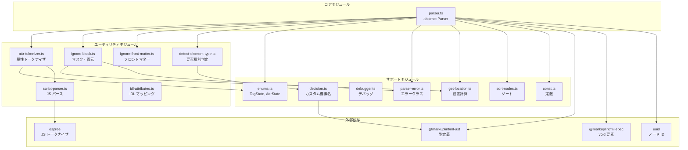
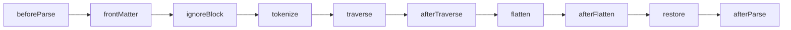
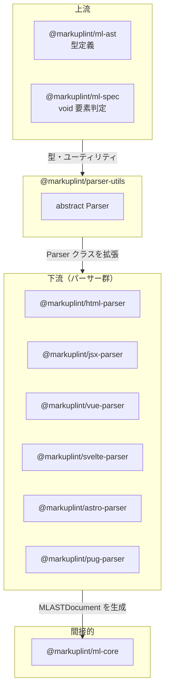

# @markuplint/parser-utils

## 概要

`@markuplint/parser-utils` は全 markuplint パーサーの共通基盤パッケージです。完全なパースパイプラインを実装する抽象 `Parser` クラスと、トークン化、エラー処理、デバッグ、AST 操作のためのユーティリティモジュール群を提供します。すべてのマークアップ言語パーサー（HTML、JSX、Vue、Svelte、Astro、Pug）はこのパッケージの `Parser` クラスを拡張し、言語固有の AST ノードを `@markuplint/ml-ast` で定義された統一 markuplint AST 形式に変換します。

## ディレクトリ構成

```
src/
├── index.ts               — 全パブリック API の再エクスポート
├── parser.ts              — abstract class Parser<Node, State>（約1825行、コア）
├── types.ts               — ParserOptions, ParseOptions, Token, ChildToken, IgnoreTag 等
├── enums.ts               — TagState, AttrState ステートマシン
├── attr-tokenizer.ts      — 属性トークナイザ（AttrState 使用）
├── script-parser.ts       — espree による JavaScript パース
├── ignore-block.ts        — テンプレート式のマスキングと復元
├── ignore-front-matter.ts — YAML フロントマター検出・マスキング
├── detect-element-type.ts — 要素種別判定（html/web-component/authored）
├── idl-attributes.ts      — IDL ↔ コンテンツ属性名マッピング（React 互換）
├── debugger.ts            — デバッグ・テスト用ユーティリティ
├── parser-error.ts        — ParserError, TargetParserError, ConfigParserError
├── sort-nodes.ts          — ノード位置ソート
├── const.ts               — MASK_CHAR, SVG 要素リスト, defaultSpaces
├── get-location.ts        — 行/列/オフセット計算ユーティリティ
└── decision.ts            — カスタム要素名判定
```

## アーキテクチャ図



## モジュール責務

| モジュール               | 責務                                       | 主要エクスポート                                                                                                                          |
| ------------------------ | ------------------------------------------ | ----------------------------------------------------------------------------------------------------------------------------------------- |
| `parser.ts`              | コアパースパイプライン、抽象 Parser クラス | `Parser`                                                                                                                                  |
| `types.ts`               | 型定義                                     | `ParserOptions`, `ParseOptions`, `Token`, `ChildToken`, `IgnoreTag`, `IgnoreBlock`, `QuoteSet`, `ValueType`, `SelfCloseType`, `Tokenized` |
| `enums.ts`               | ステートマシン列挙型                       | `TagState`, `AttrState`                                                                                                                   |
| `attr-tokenizer.ts`      | 属性文字列のトークン化                     | `attrTokenizer`                                                                                                                           |
| `script-parser.ts`       | 組み込みスクリプトの JavaScript パース     | `scriptParser`, `safeScriptParser`                                                                                                        |
| `ignore-block.ts`        | テンプレート式のマスキングと復元           | `ignoreBlock`, `restoreNode`                                                                                                              |
| `ignore-front-matter.ts` | YAML フロントマター処理                    | `ignoreFrontMatter`                                                                                                                       |
| `detect-element-type.ts` | 要素の分類                                 | `detectElementType`                                                                                                                       |
| `idl-attributes.ts`      | IDL ↔ コンテンツ属性名マッピング          | `searchIDLAttribute`                                                                                                                      |
| `debugger.ts`            | テスト・デバッグユーティリティ             | `nodeListToDebugMaps`, `attributesToDebugMaps`, `nodeTreeDebugView`                                                                       |
| `parser-error.ts`        | エラークラス                               | `ParserError`, `TargetParserError`, `ConfigParserError`                                                                                   |
| `sort-nodes.ts`          | ノードの位置ソート                         | `sortNodes`                                                                                                                               |
| `const.ts`               | 定数                                       | `MASK_CHAR`, `svgElementList`, `defaultSpaces`                                                                                            |
| `get-location.ts`        | 位置計算                                   | `getPosition`, `getEndLine`, `getEndCol`, `getOffsetsFromCode`                                                                            |
| `decision.ts`            | カスタム要素名判定                         | `isPotentialCustomElementName`, `isSVGElement`                                                                                            |

## パースパイプライン概要

Parser クラスの `parse()` メソッドは11ステップのパイプラインを実行します:



詳細は [Parser クラスリファレンス](docs/parser-class.ja.md) を参照してください。

## ステートマシン概要

パッケージには2つのステートマシンがあります:

- **TagState** -- タグレベルのパースで使用（`<` 検出 → タグ名 → 属性 → `>` 検出）
- **AttrState** -- 属性レベルのパースで使用（名前 → `=` → 値）

詳細な状態遷移図は [Parser クラスリファレンス](docs/parser-class.ja.md#ステートマシン) を参照してください。

## エラー処理

```
ParserError (基底クラス)
├── line, col, raw — ソース位置情報
├── TargetParserError — 特定要素に関するエラー（nodeName を含む）
└── ConfigParserError — 設定ファイルのエラー（filePath を含む）
```

## デバッグユーティリティ

- **`nodeListToDebugMaps`** -- AST ノードリストを人間が読めるデバッグ文字列に変換。スナップショットテストに使用
- **`attributesToDebugMaps`** -- 属性を名前、等号、値、引用符の各部品に分解して表示
- **`nodeTreeDebugView`** -- ツリー構造の可視化。深さ、親子関係、ペアノードを表示

## IDL 属性マッピング

`searchIDLAttribute` は React スタイルの IDL 属性名と HTML コンテンツ属性名の双方向マッピングを提供します（例: `className` → `class`、`htmlFor` → `for`）。JSX パーサーが属性の `potentialName` を解決する際に使用されます。

## 外部依存

| 依存パッケージ        | 用途                               |
| --------------------- | ---------------------------------- |
| `@markuplint/ml-ast`  | AST 型定義                         |
| `@markuplint/ml-spec` | void 要素判定                      |
| `@markuplint/types`   | カスタム要素名検証                 |
| `uuid`                | AST ノード UUID 生成               |
| `debug`               | パフォーマンスタイミング・ロギング |
| `espree`              | JavaScript トークン化・パース      |
| `type-fest`           | TypeScript ユーティリティ型        |

## 統合ポイント



### 上流

- **`@markuplint/ml-ast`** -- 全 AST 型定義（`MLASTElement`, `MLASTText` 等）
- **`@markuplint/ml-spec`** -- `isVoidElement` による自己閉じタグ判定

### 下流

6つのパーサーパッケージが Parser クラスを拡張: html-parser, jsx-parser, vue-parser, svelte-parser, astro-parser, pug-parser

## ドキュメントマップ

- [Parser クラスリファレンス](docs/parser-class.ja.md) -- Parser クラスの完全リファレンス
- [メンテナンスガイド](docs/maintenance.ja.md) -- コマンド、レシピ、トラブルシューティング
