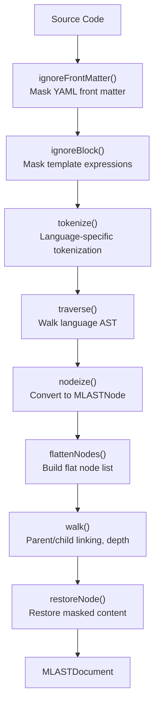
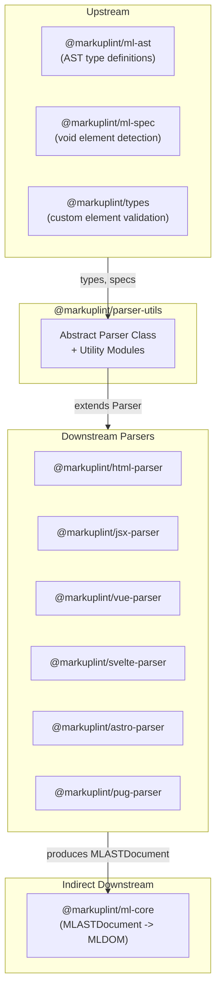

# @markuplint/parser-utils

## Overview

`@markuplint/parser-utils` is the shared foundation for all markuplint parsers. It provides the abstract `Parser` class that implements the full parsing pipeline and a set of utility modules for tokenization, error handling, debugging, and AST manipulation. Every markup language parser (HTML, JSX, Vue, Svelte, Astro, Pug) extends this package's `Parser` class to convert language-specific AST nodes into the unified markuplint AST format defined by `@markuplint/ml-ast`.

## Directory Structure

```
src/
├── index.ts               — Re-exports all public API
├── parser.ts              — Abstract class Parser<Node, State> (~1825 lines, core)
├── types.ts               — ParserOptions, ParseOptions, Token, ChildToken, IgnoreTag, etc.
├── enums.ts               — TagState, AttrState state machines
├── attr-tokenizer.ts      — Attribute tokenizer (uses AttrState)
├── script-parser.ts       — JavaScript parsing via espree
├── ignore-block.ts        — Template expression masking and restoration
├── ignore-front-matter.ts — YAML front matter detection and masking
├── detect-element-type.ts — Element type classification (html/web-component/authored)
├── idl-attributes.ts      — IDL <-> content attribute name mapping (React-compatible)
├── debugger.ts            — Debug and test utilities (nodeListToDebugMaps, etc.)
├── debug.ts               — Performance timer and debug logging via `debug` package
├── parser-error.ts        — ParserError, TargetParserError, ConfigParserError
├── sort-nodes.ts          — Node position sorting
├── const.ts               — MASK_CHAR, SVG element list, defaultSpaces
├── get-location.ts        — Line/column/offset calculation utilities
└── decision.ts            — Custom element name detection
```

## Architecture Diagram

```mermaid
flowchart TD
    subgraph core ["Core"]
        parser["parser.ts\nAbstract Parser Class"]
        types["types.ts\nParserOptions, Token, etc."]
        enums["enums.ts\nTagState, AttrState"]
    end

    subgraph tokenizer ["Tokenizer Utilities"]
        attrTok["attr-tokenizer.ts\nattrTokenizer()"]
        scriptParser["script-parser.ts\nscriptParser(), safeScriptParser()"]
    end

    subgraph masking ["Masking & Preprocessing"]
        ignoreBlock["ignore-block.ts\nignoreBlock(), restoreNode()"]
        ignoreFM["ignore-front-matter.ts\nignoreFrontMatter()"]
    end

    subgraph classification ["Classification"]
        detectType["detect-element-type.ts\ndetectElementType()"]
        decision["decision.ts\nisPotentialCustomElementName()"]
        idlAttrs["idl-attributes.ts\nsearchIDLAttribute()"]
    end

    subgraph utilities ["Utilities"]
        debugger["debugger.ts\nnodeListToDebugMaps()"]
        debugMod["debug.ts\nPerformanceTimer, domLog()"]
        parserError["parser-error.ts\nParserError hierarchy"]
        sortNodes["sort-nodes.ts\nsortNodes()"]
        getLoc["get-location.ts\ngetPosition(), getEndLine()"]
        constMod["const.ts\nMASK_CHAR, svgElementList"]
    end

    subgraph external ["External Dependencies"]
        mlAst["@markuplint/ml-ast\n(AST types)"]
        mlSpec["@markuplint/ml-spec\n(void element detection)"]
        mlTypes["@markuplint/types\n(custom element validation)"]
        espree["espree\n(JS tokenization)"]
        uuidLib["uuid\n(node ID generation)"]
        debugLib["debug\n(logging)"]
    end

    parser --> types
    parser --> enums
    parser --> attrTok
    parser --> ignoreBlock
    parser --> ignoreFM
    parser --> detectType
    parser --> sortNodes
    parser --> getLoc
    parser --> constMod
    parser --> parserError
    parser --> debugMod
    attrTok --> enums
    attrTok --> scriptParser
    detectType --> decision
    ignoreBlock --> constMod
    ignoreBlock --> getLoc
    decision --> mlTypes
    parser --> mlAst
    parser --> mlSpec
    parser --> uuidLib
    scriptParser --> espree
    debugMod --> debugLib
```



## Module Responsibilities

| Module                   | Responsibility                                                                  | Key Exports                                                                                                                               |
| ------------------------ | ------------------------------------------------------------------------------- | ----------------------------------------------------------------------------------------------------------------------------------------- |
| `parser.ts`              | Core parsing pipeline; abstract `Parser` class that all language parsers extend | `Parser`                                                                                                                                  |
| `types.ts`               | Type definitions for parser configuration and tokenization                      | `ParserOptions`, `ParseOptions`, `Token`, `ChildToken`, `IgnoreTag`, `IgnoreBlock`, `QuoteSet`, `ValueType`, `SelfCloseType`, `Tokenized` |
| `enums.ts`               | State machine enumerations for tag and attribute parsing                        | `TagState`, `AttrState`                                                                                                                   |
| `attr-tokenizer.ts`      | Attribute string tokenization using `AttrState` state machine                   | `attrTokenizer`                                                                                                                           |
| `script-parser.ts`       | JavaScript parsing for embedded scripts using espree                            | `scriptParser`, `safeScriptParser`                                                                                                        |
| `ignore-block.ts`        | Template expression masking before parsing and restoration after                | `ignoreBlock`, `restoreNode`                                                                                                              |
| `ignore-front-matter.ts` | YAML front matter detection and masking                                         | `ignoreFrontMatter`                                                                                                                       |
| `detect-element-type.ts` | Element classification into `html`, `web-component`, or `authored`              | `detectElementType`                                                                                                                       |
| `idl-attributes.ts`      | IDL-to-content attribute name mapping (React-compatible)                        | `searchIDLAttribute`                                                                                                                      |
| `debugger.ts`            | Test and debug snapshot utilities                                               | `nodeListToDebugMaps`, `attributesToDebugMaps`, `nodeTreeDebugView`                                                                       |
| `debug.ts`               | Performance timing and debug logging                                            | `PerformanceTimer`, `domLog`, `log`                                                                                                       |
| `parser-error.ts`        | Error classes with positional information                                       | `ParserError`, `TargetParserError`, `ConfigParserError`                                                                                   |
| `sort-nodes.ts`          | Node position sorting by offset                                                 | `sortNodes`                                                                                                                               |
| `const.ts`               | Constants used across the package                                               | `MASK_CHAR`, `svgElementList`, `defaultSpaces`                                                                                            |
| `get-location.ts`        | Line/column/offset position calculations                                        | `getPosition`, `getEndLine`, `getEndCol`, `getOffsetsFromCode`                                                                            |
| `decision.ts`            | Custom element name detection and SVG element lookup                            | `isPotentialCustomElementName`, `isSVGElement`                                                                                            |

## Parse Pipeline Overview

The `Parser` class implements the complete parse pipeline. Each language-specific parser extends `Parser` and provides a `tokenize()` method that produces language-specific AST nodes, plus a `nodeize()` method that converts those nodes into markuplint AST nodes. See [Parser Class Reference](docs/parser-class.md) for the full pipeline documentation.



## State Machines Overview

The parser uses two state machine enumerations to drive character-by-character tokenization:

**TagState** controls the tag-level parse loop:

`BeforeOpenTag` -> `FirstCharOfTagName` -> `TagName` -> `Attrs` -> `AfterAttrs` -> `AfterOpenTag`

**AttrState** controls the attribute-level parse loop:

`BeforeName` -> `Name` -> `Equal` -> `BeforeValue` -> `Value` -> `AfterValue`

See [Parser Class Reference](docs/parser-class.md) for detailed state transition diagrams.

## Error Handling

The package provides a three-level error class hierarchy for parser errors:

| Class               | Extends       | Additional Fields    | Purpose                                                                      |
| ------------------- | ------------- | -------------------- | ---------------------------------------------------------------------------- |
| `ParserError`       | `Error`       | `line`, `col`, `raw` | Base parser error with source position                                       |
| `TargetParserError` | `ParserError` | `nodeName`           | Error tied to a specific element, includes the element name in the message   |
| `ConfigParserError` | `ParserError` | `filePath`           | Error from configuration file parsing, includes the file path in the message |

All error classes automatically format their messages with positional information (e.g., `(line:col)`).

## Debug Utilities

The package provides three debug functions for testing and visualization:

- **`nodeListToDebugMaps`** -- Converts a flat AST node list into human-readable debug strings showing each node's position, type, and raw content. The primary tool for snapshot testing in parser tests.
- **`attributesToDebugMaps`** -- Converts attributes into detailed debug strings showing all attribute components (name, equal sign, value, quotes) with positional information and metadata flags (`isDirective`, `isDynamicValue`).
- **`nodeTreeDebugView`** -- Produces an indented tree view of the AST showing depth, parent-child relationships, pair node links, and ghost/bogus markers. Useful for visual inspection of parse results.

Additionally, `debug.ts` provides `PerformanceTimer` for measuring parse phase durations and `domLog` for structured logging via the `debug` package (enabled with `DEBUG=ml-parser`).

## IDL Attribute Mapping

`searchIDLAttribute` maps between React-style IDL attribute names and HTML content attribute names. It maintains a comprehensive mapping table derived from React's `possibleStandardNames.js`, covering:

- HTML attributes (e.g., `className` -> `class`, `htmlFor` -> `for`, `tabIndex` -> `tabindex`)
- SVG attributes (e.g., `strokeWidth` -> `stroke-width`, `clipPath` -> `clip-path`)
- Event handler attributes (e.g., `onClick` -> `onclick`)

The lookup handles camelCase IDL names, lowercase content attribute names, and hyphenated variants.

## External Dependencies

| Dependency            | Purpose                                                                    |
| --------------------- | -------------------------------------------------------------------------- |
| `@markuplint/ml-ast`  | AST type definitions (`MLASTDocument`, `MLASTElement`, `MLASTToken`, etc.) |
| `@markuplint/ml-spec` | Void element detection (`isVoidElement`) for self-closing tag handling     |
| `@markuplint/types`   | Custom element name validation (`isCustomElementName`)                     |
| `uuid`                | AST node UUID generation for unique node identification                    |
| `debug`               | Performance timing and structured logging                                  |
| `espree`              | JavaScript tokenization and parsing for embedded script content            |
| `type-fest`           | TypeScript utility types                                                   |

## Integration Points



### Upstream

- **`@markuplint/ml-ast`** -- All AST type definitions (`MLASTDocument`, `MLASTElement`, `MLASTAttr`, `MLASTToken`, etc.) that the Parser class produces.
- **`@markuplint/ml-spec`** -- `isVoidElement` function used to determine self-closing behavior for HTML void elements.
- **`@markuplint/types`** -- `isCustomElementName` function used by `decision.ts` to validate custom element names per the HTML spec.

### Downstream

Six parser packages extend the abstract `Parser` class:

- **`@markuplint/html-parser`** -- Standard HTML parsing
- **`@markuplint/jsx-parser`** -- JSX/TSX parsing (extends html-parser)
- **`@markuplint/vue-parser`** -- Vue Single File Component parsing
- **`@markuplint/svelte-parser`** -- Svelte component parsing
- **`@markuplint/astro-parser`** -- Astro component parsing
- **`@markuplint/pug-parser`** -- Pug template parsing

Each downstream parser implements the `tokenize()` and `nodeize()` abstract methods to convert their language-specific AST into the unified markuplint AST format.

## Documentation Map

- [Parser Class Reference](docs/parser-class.md) -- Detailed documentation of the Parser class, its methods, and parse pipeline
- [Maintenance Guide](docs/maintenance.md) -- Commands, recipes, and troubleshooting
