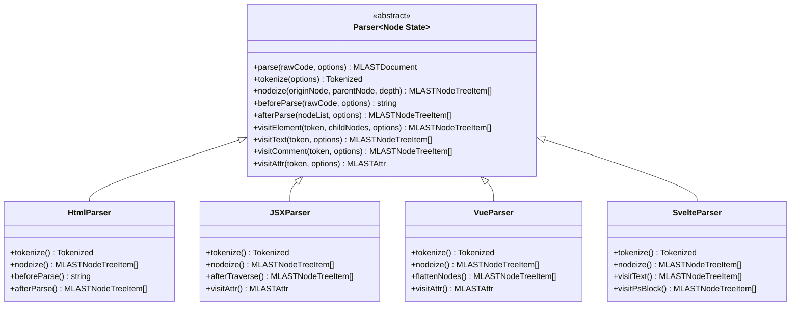
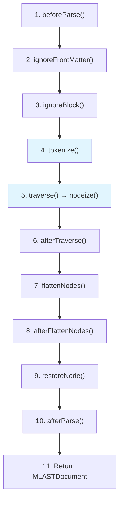
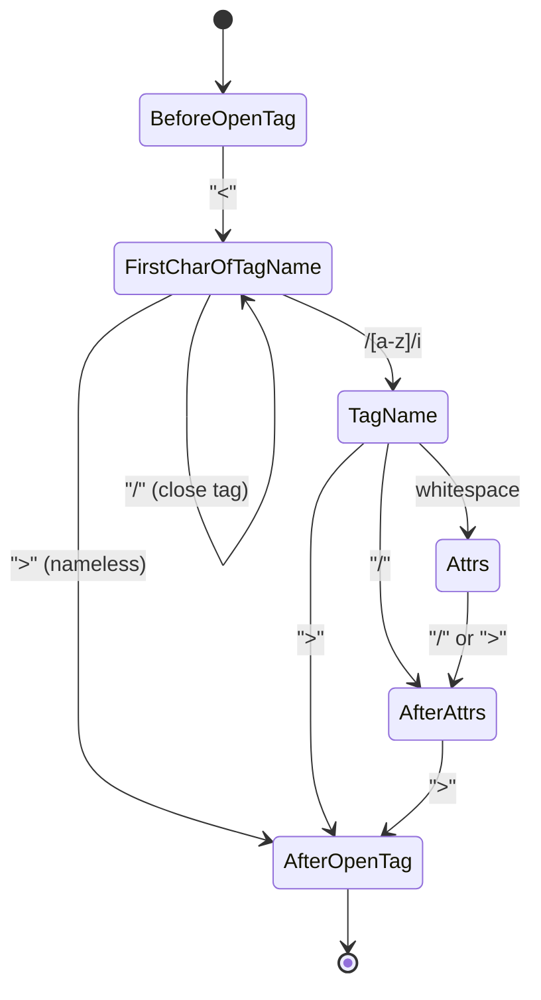
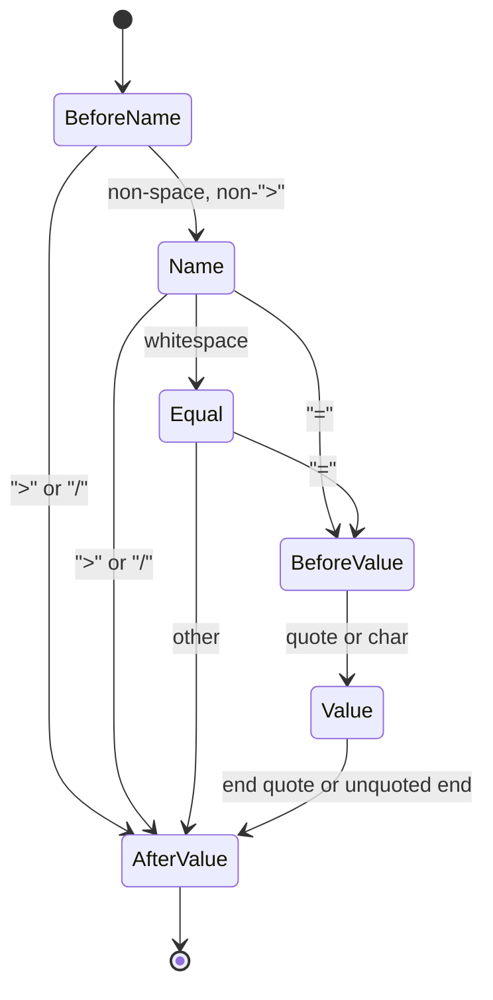

# Parser クラスリファレンス

`Parser<Node, State>` 抽象クラスは、すべての markuplint パーサーの基盤です。生のソースコードからフラットな `MLASTNodeTreeItem[]` に至るまでの完全なパースパイプラインを定義し、特定のマークアップ言語をサポートするためにサブクラスがオーバーライドする豊富なビジターメソッドとユーティリティメソッドを提供します。

## デザインパターン

Parser は **Template Method** パターンを使用しています。`parse()` メソッドは 11 ステップのパイプラインを統制し、各段階で protected なフックメソッドを呼び出します。サブクラスは特定のフック（主に `tokenize` と `nodeize`）をオーバーライドすることで、共通のパイプラインロジックを継承しながら言語固有の振る舞いを注入します。



## 型パラメータ

| パラメータ | 制約              | デフォルト | 説明                                                                                                                                      |
| ---------- | ----------------- | ---------- | ----------------------------------------------------------------------------------------------------------------------------------------- |
| `Node`     | `extends {}`      | `{}`       | トークナイザーが生成する言語固有の AST ノード型（例: parse5 の `Node`、Svelte の `SvelteNode`）                                           |
| `State`    | `extends unknown` | `null`     | 単一の `parse()` 呼び出しにわたって保持されるオプションのパーサー状態型。開始時に `defaultState` からクローンされ、終了時にリセットされる |

## コンストラクタ / ParserOptions

```ts
constructor(options?: ParserOptions, defaultState?: State)
```

コンストラクタは `ParserOptions` オブジェクトとオプションのデフォルト状態値を受け取ります。

| オプション             | 型                     | デフォルト                      | 説明                                                                                     |
| ---------------------- | ---------------------- | ------------------------------- | ---------------------------------------------------------------------------------------- |
| `booleanish`           | `boolean`              | `false`                         | 省略された属性値を `true` として扱う（例: JSX `<Component aria-hidden />`）              |
| `endTagType`           | `EndTagType`           | `'omittable'`                   | `'xml'`: 終了タグ必須またはセルフクローズ; `'omittable'`: 省略可; `'never'`: 不要        |
| `ignoreTags`           | `readonly IgnoreTag[]` | `[]`                            | パース前にマスクするコードブロックのパターン（例: テンプレート式）                       |
| `maskChar`             | `string`               | `'\uE000'` (MASK_CHAR)          | マスクされたコードブロックを置換するために使用する文字                                   |
| `tagNameCaseSensitive` | `boolean`              | `false`                         | タグ名の比較で大文字小文字を区別するか（例: JSX、Svelte）                                |
| `selfCloseType`        | `SelfCloseType`        | `'html'`                        | `'html'`: void 要素のみセルフクローズ; `'xml'`: スラッシュで判定; `'html+xml'`: いずれか |
| `spaceChars`           | `readonly string[]`    | `['\t', '\n', '\f', '\r', ' ']` | タグのパース時に空白として扱う文字                                                       |
| `rawTextElements`      | `readonly string[]`    | `['style', 'script']`           | 子要素をトラバースしない要素（生テキストコンテンツ）                                     |

## パースパイプライン

`parse()` メソッドがパイプライン全体を駆動します。



青色でハイライトされたステップが主要なオーバーライドポイントです。

### ステップ 1: beforeParse()

```ts
beforeParse(rawCode: string, options?: ParseOptions): string
```

`ParseOptions`（`offsetOffset`、`offsetLine`、`offsetColumn`）に基づいてオフセットスペースを先頭に追加します。これは埋め込みコードフラグメント（例: `.vue` ファイル内の `<template>` ブロック）の座標系を調整します。

### ステップ 2: フロントマターの除去

`options.ignoreFrontMatter` が true の場合、`ignoreFrontMatter()` は YAML フロントマター（`---\n...\n---\n`）を検出し、改行を保持しながらスペースに置換します。フロントマターはパイプラインの最後に `#ps:front-matter` psblock ノードとして復元されます。

### ステップ 3: 無視ブロックのマスキング

`ignoreBlock()` はソースを走査して `ignoreTags` で定義されたパターンを探し、一致するブロックを `<!...>` ボーガスコメント構文で囲まれたマスク文字に置換します。これにより、テンプレート式（例: `{{ expr }}`、`{#if}`）が HTML パースに干渉することを防ぎます。

### ステップ 4: tokenize()

```ts
tokenize(options?: ParseOptions): Tokenized<Node, State>
```

**主要なオーバーライドポイント。** デフォルト実装は空の配列を返します。各パーサーはこれをオーバーライドして、言語固有のトークナイザー（parse5、vue-eslint-parser、svelte/compiler など）を呼び出し、結果の AST を返します。

### ステップ 5: traverse() → nodeize()

```ts
traverse(originNodes: readonly Node[], parentNode: MLASTParentNode | null, depth: number)
nodeize(originNode: Node, parentNode: MLASTParentNode | null, depth: number): readonly MLASTNodeTreeItem[]
```

`traverse()` はトークン化されたノードを反復処理し、各ノードに対して `nodeize()` を呼び出します。**`nodeize()` は 2 番目の主要なオーバーライドポイント**です。サブクラスはビジターメソッドを使用して、言語固有の AST ノードを markuplint AST ノードに変換します。

`nodeize()` の後、`afterNodeize()` は結果のノードを現在の深さの兄弟ノードとより浅い深さの祖先ノードに分離します。

### ステップ 6: afterTraverse()

```ts
afterTraverse(nodeTree: readonly MLASTNodeTreeItem[]): readonly MLASTNodeTreeItem[]
```

ノードツリーをソース位置でソートします。サブクラスはトラバース後の再構築のためにオーバーライドできます（例: JSX は式コンテナの parentId 参照を再マッピングします）。

### ステップ 7: flattenNodes()

```ts
flattenNodes(nodeTree: readonly MLASTNodeTreeItem[]): readonly MLASTNodeTreeItem[]
```

階層的なノードツリーを深さ優先で走査し、フラットでソートされたリストを生成します。重複ノードを除去します。

### ステップ 8: afterFlattenNodes()

```ts
afterFlattenNodes(
  nodeList: readonly MLASTNodeTreeItem[],
  options?: {
    readonly exposeInvalidNode?: boolean;   // default: true
    readonly exposeWhiteSpace?: boolean;    // default: true
    readonly concatText?: boolean;          // default: true
  }
): readonly MLASTNodeTreeItem[]
```

4 つのクリーンアップパスを実行します。

1. **残留ノードの露出** — 既知のノード間の空白と無効なマークアップを発見する
2. **孤立終了タグ → ボーガス** — 対応する開始タグがない終了タグを `invalid` ノードに変換する
3. **テキストの結合** — 同じオフセットにある隣接する `#text` ノードをマージする
4. **テキストのトリム** — 重複するテキストノードの境界をトリムする

### ステップ 9: restoreNode()

`restoreNode()` はフラットなノードリストを走査し、マスク文字を元のコードに置換します。復元された各ブロックは `#ps:<type>` psblock ノードになります。属性値内のマスクされたコンテンツも復元され、`isDynamicValue` としてマークされます。

### ステップ 10: afterParse()

```ts
afterParse(nodeList: readonly MLASTNodeTreeItem[], options?: ParseOptions): readonly MLASTNodeTreeItem[]
```

ステップ 1 で先頭に追加されたオフセットスペースを除去します。サブクラスはさらなる後処理を追加できます。

### ステップ 11: 戻り値

`{ raw, nodeList, isFragment }` を含む `MLASTDocument` を返します。

## ビジターメソッド

### visitElement()

```ts
visitElement(
  token: ChildToken & { nodeName: string; namespace: string },
  childNodes?: readonly Node[],
  options?: {
    createEndTagToken?: (startTag: MLASTElement) => ChildToken | null;
    namelessFragment?: boolean;
    overwriteProps?: Partial<MLASTElement>;
  }
): readonly MLASTNodeTreeItem[]
```

要素の開始タグノードを作成します。以下を処理します。

- **ゴースト要素** — `token.raw === ''` の場合、`isGhost: true` の要素を作成する（HTML における暗黙の `<head>` や `<body>` のような省略されたタグに使用）
- **セルフクローズの検出** — `selfCloseType` 設定と void 要素ステータスに基づく
- **終了タグのペアリング** — `createEndTagToken` がトークンを返す場合、終了タグを作成してペアリングする
- **名前なしフラグメント** — 空のタグ名を持つ JSX `<>...</>` フラグメント

### visitText()

```ts
visitText(
  token: ChildToken,
  options?: {
    researchTags?: boolean;
    invalidTagAsText?: boolean;
  }
): readonly MLASTNodeTreeItem[]
```

テキストノードを作成します。`researchTags` が true の場合、`parseCodeFragment()` を通じてテキストを再パースし、埋め込まれた HTML タグを発見します。`invalidTagAsText` も true の場合、発見された開始タグによりコンテンツ全体が単一のテキストノードとして扱われます。

### visitComment()

```ts
visitComment(
  token: ChildToken,
  options?: { isBogus?: boolean }
): readonly MLASTNodeTreeItem[]
```

コメントノードを作成します。ボーガスコメント（`<!--` で始まらないもの）を自動的に検出します。`isBogus` オプションでこの検出をオーバーライドできます。

### visitDoctype()

```ts
visitDoctype(
  token: ChildToken & { name: string; publicId: string; systemId: string }
): readonly MLASTNodeTreeItem[]
```

doctype 名、パブリック ID、システム ID を含むトークンから doctype ノードを作成します。

### visitPsBlock()

```ts
visitPsBlock(
  token: ChildToken & { nodeName: string; isFragment: boolean },
  childNodes?: readonly Node[],
  conditionalType?: MLASTPreprocessorSpecificBlockConditionalType,
  originBlockNode?: Node
): readonly MLASTNodeTreeItem[]
```

プリプロセッサ固有のブロックノードを作成します。`nodeName` には自動的に `#ps:` プレフィックスが付加されます（例: `#ps:if`、`#ps:each`、`#ps:front-matter`）。`visitChildren()` を通じて子ノードを再帰的にトラバースします。

### visitAttr()

```ts
visitAttr(
  token: Token,
  options?: {
    quoteSet?: readonly QuoteSet[];
    noQuoteValueType?: ValueType;
    endOfUnquotedValueChars?: readonly string[];
    startState?: AttrState;
  }
): MLASTAttr & { __rightText?: string }
```

生の属性文字列を、スペース、名前、等号、引用符、値の個別トークンに完全に分解された `MLASTAttr` にパースします。内部的に `attrTokenizer()` を通じて `AttrState` ステートマシンを使用します。

生の文字列に複数の属性が含まれている場合、最初の属性のみがパースされ、残りは反復処理のために `__rightText` に返されます。

また、`visitSpreadAttr()` を通じてスプレッド属性の検出も試みます。

### visitSpreadAttr()

```ts
visitSpreadAttr(token: Token): MLASTSpreadAttr | null
```

`{...expr}` パターンに一致する JSX スプレッド属性を検出します。トークンが一致しない場合は null を返します。HTML パーサーはこれをオーバーライドして常に null を返します。

### visitChildren()

```ts
visitChildren(
  children: readonly Node[],
  parentNode: MLASTParentNode | null
): readonly MLASTNodeTreeItem[]
```

親の下の子ノードをトラバースします。`rawTextElements`（例: `<script>`、`<style>`）のトラバースはスキップします。祖先の深さレベルに属する兄弟ノードを返します。

## ステートマシン

### TagState

`#parseTag()` でのタグパース中に使用されます。



### AttrState

`attrTokenizer()` での属性パース中に使用されます。



## トークン作成ユーティリティ

### createToken()

```ts
createToken(token: Token): MLASTToken;
createToken(token: string, startOffset: number, startLine: number, startCol: number): MLASTToken;
```

生成された UUID（8 文字）と計算された終了位置を持つ新しい `MLASTToken` を作成します。`Token` オブジェクトまたは明示的な座標を持つ生の文字列を受け取ります。

### sliceFragment()

```ts
sliceFragment(start: number, end?: number): Token
```

指定されたバイトオフセット範囲で現在の `rawCode` から `Token` を抽出し、ソース位置から行と列を計算します。

### getOffsetsFromCode()

```ts
getOffsetsFromCode(
  startLine: number, startCol: number,
  endLine: number, endCol: number
): { offset: number; endOffset: number }
```

行/列の位置を現在の生のソースコード内のバイトオフセットに変換します。

## ツリー操作

### appendChild()

```ts
appendChild(parentNode: MLASTParentNode | null, ...childNodes: readonly MLASTChildNode[]): void
```

子ノードを親に追加し、ソース位置によるソート順を維持します。子が既に存在する場合（UUID による）、その場で置換されます。

### replaceChild()

```ts
replaceChild(
  parentNode: MLASTParentNode,
  oldChildNode: MLASTChildNode,
  ...replacementChildNodes: readonly MLASTChildNode[]
): void
```

親の子リスト内の子ノードを 1 つ以上の置換ノードで置き換えます。

### walk()

```ts
walk<Node extends MLASTNodeTreeItem>(
  nodeList: readonly Node[],
  walker: Walker<Node>,
  depth?: number
): void
```

ノードリストを深さ優先で走査し、各ノードに対してウォーカーコールバックを呼び出します。ウォーカーは現在のノード、順序的に前のノード、および深さを受け取ります。子ノードへの再帰は自動的に行われます。

## 更新メソッド

### updateLocation()

```ts
updateLocation(
  node: MLASTNodeTreeItem,
  props: Partial<Pick<MLASTNodeTreeItem, 'startOffset' | 'startLine' | 'startCol' | 'depth'>>
): void
```

AST ノードの位置と深さのプロパティを更新し、新しい開始値から終了オフセット/行/列を再計算します。

### updateRaw()

```ts
updateRaw(node: MLASTToken, raw: string): void
```

ノードの生のコードを置換し、すべての位置プロパティを適切に更新します。

### updateElement()

```ts
updateElement(el: MLASTElement, props: Partial<Pick<MLASTElement, 'nodeName' | 'elementType'>>): void
updateElement(el: MLASTElementCloseTag, props: Partial<Pick<MLASTElementCloseTag, 'nodeName'>>): void
```

要素または閉じタグノードのノード名および/または要素タイプを更新します。

### updateAttr()

```ts
updateAttr(
  attr: MLASTHTMLAttr,
  props: Partial<Pick<MLASTHTMLAttr,
    'isDynamicValue' | 'isDirective' | 'potentialName' | 'potentialValue' |
    'valueType' | 'candidate' | 'isDuplicatable'
  >>
): void
```

属性ノードのメタデータプロパティを更新します。ディレクティブや動的値としてマークするなどの用途に使用します。

## 無視ブロックシステム

無視ブロックシステムは、HTML パースの前にテンプレート式やプリプロセッサディレクティブをマスクし、パース後に復元します。

### ライフサイクル

1. **定義** — `ParserOptions.ignoreTags` で `IgnoreTag` パターンを定義:

   ```ts
   { type: 'mustache', start: '{{', end: '}}' }
   { type: 'Style', start: '<style', end: '</style>' }
   ```

2. **マスク** — `ignoreBlock()` が一致箇所をボーガスコメント構文（`<!...>`）内のマスク文字に置換し、位置追跡のために改行を保持する

3. **パース** — マスクされたコードは HTML トークン化に対して安全

4. **復元** — `restoreNode()` がフラットなノードリストを走査し、マスクされた領域を `#ps:<type>` psblock ノードに置換する。属性値内のマスクされたコンテンツは復元され `isDynamicValue: true` としてマークされる

### IgnoreTag の定義

```ts
type IgnoreTag = {
  readonly type: string; // #ps: プレフィックスに使用される名前
  readonly start: RegExp | string; // 開始パターン
  readonly end: RegExp | string; // 終了パターン
};
```

## 要素タイプの検出

```ts
detectElementType(nodeName: string, defaultPattern?: ParserAuthoredElementNameDistinguishing): ElementType
```

要素を 3 つのタイプに分類します。

| タイプ            | 説明                                                    | 例                          |
| ----------------- | ------------------------------------------------------- | --------------------------- |
| `'html'`          | 標準 HTML 要素                                          | `div`, `span`, `input`      |
| `'web-component'` | カスタム要素（仕様に従いハイフンを含む）                | `my-component`, `x-button`  |
| `'authored'`      | フレームワークコンポーネント（authored パターンに一致） | `MyComponent`, `App.Header` |

`authoredElementName` パターンは `ParseOptions` から設定され、文字列、RegExp、関数、またはこれらの配列を指定できます。各パーサーはフレームワーク固有のデフォルトパターンを提供します（例: JSX/Svelte では `/^[A-Z]/`、Vue では PascalCase + ビルトインリスト）。

## アクセサプロパティ

| プロパティ             | 型                                                     | 説明                                                            |
| ---------------------- | ------------------------------------------------------ | --------------------------------------------------------------- |
| `rawCode`              | `string`                                               | パース中の現在の生のソースコード（前処理済みの場合あり）        |
| `booleanish`           | `boolean`                                              | 省略された属性値を `true` として扱うかどうか                    |
| `endTag`               | `EndTagType`                                           | 終了タグの処理戦略                                              |
| `tagNameCaseSensitive` | `boolean`                                              | タグ名の比較で大文字小文字を区別するかどうか                    |
| `authoredElementName`  | `ParserAuthoredElementNameDistinguishing \| undefined` | authored 要素を区別するためのパターン                           |
| `state`                | `State`                                                | ミュータブルなパーサー状態（各 `parse()` 呼び出し後にリセット） |

## パーサーの実装

### 基本構造

```ts
import { Parser } from '@markuplint/parser-utils';
import type { ParserOptions, ParseOptions, Tokenized, ChildToken } from '@markuplint/parser-utils';
import type { MLASTParentNode, MLASTNodeTreeItem } from '@markuplint/ml-ast';

// 言語固有の AST ノード型
type MyNode = {
  /* ... */
};

class MyParser extends Parser<MyNode> {
  constructor() {
    super({
      endTagType: 'xml',
      tagNameCaseSensitive: true,
      // ... その他のオプション
    });
  }

  tokenize(options?: ParseOptions): Tokenized<MyNode> {
    // this.rawCode を言語のパーサーでパースする
    const ast = myLanguageParser(this.rawCode);
    return { ast: ast.children, isFragment: true };
  }

  nodeize(originNode: MyNode, parentNode: MLASTParentNode | null, depth: number): readonly MLASTNodeTreeItem[] {
    // ビジターメソッドを使用して各言語固有ノードを
    // markuplint AST ノードに変換する
    switch (originNode.type) {
      case 'element':
        return this.visitElement(/* ... */);
      case 'text':
        return this.visitText(/* ... */);
      case 'comment':
        return this.visitComment(/* ... */);
      default:
        return [];
    }
  }
}
```

### オーバーライドパターンリファレンス

| メソッド              | super 呼び出し | パターン                  | 理由                                                                       |
| --------------------- | -------------- | ------------------------- | -------------------------------------------------------------------------- |
| `tokenize()`          | **不要**       | 完全置換                  | デフォルトは空の配列を返す。各パーサーが独自のトークナイザーを提供         |
| `nodeize()`           | **不要**       | 完全置換                  | デフォルトは空の配列を返す。各パーサーが独自のノード変換を提供             |
| `beforeParse()`       | **必須**       | super 先行                | `super.beforeParse()` がオフセットスペースの追加を処理。その後に処理を追加 |
| `afterParse()`        | **必須**       | super 先行                | `super.afterParse()` がオフセットスペースの除去を処理。その後に処理を追加  |
| `afterTraverse()`     | 推奨           | super 先行                | `super` が位置でソート。JSX はその後に parentId の再マッピングを追加       |
| `afterFlattenNodes()` | 推奨           | ラッパー                  | `super` にオプションを渡してクリーンアップステップを制御                   |
| `flattenNodes()`      | 推奨           | super 先行                | Vue は super を呼び出した後にテンプレートコメントを注入                    |
| `visitText()`         | 推奨           | ラッパー                  | `super` にオプションを渡す。Svelte は script→psblock の後処理を行う        |
| `visitComment()`      | 推奨           | super 先行                | JSX は super の後に `isBogus` を `false` にオーバーライド                  |
| `visitPsBlock()`      | 推奨           | ラッパー + バリデーション | Svelte は super の後に返却数を検証                                         |
| `visitChildren()`     | 推奨           | ラッパー + バリデーション | Svelte は super の後に兄弟がないことを検証                                 |
| `visitAttr()`         | **必須**       | super 先行                | `super.visitAttr()` がトークン分解を実行。その後にディレクティブ処理を追加 |
| `visitSpreadAttr()`   | 不要           | 完全置換                  | HTML はスプレッド非対応のため `null` を返すようオーバーライド              |
| `detectElementType()` | **必須**       | ラッパー                  | フレームワーク固有のデフォルトパターンを `super` に渡す                    |
| `parseError()`        | 推奨           | 条件付きチェーン          | フレームワーク固有のエラーを先に処理し、`super` にフォールバック           |
| `parse()`             | 推奨           | ラッパー                  | Svelte はオプションを変更してから super に委譲                             |

### パターン 1: 完全置換 (tokenize, nodeize)

`super` の呼び出しは不要です。ベース実装は空の配列を返します。

```ts
// HtmlParser より
tokenize(): Tokenized<Node, State> {
  const doc = parse5.parse(this.rawCode);
  return {
    ast: doc.childNodes,
    isFragment: false,
  };
}
```

### パターン 2: super 先行 + 後処理 (beforeParse, afterParse, visitAttr)

先に `super` を呼び出し、その後に処理を追加します。

```ts
// HtmlParser より
beforeParse(rawCode: string, options?: ParseOptions) {
  const code = super.beforeParse(rawCode, options);
  // 追加の前処理...
  return code;
}

// VueParser より
visitAttr(token: Token) {
  const attr = super.visitAttr(token);
  // Vue ディレクティブの省略記法を解決
  if (attr.type === 'attr' && attr.name.raw.startsWith(':')) {
    this.updateAttr(attr, {
      potentialName: `v-bind:${attr.name.raw.slice(1)}`,
      isDirective: true,
      isDynamicValue: true,
    });
  }
  return attr;
}
```

### パターン 3: ラッパー + オプション委譲 (afterFlattenNodes, visitText)

`super` に制御オプションを渡します。

```ts
// JSXParser より
afterFlattenNodes(nodeList: readonly MLASTNodeTreeItem[]) {
  return super.afterFlattenNodes(nodeList, {
    exposeWhiteSpace: false,
    exposeInvalidNode: false,
  });
}

// HtmlParser より
visitText(token: ChildToken) {
  return super.visitText(token, {
    researchTags: true,
    invalidTagAsText: true,
  });
}
```

### パターン 4: 条件付きチェーン (parseError)

既知のエラー形式を先に処理し、不明なエラーは `super` に委譲します。

```ts
// JSXParser より
parseError(error: any) {
  if (error.lineNumber != null && error.column != null) {
    return new ParserError(error.message, {
      line: error.lineNumber,
      col: error.column,
      raw: this.rawCode,
    });
  }
  return super.parseError(error);
}
```
