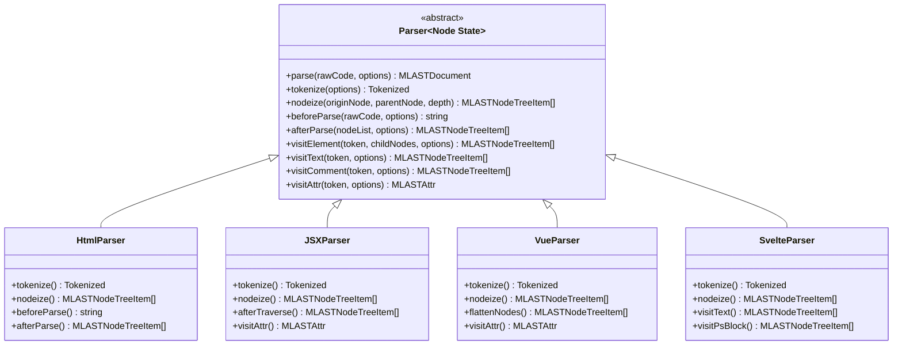
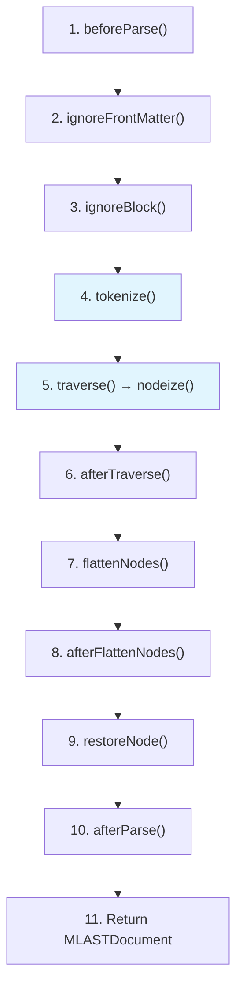
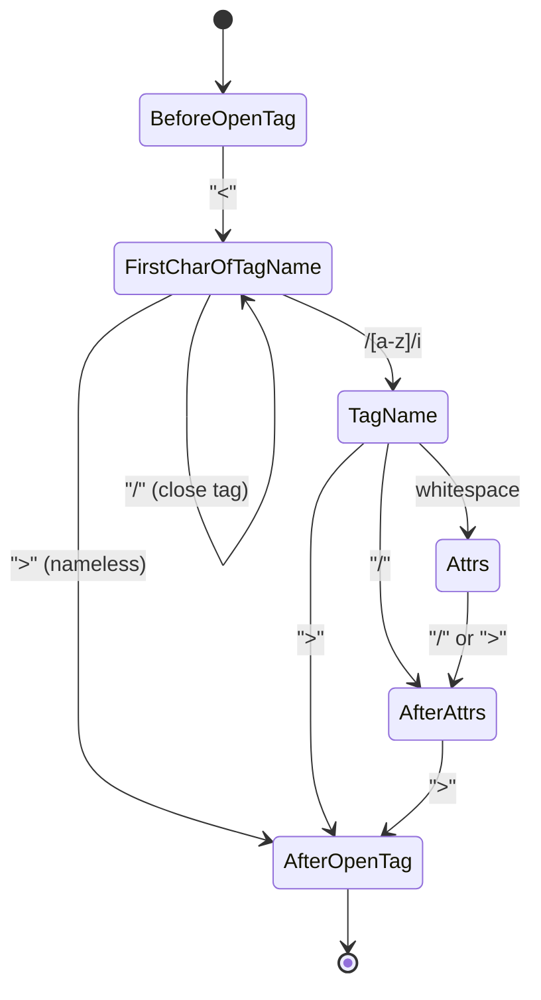
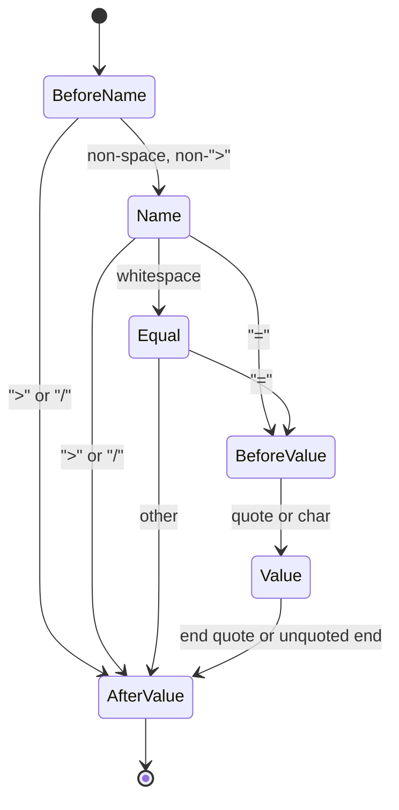

# Parser Class Reference

The `Parser<Node, State>` abstract class is the foundation of every markuplint parser. It defines the complete parsing pipeline — from raw source code to a flat `MLASTNodeTreeItem[]` — and provides a rich set of visitor and utility methods that subclasses override to support specific markup languages.

## Design Pattern

The Parser uses the **Template Method** pattern. The `parse()` method orchestrates an 11-step pipeline, calling protected hook methods at each stage. Subclasses override specific hooks (primarily `tokenize` and `nodeize`) to inject language-specific behavior while inheriting the common pipeline logic.



## Type Parameters

| Parameter | Constraint        | Default | Description                                                                                                                              |
| --------- | ----------------- | ------- | ---------------------------------------------------------------------------------------------------------------------------------------- |
| `Node`    | `extends {}`      | `{}`    | The language-specific AST node type produced by the tokenizer (e.g., parse5's `Node`, Svelte's `SvelteNode`)                             |
| `State`   | `extends unknown` | `null`  | An optional parser state type that persists across a single `parse()` call. Cloned from `defaultState` at the start and reset at the end |

## Constructor / ParserOptions

```ts
constructor(options?: ParserOptions, defaultState?: State)
```

The constructor accepts a `ParserOptions` object and an optional default state value:

| Option                 | Type                   | Default                         | Description                                                                                |
| ---------------------- | ---------------------- | ------------------------------- | ------------------------------------------------------------------------------------------ |
| `booleanish`           | `boolean`              | `false`                         | Treat omitted attribute values as `true` (e.g., JSX `<Component aria-hidden />`)           |
| `endTagType`           | `EndTagType`           | `'omittable'`                   | `'xml'`: end tag required or self-close; `'omittable'`: may omit; `'never'`: never need    |
| `ignoreTags`           | `readonly IgnoreTag[]` | `[]`                            | Patterns for code blocks to mask before parsing (e.g., template expressions)               |
| `maskChar`             | `string`               | `'\uE000'` (MASK_CHAR)          | Character used to replace masked code blocks                                               |
| `tagNameCaseSensitive` | `boolean`              | `false`                         | Whether tag name comparisons are case-sensitive (e.g., JSX, Svelte)                        |
| `selfCloseType`        | `SelfCloseType`        | `'html'`                        | `'html'`: only void elements self-close; `'xml'`: solidus determines; `'html+xml'`: either |
| `spaceChars`           | `readonly string[]`    | `['\t', '\n', '\f', '\r', ' ']` | Characters treated as whitespace in tag parsing                                            |
| `rawTextElements`      | `readonly string[]`    | `['style', 'script']`           | Elements whose children are not traversed (raw text content)                               |

## Parse Pipeline

The `parse()` method drives the full pipeline:



Steps highlighted in blue are the primary override points.

### Step 1: beforeParse()

```ts
beforeParse(rawCode: string, options?: ParseOptions): string
```

Prepends offset spaces based on `ParseOptions` (`offsetOffset`, `offsetLine`, `offsetColumn`). This adjusts the coordinate system for embedded code fragments (e.g., a `<template>` block inside a `.vue` file).

### Step 2: Front Matter Removal

If `options.ignoreFrontMatter` is true, `ignoreFrontMatter()` detects YAML front matter (`---\n...\n---\n`) and replaces it with spaces while preserving line breaks. The front matter is restored as a `#ps:front-matter` psblock node at the end of the pipeline.

### Step 3: Ignore Block Masking

`ignoreBlock()` scans the source for patterns defined in `ignoreTags` and replaces matching blocks with mask characters wrapped in `<!...>` bogus comment syntax. This prevents template expressions (e.g., `{{ expr }}`, `{#if}`) from interfering with HTML parsing.

### Step 4: tokenize()

```ts
tokenize(options?: ParseOptions): Tokenized<Node, State>
```

**Primary override point.** The default implementation returns an empty array. Each parser overrides this to invoke its language-specific tokenizer (parse5, vue-eslint-parser, svelte/compiler, etc.) and return the resulting AST.

### Step 5: traverse() → nodeize()

```ts
traverse(originNodes: readonly Node[], parentNode: MLASTParentNode | null, depth: number)
nodeize(originNode: Node, parentNode: MLASTParentNode | null, depth: number): readonly MLASTNodeTreeItem[]
```

`traverse()` iterates over tokenized nodes and calls `nodeize()` for each one. **`nodeize()` is the second primary override point** — subclasses convert language-specific AST nodes into markuplint AST nodes using visitor methods.

After `nodeize()`, `afterNodeize()` separates the resulting nodes into siblings at the current depth and ancestors at shallower depths.

### Step 6: afterTraverse()

```ts
afterTraverse(nodeTree: readonly MLASTNodeTreeItem[]): readonly MLASTNodeTreeItem[]
```

Sorts the node tree by source position. Subclasses may override for post-traversal restructuring (e.g., JSX remaps parentId references for expression containers).

### Step 7: flattenNodes()

```ts
flattenNodes(nodeTree: readonly MLASTNodeTreeItem[]): readonly MLASTNodeTreeItem[]
```

Walks the hierarchical node tree depth-first and produces a flat, sorted list. Removes duplicated nodes.

### Step 8: afterFlattenNodes()

```ts
afterFlattenNodes(
  nodeList: readonly MLASTNodeTreeItem[],
  options?: {
    readonly exposeInvalidNode?: boolean;   // default: true
    readonly exposeWhiteSpace?: boolean;    // default: true
    readonly concatText?: boolean;          // default: true
  }
): readonly MLASTNodeTreeItem[]
```

Performs four cleanup passes:

1. **Expose remnant nodes** — discovers whitespace and invalid markup between known nodes
2. **Orphan end tags → bogus** — converts unmatched end tags to `invalid` nodes
3. **Concatenate text** — merges adjacent `#text` nodes at the same offset
4. **Trim text** — trims overlapping text node boundaries

### Step 9: restoreNode()

`restoreNode()` walks the flat node list and replaces mask characters with the original code. Each restored block becomes a `#ps:<type>` psblock node. Masked content inside attribute values is also restored and marked as `isDynamicValue`.

### Step 10: afterParse()

```ts
afterParse(nodeList: readonly MLASTNodeTreeItem[], options?: ParseOptions): readonly MLASTNodeTreeItem[]
```

Removes the offset spaces prepended in step 1. Subclasses may add further post-processing.

### Step 11: Return

Returns an `MLASTDocument` containing `{ raw, nodeList, isFragment }`.

## Visitor Methods

### visitElement()

```ts
visitElement(
  token: ChildToken & { nodeName: string; namespace: string },
  childNodes?: readonly Node[],
  options?: {
    createEndTagToken?: (startTag: MLASTElement) => ChildToken | null;
    namelessFragment?: boolean;
    overwriteProps?: Partial<MLASTElement>;
  }
): readonly MLASTNodeTreeItem[]
```

Creates an element start tag node. Handles:

- **Ghost elements** — if `token.raw === ''`, creates an `isGhost: true` element (used for omitted tags like implicit `<head>`, `<body>` in HTML)
- **Self-closing detection** — based on `selfCloseType` setting and void element status
- **End tag pairing** — if `createEndTagToken` returns a token, creates and pairs the end tag
- **Nameless fragments** — JSX `<>...</>` fragments with empty tag name

### visitText()

```ts
visitText(
  token: ChildToken,
  options?: {
    researchTags?: boolean;
    invalidTagAsText?: boolean;
  }
): readonly MLASTNodeTreeItem[]
```

Creates a text node. When `researchTags` is true, re-parses the text via `parseCodeFragment()` to discover embedded HTML tags. If `invalidTagAsText` is also true, any discovered start tags cause the entire content to be treated as a single text node.

### visitComment()

```ts
visitComment(
  token: ChildToken,
  options?: { isBogus?: boolean }
): readonly MLASTNodeTreeItem[]
```

Creates a comment node. Automatically detects bogus comments (those not starting with `<!--`). The `isBogus` option can override this detection.

### visitDoctype()

```ts
visitDoctype(
  token: ChildToken & { name: string; publicId: string; systemId: string }
): readonly MLASTNodeTreeItem[]
```

Creates a doctype node from a token containing the doctype name, public ID, and system ID.

### visitPsBlock()

```ts
visitPsBlock(
  token: ChildToken & { nodeName: string; isFragment: boolean },
  childNodes?: readonly Node[],
  conditionalType?: MLASTPreprocessorSpecificBlockConditionalType,
  originBlockNode?: Node
): readonly MLASTNodeTreeItem[]
```

Creates a preprocessor-specific block node. The `nodeName` is automatically prefixed with `#ps:` (e.g., `#ps:if`, `#ps:each`, `#ps:front-matter`). Recursively traverses child nodes via `visitChildren()`.

### visitAttr()

```ts
visitAttr(
  token: Token,
  options?: {
    quoteSet?: readonly QuoteSet[];
    noQuoteValueType?: ValueType;
    endOfUnquotedValueChars?: readonly string[];
    startState?: AttrState;
  }
): MLASTAttr & { __rightText?: string }
```

Parses a raw attribute string into a fully decomposed `MLASTAttr` with individual tokens for spaces, name, equal sign, quotes, and value. Uses the `AttrState` state machine internally via `attrTokenizer()`.

If the raw string contains multiple attributes, only the first is parsed and the remainder is returned in `__rightText` for iterative processing.

Also attempts to detect spread attributes via `visitSpreadAttr()`.

### visitSpreadAttr()

```ts
visitSpreadAttr(token: Token): MLASTSpreadAttr | null
```

Detects JSX spread attributes matching the pattern `{...expr}`. Returns null if the token doesn't match. HTML parser overrides this to always return null.

### visitChildren()

```ts
visitChildren(
  children: readonly Node[],
  parentNode: MLASTParentNode | null
): readonly MLASTNodeTreeItem[]
```

Traverses child nodes under a parent. Skips traversal for `rawTextElements` (e.g., `<script>`, `<style>`). Returns sibling nodes that belong to ancestor depth levels.

## State Machines

### TagState

Used during tag parsing in `#parseTag()`:



### AttrState

Used during attribute parsing in `attrTokenizer()`:



## Token Creation Utilities

### createToken()

```ts
createToken(token: Token): MLASTToken;
createToken(token: string, startOffset: number, startLine: number, startCol: number): MLASTToken;
```

Creates a new `MLASTToken` with a generated UUID (8 chars) and computed end position. Accepts either a `Token` object or a raw string with explicit coordinates.

### sliceFragment()

```ts
sliceFragment(start: number, end?: number): Token
```

Extracts a `Token` from the current `rawCode` at the given byte offset range, computing line and column from the source position.

### getOffsetsFromCode()

```ts
getOffsetsFromCode(
  startLine: number, startCol: number,
  endLine: number, endCol: number
): { offset: number; endOffset: number }
```

Converts line/column positions to byte offsets within the current raw source code.

## Tree Manipulation

### appendChild()

```ts
appendChild(parentNode: MLASTParentNode | null, ...childNodes: readonly MLASTChildNode[]): void
```

Appends child nodes to a parent, maintaining sorted order by source position. If a child already exists (by UUID), it is replaced in place.

### replaceChild()

```ts
replaceChild(
  parentNode: MLASTParentNode,
  oldChildNode: MLASTChildNode,
  ...replacementChildNodes: readonly MLASTChildNode[]
): void
```

Replaces a child node within a parent's child list with one or more replacement nodes.

### walk()

```ts
walk<Node extends MLASTNodeTreeItem>(
  nodeList: readonly Node[],
  walker: Walker<Node>,
  depth?: number
): void
```

Walks a node list depth-first, invoking the walker callback for each node. The walker receives the current node, the sequentially previous node, and the depth. Automatically recurses into child nodes.

## Update Methods

### updateLocation()

```ts
updateLocation(
  node: MLASTNodeTreeItem,
  props: Partial<Pick<MLASTNodeTreeItem, 'startOffset' | 'startLine' | 'startCol' | 'depth'>>
): void
```

Updates position and depth properties of an AST node, recalculating end offsets/lines/columns from the new start values.

### updateRaw()

```ts
updateRaw(node: MLASTToken, raw: string): void
```

Replaces the raw code of a node and updates all positional properties accordingly.

### updateElement()

```ts
updateElement(el: MLASTElement, props: Partial<Pick<MLASTElement, 'nodeName' | 'elementType'>>): void
updateElement(el: MLASTElementCloseTag, props: Partial<Pick<MLASTElementCloseTag, 'nodeName'>>): void
```

Updates the node name and/or element type of an element or close tag node.

### updateAttr()

```ts
updateAttr(
  attr: MLASTHTMLAttr,
  props: Partial<Pick<MLASTHTMLAttr,
    'isDynamicValue' | 'isDirective' | 'potentialName' | 'potentialValue' |
    'valueType' | 'candidate' | 'isDuplicatable'
  >>
): void
```

Updates metadata properties on an attribute node, such as marking it as a directive or dynamic value.

## Ignore Block System

The ignore block system masks template expressions and preprocessor directives before HTML parsing, then restores them afterward.

### Lifecycle

1. **Define** — `IgnoreTag` patterns in `ParserOptions.ignoreTags`:

   ```ts
   { type: 'mustache', start: '{{', end: '}}' }
   { type: 'Style', start: '<style', end: '</style>' }
   ```

2. **Mask** — `ignoreBlock()` replaces matches with mask characters inside bogus comment syntax (`<!...>`), preserving line breaks for position tracking

3. **Parse** — the masked code is safe for HTML tokenization

4. **Restore** — `restoreNode()` walks the flat node list and replaces masked regions with `#ps:<type>` psblock nodes. Masked content in attribute values is restored and marked `isDynamicValue: true`

### IgnoreTag Definition

```ts
type IgnoreTag = {
  readonly type: string; // Name used for #ps: prefix
  readonly start: RegExp | string; // Start pattern
  readonly end: RegExp | string; // End pattern
};
```

## Element Type Detection

```ts
detectElementType(nodeName: string, defaultPattern?: ParserAuthoredElementNameDistinguishing): ElementType
```

Classifies elements into three types:

| Type              | Description                                    | Example                     |
| ----------------- | ---------------------------------------------- | --------------------------- |
| `'html'`          | Standard HTML element                          | `div`, `span`, `input`      |
| `'web-component'` | Custom element (contains hyphen, per spec)     | `my-component`, `x-button`  |
| `'authored'`      | Framework component (matches authored pattern) | `MyComponent`, `App.Header` |

The `authoredElementName` pattern is set from `ParseOptions` and can be a string, RegExp, function, or array of these. Each parser provides a framework-specific default pattern (e.g., `/^[A-Z]/` for JSX/Svelte, PascalCase + built-in list for Vue).

## Accessor Properties

| Property               | Type                                                   | Description                                                    |
| ---------------------- | ------------------------------------------------------ | -------------------------------------------------------------- |
| `rawCode`              | `string`                                               | The current raw source code being parsed (may be preprocessed) |
| `booleanish`           | `boolean`                                              | Whether omitted attribute values are treated as `true`         |
| `endTag`               | `EndTagType`                                           | The end tag handling strategy                                  |
| `tagNameCaseSensitive` | `boolean`                                              | Whether tag name comparisons are case-sensitive                |
| `authoredElementName`  | `ParserAuthoredElementNameDistinguishing \| undefined` | The pattern for distinguishing authored elements               |
| `state`                | `State`                                                | The mutable parser state (reset after each `parse()` call)     |

## Implementing a Parser

### Basic Structure

```ts
import { Parser } from '@markuplint/parser-utils';
import type { ParserOptions, ParseOptions, Tokenized, ChildToken } from '@markuplint/parser-utils';
import type { MLASTParentNode, MLASTNodeTreeItem } from '@markuplint/ml-ast';

// Your language-specific AST node type
type MyNode = {
  /* ... */
};

class MyParser extends Parser<MyNode> {
  constructor() {
    super({
      endTagType: 'xml',
      tagNameCaseSensitive: true,
      // ... other options
    });
  }

  tokenize(options?: ParseOptions): Tokenized<MyNode> {
    // Parse this.rawCode with your language's parser
    const ast = myLanguageParser(this.rawCode);
    return { ast: ast.children, isFragment: true };
  }

  nodeize(originNode: MyNode, parentNode: MLASTParentNode | null, depth: number): readonly MLASTNodeTreeItem[] {
    // Convert each language-specific node to markuplint AST nodes
    // using visitor methods
    switch (originNode.type) {
      case 'element':
        return this.visitElement(/* ... */);
      case 'text':
        return this.visitText(/* ... */);
      case 'comment':
        return this.visitComment(/* ... */);
      default:
        return [];
    }
  }
}
```

### Override Pattern Reference

| Method                | super call     | Pattern              | Reason                                                                         |
| --------------------- | -------------- | -------------------- | ------------------------------------------------------------------------------ |
| `tokenize()`          | **Not needed** | Full replacement     | Default returns empty array. Each parser provides its own tokenizer            |
| `nodeize()`           | **Not needed** | Full replacement     | Default returns empty array. Each parser provides its own node conversion      |
| `beforeParse()`       | **Required**   | super-first          | `super.beforeParse()` handles offset space prepending. Add processing after    |
| `afterParse()`        | **Required**   | super-first          | `super.afterParse()` handles offset space removal. Add processing after        |
| `afterTraverse()`     | Recommended    | super-first          | `super` sorts by position. JSX adds parentId remapping after                   |
| `afterFlattenNodes()` | Recommended    | wrapper              | Pass options to `super` to control cleanup steps                               |
| `flattenNodes()`      | Recommended    | super-first          | Vue calls super then injects template comments                                 |
| `visitText()`         | Recommended    | wrapper              | Pass options to `super`. Svelte post-processes script→psblock                  |
| `visitComment()`      | Recommended    | super-first          | JSX overrides `isBogus` to `false` after super                                 |
| `visitPsBlock()`      | Recommended    | wrapper + validation | Svelte validates return count after super                                      |
| `visitChildren()`     | Recommended    | wrapper + validation | Svelte validates no siblings after super                                       |
| `visitAttr()`         | **Required**   | super-first          | `super.visitAttr()` performs token decomposition. Add directive handling after |
| `visitSpreadAttr()`   | Not needed     | Full replacement     | HTML overrides to return `null` (no spread support)                            |
| `detectElementType()` | **Required**   | wrapper              | Pass framework-specific default pattern to `super`                             |
| `parseError()`        | Recommended    | conditional chain    | Handle framework-specific errors first, fallback to `super`                    |
| `parse()`             | Recommended    | wrapper              | Svelte modifies options then delegates to super                                |

### Pattern 1: Full Replacement (tokenize, nodeize)

No `super` call needed — the base implementation returns an empty array.

```ts
// From HtmlParser
tokenize(): Tokenized<Node, State> {
  const doc = parse5.parse(this.rawCode);
  return {
    ast: doc.childNodes,
    isFragment: false,
  };
}
```

### Pattern 2: super-first + Post-processing (beforeParse, afterParse, visitAttr)

Call `super` first, then add processing.

```ts
// From HtmlParser
beforeParse(rawCode: string, options?: ParseOptions) {
  const code = super.beforeParse(rawCode, options);
  // Additional preprocessing...
  return code;
}

// From VueParser
visitAttr(token: Token) {
  const attr = super.visitAttr(token);
  // Resolve Vue directive shorthands
  if (attr.type === 'attr' && attr.name.raw.startsWith(':')) {
    this.updateAttr(attr, {
      potentialName: `v-bind:${attr.name.raw.slice(1)}`,
      isDirective: true,
      isDynamicValue: true,
    });
  }
  return attr;
}
```

### Pattern 3: wrapper + Options Delegation (afterFlattenNodes, visitText)

Pass control options to `super`.

```ts
// From JSXParser
afterFlattenNodes(nodeList: readonly MLASTNodeTreeItem[]) {
  return super.afterFlattenNodes(nodeList, {
    exposeWhiteSpace: false,
    exposeInvalidNode: false,
  });
}

// From HtmlParser
visitText(token: ChildToken) {
  return super.visitText(token, {
    researchTags: true,
    invalidTagAsText: true,
  });
}
```

### Pattern 4: Conditional Chain (parseError)

Handle known error formats first, delegate unknown errors to `super`.

```ts
// From JSXParser
parseError(error: any) {
  if (error.lineNumber != null && error.column != null) {
    return new ParserError(error.message, {
      line: error.lineNumber,
      col: error.column,
      raw: this.rawCode,
    });
  }
  return super.parseError(error);
}
```
