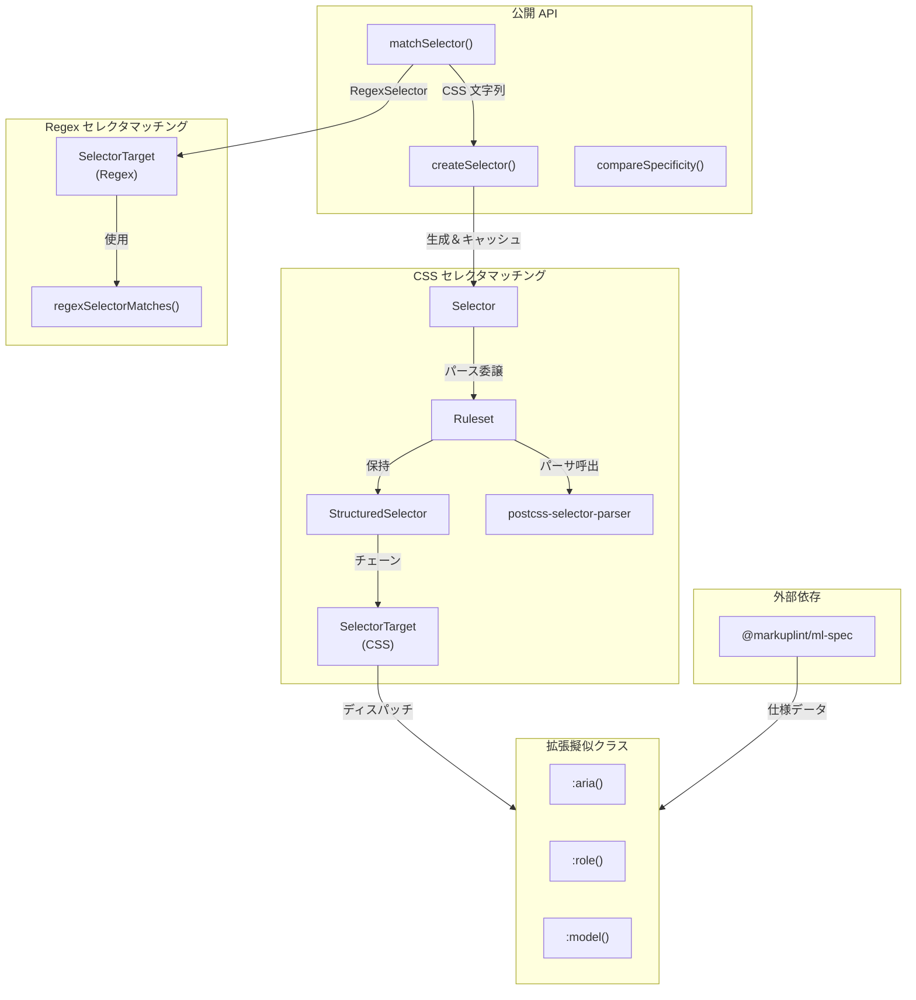
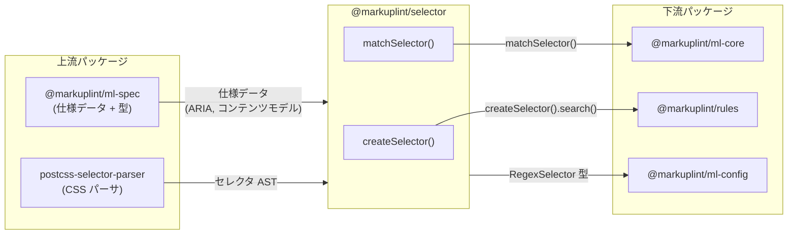

# @markuplint/selector

## 概要

`@markuplint/selector` は markuplint のための拡張 [W3C Selectors Level 4](https://www.w3.org/TR/selectors-4/) マッチャーです。2 つの独立したマッチングシステムを提供します:

1. **CSS セレクタマッチング** -- `postcss-selector-parser` を使用して標準 CSS セレクタをパースし、DOM ノードに対して完全な詳細度追跡付きでマッチングします。
2. **Regex セレクタマッチング** -- ノード名と属性に対する正規表現パターンでマッチングし、キャプチャグループデータを抽出します。

また、markuplint 固有の拡張擬似クラス（`:aria()`、`:role()`、`:model()`）を定義し、HTML/ARIA 仕様データをセレクタマッチングに統合します。

## ディレクトリ構成

```
src/
├── index.ts                                — エクスポートエントリーポイント
├── types.ts                                — 型定義（Specificity, SelectorResult, RegexSelector 等）
├── selector.ts                             — コア Selector/Ruleset/StructuredSelector/SelectorTarget クラス
├── create-selector.ts                      — インスタンスキャッシュと拡張擬似クラス登録を持つ Selector ファクトリ
├── match-selector.ts                       — CSS/Regex セレクタマッチング公開関数
├── compare-specificity.ts                  — 詳細度比較ユーティリティ
├── regex-selector-matches.ts               — 正規表現パターンマッチングヘルパー
├── is.ts                                   — DOM ノード型ガード
├── invalid-selector-error.ts               — 無効セレクタ用カスタムエラークラス
├── debug.ts                                — デバッグログ設定（debug パッケージ使用）
└── extended-selector/
    ├── aria-pseudo-class.ts                — :aria() 擬似クラス（アクセシブルネーム判定）
    ├── aria-role-pseudo-class.ts           — :role() 擬似クラス（計算された ARIA ロール判定）
    └── content-model-pseudo-class.ts       — :model() 擬似クラス（HTML コンテンツモデルカテゴリ判定）
```

## アーキテクチャ図



## モジュール概要

| モジュール                      | 役割                     | 主要エクスポート                                                                                                               |
| ------------------------------- | ------------------------ | ------------------------------------------------------------------------------------------------------------------------------ |
| `index.ts`                      | エントリーポイント       | 全公開 API の再エクスポート                                                                                                    |
| `types.ts`                      | 型定義                   | `Specificity`, `SelectorResult`, `RegexSelector`, `RegexSelectorCombinator`                                                    |
| `selector.ts`                   | CSS セレクタエンジン     | `Selector` クラス（エントリーポイントからは再エクスポートされない）、`Ruleset`, `StructuredSelector`, `SelectorTarget`（内部） |
| `create-selector.ts`            | キャッシュ付きファクトリ | `createSelector()`                                                                                                             |
| `match-selector.ts`             | 統合マッチング           | `matchSelector()`, `SelectorMatches`                                                                                           |
| `compare-specificity.ts`        | 詳細度比較               | `compareSpecificity()`                                                                                                         |
| `regex-selector-matches.ts`     | Regex マッチングヘルパー | `regexSelectorMatches()`                                                                                                       |
| `is.ts`                         | DOM 型ガード             | `isElement()`, `isNonDocumentTypeChildNode()`, `isPureHTMLElement()`                                                           |
| `invalid-selector-error.ts`     | エラークラス             | `InvalidSelectorError`                                                                                                         |
| `debug.ts`                      | デバッグログ             | `log`（debug インスタンス）, `enableDebug()`                                                                                   |
| `aria-pseudo-class.ts`          | `:aria()` ハンドラ       | `ariaPseudoClass()`                                                                                                            |
| `aria-role-pseudo-class.ts`     | `:role()` ハンドラ       | `ariaRolePseudoClass()`                                                                                                        |
| `content-model-pseudo-class.ts` | `:model()` ハンドラ      | `contentModelPseudoClass()`                                                                                                    |

## 公開 API

### `createSelector(selector, specs?)`

キャッシュされた `Selector` インスタンスを作成します。`specs` を指定すると、拡張擬似クラス（`:model()`、`:aria()`、`:role()`）が利用可能になります。インスタンスはセレクタ文字列をキーとしてキャッシュされます。

### `matchSelector(el, selector, scope?, specs?)`

CSS セレクタ文字列または `RegexSelector` オブジェクトの両方を受け付ける統合マッチング関数です。`{ matched: true, selector, specificity, data? }` または `{ matched: false }` を返します。

### `compareSpecificity(a, b)`

2 つの `Specificity` タプル（`[id, class, type]`）を比較します。`-1`、`0`、`1` を返します。

### `SelectorMatches`（型）

セレクタマッチ結果のユニオン型: `{ matched: true, selector, specificity, data? } | { matched: false }`。

### `InvalidSelectorError`

CSS セレクタ文字列がパースできない場合にスローされるカスタムエラーです。

## コア内部クラス

CSS マッチングシステムは 4 つのクラスの階層で構成されます:

```
Selector
  └── Ruleset（postcss-selector-parser でパース）
        └── StructuredSelector[]（カンマ区切りセレクタごとに 1 つ）
              └── SelectorTarget[]（コンビネータで連結されたチェーン）
```

- **Selector** -- 公開クラス。マッチングと検索を `Ruleset` に委譲します。
- **Ruleset** -- `postcss-selector-parser` でセレクタ文字列をパースし、`StructuredSelector` インスタンスのグループを保持します。カンマ区切りの全選択肢に対する `SelectorResult` 配列を返します。
- **StructuredSelector** -- 単一のセレクタ（カンマなし）を表現します。コンビネータで連結された `SelectorTarget` ノードのチェーンを構築します。マッチング時は右から左へチェーンをたどります。
- **SelectorTarget** -- 単一の複合セレクタを要素に対してマッチングします。ID、タグ、クラス、属性、ユニバーサルセレクタ、擬似クラス（拡張擬似クラスを含む）を処理します。

## 2 つのマッチングシステム

### CSS セレクタマッチング

標準 CSS セレクタは `postcss-selector-parser` により AST にパースされ、DOM ノードに対してマッチングされます:

1. `createSelector()` がキャッシュされた `Selector` インスタンスを作成または取得
2. `Selector.match()` が `Ruleset.match()` に委譲
3. 各 `StructuredSelector` が AST から `SelectorTarget` チェーンを構築
4. `SelectorTarget` が個別の複合セレクタ（ID、クラス、タグ、属性、擬似クラス）をマッチング
5. コンビネータ（子孫、子、兄弟）が `SelectorTarget` ノード間の DOM をトラバース

### Regex セレクタマッチング

Regex セレクタは `RegexSelector` 型を使用してパターンで要素をマッチングします:

1. `matchSelector()` が `RegexSelector` オブジェクトを受け取る
2. `combination` リンクから `SelectorTarget` チェーンが構築される
3. 各ターゲットが `regexSelectorMatches()` を使用して `nodeName`、`attrName`、`attrValue` をマッチング
4. マッチしたキャプチャグループが `data` レコード（`$0`、`$1`、名前付きグループ）に収集される
5. コンビネータは標準 CSS コンビネータに加え、前方兄弟マッチング用の `:has(+)` と `:has(~)` を含む

詳細なアルゴリズムは[セレクタマッチング](docs/matching.ja.md)を参照してください。

## 拡張擬似クラスシステム

拡張擬似クラスは `ExtendedPseudoClass` 型を通じて登録されます:

```typescript
type ExtendedPseudoClass = Record<string, (content: string) => (el: Element) => SelectorResult>;
```

3 つの擬似クラスが組み込まれています:

| 擬似クラス                                     | モジュール                      | 説明                                                                   |
| ---------------------------------------------- | ------------------------------- | ---------------------------------------------------------------------- |
| `:aria(has name)` / `:aria(has no name)`       | `aria-pseudo-class.ts`          | `getAccname()` を使用してアクセシブルネームの有無で要素をマッチング    |
| `:role(roleName)` / `:role(roleName\|version)` | `aria-role-pseudo-class.ts`     | `getComputedRole()` を使用して計算された ARIA ロールで要素をマッチング |
| `:model(category)`                             | `content-model-pseudo-class.ts` | HTML コンテンツモデルカテゴリに属する要素をマッチング                  |

すべての拡張擬似クラスの詳細度は `[0, 1, 0]` です。

## 詳細度

詳細度はマッチング全体を通じて `[id, class, type]` タプルとして追跡されます。主要なルール:

- `:where()` は `[0, 0, 0]` の詳細度
- `:not()`、`:is()`、`:has()` は最も詳細度の高い引数の詳細度
- 拡張擬似クラスは `[0, 1, 0]`
- `compareSpecificity()` は左から右に比較（ID > class > type）

## 外部依存パッケージ

| パッケージ                | 用途                                                      |
| ------------------------- | --------------------------------------------------------- |
| `postcss-selector-parser` | CSS セレクタ文字列の AST へのパース                       |
| `@markuplint/ml-spec`     | 拡張擬似クラス用の HTML/ARIA 仕様データ                   |
| `debug`                   | `DEBUG=selector*` によるデバッグログ                      |
| `type-fest`               | TypeScript ユーティリティ型（`ReadonlyDeep`, `Writable`） |

開発依存:

| パッケージ | 用途              |
| ---------- | ----------------- |
| `jsdom`    | テスト用 DOM 環境 |

## 他パッケージとの連携



### 上流

- **`@markuplint/ml-spec`** は拡張擬似クラスで使用される ARIA 仕様データ（`getComputedRole`、`getAccname`、`contentModelCategoryToTagNames`）と `resolveNamespace()` ユーティリティを提供します。
- **`postcss-selector-parser`** は CSS セレクタ文字列を `Ruleset` が使用する AST にパースします。

### 下流

- **`@markuplint/ml-core`** はリント実行中にルール設定を要素にマッチングするために `matchSelector()` を使用します。
- **`@markuplint/rules`** はルール実装での要素選択に `createSelector().search()` を使用します。
- **`@markuplint/ml-config`** は設定スキーマ定義に `RegexSelector` 型を使用します。

## ドキュメントマップ

- [セレクタマッチング](docs/matching.ja.md) -- CSS と Regex セレクタマッチングアルゴリズムの詳細
- [メンテナンスガイド](docs/maintenance.ja.md) -- コマンド、テスト、レシピ、トラブルシューティング
