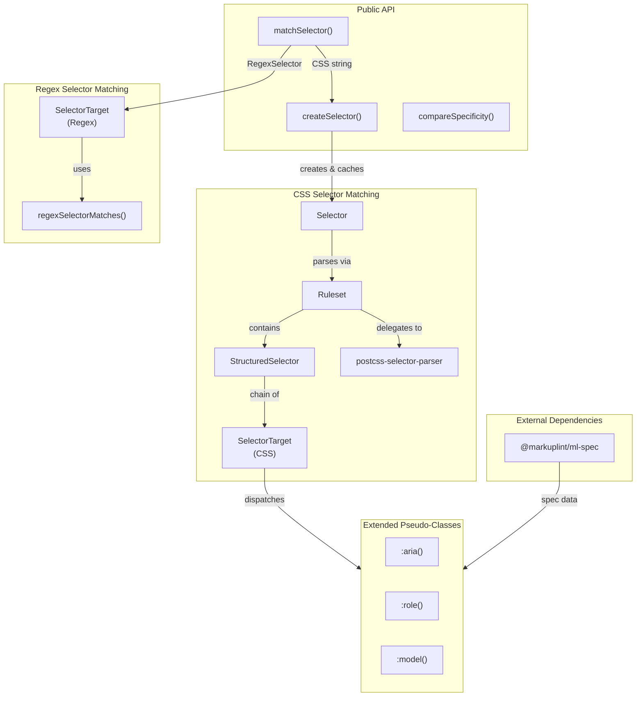
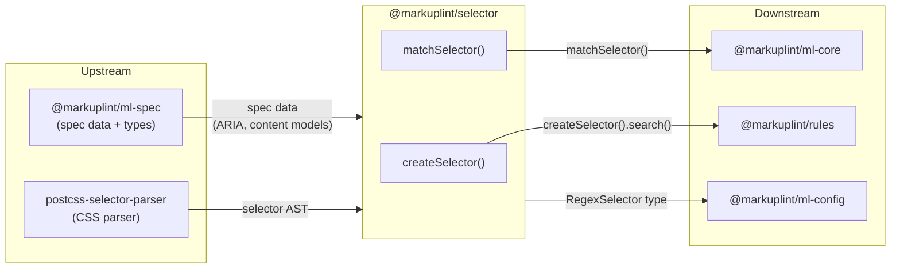

# @markuplint/selector

## Overview

`@markuplint/selector` is an extended [W3C Selectors Level 4](https://www.w3.org/TR/selectors-4/) matcher for markuplint. It provides two independent matching systems:

1. **CSS Selector Matching** -- Parses standard CSS selectors via `postcss-selector-parser` and matches them against DOM nodes with full specificity tracking.
2. **Regex Selector Matching** -- Matches elements using regular expression patterns on node names and attributes, with captured group data extraction.

The package also defines markuplint-specific extended pseudo-classes (`:aria()`, `:role()`, `:model()`) that integrate HTML/ARIA specification data into selector matching.

## Directory Structure

```
src/
├── index.ts                                — Export entry point
├── types.ts                                — Type definitions (Specificity, SelectorResult, RegexSelector, etc.)
├── selector.ts                             — Core Selector/Ruleset/StructuredSelector/SelectorTarget classes
├── create-selector.ts                      — Selector factory with instance caching and extended pseudo-class registration
├── match-selector.ts                       — CSS/Regex selector matching public function
├── compare-specificity.ts                  — Specificity comparison utility
├── regex-selector-matches.ts               — Regex pattern matching helper
├── is.ts                                   — DOM node type guards
├── invalid-selector-error.ts               — Custom error class for invalid selectors
├── debug.ts                                — Debug log configuration (using debug package)
└── extended-selector/
    ├── aria-pseudo-class.ts                — :aria() pseudo-class (accessible name matching)
    ├── aria-role-pseudo-class.ts           — :role() pseudo-class (computed ARIA role matching)
    └── content-model-pseudo-class.ts       — :model() pseudo-class (HTML content model category matching)
```

## Architecture Diagram



## Module Overview

| Module                          | Role                   | Key Exports                                                                                                       |
| ------------------------------- | ---------------------- | ----------------------------------------------------------------------------------------------------------------- |
| `index.ts`                      | Entry point            | Re-exports all public API                                                                                         |
| `types.ts`                      | Type definitions       | `Specificity`, `SelectorResult`, `RegexSelector`, `RegexSelectorCombinator`                                       |
| `selector.ts`                   | CSS selector engine    | `Selector` class (not re-exported from entry point), `Ruleset`, `StructuredSelector`, `SelectorTarget` (internal) |
| `create-selector.ts`            | Factory with caching   | `createSelector()`                                                                                                |
| `match-selector.ts`             | Unified matching       | `matchSelector()`, `SelectorMatches`                                                                              |
| `compare-specificity.ts`        | Specificity comparison | `compareSpecificity()`                                                                                            |
| `regex-selector-matches.ts`     | Regex matching helper  | `regexSelectorMatches()`                                                                                          |
| `is.ts`                         | DOM type guards        | `isElement()`, `isNonDocumentTypeChildNode()`, `isPureHTMLElement()`                                              |
| `invalid-selector-error.ts`     | Error class            | `InvalidSelectorError`                                                                                            |
| `debug.ts`                      | Debug logging          | `log` (debug instance), `enableDebug()`                                                                           |
| `aria-pseudo-class.ts`          | `:aria()` handler      | `ariaPseudoClass()`                                                                                               |
| `aria-role-pseudo-class.ts`     | `:role()` handler      | `ariaRolePseudoClass()`                                                                                           |
| `content-model-pseudo-class.ts` | `:model()` handler     | `contentModelPseudoClass()`                                                                                       |

## Public API

### `createSelector(selector, specs?)`

Creates a cached `Selector` instance. When `specs` is provided, the extended pseudo-classes (`:model()`, `:aria()`, `:role()`) become available. Instances are cached by selector string for reuse.

### `matchSelector(el, selector, scope?, specs?)`

Unified matching function that accepts either a CSS selector string or a `RegexSelector` object. Returns `{ matched: true, selector, specificity, data? }` or `{ matched: false }`.

### `compareSpecificity(a, b)`

Compares two `Specificity` tuples (`[id, class, type]`). Returns `-1`, `0`, or `1`.

### `SelectorMatches` (type)

Union type for selector match results: `{ matched: true, selector, specificity, data? } | { matched: false }`.

### `InvalidSelectorError`

Custom error thrown when a CSS selector string cannot be parsed.

## Core Internal Classes

The CSS matching system uses a hierarchy of four classes:

```
Selector
  └── Ruleset (parsed from postcss-selector-parser)
        └── StructuredSelector[] (one per comma-separated selector)
              └── SelectorTarget[] (chain linked by combinators)
```

- **Selector** -- Public-facing class. Delegates to `Ruleset` for matching and searching.
- **Ruleset** -- Parses a selector string via `postcss-selector-parser` and holds a group of `StructuredSelector` instances. Returns an array of `SelectorResult` for all comma-separated alternatives.
- **StructuredSelector** -- Represents a single selector (without commas). Builds a chain of `SelectorTarget` nodes linked by combinators. Traverses the chain from right to left during matching.
- **SelectorTarget** -- Matches a single compound selector against an element. Handles ID, tag, class, attribute, universal selectors, and pseudo-classes (including extended pseudo-classes).

## Two Matching Systems

### CSS Selector Matching

Standard CSS selectors are parsed by `postcss-selector-parser` into an AST, then matched against DOM nodes. The matching process:

1. `createSelector()` creates or retrieves a cached `Selector` instance
2. `Selector.match()` delegates to `Ruleset.match()`
3. Each `StructuredSelector` builds a `SelectorTarget` chain from the AST
4. `SelectorTarget` matches individual compounds (ID, class, tag, attributes, pseudo-classes)
5. Combinators (descendant, child, sibling) traverse the DOM between `SelectorTarget` nodes

### Regex Selector Matching

Regex selectors use the `RegexSelector` type to match elements by patterns:

1. `matchSelector()` receives a `RegexSelector` object
2. A `SelectorTarget` chain is built from the `combination` links
3. Each target matches `nodeName`, `attrName`, and/or `attrValue` using `regexSelectorMatches()`
4. Matched capture groups are collected into a `data` record (`$0`, `$1`, named groups)
5. Combinators include standard CSS combinators plus `:has(+)` and `:has(~)` for forward-sibling matching

See [Selector Matching](docs/matching.md) for detailed algorithm documentation.

## Extended Pseudo-Class System

Extended pseudo-classes are registered through the `ExtendedPseudoClass` type:

```typescript
type ExtendedPseudoClass = Record<string, (content: string) => (el: Element) => SelectorResult>;
```

Three pseudo-classes are built in:

| Pseudo-Class                                   | Module                          | Description                                                       |
| ---------------------------------------------- | ------------------------------- | ----------------------------------------------------------------- |
| `:aria(has name)` / `:aria(has no name)`       | `aria-pseudo-class.ts`          | Matches elements by accessible name presence using `getAccname()` |
| `:role(roleName)` / `:role(roleName\|version)` | `aria-role-pseudo-class.ts`     | Matches elements by computed ARIA role using `getComputedRole()`  |
| `:model(category)`                             | `content-model-pseudo-class.ts` | Matches elements belonging to an HTML content model category      |

All extended pseudo-classes have a specificity of `[0, 1, 0]`.

## Specificity

Specificity is tracked as a `[id, class, type]` tuple throughout matching. Key rules:

- `:where()` contributes `[0, 0, 0]` specificity
- `:not()`, `:is()`, `:has()` contribute the specificity of their most specific argument
- Extended pseudo-classes contribute `[0, 1, 0]`
- `compareSpecificity()` compares left-to-right (ID > class > type)

## External Dependencies

| Dependency                | Purpose                                                  |
| ------------------------- | -------------------------------------------------------- |
| `postcss-selector-parser` | CSS selector string parsing into AST                     |
| `@markuplint/ml-spec`     | HTML/ARIA specification data for extended pseudo-classes |
| `debug`                   | Debug logging via `DEBUG=selector*`                      |
| `type-fest`               | TypeScript utility types (`ReadonlyDeep`, `Writable`)    |

Dev dependencies:

| Dependency | Purpose                   |
| ---------- | ------------------------- |
| `jsdom`    | DOM environment for tests |

## Integration Points



### Upstream

- **`@markuplint/ml-spec`** provides ARIA specification data (`getComputedRole`, `getAccname`, `contentModelCategoryToTagNames`) used by extended pseudo-classes and the `resolveNamespace()` utility.
- **`postcss-selector-parser`** parses CSS selector strings into an AST consumed by `Ruleset`.

### Downstream

- **`@markuplint/ml-core`** uses `matchSelector()` to match rule configurations against elements during linting.
- **`@markuplint/rules`** uses `createSelector().search()` for element selection in rule implementations.
- **`@markuplint/ml-config`** uses the `RegexSelector` type for configuration schema definitions.

## Documentation Map

- [Selector Matching](docs/matching.md) -- CSS and regex selector matching algorithm details
- [Maintenance Guide](docs/maintenance.md) -- Commands, testing, recipes, and troubleshooting
