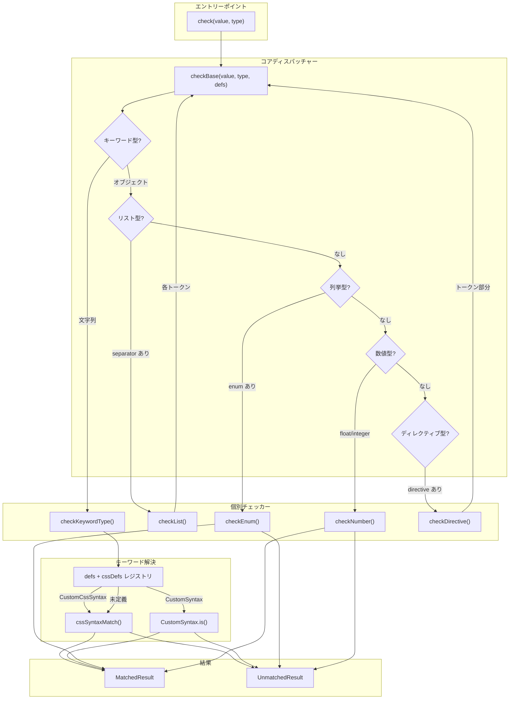
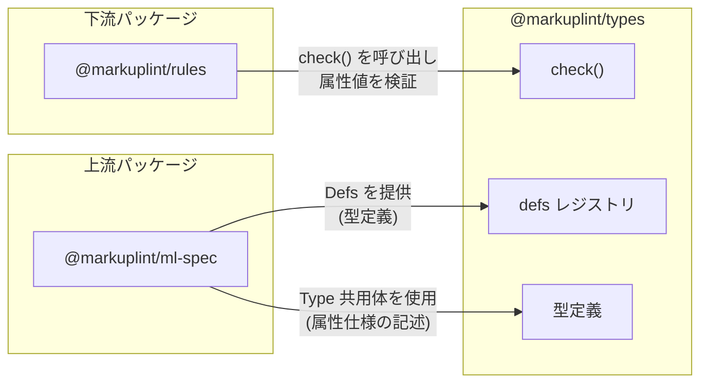

# @markuplint/types

## 概要

`@markuplint/types` は、markuplint における HTML/SVG 属性値の型バリデーションシステムです。HTML Living Standard、CSS 仕様、その他の Web 標準に基づく型定義に対して属性値を検証します。

文字列値と型定義を受け取り、値が型に適合するかどうかを判定します。不適合の場合は、不一致箇所の位置情報・理由・期待される値・修正候補を含む詳細なエラー結果を生成します。

## ディレクトリ構成

```
src/
├── index.ts                        # パッケージのエントリーポイント。公開APIを再エクスポート
├── types.ts                        # 主要な型定義 (Result, Defs, CustomSyntax など)
├── types.schema.ts                 # JSONスキーマから自動生成された型 (Type, List, Enum, Number, Directive)
├── check.ts                        # 公開エントリーポイント: 組み込みdefsを使う check()
├── check-base.ts                   # コアディスパッチャー: 型の形状に応じてチェッカーを振り分け
├── check-multi-types.ts            # 複数チェッカーを試行し、最良の結果を返す
├── match-result.ts                 # ファクトリ関数: matched(), unmatched(), matches()
├── defs.ts                         # 組み込みHTML型定義レジストリ (Any, URL, DateTime など)
├── css-defs.ts                     # CSS/SVG型定義 (viewBox, dasharray など)
├── css-syntax.ts                   # css-tree フォークによるCSS構文マッチング
├── css-overrides.ts                # css-tree組み込み構文のオーバーライド (SVGトランスフォーム)
├── css-tokenizers.ts               # css-tree用カスタムトークナイザー (BCP-47)
├── keyword-type.ts                 # キーワード型の解決とキャッシュ
├── enum.ts                         # 列挙型チェッカー (大文字小文字非区別の集合メンバーシップ)
├── list.ts                         # リスト型チェッカー (カンマ/スペース区切りのトークン列)
├── number.ts                       # 数値型チェッカー (整数/浮動小数点と範囲制約)
├── directive.ts                    # ディレクティブ型チェッカー (プレフィックスパターン + トークン検証)
├── get-candidate.ts                # レーベンシュタイン距離によるタイプミス修正候補の提示
├── debug.ts                        # デバッグロガーインスタンス
├── primitive/                      # プリミティブ数値バリデーター
│   ├── index.ts                    # 全プリミティブバリデーターの再エクスポート
│   ├── is-float.ts                 # 浮動小数点数の検証
│   ├── is-int.ts                   # 符号付き整数の検証
│   ├── is-uint.ts                  # 符号なし整数の検証
│   ├── is-non-zero-uint.ts         # 0以外の符号なし整数の検証
│   ├── is-quantity.ts              # CSS数量 (数値 + 単位) の検証
│   ├── split-unit.ts               # 数値部分と単位接尾辞の分離
│   ├── range.ts                    # 数値範囲チェックユーティリティ
│   └── index.spec.ts               # テスト
├── token/                          # 位置追跡トークンシステム
│   ├── index.ts                    # Token と TokenCollection の再エクスポート
│   ├── token.ts                    # Token クラス: オフセット・行・列の追跡
│   ├── token-collection.ts         # TokenCollection: パース済みトークン列と検証機能
│   ├── types.ts                    # トークン値の型 (スカラー、配列、正規表現、数値)
│   └── index.spec.ts               # テスト
├── whatwg/                          # WHATWG HTML Standard に基づくバリデーター
│   ├── check-autocomplete.ts       # autocomplete 属性の検証
│   ├── check-datetime/             # DateTime マイクロシンタックスバリデーター群
│   │   ├── index.ts                # 全日時フォーマットのディスパッチャー
│   │   ├── date-string.ts          # YYYY-MM-DD
│   │   ├── time-string.ts          # HH:MM:SS
│   │   ├── month-string.ts         # YYYY-MM
│   │   ├── week-string.ts          # YYYY-Www
│   │   ├── year-string.ts          # YYYY
│   │   ├── yearless-date-string.ts # MM-DD
│   │   ├── duration-string.ts      # 期間フォーマット
│   │   ├── global-date-and-time-string.ts
│   │   ├── local-date-and-time-string.ts
│   │   ├── time-zone-offset-string.ts
│   │   ├── datetime-tokens.ts      # 共通トークンパターン
│   │   └── index.spec.ts           # テスト
│   ├── check-link-type.ts          # リンクタイプの検証 (rel 属性)
│   ├── check-mime-type.ts          # MIMEタイプの検証
│   ├── is-abs-url.ts               # 絶対URLの判定
│   ├── is-browser-context-name.ts  # ブラウジングコンテキスト名の判定 (非推奨)
│   ├── is-custom-element-name.ts   # カスタム要素名の判定
│   ├── is-itemprop-name.ts         # itemprop 名の判定
│   └── is-navigable-target-name.ts # ナビゲーションターゲット名の判定
├── rfc/                             # RFC仕様に基づくバリデーター
│   ├── is-bcp-47.ts                # BCP 47 言語タグの検証
│   └── is-bcp-47.spec.ts           # テスト
└── w3c/                             # W3C仕様に基づくバリデーター
    ├── check-serialized-permissions-policy.ts  # Permissions Policy の検証
    └── check-serialized-permissions-policy.spec.ts  # テスト
```

## アーキテクチャ図



## 主要コンポーネント

### 1. 型システム

型システムは、属性値の制約を表現する型定義と、検証結果の表現方法を定めています。

| ファイル          | 役割                                                                                                          |
| ----------------- | ------------------------------------------------------------------------------------------------------------- |
| `types.ts`        | 主要な型: `Result`, `MatchedResult`, `UnmatchedResult`, `Defs`, `CustomSyntax`, `CustomCssSyntax`             |
| `types.schema.ts` | 自動生成された判別共用体 `Type` とそのバリアント: `KeywordDefinedType`, `List`, `Enum`, `Number`, `Directive` |
| `match-result.ts` | ファクトリ関数 `matched()`, `unmatched()` および `matches()` ラッパー                                         |
| `defs.ts`         | 組み込みHTML定義レジストリ (30以上の型: `Any`, `URL`, `DateTime`, `DOMID`, `BCP47` など)                      |
| `css-defs.ts`     | CSS/SVG定義 (25以上の型: `<view-box>`, `<preserve-aspect-ratio>`, `<dasharray>` など)                         |

`Type` 共用体は5つの形状に分岐する判別共用体です:

- **文字列** (キーワード) -- 例: `"URL"`, `"<color>"`, `"DateTime"`
- **`separator` を持つオブジェクト** (リスト) -- スペース区切りまたはカンマ区切りのトークン列
- **`enum` を持つオブジェクト** (列挙) -- 許容される文字列値の固定集合
- **`type: "float" | "integer"` を持つオブジェクト** (数値) -- 範囲制約付きの数値
- **`directive` を持つオブジェクト** (ディレクティブ) -- プレフィックスパターンに続く型付きトークン

### 2. チェックパイプライン

バリデーションパイプラインは、型定義の形状を判別して適切なチェッカーに処理を振り分けます。

| ファイル               | 役割                                                                                                                              |
| ---------------------- | --------------------------------------------------------------------------------------------------------------------------------- |
| `check.ts`             | 公開関数 `check()`。`defs` と `cssDefs` を結合し、`checkBase()` に委譲                                                            |
| `check-base.ts`        | ディスパッチャー。`isKeyword()`, `isList()`, `isEnum()`, `isNumber()`, `isDirective()` で型を判別し、対応するチェッカーを呼び出す |
| `keyword-type.ts`      | キーワード型の解決: `Defs` レジストリを参照し、見つからなければ `cssSyntaxMatch()` にフォールバック。結果をキャッシュ             |
| `css-syntax.ts`        | `css-tree` のフォークを使い、カスタム型とトークナイザーを組み込んだ CSS 値定義構文マッチング                                      |
| `enum.ts`              | 許容値の集合に対する検証 (デフォルトで大文字小文字非区別)                                                                         |
| `list.ts`              | セパレータで値を分割し、各トークンを `checkBase()` で再帰的に検証                                                                 |
| `number.ts`            | 整数/浮動小数点のフォーマット検証と範囲制約 (gt, gte, lt, lte) のチェック                                                         |
| `directive.ts`         | プレフィックスパターン (文字列または正規表現) のマッチング後、トークン部分を `checkBase()` で再帰的に検証                         |
| `check-multi-types.ts` | 複数のチェッカーを順に試行し、最初にマッチした結果、またはパス数・オフセットが最大の不一致結果を返す                              |
| `get-candidate.ts`     | レーベンシュタイン距離を用いたタイプミスの修正候補提示                                                                            |

### 3. トークンシステム

トークンシステムは、位置情報を保持したまま文字列を解析し、正確なエラー位置を報告するための基盤です。

| ファイル                    | 役割                                                                                                                                                 |
| --------------------------- | ---------------------------------------------------------------------------------------------------------------------------------------------------- |
| `token/token.ts`            | `Token` クラス。値・オフセット・行・列を保持。位置情報付きエラー結果を生成する `unmatched()` メソッドを提供                                          |
| `token/token-collection.ts` | `TokenCollection` クラス (`Array<Token>` を継承)。設定可能なセパレータで文字列をトークンに分割。ユニーク制約・順序チェック・パターンマッチングに対応 |
| `token/types.ts`            | トークン値の型定義: `TokenValueScalar` (文字列、RegExp、数値)、`TokenValueArray`                                                                     |

### 4. バリデーター群

Web標準の仕様に基づいた、個別の値検証ロジックを実装しています。

| ディレクトリ | バリデーター                                                                                                                                                                                         |
| ------------ | ---------------------------------------------------------------------------------------------------------------------------------------------------------------------------------------------------- |
| `primitive/` | `isFloat`, `isInt`, `isUint`, `isNonZeroUint`, `isQuantity`, `splitUnit`, `range`                                                                                                                    |
| `whatwg/`    | `checkDateTime` (8種のサブバリデーター), `checkAutoComplete`, `checkMIMEType`, `checkLinkType`, `isAbsURL`, `isCustomElementName`, `isNavigableTargetName`, `isBrowserContextName`, `isItempropName` |
| `rfc/`       | `isBCP47` (BCP 47 言語タグ検証)                                                                                                                                                                      |
| `w3c/`       | `checkSerializedPermissionsPolicy` (Permissions Policy 検証)                                                                                                                                         |

## 外部依存パッケージ

| パッケージ        | 用途                                               | 使用箇所                                   |
| ----------------- | -------------------------------------------------- | ------------------------------------------ |
| `css-tree`        | CSS値定義構文のレキサーフォークによるマッチング    | `css-syntax.ts`                            |
| `bcp-47`          | BCP 47 言語タグのパースと検証                      | `rfc/is-bcp-47.ts`, `css-tokenizers.ts`    |
| `whatwg-mimetype` | WHATWG MIMEタイプのパース                          | `whatwg/check-mime-type.ts`                |
| `leven`           | タイプミス検出のためのレーベンシュタイン距離計算   | `get-candidate.ts`                         |
| `debug`           | 名前空間 `@markuplint/types` のデバッグログ        | `debug.ts`                                 |
| `type-fest`       | 深い不変性のための `ReadonlyDeep` ユーティリティ型 | `check.ts`, `check-base.ts` 他各チェッカー |

## 他パッケージとの連携



### 上流: `@markuplint/ml-spec`

`@markuplint/ml-spec` は、要素仕様の中で属性値の制約を表現するために `Type` 共用体と関連する型 (`List`, `Enum`, `Number`, `Directive`, `KeywordDefinedType`) を利用します。また、組み込み定義レジストリを拡張する `Defs` エントリを生成します。

### 下流: `@markuplint/rules`

`@markuplint/rules` は、パース済み HTML ドキュメント中の属性値を検証するために `check(value, type)` を呼び出します。`Result` 型がエラー報告を駆動し、`UnmatchedResult` に含まれるオフセット・行・列・理由・期待値・修正候補の情報を、ルールがリント診断メッセージに変換します。

## ドキュメントマップ

- [型システム](docs/type-system.ja.md) -- 型共用体、Result型、Defsレジストリ、スキーマ生成
- [チェックパイプライン](docs/check-pipeline.ja.md) -- `check()` から個別チェッカーまでのバリデーションフロー
- [トークンシステム](docs/token-system.ja.md) -- Token クラス、TokenCollection、パースパターン
- [バリデーター](docs/validators.ja.md) -- プリミティブ、WHATWG、RFC、W3C バリデーター
