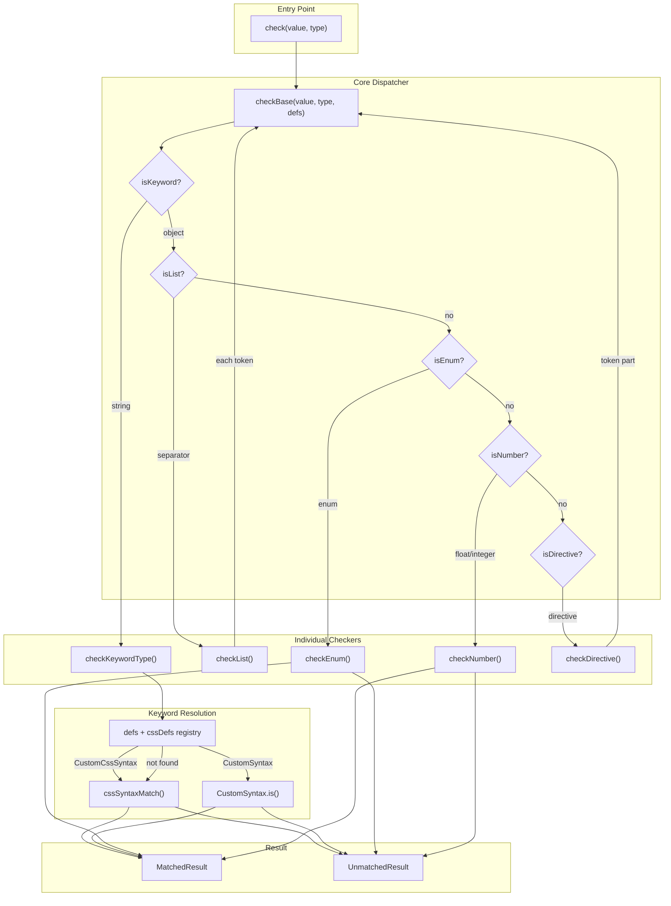
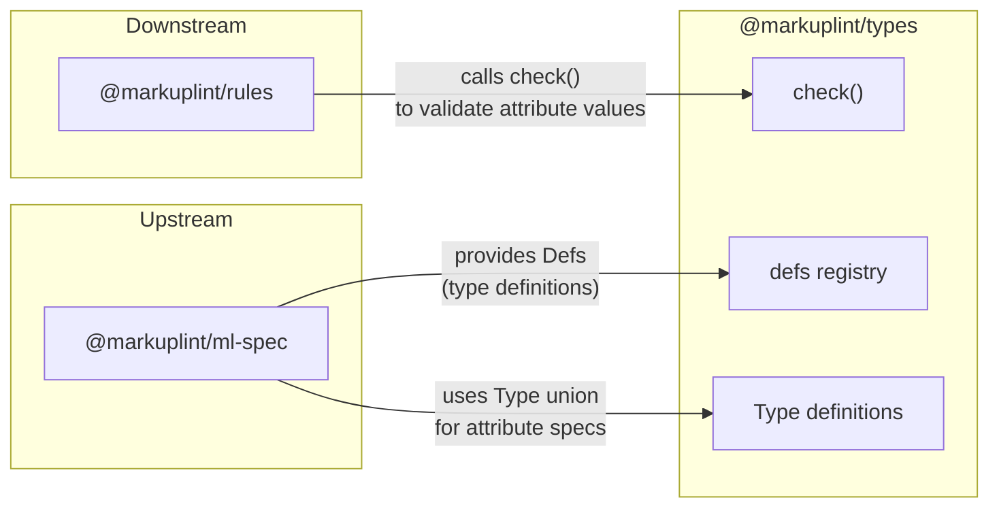

# @markuplint/types

## Overview

`@markuplint/types` is the attribute value type validation system for markuplint. It validates HTML and SVG attribute values against type definitions derived from the HTML Living Standard, CSS specifications, and related web standards.

Given a string value and a type definition, the package determines whether the value conforms to the type and, when it does not, produces a detailed error result including the mismatch position, reason, expected values, and suggested corrections.

## Directory Structure

```
src/
├── index.ts                        # Package entry point; re-exports public API
├── types.ts                        # Core type definitions (Result, Defs, CustomSyntax, etc.)
├── types.schema.ts                 # Auto-generated types from JSON schema (Type, List, Enum, Number, Directive)
├── check.ts                        # Primary entry point: check() with built-in defs
├── check-base.ts                   # Core dispatcher: routes to checkers by type shape
├── check-multi-types.ts            # Tries multiple checkers, returns best result
├── match-result.ts                 # Factory functions: matched(), unmatched(), matches()
├── defs.ts                         # Built-in HTML type definitions registry (Any, URL, DateTime, etc.)
├── css-defs.ts                     # CSS/SVG type definitions (viewBox, dasharray, etc.)
├── css-syntax.ts                   # CSS syntax matching via css-tree fork
├── css-overrides.ts                # Overrides for css-tree built-in syntax (SVG transforms)
├── css-tokenizers.ts               # Custom tokenizers for css-tree (BCP-47)
├── keyword-type.ts                 # Keyword type resolution with caching
├── enum.ts                         # Enum checker (case-insensitive set membership)
├── list.ts                         # List checker (comma/space-separated token sequences)
├── number.ts                       # Number checker (int/float with range constraints)
├── directive.ts                    # Directive checker (prefix pattern + token validation)
├── get-candidate.ts                # Typo correction via Levenshtein distance
├── debug.ts                        # Debug logger instance
├── primitive/                      # Primitive numeric validators
│   ├── index.ts                    # Re-exports all primitive validators
│   ├── is-float.ts                 # Floating-point number validation
│   ├── is-int.ts                   # Signed integer validation
│   ├── is-uint.ts                  # Unsigned integer validation
│   ├── is-non-zero-uint.ts         # Non-zero unsigned integer validation
│   ├── is-quantity.ts              # CSS quantity (number + unit) validation
│   ├── split-unit.ts               # Splits numeric value from unit suffix
│   ├── range.ts                    # Numeric range checking utility
│   └── index.spec.ts               # Tests
├── token/                          # Position-tracked token system
│   ├── index.ts                    # Re-exports Token and TokenCollection
│   ├── token.ts                    # Token class with offset, line, column tracking
│   ├── token-collection.ts         # TokenCollection: parsed token sequence with validation
│   ├── types.ts                    # Token value types (scalar, array, regex, number)
│   └── index.spec.ts               # Tests
├── whatwg/                          # WHATWG HTML Standard validators
│   ├── check-autocomplete.ts       # Autocomplete attribute validation
│   ├── check-datetime/             # DateTime microsyntax validators (date, time, month, etc.)
│   │   ├── index.ts                # Dispatcher for all datetime formats
│   │   ├── date-string.ts          # YYYY-MM-DD
│   │   ├── time-string.ts          # HH:MM:SS
│   │   ├── month-string.ts         # YYYY-MM
│   │   ├── week-string.ts          # YYYY-Www
│   │   ├── year-string.ts          # YYYY
│   │   ├── yearless-date-string.ts # MM-DD
│   │   ├── duration-string.ts      # Duration format
│   │   ├── global-date-and-time-string.ts
│   │   ├── local-date-and-time-string.ts
│   │   ├── time-zone-offset-string.ts
│   │   ├── datetime-tokens.ts      # Shared token patterns
│   │   └── index.spec.ts           # Tests
│   ├── check-link-type.ts          # Link type validation (rel attribute)
│   ├── check-mime-type.ts          # MIME type validation
│   ├── is-abs-url.ts               # Absolute URL check
│   ├── is-browser-context-name.ts  # Browsing context name check (deprecated)
│   ├── is-custom-element-name.ts   # Custom element name check
│   ├── is-itemprop-name.ts         # Itemprop name check
│   └── is-navigable-target-name.ts # Navigable target name check
├── rfc/                             # RFC-based validators
│   ├── is-bcp-47.ts                # BCP 47 language tag validation
│   └── is-bcp-47.spec.ts           # Tests
└── w3c/                             # W3C specification validators
    ├── check-serialized-permissions-policy.ts  # Permissions Policy validation
    └── check-serialized-permissions-policy.spec.ts  # Tests
```

## Architecture Diagram



## Core Components

### 1. Type System

The type system defines what kinds of attribute values can be expressed and how validation results are represented.

| File              | Purpose                                                                                                        |
| ----------------- | -------------------------------------------------------------------------------------------------------------- |
| `types.ts`        | Core types: `Result`, `MatchedResult`, `UnmatchedResult`, `Defs`, `CustomSyntax`, `CustomCssSyntax`            |
| `types.schema.ts` | Auto-generated union type `Type` and its variants: `KeywordDefinedType`, `List`, `Enum`, `Number`, `Directive` |
| `match-result.ts` | Factory functions `matched()`, `unmatched()`, and the `matches()` wrapper                                      |
| `defs.ts`         | Built-in HTML definitions registry (30+ types: `Any`, `URL`, `DateTime`, `DOMID`, `BCP47`, etc.)               |
| `css-defs.ts`     | CSS/SVG definitions (25+ types: `<view-box>`, `<preserve-aspect-ratio>`, `<dasharray>`, etc.)                  |

The `Type` union is the central discriminated union:

- **String** (keyword) -- e.g., `"URL"`, `"<color>"`, `"DateTime"`
- **Object with `separator`** (list) -- space-separated or comma-separated token sequences
- **Object with `enum`** (enum) -- fixed set of allowed string values
- **Object with `type: "float" | "integer"`** (number) -- numeric with range constraints
- **Object with `directive`** (directive) -- prefix pattern followed by a typed token

### 2. Check Pipeline

The validation pipeline routes a value through the correct checker based on the type definition's shape.

| File                   | Purpose                                                                                                                                 |
| ---------------------- | --------------------------------------------------------------------------------------------------------------------------------------- |
| `check.ts`             | Public `check()` function. Merges `defs` and `cssDefs`, delegates to `checkBase()`                                                      |
| `check-base.ts`        | Dispatcher. Inspects type shape via `isKeyword()`, `isList()`, `isEnum()`, `isNumber()`, `isDirective()` and calls the matching checker |
| `keyword-type.ts`      | Resolves keyword types: looks up in `Defs` registry, falls back to `cssSyntaxMatch()`. Caches results                                   |
| `css-syntax.ts`        | Matches values against CSS value definition syntax using a `css-tree` fork with custom types and tokenizers                             |
| `enum.ts`              | Validates against a set of allowed string values (case-insensitive by default)                                                          |
| `list.ts`              | Splits value into tokens by separator, validates each token recursively via `checkBase()`                                               |
| `number.ts`            | Validates integer/float format and checks range constraints (gt, gte, lt, lte)                                                          |
| `directive.ts`         | Matches prefix patterns (string or regex), extracts token portion, validates recursively via `checkBase()`                              |
| `check-multi-types.ts` | Tries multiple checkers, returns first match or best unmatched result                                                                   |
| `get-candidate.ts`     | Suggests corrections for typos using Levenshtein distance                                                                               |

### 3. Token System

The token system provides position-tracked string parsing for generating precise error locations.

| File                        | Purpose                                                                                                                                                        |
| --------------------------- | -------------------------------------------------------------------------------------------------------------------------------------------------------------- |
| `token/token.ts`            | `Token` class. Tracks value, offset, line, column. Provides `unmatched()` for position-aware error results                                                     |
| `token/token-collection.ts` | `TokenCollection` class (extends `Array<Token>`). Parses strings into tokens with configurable separators. Supports uniqueness, ordering, and pattern matching |
| `token/types.ts`            | Token value types for matching: `TokenValueScalar` (string, RegExp, number), `TokenValueArray`                                                                 |

### 4. Validators

Domain-specific validators implementing checks for values defined in web standards.

| Directory    | Validators                                                                                                                                                                                      |
| ------------ | ----------------------------------------------------------------------------------------------------------------------------------------------------------------------------------------------- |
| `primitive/` | `isFloat`, `isInt`, `isUint`, `isNonZeroUint`, `isQuantity`, `splitUnit`, `range`                                                                                                               |
| `whatwg/`    | `checkDateTime` (8 sub-validators), `checkAutoComplete`, `checkMIMEType`, `checkLinkType`, `isAbsURL`, `isCustomElementName`, `isNavigableTargetName`, `isBrowserContextName`, `isItempropName` |
| `rfc/`       | `isBCP47` (BCP 47 language tag validation)                                                                                                                                                      |
| `w3c/`       | `checkSerializedPermissionsPolicy` (Permissions Policy)                                                                                                                                         |

## External Dependencies

| Dependency        | Purpose                                             | Where Used                                |
| ----------------- | --------------------------------------------------- | ----------------------------------------- |
| `css-tree`        | CSS value definition syntax matching via lexer fork | `css-syntax.ts`                           |
| `bcp-47`          | BCP 47 language tag parsing and validation          | `rfc/is-bcp-47.ts`, `css-tokenizers.ts`   |
| `whatwg-mimetype` | WHATWG MIME type parsing                            | `whatwg/check-mime-type.ts`               |
| `leven`           | Levenshtein distance for typo detection             | `get-candidate.ts`                        |
| `debug`           | Debug logging with namespace `@markuplint/types`    | `debug.ts`                                |
| `type-fest`       | `ReadonlyDeep` utility type for deep immutability   | `check.ts`, `check-base.ts`, and checkers |

## Integration Points



### Upstream: `@markuplint/ml-spec`

`@markuplint/ml-spec` consumes the `Type` union and related types (`List`, `Enum`, `Number`, `Directive`, `KeywordDefinedType`) to describe attribute value constraints in element specifications. It also produces `Defs` entries that extend the built-in definitions registry.

### Downstream: `@markuplint/rules`

`@markuplint/rules` calls `check(value, type)` to validate attribute values found in parsed HTML documents. The `Result` type drives error reporting: an `UnmatchedResult` provides the offset, line, column, reason, expected values, and candidate corrections that rules translate into lint diagnostics.

## Documentation Map

- [Type System](docs/type-system.md) -- Type unions, Result types, Defs registry, schema generation
- [Check Pipeline](docs/check-pipeline.md) -- Validation flow from `check()` through individual checkers
- [Token System](docs/token-system.md) -- Token class, TokenCollection, parse patterns
- [Validators](docs/validators.md) -- Primitive, WHATWG, RFC, W3C validators
