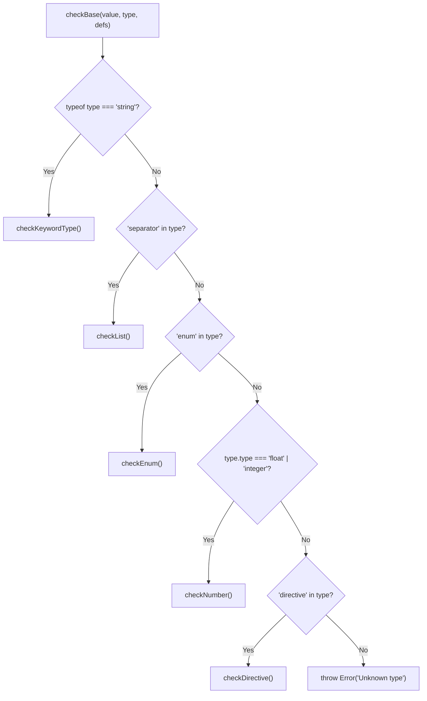
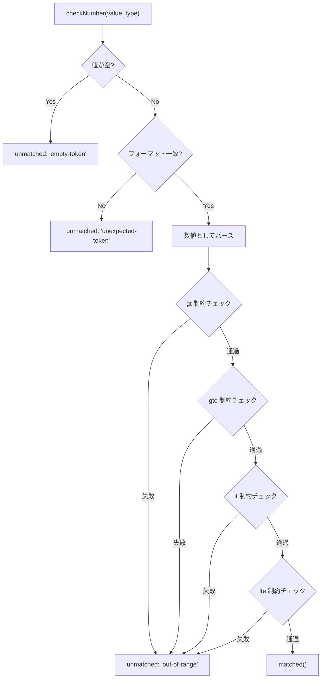
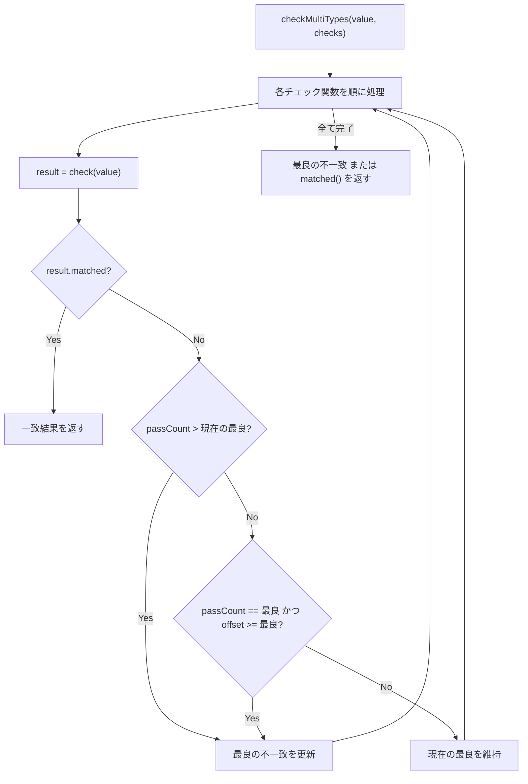
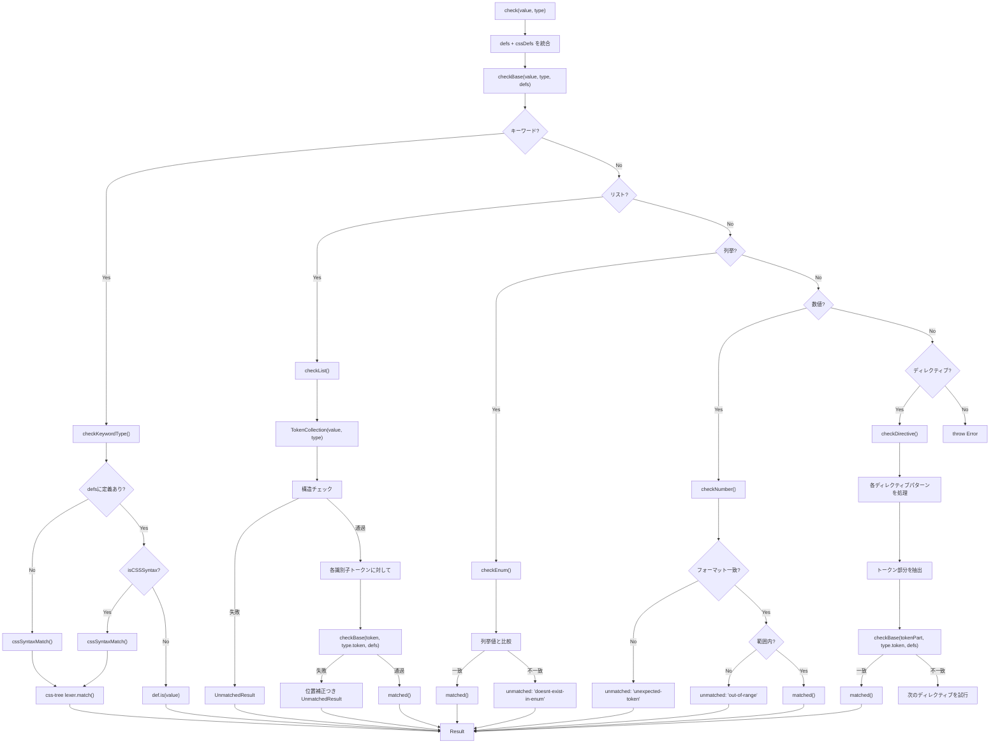

# チェックパイプライン

## 概要

`@markuplint/types` パッケージは、HTML属性値の型バリデーションパイプラインを提供します。文字列値と型定義を受け取り、その値が期待される型に適合するかどうかを判定します。結果として、成功（一致）もしくは、不一致箇所の位置情報・理由コード・修正候補を含む詳細なエラーレポートを返します。

パイプラインが対応する型定義は5種類あります:

| カテゴリ             | 説明                                           | 例                                        |
| -------------------- | ---------------------------------------------- | ----------------------------------------- |
| **キーワード型**     | 定義レジストリから名前で解決される型           | `"URL"`, `"<color>"`, `"BCP47"`           |
| **リスト型**         | 空白区切りまたはカンマ区切りのトークン列       | `{ separator: "comma", token: "URL" }`    |
| **列挙型**           | 許可された文字列の固定集合                     | `{ enum: ["auto", "lazy", "eager"] }`     |
| **数値型**           | 整数・浮動小数点数と範囲制約                   | `{ type: "integer", gte: 0 }`             |
| **ディレクティブ型** | プレフィックスパターンとトークン値の組み合わせ | `{ directive: ["/path/"], token: "URL" }` |

## エントリポイント: `check()`

**ソース:** `src/check.ts`

`check()` 関数は、パッケージにおける型バリデーションの主要エントリポイントです。文字列値と型定義を受け取り、HTML定義とCSS定義を統合した定義レジストリと共にコアディスパッチャーへ処理を委譲します。

```typescript
// src/check.ts
export function check(value: string, type: ReadonlyDeep<Type>, ref?: string, cache = true): Result {
  return checkBase(value, type, { ...defs, ...cssDefs }, ref, cache);
}
```

**パラメータ:**

| パラメータ | 型        | 説明                                               |
| ---------- | --------- | -------------------------------------------------- |
| `value`    | `string`  | バリデーション対象の属性値                         |
| `type`     | `Type`    | バリデーションに使用する型定義                     |
| `ref`      | `string?` | エラー報告に使用する参照URL（省略可）              |
| `cache`    | `boolean` | キャッシュを使用するかどうか（デフォルト: `true`） |

**戻り値:** `Result` 型（判別可能なユニオン型）:

- `MatchedResult` -- `{ matched: true }`
- `UnmatchedResult` -- `{ matched: false, raw, offset, length, line, column, reason, ref, ... }`

## ディスパッチロジック: `checkBase()`

**ソース:** `src/check-base.ts`

`checkBase()` 関数は、型定義の構造を検査して適切なチェッカーへルーティングします。型の判別には一連の型ガード関数が使われます:

```typescript
// src/check-base.ts
export function checkBase(value: string, type: ReadonlyDeep<Type>, defs: Defs, ref?: string, cache = true): Result {
  if (isKeyword(type)) return checkKeywordType(value, type, defs, cache);
  if (isList(type)) return checkList(value, type, defs, ref, cache);
  if (isEnum(type)) return checkEnum(value, type, ref);
  if (isNumber(type)) return checkNumber(value, type, ref);
  if (isDirective(type)) return checkDirective(value, type, defs, ref, cache);
  throw new Error('Unknown type');
}
```

### 型ガードの判定表

| ガード関数    | 判定条件                                         | 呼び出されるチェッカー |
| ------------- | ------------------------------------------------ | ---------------------- |
| `isKeyword`   | `typeof type === 'string'`                       | `checkKeywordType`     |
| `isList`      | `separator` プロパティを持つオブジェクト         | `checkList`            |
| `isEnum`      | `enum` プロパティを持つオブジェクト              | `checkEnum`            |
| `isNumber`    | `type` プロパティが `'float'` または `'integer'` | `checkNumber`          |
| `isDirective` | `directive` プロパティを持つオブジェクト         | `checkDirective`       |

### ディスパッチフローチャート



## 各チェッカーの詳細

### `checkEnum()`

**ソース:** `src/enum.ts`

許可された文字列の集合に対して値を検証します。

```typescript
// src/enum.ts
export function checkEnum(value: string, type: ReadonlyDeep<Enum>, ref?: string): Result;
```

**動作の流れ:**

1. デフォルトでは、前後の空白は**許可されません**（`disallowToSurroundBySpaces` のデフォルト値は `true`）。許可されている場合はトリムされます。
2. デフォルトでは、比較は**大文字小文字を区別しません**（`caseInsensitive` のデフォルト値は `true`）。値と列挙値の両方を小文字に変換してから比較します。
3. いずれかの列挙値に一致すれば `matched()` を返します。
4. 一致しなければ、理由 `'doesnt-exist-in-enum'` と共に、期待される値のリスト全体を含む `unmatched()` を返します。

**型定義の例:**

```json
{
  "enum": ["auto", "lazy", "eager"],
  "caseInsensitive": true
}
```

### `checkList()`

**ソース:** `src/list.ts`

区切り文字で分割されたトークン列として値を検証します。各トークンはネストされた型定義に対してバリデーションされます。

```typescript
// src/list.ts
export function checkList(value: string, type: ReadonlyDeep<List>, defs: Defs, ref?: string, cache = true): Result;
```

**動作の流れ:**

1. リストの `separator`（`'space'` または `'comma'`）に基づいて、値を `TokenCollection` にパースします。
2. トークンコレクションに対して構造的なチェック（トークン数、重複、順序）を実行します。
3. 識別子トークンを取り出し、それぞれに対して `checkBase()` を再帰的に呼び出し、リストの `token` 型で検証します。
4. トークン単位で失敗した場合、`Token.shiftLocation()` を使ってエラーの offset/line/column を調整し、問題のあるトークンを正確に指し示します。

**リスト型のプロパティ:**

| プロパティ                   | 型                     | 説明                     |
| ---------------------------- | ---------------------- | ------------------------ |
| `separator`                  | `'space' \| 'comma'`   | トークンの区切り文字     |
| `token`                      | `ExtendedType \| Enum` | 各トークンの型定義       |
| `allowEmpty`                 | `boolean?`             | 空の値を許可するか       |
| `ordered`                    | `boolean?`             | トークンの順序が重要か   |
| `unique`                     | `boolean?`             | 重複トークンを禁止するか |
| `number`                     | `string \| object?`    | トークン数の制約         |
| `caseInsensitive`            | `boolean?`             | 大文字小文字の区別       |
| `disallowToSurroundBySpaces` | `boolean?`             | 前後の空白を許可するか   |

### `checkNumber()`

**ソース:** `src/number.ts`

数値型の値を範囲制約付きで検証します。

```typescript
// src/number.ts
export function checkNumber(value: string, type: Readonly<TypeNumber>, ref?: string): Result;
```

**動作の流れ:**

1. 値が空の場合は `'empty-token'` として不一致を返します。
2. `type.type` に応じて `isFloat()` または `isInt()` でフォーマットを検証します。
3. フォーマットが合致した場合、数値をパースして範囲制約をチェックします:
   - `gt` -- より大きい（厳密な不等式）
   - `gte` -- 以上
   - `lt` -- より小さい（厳密な不等式）
   - `lte` -- 以下
4. `clampable` が `true` の場合、範囲違反時に最も近い境界値を `candidate` として提案します。

**範囲チェックの流れ:**



### `checkDirective()`

**ソース:** `src/directive.ts`

プレフィックスパターン（ディレクティブ）とそれに続くトークン部分で構成される値を検証します。テンプレートの補間構文やURLスキームのプレフィックスなど、既知のプレフィックスの後に型付きの値が続く属性に使われます。

```typescript
// src/directive.ts
export function checkDirective(
  value: string,
  type: ReadonlyDeep<Directive>,
  defs: Defs,
  ref?: string,
  cache = true,
): Result;
```

**動作の流れ:**

1. `type.directive` 内の各ディレクティブパターンを順に処理します。
2. 各パターンは**プレーンな文字列**プレフィックスまたは**正規表現**（`regexParser()` でパース）のいずれかです。
   - 正規表現: 値に対して実行し、名前付きグループ `token` またはキャプチャグループ `[1]` からトークン部分を抽出します。
   - 文字列: 値がディレクティブで始まるか確認し、プレフィックスを除去します。
3. 抽出されたトークン部分を `checkBase()` で `type.token` に対して検証します。
4. 最初に成功したマッチを返すか、全ディレクティブが失敗した場合は最初の不一致結果を返します。

### `checkKeywordType()`

**ソース:** `src/keyword-type.ts`

キーワード型名を定義レジストリから解決し、値を検証します。カスタムのプログラム的バリデータとCSSシンタックスマッチングの両方への入口となります。

```typescript
// src/keyword-type.ts
export function checkKeywordType(value: string, type: KeywordDefinedType, defs: Defs, cache = true): Result;
```

**動作の流れ:**

1. **キャッシュ確認:** キャッシュが有効な場合、`value + type` をキーとして過去の結果を検索します。
2. **定義の検索:** `defs` レジストリで `type` を検索します。
3. **定義が見つからない場合:** `cssSyntaxMatch(value, type)` にフォールバックします。CSSシンタックスマッチングが `MARKUPLINT_TYPE_NO_EXIST` をスローした場合、値は寛容に受け入れられます（`matched()` を返す）。
4. **定義が見つかった場合:** 定義がCSSシンタックスかカスタムシンタックスかを判別します:
   - **CSSシンタックス** (`isCSSSyntax`): `cssSyntaxMatch()` に委譲
   - **カスタムシンタックス** (`isCustomSyntax`): 定義の `is(value)` 関数を呼び出し
5. 不一致の場合、定義の `ref` と `expects` で結果を補完します。

```mermaid
flowchart TD
    A["checkKeywordType(value, type, defs)"] --> B{キャッシュあり?}
    B -->|Yes| C["キャッシュ結果を返す"]
    B -->|No| D{defsに型が存在?}
    D -->|No| E["cssSyntaxMatch(value, type)"]
    E --> F{MARKUPLINT_TYPE_NO_EXIST?}
    F -->|Yes| G["matched()"]
    F -->|No| H["CSS結果を返す"]
    D -->|Yes| I{isCSSSyntax(def)?}
    I -->|Yes| J["cssSyntaxMatch(value, def)"]
    I -->|No| K["def.is(value)"]
    J --> L{一致?}
    K --> L
    L -->|Yes| M["matched を返す"]
    L -->|No| N["ref/expects を補完して unmatched を返す"]
```

## CSSシンタックスマッチング

**ソース:** `src/css-syntax.ts`

`cssSyntaxMatch()` 関数は、[css-tree](https://github.com/csstree/csstree) ライブラリを利用して、CSSバリューの定義構文に対して値を検証します。

```typescript
// src/css-syntax.ts
export function cssSyntaxMatch(value: string, type: CssSyntax | CustomCssSyntax): Result;
```

### 処理の仕組み

1. **設定:** `type` がプレーンな文字列か `CustomCssSyntax` オブジェクトかに応じて処理が分岐します:
   - **文字列:** CSSの型名やプロパティ名として直接使用（例: `"<color>"`）
   - **オブジェクト:** `syntax.apply` を定義名、`syntax.def` を拡張型・カスタムトークナイザ、`syntax.properties` をCSSプロパティ拡張として取り出す

2. **レキサー生成:** 以下を統合した、フォーク版 css-tree レキサーを生成します:
   - **CSSオーバーライド** (`css-overrides.ts`): transform関数やレガシーSVG型の代替構文
   - **拡張型定義:** カスタムシンタックス定義からマージされたもの
   - **カスタムトークナイザ** (`css-tokenizers.ts`): BCP-47言語タグなど、プログラム的なトークンレベルのマッチャー

3. **名前の検出:** 定義がCSSプロパティ（例: `<'color'>`）かCSS型（例: `<color>`）かを判定し、適切なマッチャーを設定します。

4. **大文字小文字の区別:** `caseSensitive` が `true` の場合、大文字をミミックタグで包むことで、通常は大文字小文字を区別しない css-tree でのマッチング中にケースを保持します。

5. **マッチング実行:** `lexer.match(defName, value)` を呼び出します。エラーがなければ `matched()` を返します。`var()` 関数が検出された場合も `matched()` を返します（css-treeの既知の制限）。

6. **エラーハンドリング:** 不一致の場合、`SyntaxMatchError` から位置情報を抽出し、CSSシンタックスの期待値を含む `UnmatchedResult` を返します。

### CSSオーバーライド

**ソース:** `src/css-overrides.ts`

SVG属性のバリデーションをサポートするため、CSS transform関数の代替構文を提供します:

```typescript
export const cssOverrides: Record<string, string> = {
  'legacy-length-percentage': '<length> | <percentage> | <svg-length>',
  'legacy-angle': '<angle> | <zero> | <number>',
  'translate()': 'translate( <legacy-length-percentage> , ... )',
  'scale()': 'scale( [ <number> | <percentage> ]#{1,2} )',
  'rotate()': 'rotate( <legacy-angle> )',
  'skew()': 'skew( <legacy-angle> , <legacy-angle>? ) | ...',
};
```

### カスタムトークナイザ

**ソース:** `src/css-tokenizers.ts`

カスタムパースが必要な型に対して、トークンレベルのマッチャーを提供します:

```typescript
export const cssTokenizers: Record<string, CssSyntaxTokenizer> = {
  'bcp-47'(token) {
    if (!token) return 0;
    return isBCP47()(token.value) ? 1 : 0;
  },
};
```

## マルチタイプチェック

**ソース:** `src/check-multi-types.ts`

`checkMultiTypes()` 関数は、ひとつの値に対して複数の型チェッカー関数を順に試行し、最初に一致した結果か、最も有益な失敗結果を返します。

```typescript
// src/check-multi-types.ts
export function checkMultiTypes(value: string, checks: readonly CustomSyntaxCheck[]): Result;
```

**動作の流れ:**

1. チェック関数を順番に実行します。
2. いずれかのチェックが `matched` を返した時点で、その結果を即座に返します。
3. すべてのチェックが失敗した場合、以下のヒューリスティックで「最良の」不一致結果を選定します:
   - `passCount`（失敗前に通過したサブチェックの数）がより多い結果を優先
   - `passCount` が同じ場合、`offset`（値の中でより後方で失敗した）がより大きい結果を優先
4. チェック関数が提供されなかった場合、フォールバックとして `matched()` を返します。



**使用例**（`defs.ts` の `ItemProp` 型より）:

```typescript
is(value) {
  return checkMultiTypes(value, [
    value => (isAbsURL()(value) ? matched() : unmatched(value, 'unexpected-token')),
    value => (isItempropName()(value) ? matched() : unmatched(value, 'unexpected-token')),
  ]);
}
```

## 修正候補の提案

**ソース:** `src/get-candidate.ts`

`getCandidate()` 関数は、[レーベンシュタイン距離](https://ja.wikipedia.org/wiki/%E3%83%AC%E3%83%BC%E3%83%99%E3%83%B3%E3%82%B7%E3%83%A5%E3%82%BF%E3%82%A4%E3%83%B3%E8%B7%9D%E9%9B%A2)（`leven` ライブラリ経由）を用いて、候補文字列の中から最も近い一致を見つけます。

```typescript
// src/get-candidate.ts
export function getCandidate(
  value: NullableString,
  ...candidates: readonly (NullableString | readonly NullableString[])[]
): string | undefined;
```

**アルゴリズム:**

1. 候補の配列を2階層まで平坦化し、null/undefined を除外します。
2. 各候補に対して類似度を算出: `ratio = 1 - levenshtein(value, candidate) / candidate.length`
3. 値と候補の両方を小文字化・トリムしてから比較します。
4. **閾値:** `ratio >= 0.5`（50%以上の類似度）を持つ候補のみが対象です。
5. 最も高い ratio を持つ候補を返します。閾値を満たすものがなければ `undefined` を返します。
6. 値が候補と完全一致する場合は `undefined` を返します（提案は不要）。

**使用場面:** `getCandidate()` は、特定の型バリデータ（例: `NavigableTargetNameOrKeyword`）でタイプミスの修正候補を提案する際に呼び出されます。たとえば `_blank` のスペルミスに対して正しい値を提案するといった用途です。

## パイプライン全体図

エントリポイントから結果出力までのパイプライン全体を以下の図で示します:



## 型定義レジストリ

**ソース:** `src/defs.ts`, `src/css-defs.ts`

型定義レジストリ（`Defs`）は、型名の文字列から `CustomSyntax` または `CustomCssSyntax` オブジェクトへのマップです。エントリポイントでは2つのレジストリが統合されます:

| レジストリ | ソース            | 内容                                                                                                   |
| ---------- | ----------------- | ------------------------------------------------------------------------------------------------------ |
| `defs`     | `src/defs.ts`     | HTML属性型: `Any`, `URL`, `Number`, `DOMID`, `DateTime`, `BCP47`, `MIMEType`, `CustomElementName` など |
| `cssDefs`  | `src/css-defs.ts` | CSS/SVG型: `<css-declaration-list>`, `<view-box>`, `<preserve-aspect-ratio>`, `<dasharray>` など       |

各定義は以下の2つの形式のいずれかです:

**カスタムシンタックス**（プログラム的チェッカー）:

```typescript
{
  ref: 'https://...',
  expects: [{ type: 'format', value: 'date time' }],
  is: (value: string) => Result
}
```

**CSSシンタックス**（css-tree 文法）:

```typescript
{
  ref: 'https://...',
  syntax: {
    apply: '<view-box>',
    def: {
      'view-box': '<min-x> [,]? <min-y> [,]? <width> [,]? <height>',
      'min-x': '<number>',
      // ...
    }
  }
}
```
