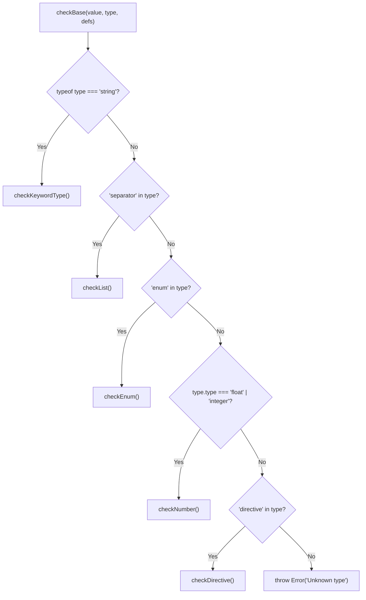
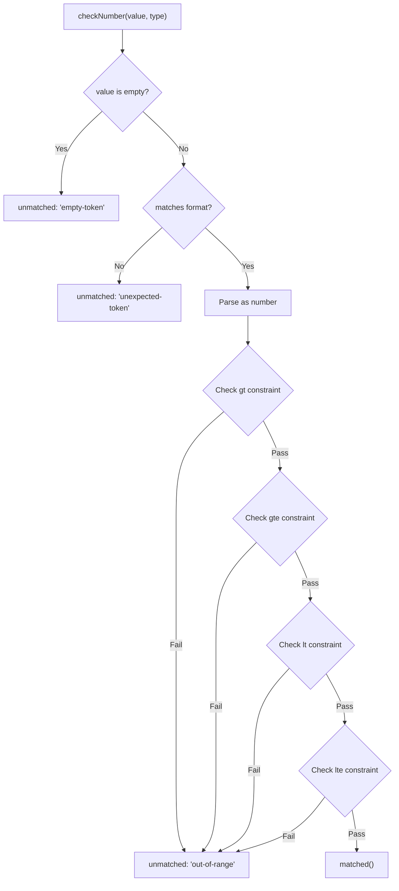
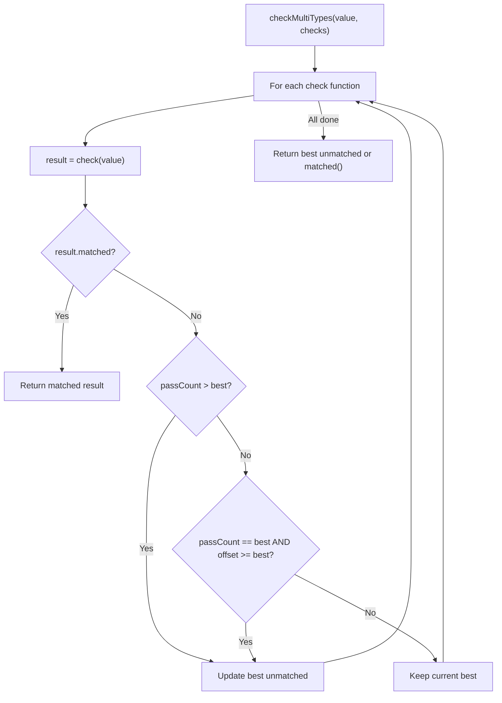
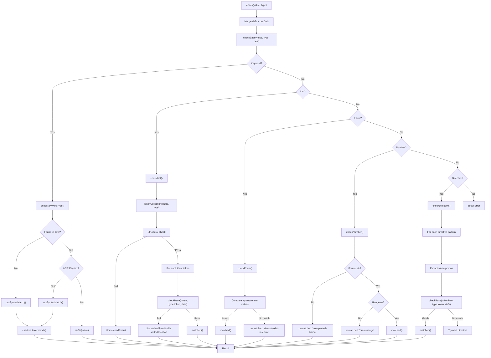

# Check Pipeline

## Overview

The `@markuplint/types` package provides a type validation pipeline for HTML attribute values. Given a string value and a type definition, the pipeline determines whether the value conforms to the expected type, returning either a successful match or a detailed mismatch report with location information, reason codes, and suggested corrections.

The pipeline supports five categories of type definitions:

| Category      | Description                                        | Example                                   |
| ------------- | -------------------------------------------------- | ----------------------------------------- |
| **Keyword**   | Named types resolved via a definitions registry    | `"URL"`, `"<color>"`, `"BCP47"`           |
| **List**      | Space-separated or comma-separated token sequences | `{ separator: "comma", token: "URL" }`    |
| **Enum**      | Fixed set of allowed string values                 | `{ enum: ["auto", "lazy", "eager"] }`     |
| **Number**    | Integer or float with optional range constraints   | `{ type: "integer", gte: 0 }`             |
| **Directive** | Prefix-pattern followed by a token value           | `{ directive: ["/path/"], token: "URL" }` |

## Entry Point: `check()`

**Source:** `src/check.ts`

The `check()` function is the primary entry point for all type validation in the package. It accepts a string value and a type definition, then delegates to the core dispatcher with the combined HTML and CSS definition registries.

```typescript
// src/check.ts
export function check(value: string, type: ReadonlyDeep<Type>, ref?: string, cache = true): Result {
  return checkBase(value, type, { ...defs, ...cssDefs }, ref, cache);
}
```

**Parameters:**

| Parameter | Type      | Description                                     |
| --------- | --------- | ----------------------------------------------- |
| `value`   | `string`  | The attribute value to validate                 |
| `type`    | `Type`    | The type definition to validate against         |
| `ref`     | `string?` | Optional reference URL for error context        |
| `cache`   | `boolean` | Whether to use cached results (default: `true`) |

**Return value:** A `Result` type, which is a discriminated union:

- `MatchedResult` -- `{ matched: true }`
- `UnmatchedResult` -- `{ matched: false, raw, offset, length, line, column, reason, ref, ... }`

## Dispatch Logic: `checkBase()`

**Source:** `src/check-base.ts`

The `checkBase()` function inspects the shape of the type definition and routes to the appropriate checker. The type discrimination uses a series of type guard functions:

```typescript
// src/check-base.ts
export function checkBase(value: string, type: ReadonlyDeep<Type>, defs: Defs, ref?: string, cache = true): Result {
  if (isKeyword(type)) return checkKeywordType(value, type, defs, cache);
  if (isList(type)) return checkList(value, type, defs, ref, cache);
  if (isEnum(type)) return checkEnum(value, type, ref);
  if (isNumber(type)) return checkNumber(value, type, ref);
  if (isDirective(type)) return checkDirective(value, type, defs, ref, cache);
  throw new Error('Unknown type');
}
```

### Type Guard Decision Table

| Guard         | Condition                                            | Resulting Checker  |
| ------------- | ---------------------------------------------------- | ------------------ |
| `isKeyword`   | `typeof type === 'string'`                           | `checkKeywordType` |
| `isList`      | object with `separator` property                     | `checkList`        |
| `isEnum`      | object with `enum` property                          | `checkEnum`        |
| `isNumber`    | object with `type` equal to `'float'` or `'integer'` | `checkNumber`      |
| `isDirective` | object with `directive` property                     | `checkDirective`   |

### Dispatch Flowchart



## Individual Checkers

### `checkEnum()`

**Source:** `src/enum.ts`

Validates a value against a fixed set of allowed strings.

```typescript
// src/enum.ts
export function checkEnum(value: string, type: ReadonlyDeep<Enum>, ref?: string): Result;
```

**Behavior:**

1. By default, surrounding spaces are **disallowed** (`disallowToSurroundBySpaces` defaults to `true`). If allowed, the value is trimmed.
2. By default, comparison is **case-insensitive** (`caseInsensitive` defaults to `true`). Both the value and enum entries are lowercased before comparison.
3. If the value matches an entry, returns `matched()`.
4. Otherwise, returns `unmatched()` with reason `'doesnt-exist-in-enum'` and the full list of expected values.

**Example type definition:**

```json
{
  "enum": ["auto", "lazy", "eager"],
  "caseInsensitive": true
}
```

### `checkList()`

**Source:** `src/list.ts`

Validates a value as a separated list of tokens, where each token is validated against a nested type definition.

```typescript
// src/list.ts
export function checkList(value: string, type: ReadonlyDeep<List>, defs: Defs, ref?: string, cache = true): Result;
```

**Behavior:**

1. Parses the value into a `TokenCollection` based on the list's `separator` (`'space'` or `'comma'`).
2. Performs structural checks on the token collection (token count, uniqueness, ordering).
3. Extracts identifier tokens and validates each one by recursively calling `checkBase()` with the list's `token` type.
4. On per-token failure, adjusts the error offset/line/column using `Token.shiftLocation()` to point to the exact failing token.

**List type properties:**

| Property                     | Type                   | Description                             |
| ---------------------------- | ---------------------- | --------------------------------------- |
| `separator`                  | `'space' \| 'comma'`   | Token separator                         |
| `token`                      | `ExtendedType \| Enum` | Type definition for each token          |
| `allowEmpty`                 | `boolean?`             | Whether an empty value is valid         |
| `ordered`                    | `boolean?`             | Whether token order matters             |
| `unique`                     | `boolean?`             | Whether duplicate tokens are disallowed |
| `number`                     | `string \| object?`    | Constraints on the number of tokens     |
| `caseInsensitive`            | `boolean?`             | Case sensitivity for token comparison   |
| `disallowToSurroundBySpaces` | `boolean?`             | Whether outer spaces are allowed        |

### `checkNumber()`

**Source:** `src/number.ts`

Validates a value as a numeric type with optional range constraints.

```typescript
// src/number.ts
export function checkNumber(value: string, type: Readonly<TypeNumber>, ref?: string): Result;
```

**Behavior:**

1. Returns `unmatched` with `'empty-token'` if the value is empty.
2. Tests the value's format using `isFloat()` or `isInt()` based on `type.type`.
3. If the format matches, parses the number and checks range constraints:
   - `gt` -- value must be strictly greater than
   - `gte` -- value must be greater than or equal to
   - `lt` -- value must be strictly less than
   - `lte` -- value must be less than or equal to
4. When `clampable` is `true` and a range violation occurs, suggests the nearest boundary value as a `candidate`.

**Range check flow:**



### `checkDirective()`

**Source:** `src/directive.ts`

Validates a value that consists of a prefix pattern (directive) followed by a token portion. Directives are used for attribute values where a known prefix leads into a typed value (for example, an interpolation syntax or a URL scheme prefix).

```typescript
// src/directive.ts
export function checkDirective(
  value: string,
  type: ReadonlyDeep<Directive>,
  defs: Defs,
  ref?: string,
  cache = true,
): Result;
```

**Behavior:**

1. Iterates through each directive pattern in `type.directive`.
2. Each pattern can be either a **plain string** prefix or a **regex** (parsed by `regexParser()`).
   - For regex patterns: executes against the value, extracting the token from a named group `token` or capture group `[1]`.
   - For string patterns: checks if the value starts with the directive, then slices off the prefix.
3. The extracted token portion is validated via `checkBase()` with `type.token`.
4. Returns the first successful match, or the first unmatched result if all directives fail.

### `checkKeywordType()`

**Source:** `src/keyword-type.ts`

Resolves a keyword type name through the definitions registry and validates the value accordingly. This is the gateway to both custom programmatic validators and CSS syntax matching.

```typescript
// src/keyword-type.ts
export function checkKeywordType(value: string, type: KeywordDefinedType, defs: Defs, cache = true): Result;
```

**Behavior:**

1. **Cache lookup:** If caching is enabled, checks for a previously computed result using the key `value + type`.
2. **Definition lookup:** Searches for `type` in the `defs` registry.
3. **If the type is not found in `defs`:** Falls back to `cssSyntaxMatch(value, type)`. If CSS syntax matching throws `MARKUPLINT_TYPE_NO_EXIST`, the value is permissively accepted (returns `matched()`).
4. **If the type is found:** Determines whether the definition is a CSS syntax definition or a custom syntax definition:
   - **CSS syntax** (`isCSSSyntax`): Delegates to `cssSyntaxMatch()`.
   - **Custom syntax** (`isCustomSyntax`): Calls the definition's `is(value)` function.
5. On mismatch, enriches the result with the definition's `ref` and `expects` if not already set.

```mermaid
flowchart TD
    A["checkKeywordType(value, type, defs)"] --> B{Cached?}
    B -->|Yes| C["Return cached result"]
    B -->|No| D{type in defs?}
    D -->|No| E["cssSyntaxMatch(value, type)"]
    E --> F{MARKUPLINT_TYPE_NO_EXIST?}
    F -->|Yes| G["matched()"]
    F -->|No| H["Return CSS result"]
    D -->|Yes| I{isCSSSyntax(def)?}
    I -->|Yes| J["cssSyntaxMatch(value, def)"]
    I -->|No| K["def.is(value)"]
    J --> L{matched?}
    K --> L
    L -->|Yes| M["Return matched"]
    L -->|No| N["Enrich with ref/expects, return unmatched"]
```

## CSS Syntax Matching

**Source:** `src/css-syntax.ts`

The `cssSyntaxMatch()` function validates values against CSS value definition syntax using the [css-tree](https://github.com/csstree/csstree) library.

```typescript
// src/css-syntax.ts
export function cssSyntaxMatch(value: string, type: CssSyntax | CustomCssSyntax): Result;
```

### How It Works

1. **Configuration:** Depending on whether `type` is a plain string or a `CustomCssSyntax` object:
   - **String:** Used directly as a CSS type or property name (e.g., `"<color>"`).
   - **Object:** Extracts `syntax.apply` as the definition name, `syntax.def` for extended types and custom tokenizers, and `syntax.properties` for CSS property extensions.

2. **Lexer creation:** Creates a forked css-tree lexer with:
   - **CSS overrides** (`css-overrides.ts`): Alternative syntax for transform functions and legacy SVG types.
   - **Extended type definitions:** Merged from the custom syntax definition.
   - **Custom tokenizers** (`css-tokenizers.ts`): Programmatic token-level matchers (e.g., BCP-47 language tags).

3. **Name detection:** Determines whether the definition is a CSS property (e.g., `<'color'>`) or a CSS type (e.g., `<color>`) and sets up the appropriate matcher.

4. **Case sensitivity:** When `caseSensitive` is `true`, uppercase letters are wrapped in mimic tags to preserve case during css-tree matching (which is normally case-insensitive).

5. **Matching:** Calls `lexer.match(defName, value)`. If no error, returns `matched()`. If a `var()` function is encountered, returns `matched()` (known css-tree limitation).

6. **Error handling:** On mismatch, extracts position information from the `SyntaxMatchError` and returns an `UnmatchedResult` with the CSS syntax expectation.

### CSS Overrides

**Source:** `src/css-overrides.ts`

Provides alternative syntax definitions for CSS transform functions to support SVG attribute validation:

```typescript
export const cssOverrides: Record<string, string> = {
  'legacy-length-percentage': '<length> | <percentage> | <svg-length>',
  'legacy-angle': '<angle> | <zero> | <number>',
  'translate()': 'translate( <legacy-length-percentage> , ... )',
  'scale()': 'scale( [ <number> | <percentage> ]#{1,2} )',
  'rotate()': 'rotate( <legacy-angle> )',
  'skew()': 'skew( <legacy-angle> , <legacy-angle>? ) | ...',
};
```

### Custom Tokenizers

**Source:** `src/css-tokenizers.ts`

Provides token-level matchers for types that require custom parsing:

```typescript
export const cssTokenizers: Record<string, CssSyntaxTokenizer> = {
  'bcp-47'(token) {
    if (!token) return 0;
    return isBCP47()(token.value) ? 1 : 0;
  },
};
```

## Multi-Type Checking

**Source:** `src/check-multi-types.ts`

The `checkMultiTypes()` function tries multiple type checker functions against a single value, returning the first match or the best failure.

```typescript
// src/check-multi-types.ts
export function checkMultiTypes(value: string, checks: readonly CustomSyntaxCheck[]): Result;
```

**Behavior:**

1. Iterates through each check function in order.
2. If a check returns `matched`, immediately returns that result.
3. If no check matches, selects the "best" unmatched result using the following heuristic:
   - Prefers the result with the higher `passCount` (more sub-checks passed before failing).
   - On equal `passCount`, prefers the result with the greater `offset` (the failure occurred later in the value string).
4. If no checks were provided, returns `matched()` as a fallback.



**Usage example** (from `defs.ts`, `ItemProp` type):

```typescript
is(value) {
  return checkMultiTypes(value, [
    value => (isAbsURL()(value) ? matched() : unmatched(value, 'unexpected-token')),
    value => (isItempropName()(value) ? matched() : unmatched(value, 'unexpected-token')),
  ]);
}
```

## Candidate Suggestion

**Source:** `src/get-candidate.ts`

The `getCandidate()` function finds the closest matching string from a set of candidates using [Levenshtein distance](https://en.wikipedia.org/wiki/Levenshtein_distance) (via the `leven` library).

```typescript
// src/get-candidate.ts
export function getCandidate(
  value: NullableString,
  ...candidates: readonly (NullableString | readonly NullableString[])[]
): string | undefined;
```

**Algorithm:**

1. Flattens the candidate arrays (up to 2 levels deep) and filters out null/undefined entries.
2. For each candidate, computes the similarity ratio: `ratio = 1 - levenshtein(value, candidate) / candidate.length`.
3. Both value and candidate are lowercased and trimmed before comparison.
4. **Threshold:** Only candidates with `ratio >= 0.5` (at least 50% similar) are considered.
5. Returns the candidate with the highest ratio, or `undefined` if none meets the threshold.
6. If the value exactly matches a candidate, returns `undefined` (no suggestion needed).

**Usage context:** `getCandidate()` is called in specific type validators (e.g., `NavigableTargetNameOrKeyword`) to suggest corrections for typos in attribute values (e.g., a misspelled `_blank`).

## Complete Flow Diagram

The following diagram shows the full pipeline from entry point to result:



## Type Definitions Registry

**Source:** `src/defs.ts`, `src/css-defs.ts`

The definitions registry (`Defs`) is a map from type name strings to either `CustomSyntax` or `CustomCssSyntax` objects. There are two registries that are merged at the entry point:

| Registry  | Source            | Contents                                                                                                          |
| --------- | ----------------- | ----------------------------------------------------------------------------------------------------------------- |
| `defs`    | `src/defs.ts`     | HTML attribute types: `Any`, `URL`, `Number`, `DOMID`, `DateTime`, `BCP47`, `MIMEType`, `CustomElementName`, etc. |
| `cssDefs` | `src/css-defs.ts` | CSS/SVG types: `<css-declaration-list>`, `<view-box>`, `<preserve-aspect-ratio>`, `<dasharray>`, etc.             |

Each definition is one of two forms:

**Custom syntax** (programmatic checker):

```typescript
{
  ref: 'https://...',
  expects: [{ type: 'format', value: 'date time' }],
  is: (value: string) => Result
}
```

**CSS syntax** (css-tree grammar):

```typescript
{
  ref: 'https://...',
  syntax: {
    apply: '<view-box>',
    def: {
      'view-box': '<min-x> [,]? <min-y> [,]? <width> [,]? <height>',
      'min-x': '<number>',
      // ...
    }
  }
}
```
