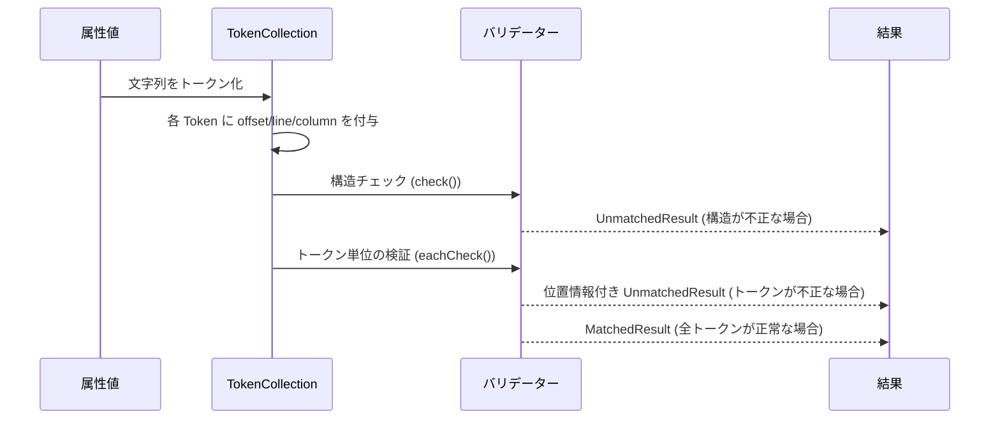
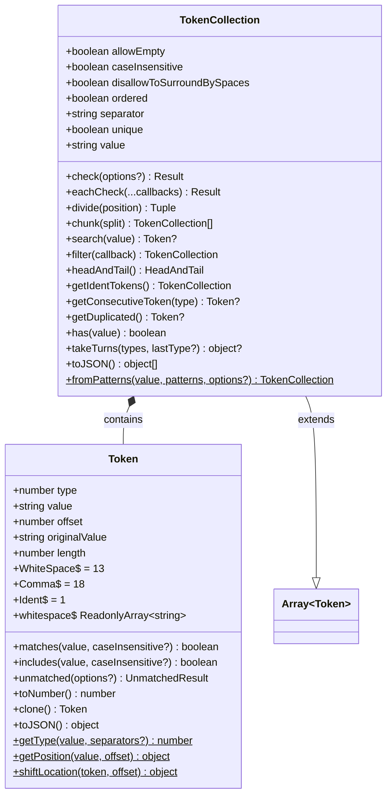
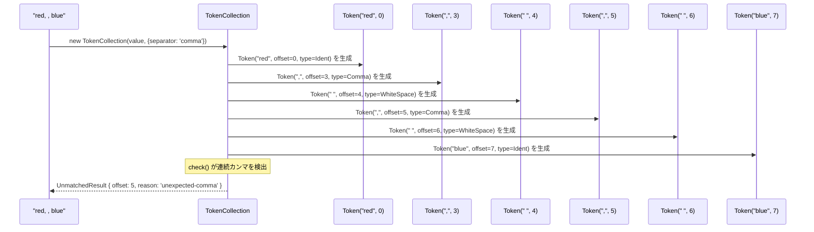
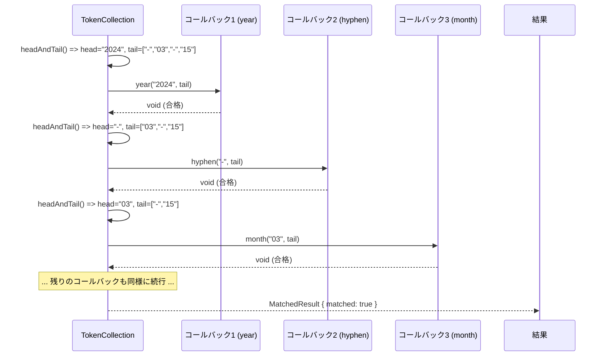

# トークンシステム

## 概要

`@markuplint/types` パッケージのトークンシステムは、HTML属性値の**位置追跡付きバリデーション**を実現するための基盤です。markuplint が datetime 文字列やカラーコード、カンマ区切りリストなどの構造化された属性値を検証する際、エラーが発生した**正確な文字位置**を報告する必要があります。

### 解決する課題

たとえば、属性値 `"red, , blue"` をカンマ区切りリストとしてバリデーションする場面を考えてみましょう。単純なバリデーターであれば「値が不正です」と全体に対してエラーを報告するだけかもしれません。しかし、実際の問題はオフセット5にある2つ目のカンマ -- つまり空の要素が存在することです。トークンシステムでは、入力文字列を個々のトークンに分解し、それぞれにオフセット・行番号・列番号を持たせることで、バリデーション失敗時に正確な位置情報を含むエラーメッセージを生成できます。

### チェックパイプラインにおける位置づけ

属性値の検証は、以下の流れで行われます。

1. 属性値の文字列が型チェックパイプラインに渡される。
2. 文字列が**トークン化**され、`TokenCollection` が生成される（コンストラクタまたは `fromPatterns` による）。
3. コレクションの構造チェックが実行される（連続カンマや先頭セパレーターの検出など）。
4. 個々のトークンが `eachCheck` やトークン単位の型チェックで検証される。
5. いずれかのチェックが失敗すると、正確な `offset`・`line`・`column` を含む `UnmatchedResult` が返される。



## Token クラス

**ソースファイル:** `src/token/token.ts`

`Token` クラスは、文字列値をパースして得られる1つの断片を表します。各トークンは、自身の文字列値・型（空白、カンマ、識別子）・元の入力文字列内でのバイトオフセットを保持しています。

### 型番号

トークンの型は [csstree トークナイザー](https://github.com/csstree/csstree/blob/master/lib/tokenizer/types.js) に由来する数値定数です。

| 定数               | 値   | 説明                                                           |
| ------------------ | ---- | -------------------------------------------------------------- |
| `Token.Ident`      | `1`  | 識別子または一般的なコンテンツトークン                         |
| `Token.WhiteSpace` | `13` | 1つ以上の ASCII 空白文字                                       |
| `Token.Comma`      | `18` | カンマ文字（カンマがセパレーターとして設定されている場合のみ） |

型の判定は `Token.getType()` によって自動的に行われます。先頭文字が ASCII 空白であれば `WhiteSpace`、設定されたセパレーター（例: `,`）に一致すれば対応する型、それ以外は `Ident` となります。

### 静的プロパティ

#### `Token.whitespace`

[WHATWG Infra Standard](https://infra.spec.whatwg.org/#ascii-whitespace) で定義されている ASCII 空白文字の読み取り専用配列です。

```ts
static readonly whitespace: ReadonlyArray<string> = [
  '\u0009', // TAB
  '\u000A', // LF
  '\u000C', // FF
  '\u000D', // CR
  '\u0020', // SPACE
];
```

### 静的メソッド

#### `Token.getType(value, separators?)`

`value` の先頭文字からトークン型番号を判定します。

```ts
Token.getType(' hello'); // => 13 (WhiteSpace)
Token.getType(',', [',']); // => 18 (Comma)
Token.getType('blue'); // => 1  (Ident)
```

#### `Token.getPosition(value, offset)`

文字列内の指定オフセットにおける行番号と列番号（ともに1始まり）を算出します。

```ts
Token.getPosition('abc\ndef', 5);
// => { line: 2, column: 2 }
```

#### `Token.shiftLocation(token, offset)`

トークンの既存オフセットに `offset` を加算した新しい位置を計算します。元の文字列から行番号・列番号を再計算するため、トークンの値の**途中**で発生したエラーの位置特定に使われます。

```ts
// offset 10 にあるトークンの場合:
Token.shiftLocation(token, 3);
// => { offset: 13, line: ..., column: ... }
```

### コンストラクタ

```ts
new Token(value: string, offset: number, originalValue: string, separators?: readonly string[])
```

| 引数            | 説明                                         |
| --------------- | -------------------------------------------- |
| `value`         | トークンの文字列内容                         |
| `offset`        | 元の文字列内でのオフセット位置               |
| `originalValue` | トークンの抽出元となった完全な元の文字列     |
| `separators`    | 型判定に使用するセパレーター文字（省略可能） |

### インスタンスプロパティ

| プロパティ      | 型       | 説明                                         |
| --------------- | -------- | -------------------------------------------- |
| `value`         | `string` | トークンの文字列内容                         |
| `type`          | `number` | トークン型（`Ident`、`WhiteSpace`、`Comma`） |
| `offset`        | `number` | 元の文字列内の0始まりオフセット              |
| `originalValue` | `string` | トークンのパース元となった完全な元の文字列   |
| `length`        | `number` | `value` の文字長（算出プロパティ）           |

### インスタンスメソッド

#### `matches(value, caseInsensitive?)`

トークンが指定値と**完全一致**するかを判定します。文字列（完全一致）、`RegExp`（テスト）、型番号（型チェック）、またはこれらの配列（論理OR）を受け取ります。

```ts
token.matches('red'); // 文字列の完全一致
token.matches(/^\d{4}$/); // 正規表現によるマッチ
token.matches(Token.WhiteSpace); // 型の一致
token.matches(['T', ' ']); // 'T' または ' ' のいずれか
```

#### `includes(value, caseInsensitive?)`

`matches` と同様ですが、文字列値の場合は完全一致ではなく部分文字列の包含（`String.includes`）で判定します。RegExp や型番号の場合は `matches` と同じ動作です。

#### `unmatched(options?)`

このトークンの位置情報を持つ `UnmatchedResult` を生成します。バリデーションエラーを正確な位置情報付きで生成するための主要な手段です。

```ts
token.unmatched({
  reason: 'unexpected-token',
  expects: [{ type: 'common', value: 'hyphen' }],
  partName: 'datetime',
});
// => { matched: false, raw: token.value, offset: token.offset, line: ..., column: ..., ... }
```

#### `toNumber()`

トークンの値を浮動小数点数としてパースします（パースに失敗した場合は `0` を返します）。

#### `clone()`

同じ値・オフセット・元の文字列を持つ新しい `Token` を返します。

#### `toJSON()`

`{ type, value, offset }` のプレーンオブジェクトを返します。シリアライズやテストのアサーションに適しています。

## TokenCollection

**ソースファイル:** `src/token/token-collection.ts`

`TokenCollection` は `Array<Token>` を拡張し、パース・構造バリデーション・検索機能を提供するクラスです。文字列値をトークン化する際の主要なエントリーポイントとなります。

### クラス図



### コレクションの生成

#### コンストラクタ: `new TokenCollection(value, options?)`

空白文字（およびオプションでカンマ）で分割して文字列をトークン化します。設定された `separator` モードに従ってトークン化が行われます。

```ts
// スペース区切り（デフォルト）
const tokens = new TokenCollection('red green blue');
// => [Token('red'), Token(' '), Token('green'), Token(' '), Token('blue')]

// カンマ区切り
const tokens = new TokenCollection('red, green, blue', { separator: 'comma' });
// => [Token('red'), Token(','), Token(' '), Token('green'), Token(','), Token(' '), Token('blue')]
```

**オプション** (`TokenCollectionOptions`):

| オプション                   | デフォルト | 説明                                           |
| ---------------------------- | ---------- | ---------------------------------------------- |
| `separator`                  | `'space'`  | セパレーターモード: `'space'` または `'comma'` |
| `allowEmpty`                 | `true`     | 空の値を許可するかどうか                       |
| `unique`                     | `false`    | 重複トークンを禁止するかどうか                 |
| `ordered`                    | `false`    | トークンの順序が意味を持つかどうか             |
| `caseInsensitive`            | `true`     | 比較時に大文字小文字を無視するかどうか         |
| `disallowToSurroundBySpaces` | `false`    | 値の前後の空白を禁止するかどうか               |
| `specificSeparator`          | --         | 追加のカスタムセパレーター文字                 |

#### 静的メソッド: `TokenCollection.fromPatterns(value, patterns, options?)`

正規表現パターンの列に対して文字列を順番にマッチングし、`TokenCollection` を生成します。各パターンは入力の一部を順に消費し、マッチしなかった残りは追加トークンになります。datetime 文字列のような構造化フォーマットのパースに主に使われます。

```ts
// タイムゾーンオフセット "+09:30" や "+0930" をパースする場合
const patterns = [/\+|-/, /\d{2}/, /:?/, /\d{2}/];

TokenCollection.fromPatterns('+09:30', patterns).map(t => t.value);
// => ['+', '09', ':', '30']

TokenCollection.fromPatterns('+0930', patterns).map(t => t.value);
// => ['+', '09', '', '30']
```

生成される各トークンには元の文字列からの累積オフセットが正しく設定されるため、パターンマッチングを経ても位置追跡が維持されます。

### 主要メソッド

#### `check(options?)`

トークンコレクションの**構造的な整合性**を設定に基づいて検証します。チェック内容は以下の通りです。

- 予期しない空白（非スペースセパレーターで `disallowToSurroundBySpaces` が設定されている場合）
- カンマ区切りリストにおける連続カンマ
- 先頭・末尾のカンマ
- 空の値（`allowEmpty` が `false` の場合）
- 重複する値（`unique` が `true` の場合）

```ts
const tokens = new TokenCollection('a,, b', { separator: 'comma' });
const result = tokens.check();
// result.matched === false
// result.reason === 'unexpected-comma'
// result.offset === 2  （2つ目のカンマを指す）
```

#### `eachCheck(...callbacks)`

構造化されたトークン列を順次検証するための主要メソッドです。詳しくは [eachCheck パターン](#eachcheck-パターン) のセクションを参照してください。

#### `divide(position)`

指定インデックスでコレクションを2つの `TokenCollection` に分割します。

```ts
const tokens = new TokenCollection('a b c');
const [before, after] = tokens.divide(2);
// before: [Token('a'), Token(' ')]
// after:  [Token('b'), Token(' '), Token('c')]
```

#### `chunk(split)`

コレクションを `split` 個ずつのトークングループに分割します。

```ts
const tokens = new TokenCollection('a b c d');
const chunks = tokens.chunk(2);
// chunks[0]: [Token('a'), Token(' ')]
// chunks[1]: [Token('b'), Token(' ')]
// chunks[2]: [Token('c'), Token(' ')]
// chunks[3]: [Token('d')]
```

#### `search(value)`

指定値を含む（`Token.includes` による）最初のトークンを返します。見つからない場合は `null` を返します。

```ts
tokens.search('red'); // "red" を含むトークンを検索
tokens.search(Token.Comma); // 最初のカンマトークンを検索
tokens.search(/^\d+$/); // 最初の数字のみのトークンを検索
```

#### `headAndTail()`

コレクションを先頭トークン（`head`）と残りのトークン（`tail`）に分割します。`{ head: Token | null, tail: TokenCollection }` を返します。これが `eachCheck` の反復処理を支える仕組みです。

#### `getIdentTokens()`

型が `Ident`（型番号 `1`）のトークンのみを含む新しい `TokenCollection` を返します。空白やセパレーターは除外されます。

#### `has(value)`

コレクション内のいずれかのトークンが指定値に一致する（`Token.matches` による）場合に `true` を返します。

#### `filter(callback)`

`Array.filter` をオーバーライドし、プレーンな配列ではなく `TokenCollection` を返します。コレクションの設定オプションは維持されます。

#### `getConsecutiveToken(tokenType)`

同じ型のトークンが連続している最初の箇所を検出します。ペアの2番目のトークンを返し、見つからない場合は `null` を返します。

#### `getDuplicated()`

コレクション内で最初に重複している値を検出します。`caseInsensitive` 設定を考慮します。重複トークンを返し、見つからない場合は `null` を返します。

#### `takeTurns(tokenNumbers, lastTokenNumber?)`

トークンが繰り返しの型パターンに従っているかを検証します。たとえば、カンマ区切りリストでは `[Ident, Comma]` パターンが繰り返され、最後は `Ident` で終わる必要があります。パターン違反があればエラーオブジェクトを返し、正常であれば `null` を返します。

### eachCheck パターン

`eachCheck` は、構造化されたトークン列を検証するための中心的なパターンです。トークンを1つずつ消費し、それぞれを対応するコールバック関数に渡します。datetime 文字列のように、各位置に固有の要件がある形式（位置0は年、位置1はハイフン、位置2は月、など）の検証に使われます。

**シグネチャ:**

```ts
eachCheck(...callbacks: readonly TokenEachCheck[]): Result
```

**`TokenEachCheck` コールバック型:**

```ts
type TokenEachCheck = (head: Readonly<Token> | null, tail: TokenCollection) => Result | void;
```

各コールバックが受け取るもの:

- `head` -- 検証対象の現在のトークン（トークンが尽きた場合は `null`）
- `tail` -- `head` の後に続く残りのトークン

コールバックの戻り値:

- `void` -- トークンは検証に合格。次のコールバックへ進む
- `matched: true` の `Result` -- 反復を停止し、成功を報告
- `matched: false` の `Result` -- エラーを記録し、残りのコールバックの検査を続行（最初のエラーが最終結果として保持される）

**内部の動作:**

1. `headAndTail()` によりコレクションが `head` と `tail` に分割される。
2. 最初のコールバックが先頭トークンと残りのコレクションを受け取る。
3. コールバックの戻り後、tail が再度分割され次のコールバックに渡される。
4. `passCount` スコアが累積され、競合するパース結果のランキングに使用される。
5. いずれかのコールバックが unmatched 結果を返した場合、それが記録される。最初の unmatched 結果が最終的なエラーとなる。
6. すべてのコールバックが `void` を返せば、全体の結果は `matched` となる。

**使用例 -- 日付文字列 `"2024-03-15"` の検証:**

```ts
// 出典: src/whatwg/check-datetime/date-string.ts
const tokens = TokenCollection.fromPatterns(value, [
  /[^-]*/, // YYYY
  /\D?/, // -
  /[^-]*/, // MM
  /\D/, // -
  /.\d*/, // DD
]);

const res = tokens.eachCheck(
  datetimeTokenCheck.year, // "2024" を検証
  datetimeTokenCheck.hyphen, // "-" を検証
  datetimeTokenCheck.month, // "03" を検証
  datetimeTokenCheck.hyphen, // "-" を検証
  datetimeTokenCheck.date, // "15" を検証
  datetimeTokenCheck.extra, // 末尾に余分な内容がないことを確認
);
```

各 `datetimeTokenCheck` 関数は、成功時に `void` を返し、失敗時に（`token.unmatched(...)` を使って）`UnmatchedResult` を返します。各トークンがオフセットを保持しているため、結果のエラーは元の文字列内の正確な位置を自動的に指し示します。

## 使用例

### DateTime バリデーター

**ソースファイル:**

- `src/whatwg/check-datetime/datetime-tokens.ts`
- `src/whatwg/check-datetime/date-string.ts`

datetime バリデーターは、構造化フォーマットを検証するためのトークンパイプライン全体を示しています。

**ステップ1: パターンによるトークン化**

入力文字列は `TokenCollection.fromPatterns` を使ってトークンに分割されます。各正規表現が datetime フォーマットの1つの構成要素をキャプチャします。

```ts
// src/whatwg/check-datetime/date-string.ts
const tokens = TokenCollection.fromPatterns(value, [
  /[^-]*/, // 最初のハイフンまでをキャプチャ（年）
  /\D?/, // 省略可能な非数字をキャプチャ（ハイフンセパレーター）
  /[^-]*/, // 2番目のハイフンまでをキャプチャ（月）
  /\D/, // 非数字をキャプチャ（ハイフンセパレーター）
  /.\d*/, // 残りの数字をキャプチャ（日）
]);
```

入力 `"2024-03-15"` の場合、以下のトークンが生成されます。

| インデックス | 値       | オフセット | 型    |
| ------------ | -------- | ---------- | ----- |
| 0            | `"2024"` | 0          | Ident |
| 1            | `"-"`    | 4          | Ident |
| 2            | `"03"`   | 5          | Ident |
| 3            | `"-"`    | 7          | Ident |
| 4            | `"15"`   | 8          | Ident |

**ステップ2: eachCheck による各トークンの検証**

各コールバックが WHATWG 仕様に基づいてトークンをチェックします。

```ts
const res = tokens.eachCheck(
  datetimeTokenCheck.year, // 4桁以上の数字、値 > 0
  datetimeTokenCheck.hyphen, // 正確に "-" であること
  datetimeTokenCheck.month, // 2桁の数字、1-12 の範囲
  datetimeTokenCheck.hyphen, // 正確に "-" であること
  datetimeTokenCheck.date, // 2桁の数字、1-maxday の範囲
  datetimeTokenCheck.extra, // 空であること（末尾に余分な内容がない）
);
```

**ステップ3: エラー位置の伝播**

入力が `"2024-13-15"`（月 `13` は不正）の場合、`month` コールバックは次のように呼び出します。

```ts
return month.unmatched({
  reason: { type: 'out-of-range', gte: 1, lte: 12 },
  expects: [],
  partName: 'month',
});
```

月のトークンは `offset: 5` を持っているため、結果の `UnmatchedResult` は `offset: 5`、`line: 1`、`column: 6` を持ち、元の文字列内の `"13"` を正確に指し示します。

### リストバリデーション

**ソースファイル:** `src/list.ts`

リストバリデーターは、`TokenCollection` がカンマ区切りやスペース区切りの属性値をどのように扱うかを示しています。

**ステップ1: 値からコレクションを生成**

```ts
// src/list.ts
const tokens = new TokenCollection(value, type);
```

`type` パラメーター（`List` 定義）がセパレーターモード、一意性、その他の制約を設定します。たとえば、`class="btn btn-primary btn"` を `{ separator: 'space', unique: true }` で検証する場合です。

**ステップ2: 構造チェック**

```ts
const matches = tokens.check({ ref });
```

リストの構造を検証します -- 連続カンマ、空の要素（禁止されている場合）、重複（`unique` が設定されている場合）。構造が不正であれば、正確な位置情報を含むエラーが即座に返されます。

**ステップ3: 個々の要素の検証**

```ts
const identTokens = tokens.getIdentTokens();

for (const token of identTokens) {
  const res = checkBase(token.value, type.token, defs, ref, cache);
  if (!res.matched) {
    const { offset, line, column } = Token.shiftLocation(token, res.offset);
    return {
      ...res,
      partName: res.partName ?? 'the content of the list',
      offset,
      line,
      column,
    };
  }
}
```

ポイント:

- `getIdentTokens()` が空白やセパレータートークンを除去し、実際の値だけを残す。
- 各識別子トークンが `checkBase` を使ってリストの `token` 型定義に対して検証される。
- トークンの検証に失敗した場合、`Token.shiftLocation` がエラーオフセットを個々のトークンではなく**元の文字列**に対する相対位置に調整する。これにより、完全な属性値内で正確な位置が報告される。

## 図解

### トークン化の流れ



### eachCheck バリデーションの流れ


