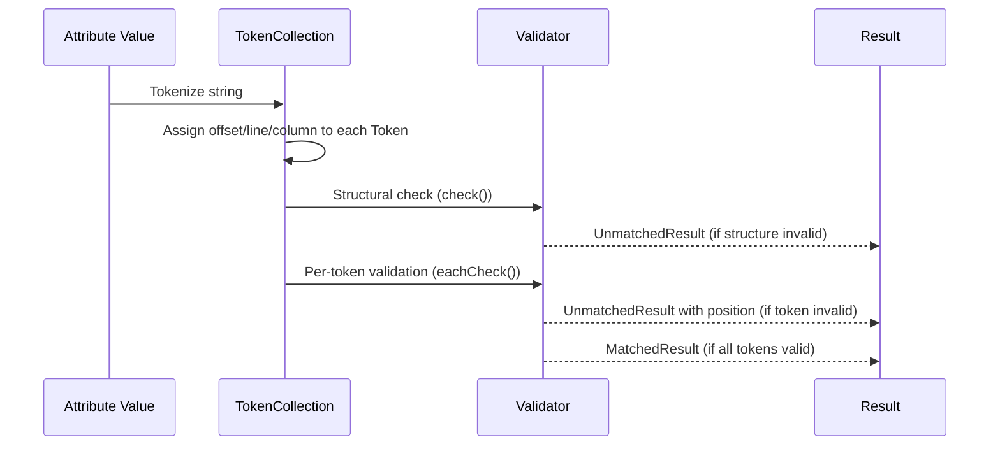
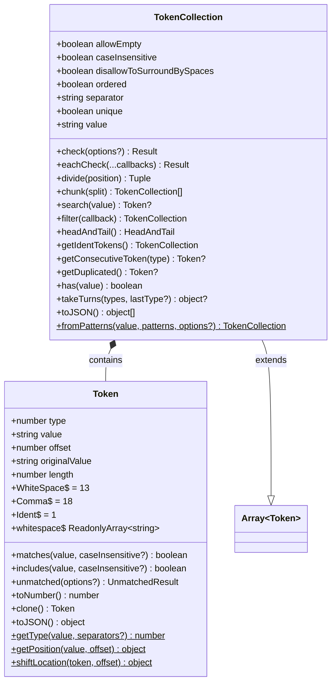
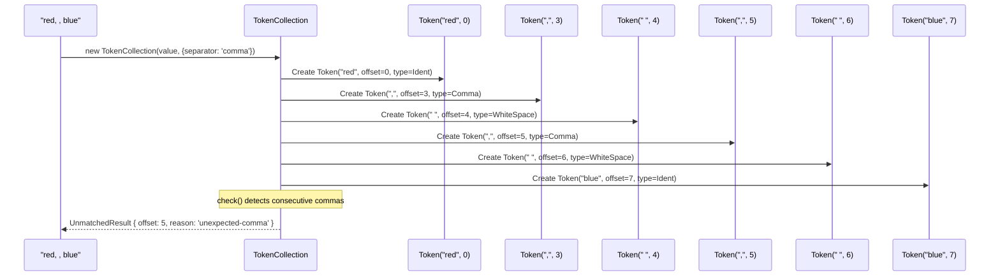
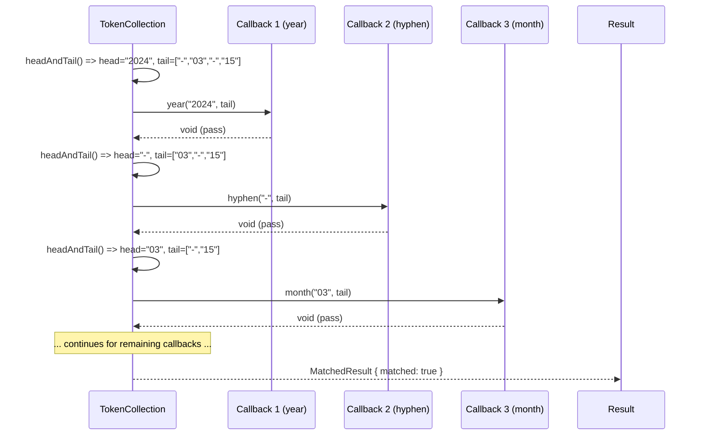

# Token System

## Overview

The `@markuplint/types` package includes a token system that enables **position-tracked validation** of HTML attribute values. When markuplint validates structured string values -- such as datetime strings, color codes, or space/comma-separated lists -- it needs to report errors at the exact character position where a problem occurs, not just that the entire value is invalid.

### The Problem

Consider validating the attribute value `"red, , blue"` as a comma-separated list. A naive validator might report "invalid value" for the whole string. But the actual problem is the empty item between the two commas at offset 5. The token system solves this by breaking the input into discrete tokens, each carrying its offset, line, and column within the original string. When validation fails on a specific token, the error message points to the precise location.

### How It Fits Into the Check Pipeline

The typical validation flow is:

1. An attribute value string enters the type-checking pipeline.
2. The string is **tokenized** into a `TokenCollection` (either by constructor parsing or `fromPatterns`).
3. Structural checks run against the collection (e.g., no consecutive commas, no leading separator).
4. Individual tokens are validated against expected patterns using `eachCheck` or per-token type checks.
5. If any check fails, an `UnmatchedResult` is returned carrying the exact `offset`, `line`, and `column`.



## Token Class

**Source:** `src/token/token.ts`

The `Token` class represents a single parsed fragment of a string value. Each token knows its string value, its type (whitespace, comma, or identifier), and its byte offset within the original input.

### Type Numbers

Token types are numeric constants borrowed from the [csstree tokenizer](https://github.com/csstree/csstree/blob/master/lib/tokenizer/types.js):

| Constant           | Value | Description                                              |
| ------------------ | ----- | -------------------------------------------------------- |
| `Token.Ident`      | `1`   | An identifier or general content token                   |
| `Token.WhiteSpace` | `13`  | One or more ASCII whitespace characters                  |
| `Token.Comma`      | `18`  | A comma character (only when comma is a known separator) |

The type is determined automatically by `Token.getType()` based on the first character of the token value and the configured separators. If the first character is ASCII whitespace, the type is `WhiteSpace`. If it matches a configured separator (e.g., `,`), it receives the corresponding type. Otherwise, it defaults to `Ident`.

### Static Properties

#### `Token.whitespace`

A readonly array of ASCII whitespace characters as defined by the [WHATWG Infra Standard](https://infra.spec.whatwg.org/#ascii-whitespace):

```ts
static readonly whitespace: ReadonlyArray<string> = [
  '\u0009', // TAB
  '\u000A', // LF
  '\u000C', // FF
  '\u000D', // CR
  '\u0020', // SPACE
];
```

### Static Methods

#### `Token.getType(value, separators?)`

Determines the token type number from the first character of `value`.

```ts
Token.getType(' hello'); // => 13 (WhiteSpace)
Token.getType(',', [',']); // => 18 (Comma)
Token.getType('blue'); // => 1  (Ident)
```

#### `Token.getPosition(value, offset)`

Calculates the 1-based line and column at the given character offset within a string.

```ts
Token.getPosition('abc\ndef', 5);
// => { line: 2, column: 2 }
```

#### `Token.shiftLocation(token, offset)`

Computes a new position by adding `offset` to a token's existing offset, then recalculating the line and column from the original string. This is used to pinpoint errors within a token's value (e.g., the third character of a five-character token).

```ts
// Given a token at offset 10 in the original string:
Token.shiftLocation(token, 3);
// => { offset: 13, line: ..., column: ... }
```

### Constructor

```ts
new Token(value: string, offset: number, originalValue: string, separators?: readonly string[])
```

| Parameter       | Description                                                |
| --------------- | ---------------------------------------------------------- |
| `value`         | The token's string content                                 |
| `offset`        | The character offset within the original string            |
| `originalValue` | The complete original string this token was extracted from |
| `separators`    | Optional separator characters used for type detection      |

### Instance Properties

| Property        | Type     | Description                                         |
| --------------- | -------- | --------------------------------------------------- |
| `value`         | `string` | The token's string content                          |
| `type`          | `number` | The token type (`Ident`, `WhiteSpace`, or `Comma`)  |
| `offset`        | `number` | The 0-based character offset in the original string |
| `originalValue` | `string` | The full original string this token was parsed from |
| `length`        | `number` | The character length of `value` (computed getter)   |

### Instance Methods

#### `matches(value, caseInsensitive?)`

Checks whether the token **exactly** matches the given value. Accepts a string (exact match), a `RegExp` (test), a type number (type check), or an array of any of these (logical OR).

```ts
token.matches('red'); // exact string match
token.matches(/^\d{4}$/); // regex match
token.matches(Token.WhiteSpace); // type match
token.matches(['T', ' ']); // matches either 'T' or ' '
```

#### `includes(value, caseInsensitive?)`

Like `matches`, but uses substring containment (`String.includes`) instead of exact equality for string values. For RegExp and type numbers, behavior is identical to `matches`.

#### `unmatched(options?)`

Creates an `UnmatchedResult` positioned at this token's location. This is the primary way validation errors are generated with accurate position information.

```ts
token.unmatched({
  reason: 'unexpected-token',
  expects: [{ type: 'common', value: 'hyphen' }],
  partName: 'datetime',
});
// => { matched: false, raw: token.value, offset: token.offset, line: ..., column: ..., ... }
```

#### `toNumber()`

Parses the token value as a floating-point number (returns `0` if parsing fails).

#### `clone()`

Returns a new `Token` with the same value, offset, and original value.

#### `toJSON()`

Returns a plain object `{ type, value, offset }` suitable for serialization and test assertions.

## TokenCollection

**Source:** `src/token/token-collection.ts`

`TokenCollection` extends `Array<Token>` with parsing, structural validation, and query capabilities. It is the primary entry point for tokenizing a string value.

### Class Diagram



### Creating Collections

#### Constructor: `new TokenCollection(value, options?)`

Parses a string into tokens by splitting on whitespace and (optionally) commas. The tokenization respects the configured `separator` mode.

```ts
// Space-separated (default)
const tokens = new TokenCollection('red green blue');
// => [Token('red'), Token(' '), Token('green'), Token(' '), Token('blue')]

// Comma-separated
const tokens = new TokenCollection('red, green, blue', { separator: 'comma' });
// => [Token('red'), Token(','), Token(' '), Token('green'), Token(','), Token(' '), Token('blue')]
```

**Options** (`TokenCollectionOptions`):

| Option                       | Default   | Description                                |
| ---------------------------- | --------- | ------------------------------------------ |
| `separator`                  | `'space'` | Separator mode: `'space'` or `'comma'`     |
| `allowEmpty`                 | `true`    | Whether an empty value is valid            |
| `unique`                     | `false`   | Whether duplicate tokens are disallowed    |
| `ordered`                    | `false`   | Whether token order matters                |
| `caseInsensitive`            | `true`    | Whether comparisons ignore case            |
| `disallowToSurroundBySpaces` | `false`   | Whether spaces around values are forbidden |
| `specificSeparator`          | --        | Additional custom separator character(s)   |

#### Static: `TokenCollection.fromPatterns(value, patterns, options?)`

Creates a `TokenCollection` by matching a string against a sequence of regular expression patterns. Each pattern consumes part of the input in order, and remaining unmatched portions become extra tokens. This is the primary method for parsing structured formats like datetime strings.

```ts
// Parse a timezone offset like "+09:30" or "+0930"
const patterns = [/\+|-/, /\d{2}/, /:?/, /\d{2}/];

TokenCollection.fromPatterns('+09:30', patterns).map(t => t.value);
// => ['+', '09', ':', '30']

TokenCollection.fromPatterns('+0930', patterns).map(t => t.value);
// => ['+', '09', '', '30']
```

Each resulting token carries the correct cumulative offset from the original string, so position tracking is preserved through the pattern matching process.

### Core Methods

#### `check(options?)`

Validates the **structural** integrity of the token collection based on its configuration. This checks for:

- Unexpected spaces (when `disallowToSurroundBySpaces` is set with non-space separator)
- Consecutive commas in comma-separated lists
- Leading/trailing commas
- Empty values (when `allowEmpty` is `false`)
- Duplicate values (when `unique` is `true`)

```ts
const tokens = new TokenCollection('a,, b', { separator: 'comma' });
const result = tokens.check();
// result.matched === false
// result.reason === 'unexpected-comma'
// result.offset === 2  (points to the second comma)
```

#### `eachCheck(...callbacks)`

The main sequential validation method. Applies a series of `TokenEachCheck` callback functions to consecutive tokens. See the detailed explanation below in [The eachCheck Pattern](#the-eachcheck-pattern).

#### `divide(position)`

Splits the collection into two `TokenCollection` instances at the given index.

```ts
const tokens = new TokenCollection('a b c');
const [before, after] = tokens.divide(2);
// before: [Token('a'), Token(' ')]
// after:  [Token('b'), Token(' '), Token('c')]
```

#### `chunk(split)`

Splits the collection into groups of `split` tokens each.

```ts
const tokens = new TokenCollection('a b c d');
const chunks = tokens.chunk(2);
// chunks[0]: [Token('a'), Token(' ')]
// chunks[1]: [Token('b'), Token(' ')]
// chunks[2]: [Token('c'), Token(' ')]
// chunks[3]: [Token('d')]
```

#### `search(value)`

Returns the first token whose value contains (via `Token.includes`) the given value, or `null`.

```ts
tokens.search('red'); // find token containing "red"
tokens.search(Token.Comma); // find the first comma token
tokens.search(/^\d+$/); // find the first all-digit token
```

#### `headAndTail()`

Splits the collection into the first token (`head`) and the remaining tokens (`tail`). Returns `{ head: Token | null, tail: TokenCollection }`. This is the mechanism that powers `eachCheck` iteration.

#### `getIdentTokens()`

Returns a new `TokenCollection` containing only tokens with type `Ident` (type `1`), filtering out whitespace and separators.

#### `has(value)`

Returns `true` if any token in the collection matches the given value (via `Token.matches`).

#### `filter(callback)`

Overrides `Array.filter` to return a `TokenCollection` (not a plain array), preserving all collection options.

#### `getConsecutiveToken(tokenType)`

Finds the first occurrence of two consecutive tokens of the same type. Returns the second token of the pair, or `null`.

#### `getDuplicated()`

Finds the first duplicated value in the collection, respecting the `caseInsensitive` setting. Returns the duplicate token, or `null`.

#### `takeTurns(tokenNumbers, lastTokenNumber?)`

Verifies that tokens follow a repeating type pattern. For example, in a comma-separated list, the pattern `[Ident, Comma]` should repeat, ending with `Ident`. Returns an error object if the pattern is violated, or `null` if valid.

### The eachCheck Pattern

`eachCheck` is the core validation pattern for structured token sequences. It consumes tokens one by one, passing each to a corresponding callback function. This is how markuplint validates formats where each position has specific requirements (e.g., a datetime string where position 0 is a year, position 1 is a hyphen, position 2 is a month, etc.).

**Signature:**

```ts
eachCheck(...callbacks: readonly TokenEachCheck[]): Result
```

**The `TokenEachCheck` callback type:**

```ts
type TokenEachCheck = (head: Readonly<Token> | null, tail: TokenCollection) => Result | void;
```

Each callback receives:

- `head` -- the current token to validate (or `null` if tokens are exhausted)
- `tail` -- the remaining tokens after `head`

The callback returns:

- `void` -- the token passed validation; continue to the next callback
- A `Result` with `matched: true` -- stop iteration, report success
- A `Result` with `matched: false` -- record the error and continue checking remaining callbacks (the first error is kept as the primary result)

**How it works internally:**

1. The collection is split into `head` and `tail` via `headAndTail()`.
2. The first callback receives the head token and tail collection.
3. After the callback returns, the tail is split again for the next callback.
4. A `passCount` score accumulates, used for ranking competing parse results.
5. If any callback returns an unmatched result, it is stored. The first unmatched result becomes the final error.
6. If all callbacks return `void`, the overall result is `matched`.

**Example -- validating a date string `"2024-03-15"`:**

```ts
// From: src/whatwg/check-datetime/date-string.ts
const tokens = TokenCollection.fromPatterns(value, [
  /[^-]*/, // YYYY
  /\D?/, // -
  /[^-]*/, // MM
  /\D/, // -
  /.\d*/, // DD
]);

const res = tokens.eachCheck(
  datetimeTokenCheck.year, // validates "2024"
  datetimeTokenCheck.hyphen, // validates "-"
  datetimeTokenCheck.month, // validates "03"
  datetimeTokenCheck.hyphen, // validates "-"
  datetimeTokenCheck.date, // validates "15"
  datetimeTokenCheck.extra, // ensures no trailing content
);
```

Each `datetimeTokenCheck` function validates its token and returns `void` on success or an `UnmatchedResult` (via `token.unmatched(...)`) on failure. Because each token carries its offset, the resulting error automatically points to the exact position in the original string.

## Usage Examples

### DateTime Validator

**Source files:**

- `src/whatwg/check-datetime/datetime-tokens.ts`
- `src/whatwg/check-datetime/date-string.ts`

The datetime validator demonstrates the full token pipeline for validating structured formats.

**Step 1: Tokenize with patterns**

The input string is split into tokens using `TokenCollection.fromPatterns`. Each regex captures one component of the datetime format:

```ts
// src/whatwg/check-datetime/date-string.ts
const tokens = TokenCollection.fromPatterns(value, [
  /[^-]*/, // Captures everything before the first hyphen (year)
  /\D?/, // Captures the optional non-digit (hyphen separator)
  /[^-]*/, // Captures everything before the second hyphen (month)
  /\D/, // Captures the non-digit (hyphen separator)
  /.\d*/, // Captures the remaining digits (day)
]);
```

For the input `"2024-03-15"`, this produces:

| Index | Value    | Offset | Type  |
| ----- | -------- | ------ | ----- |
| 0     | `"2024"` | 0      | Ident |
| 1     | `"-"`    | 4      | Ident |
| 2     | `"03"`   | 5      | Ident |
| 3     | `"-"`    | 7      | Ident |
| 4     | `"15"`   | 8      | Ident |

**Step 2: Validate each token with eachCheck**

Each callback checks its token against the WHATWG specification:

```ts
const res = tokens.eachCheck(
  datetimeTokenCheck.year, // Must be 4+ digits, value > 0
  datetimeTokenCheck.hyphen, // Must be exactly "-"
  datetimeTokenCheck.month, // Must be 2 digits, 1-12
  datetimeTokenCheck.hyphen, // Must be exactly "-"
  datetimeTokenCheck.date, // Must be 2 digits, 1-maxday
  datetimeTokenCheck.extra, // Must be empty (no trailing content)
);
```

**Step 3: Error position flows through**

If the input is `"2024-13-15"` (month `13` is invalid), the `month` callback calls:

```ts
return month.unmatched({
  reason: { type: 'out-of-range', gte: 1, lte: 12 },
  expects: [],
  partName: 'month',
});
```

Since the month token has `offset: 5`, the resulting `UnmatchedResult` carries `offset: 5`, `line: 1`, `column: 6` -- pointing directly at `"13"` in the original string.

### List Validation

**Source file:** `src/list.ts`

The list validator demonstrates how `TokenCollection` handles comma-separated and space-separated attribute values.

**Step 1: Create collection from the value**

```ts
// src/list.ts
const tokens = new TokenCollection(value, type);
```

The `type` parameter (a `List` definition) configures the separator mode, uniqueness, and other constraints. For example, validating `class="btn btn-primary btn"` with `{ separator: 'space', unique: true }`.

**Step 2: Structural check**

```ts
const matches = tokens.check({ ref });
```

This validates the list structure -- no consecutive commas, no empty items (if disallowed), no duplicates (if `unique` is set). If the structure is invalid, an error with the exact position is returned immediately.

**Step 3: Validate individual items**

```ts
const identTokens = tokens.getIdentTokens();

for (const token of identTokens) {
  const res = checkBase(token.value, type.token, defs, ref, cache);
  if (!res.matched) {
    const { offset, line, column } = Token.shiftLocation(token, res.offset);
    return {
      ...res,
      partName: res.partName ?? 'the content of the list',
      offset,
      line,
      column,
    };
  }
}
```

Key points:

- `getIdentTokens()` strips out whitespace and separator tokens, leaving only the actual values.
- Each identifier token is validated against the list's `token` type definition using `checkBase`.
- If a token fails validation, `Token.shiftLocation` adjusts the error offset to be relative to the **original string**, not the individual token. This ensures the reported position is accurate within the full attribute value.

## Diagrams

### Tokenization Flow



### eachCheck Validation Flow


