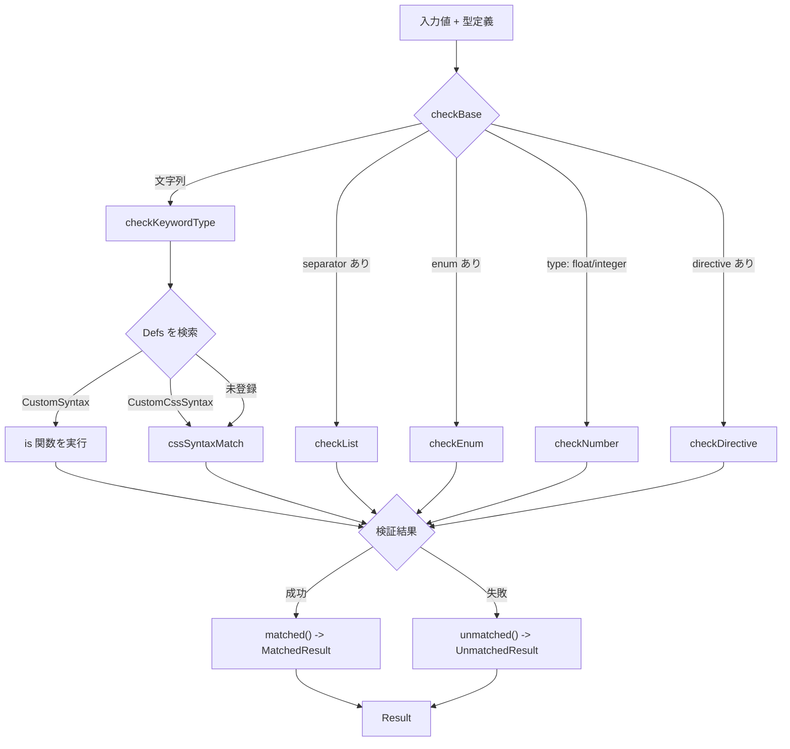
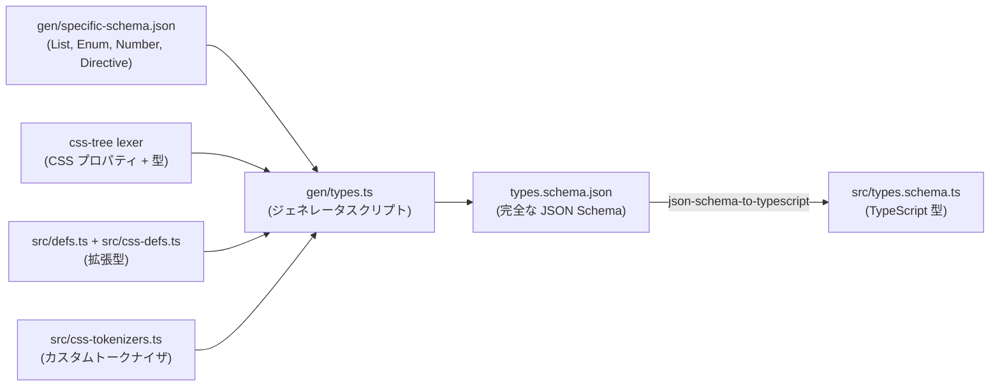
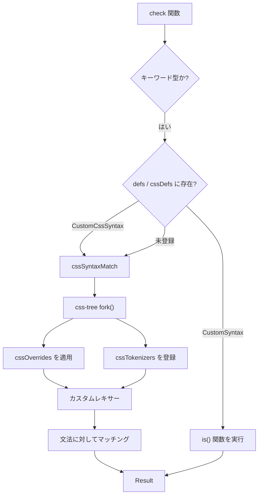

# 型システム

## 概要

`@markuplint/types` パッケージは、HTML 属性値・CSS プロパティ値・カスタム構文の検証を担う型システムを提供します。markuplint の属性値チェック機能の基盤であり、単純な列挙属性から複雑な CSS 値定義構文まで幅広く対応しています。組み込み型は HTML・CSS の各種仕様に準拠しており、さらにフレームワーク固有の型やプロジェクト独自の型を登録して拡張することもできます。

## 型の共用体（Type Union）

型システムの中核は、`src/types.schema.ts` で定義される 5 つのメンバーから成る共用体型 `Type` です。

```ts
// src/types.schema.ts
export type Type = KeywordDefinedType | List | Enum | Number | Directive;
```

markuplint のすべての属性値仕様は、最終的にこの 5 つの形式のいずれかに解決されます。`src/check-base.ts` のディスパッチャーが型の構造を判別し、対応するチェッカーに処理を振り分けます。

```ts
// src/check-base.ts
export function checkBase(value: string, type: ReadonlyDeep<Type>, defs: Defs, ref?: string, cache = true): Result {
  if (isKeyword(type)) return checkKeywordType(value, type, defs, cache);
  if (isList(type)) return checkList(value, type, defs, ref, cache);
  if (isEnum(type)) return checkEnum(value, type, ref);
  if (isNumber(type)) return checkNumber(value, type, ref);
  if (isDirective(type)) return checkDirective(value, type, defs, ref, cache);
  throw new Error('Unknown type');
}
```

### 一覧表

| 型                     | 表現形式 | 判別条件                             | 用途                                         | 例                                       |
| ---------------------- | -------- | ------------------------------------ | -------------------------------------------- | ---------------------------------------- |
| **KeywordDefinedType** | `string` | `typeof type === 'string'`           | CSS 構文・拡張型・HTML 属性要件              | `"<color>"`, `"URL"`, `"Boolean"`        |
| **List**               | `object` | `'separator' in type`                | スペース区切りまたはカンマ区切りのトークン列 | `{ token: "DOMID", separator: "space" }` |
| **Enum**               | `object` | `'enum' in type`                     | 許可された文字列値の固定集合                 | `{ enum: ["auto", "ltr", "rtl"] }`       |
| **Number**             | `object` | `type.type === 'float' \| 'integer'` | 範囲制約付きの数値                           | `{ type: "integer", gte: 0 }`            |
| **Directive**          | `object` | `'directive' in type`                | セパレータで分割して個別検証する複合値       | `{ directive: [";"], token: "URL" }`     |

### KeywordDefinedType

キーワード型は、名前付きの型定義を参照するプレーンな文字列です。3 つのサブカテゴリの共用体として構成されています。

```ts
// src/types.schema.ts
export type KeywordDefinedType = CssSyntax | ExtendedType | HtmlAttrRequirement;
```

- **CssSyntax** -- css-tree から取得される CSS 値定義構文名（例: `"<color>"`、`"<'display'>"`、`"<length-percentage>"`）。標準 CSS プロパティと値型を網羅する数百のエントリが含まれます。
- **ExtendedType** -- `src/defs.ts` と `src/css-defs.ts` で定義されるカスタム型識別子（例: `"URL"`、`"DOMID"`、`"DateTime"`、`"<view-box>"`）。純粋な CSS 構文では表現できない HTML 固有のフォーマットに対応します。
- **HtmlAttrRequirement** -- 現時点では `"Boolean"` のみ。HTML の真偽値属性を表します。

型チェッカーがキーワード文字列を検出すると、まず `Defs` レジストリを検索します。見つかった場合は登録済みのチェッカーを使用し、見つからなかった場合は css-tree のレキサーにフォールバックして CSS 構文マッチングを行います。

### List

`List` は、トークンの区切り付き列を定義します。

```ts
// src/types.schema.ts
export interface List {
  token: ExtendedType | Enum;
  separator: 'space' | 'comma';
  disallowToSurroundBySpaces?: boolean;
  allowEmpty?: boolean;
  ordered?: boolean;
  unique?: boolean;
  caseInsensitive?: boolean;
  number?: ('zeroOrMore' | 'oneOrMore') | { min: number; max: number };
}
```

WHATWG 仕様の[スペース区切りトークン](https://html.spec.whatwg.org/multipage/common-microsyntaxes.html#space-separated-tokens)と[カンマ区切りトークン](https://html.spec.whatwg.org/multipage/common-microsyntaxes.html#comma-separated-tokens)の概念に直接対応しています。

**例:** `class` 属性はスペース区切りのトークンリストとして表現されます。

```json
{
  "token": "NoEmptyAny",
  "separator": "space",
  "unique": true
}
```

### Enum

`Enum` は[列挙属性](https://html.spec.whatwg.org/multipage/common-microsyntaxes.html#enumerated-attribute)を定義します。

```ts
// src/types.schema.ts
export interface Enum {
  enum: [string, ...string[]];
  disallowToSurroundBySpaces?: boolean;
  caseInsensitive?: boolean;
  invalidValueDefault?: string;
  missingValueDefault?: string;
  sameStates?: { [k: string]: unknown };
}
```

`invalidValueDefault` と `missingValueDefault` は、WHATWG 仕様における「無効値デフォルト」「欠損値デフォルト」の概念をモデル化しています。`sameStates` は、同じ内部状態にマッピングされる複数のキーワードをグループ化します。

**例:** `dir` 属性:

```json
{
  "enum": ["ltr", "rtl", "auto"],
  "caseInsensitive": true,
  "missingValueDefault": "",
  "invalidValueDefault": ""
}
```

### Number

`Number` は範囲制約付きの数値属性値を検証します。

```ts
// src/types.schema.ts
export interface Number {
  type: 'float' | 'integer';
  gt?: number;
  gte?: number;
  lt?: number;
  lte?: number;
  clampable?: boolean;
}
```

`gt`/`gte`/`lt`/`lte` で開区間・閉区間の境界を指定します。`clampable` フラグは、範囲外の値をブラウザが自動的にクランプする属性（HTML の一部の属性がこの挙動を持つ）であることを示します。

**例:** `<canvas>` の `width` 属性:

```json
{
  "type": "integer",
  "gte": 0
}
```

### Directive

`Directive` は、セパレータ文字列で値を分割し、各トークンを個別に検証する複合的な属性値を扱います。

```ts
// src/types.schema.ts
export interface Directive {
  directive: [string, ...string[]];
  token: Type;
  ref?: string;
}
```

`directive` 配列にセパレータ文字列を 1 つ以上指定します。値をセパレータで分割した各セグメントが `token` の型に対して検証されます。

**例:** セミコロン区切りの URL を持つ属性:

```json
{
  "directive": [";"],
  "token": "URL"
}
```

## 結果型（Result Types）

すべての型チェックは `Result` を返します。`src/types.ts` で定義される判別可能な共用体型です。

```ts
// src/types.ts
export type Result = UnmatchedResult | MatchedResult;
```

### MatchedResult

検証成功時はこのシンプルなオブジェクトが返されます。

```ts
// src/types.ts
export type MatchedResult = {
  readonly matched: true;
};
```

`src/match-result.ts` の `matched()` ファクトリで生成されます。

```ts
// src/match-result.ts
export function matched(): MatchedResult {
  return { matched: true };
}
```

### UnmatchedResult

検証失敗時は、詳細な情報を含むオブジェクトが返されます。

```ts
// src/types.ts
export type UnmatchedResult = {
  readonly matched: false;
  readonly ref: string | null;
  readonly raw: string;
  readonly length: number;
  readonly offset: number;
  readonly line: number;
  readonly column: number;
  readonly reason: UnmatchedResultReason;
  readonly passCount?: number;
} & UnmatchedResultOptions;
```

| フィールド  | 説明                                           |
| ----------- | ---------------------------------------------- |
| `matched`   | 常に `false`                                   |
| `ref`       | 関連仕様の参照 URL、またはなければ `null`      |
| `raw`       | 検証に失敗した生の文字列値                     |
| `length`    | 生の値の長さ                                   |
| `offset`    | 不一致が発生した入力内の文字オフセット         |
| `line`      | 不一致の行番号（1 始まり）                     |
| `column`    | 不一致の列番号（1 始まり）                     |
| `reason`    | 失敗の理由を示すコードまたは構造化オブジェクト |
| `passCount` | 失敗前に通過したトークン数（任意）             |

### UnmatchedResultOptions

追加のメタデータを付与できます。

```ts
// src/types.ts
export type UnmatchedResultOptions = {
  readonly partName?: string;
  readonly expects?: readonly Expect[];
  readonly extra?: Expect;
  readonly candidate?: string;
  readonly fallbackTo?: string;
};
```

- `partName` -- 失敗した部分の名前（例: srcset における "width descriptor"）
- `expects` -- バリデータが期待した内容を記述する `Expect` オブジェクトの配列
- `candidate` -- 修正候補の提案（タイプミス検出に使用。例: ターゲット名のスペルミス -> `"_blank"`）
- `fallbackTo` -- このエラーがある場合にブラウザがフォールバックする値

### UnmatchedResultReason

理由は文字列リテラルか、範囲違反の構造化オブジェクトのいずれかです。

```ts
// src/types.ts
export type UnmatchedResultReason =
  | 'syntax-error'
  | 'typo'
  | 'missing-token'
  | 'missing-comma'
  | 'unexpected-token'
  | 'unexpected-space'
  | 'unexpected-newline'
  | 'unexpected-comma'
  | 'empty-token'
  | 'out-of-range'
  | 'doesnt-exist-in-enum'
  | 'duplicated'
  | 'illegal-combination'
  | 'illegal-order'
  | 'extra-token'
  | 'must-be-percent-encoded'
  | 'must-be-serialized'
  | {
      readonly type: 'out-of-range';
      readonly gt?: number;
      readonly gte?: number;
      readonly lt?: number;
      readonly lte?: number;
    }
  | { readonly type: 'out-of-range-length-char'; readonly gte: number; readonly lte?: number }
  | { readonly type: 'out-of-range-length-digit'; readonly gte: number; readonly lte?: number };
```

### 結果フロー図



## Defs レジストリ

`Defs` 型は、型識別子の文字列をその検証実装にマッピングします。

```ts
// src/types.ts
export type Defs = Readonly<Record<string, CustomCssSyntax | CustomSyntax>>;
```

各エントリは `CustomSyntax`（命令的な `is` 関数を使用）か `CustomCssSyntax`（CSS 値定義構文を使用）のいずれかです。

### CustomSyntax

```ts
// src/types.ts
export type CustomSyntax = {
  readonly ref: string;
  readonly expects?: readonly Expect[];
  readonly is: CustomSyntaxCheck;
};
```

**`src/defs.ts` の例:**

```ts
DOMID: {
    ref: 'https://html.spec.whatwg.org/multipage/dom.html#global-attributes:concept-id',
    expects: [{ type: 'format', value: 'ID' }],
    is: value => {
        const tokens = new TokenCollection(value);
        const ws = tokens.search(Token.WhiteSpace);
        if (ws) {
            return ws.unmatched({ reason: 'unexpected-space' });
        }
        if (tokens.length === 0) {
            return unmatched(value, 'empty-token');
        }
        return matched();
    },
},
```

### CustomCssSyntax

```ts
// src/types.ts
export type CustomCssSyntax = {
  readonly ref: string;
  readonly caseSensitive?: boolean;
  readonly expects?: readonly Expect[];
  readonly syntax: {
    readonly apply: `<${string}>`;
    readonly def: Readonly<Record<string, string | CssSyntaxTokenizer>>;
  };
};
```

**`src/defs.ts` の例:**

```ts
SourceSizeList: {
    ref: 'https://html.spec.whatwg.org/multipage/images.html#sizes-attributes',
    expects: [{ type: 'syntax', value: '<source-size-list>' }],
    syntax: {
        apply: '<source-size-list>',
        def: {
            'source-size-list': '[ <source-size># , ]? <source-size-value>',
            'source-size': '<media-condition> <source-size-value> | auto',
            'source-size-value': '<length> | auto',
        },
    },
},
```

### 主な組み込み型

`src/defs.ts` の `defs` オブジェクトには 30 以上の組み込み型が登録されています。代表的なものを以下に示します。

| 型識別子            | 検証方式                     | 仕様                   |
| ------------------- | ---------------------------- | ---------------------- |
| `Any`               | 常にマッチ                   | --                     |
| `NoEmptyAny`        | 空文字列を拒否               | --                     |
| `Number`            | 浮動小数点チェック           | --                     |
| `Int`               | 整数チェック                 | --                     |
| `Uint`              | 非負整数チェック             | --                     |
| `URL`               | 常にマッチ（後述の注意参照） | WHATWG URL             |
| `DOMID`             | 空白なし・空でない           | HTML #id               |
| `DateTime`          | 完全な日時パース             | WHATWG datetime        |
| `BCP47`             | RFC BCP 47 言語タグ          | IETF BCP 47            |
| `CustomElementName` | 有効なカスタム要素名         | WHATWG Custom Elements |
| `MIMEType`          | MIME タイプ解析              | MIME Sniffing          |
| `SourceSizeList`    | CSS 構文ベース               | HTML ``     |
| `AutoComplete`      | 複雑なマルチトークン         | HTML autocomplete      |

> **注意:** `URL` 型は常にマッチします。これは相対 URL がほぼあらゆる文字列を受け入れるためです。URL 形式を厳密に検証したい場合は、`AbsoluteURL` や `HTTPSchemaURL` を使用してください。

### レジストリの使われ方

メインのエントリポイントである `check()`（`src/check.ts`）が呼ばれると、HTML 定義（`defs`）と CSS 定義（`cssDefs`）が 1 つのレジストリにマージされます。

```ts
// src/check.ts
export function check(value: string, type: ReadonlyDeep<Type>, ref?: string, cache = true): Result {
  return checkBase(value, type, { ...defs, ...cssDefs }, ref, cache);
}
```

## スキーマ生成

型システムの型定義は、TypeScript の型としてだけでなく JSON Schema としても提供されており、IDE の自動補完や設定ファイルのバリデーションに活用されます。

### 生成フロー



### 仕組み

1. **`gen/specific-schema.json`** は `List`、`Enum`、`Number`、`Directive`（キーワード以外の型バリアント）の JSON Schema を定義しています。

2. **`gen/types.ts`** はジェネレータスクリプトです。以下の処理を行います。
   - css-tree のレキサーからすべての CSS プロパティ名と型名を取得
   - `defs` と `cssDefs` からすべての拡張型識別子を取得
   - `cssTokenizers` からカスタムトークナイザ名を取得
   - これらすべてを `types.schema.json` に統合

3. **`types.schema.json`** は完全な JSON Schema です。`definitions` セクションには以下が含まれます。
   - `css-syntax` -- すべての CSS プロパティ名・型名の文字列 enum
   - `extended-type` -- すべてのカスタム型識別子の文字列 enum
   - `html-attr-requirement` -- 現時点では `["Boolean"]` のみ
   - `keyword-defined-type` -- 上記 3 つの `oneOf`
   - `list`、`enum`、`number`、`directive` -- `specific-schema.json` からの定義
   - `type` -- 5 つの型バリアントすべての `oneOf`

4. **`src/types.schema.ts`** は `types.schema.json` から `json-schema-to-typescript` を使って生成されます。コードベースの他の部分がインポートする TypeScript 型（`Type`、`List`、`Enum`、`Number`、`Directive`、`KeywordDefinedType`、`CssSyntax`、`ExtendedType`、`HtmlAttrRequirement`）をエクスポートします。

### 目的

- **設定ファイルの検証:** JSON Schema は markuplint の設定スキーマから参照され、ユーザーが IDE で `.markuplintrc` ファイルを編集する際の自動補完とバリデーションを提供します。
- **型安全性:** 生成された TypeScript 型により、コードベースがコンパイル時に有効な型識別子のみを参照できることが保証されます。
- **唯一の信頼できるソース:** css-tree のレキサーデータベースと `defs.ts`/`cssDefs.ts` のカスタム定義が権威あるソースであり、スキーマと TypeScript 型は常にそこから導出されます。

## CSS 定義

型システムは、css-tree の機能を拡張する 3 つのモジュールを通じて CSS と深く統合されています。

### cssDefs (`src/css-defs.ts`)

`cssDefs` レジストリは、標準 CSS プロパティ構文を超える CSS・SVG 属性値の型定義を提供します。メインの `defs` レジストリと同じ `Defs` 構造に従います。

主なカテゴリ:

| カテゴリ           | 例                                                   | 説明                       |
| ------------------ | ---------------------------------------------------- | -------------------------- |
| CSS 宣言リスト     | `<css-declaration-list>`                             | `style` 属性用             |
| SVG ジオメトリ     | `<view-box>`, `<preserve-aspect-ratio>`, `<points>`  | SVG の座標・幾何学型       |
| SVG ペイント       | `<dasharray>`, `<color-matrix>`                      | SVG の描画・フィルタ関連型 |
| SVG アニメーション | `<key-splines>`, `<key-times>`, `<begin-value-list>` | SMIL アニメーション型      |
| SVG テキスト       | `<text-coordinate>`, `<list-of-lengths>`             | SVG テキスト配置           |

ほとんどの定義は css-tree の文法を指定する `syntax` プロパティを持つ `CustomCssSyntax` を使用します。

```ts
// src/css-defs.ts
'<preserve-aspect-ratio>': {
    ref: 'https://svgwg.org/svg2-draft/coords.html#PreserveAspectRatioAttribute',
    syntax: {
        apply: '<preserve-aspect-ratio>',
        def: {
            'preserve-aspect-ratio': '<align> <meet-or-slice>?',
            align: 'none | xMinYMin | xMidYMin | xMaxYMin | xMinYMid | xMidYMid | xMaxYMid | xMinYMax | xMidYMax | xMaxYMax',
            'meet-or-slice': 'meet | slice',
        },
    },
},
```

CSS 構文だけでは不十分な場合には、`is` 関数を持つ `CustomSyntax` を使用するエントリもあります（例: `<svg-font-size>` は TODO として現在は常にマッチします）。

### cssOverrides (`src/css-overrides.ts`)

`cssOverrides` マップは、特定の CSS 値型について css-tree の組み込み定義を置き換える代替構文定義を提供します。これは SVG 属性の検証に必要です。SVG ではスタイルシートよりも CSS 構文規則が緩和されているためです。

```ts
// src/css-overrides.ts
export const cssOverrides: Record<string, string> = {
  'legacy-length-percentage': '<length> | <percentage> | <svg-length>',
  'legacy-angle': '<angle> | <zero> | <number>',
  'translate()': 'translate( <legacy-length-percentage> , <legacy-length-percentage>? ) | ...',
  'scale()': 'scale( [ <number> | <percentage> ]#{1,2} )',
  'rotate()': 'rotate( <legacy-angle> )',
  'skew()': 'skew( <legacy-angle> , <legacy-angle>? ) | ...',
};
```

オーバーライドでは `<legacy-length-percentage>` と `<legacy-angle>` というエイリアスを導入しています。これらは単位なしの数値を受け入れます（SVG の transform 属性では有効ですが、CSS スタイルシートでは無効です）。これらのオーバーライドは css-tree の `fork()` 関数に渡され、カスタムレキサーが生成されます。

### cssTokenizers (`src/css-tokenizers.ts`)

`cssTokenizers` マップは、css-tree の文法だけでは対応できないトークンレベルのマッチング関数を提供します。

```ts
// src/css-tokenizers.ts
export const cssTokenizers: Record<string, CssSyntaxTokenizer> = {
  'bcp-47'(token) {
    if (!token) return 0;
    return isBCP47()(token.value) ? 1 : 0;
  },
};
```

`CssSyntaxTokenizer` は以下の引数を受け取る関数です。

- `token` -- 現在の CSS 構文トークン（入力末尾の場合は `null`）
- `getNextToken` -- 後続のトークンを先読みする関数
- `match` -- 再帰的な文法マッチングのための `cssSyntaxMatch` 関数

戻り値は消費したトークン数です（マッチしなかった場合は 0）。これにより、CSS 以外の検証ロジック（BCP 47 言語タグの検証など）を CSS 構文の文法規則に統合できます。

### 統合フロー



`src/css-syntax.ts` の `cssSyntaxMatch` 関数がこのプロセスを統括します。オーバーライドとカスタムトークナイザを適用した css-tree のフォーク版レキサーを作成し、指定された CSS 構文文法に対して値を検証します。
