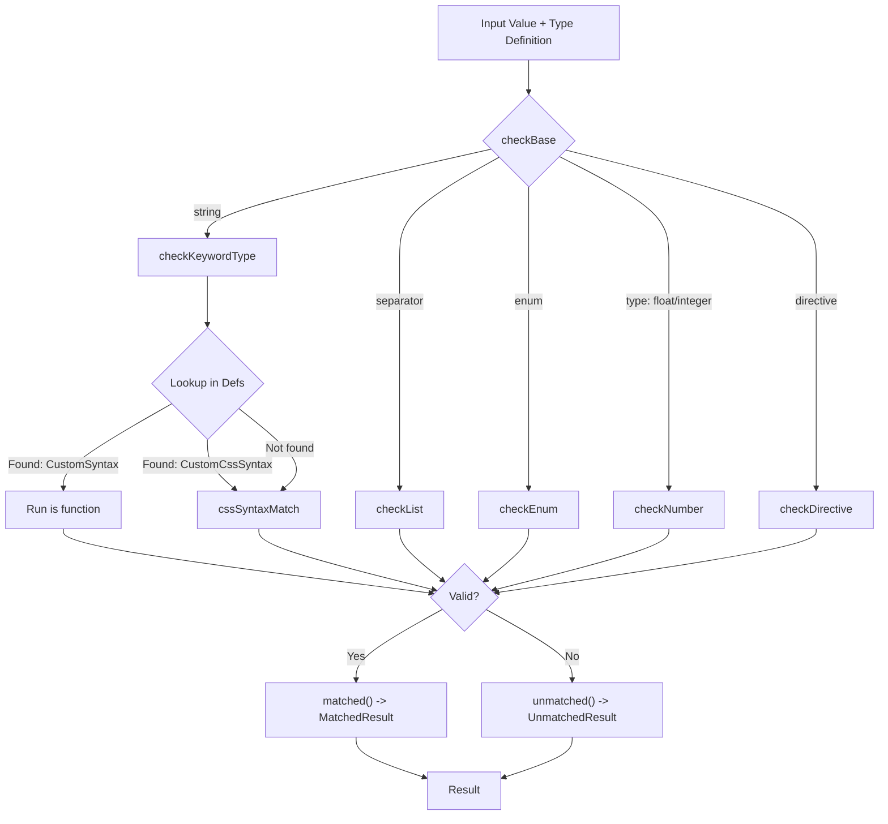
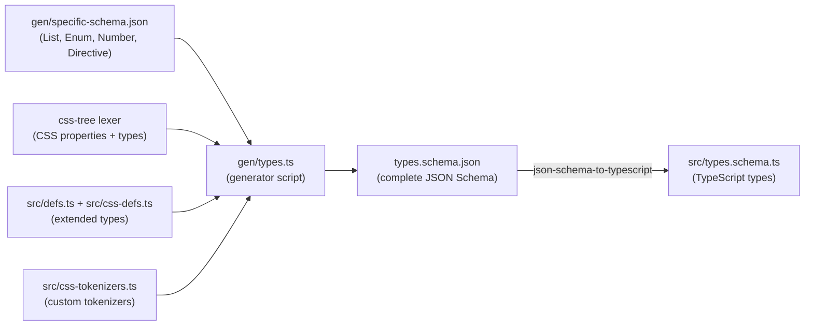
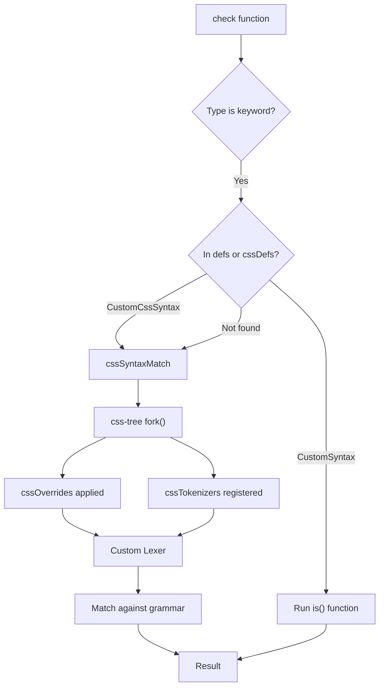

# Type System

## Overview

The `@markuplint/types` package provides a type system for validating HTML attribute values, CSS property values, and custom syntax definitions. It forms the foundation of markuplint's attribute value checking, supporting everything from simple enumerated attributes to complex CSS value definition syntax. The type system is designed to be extensible: built-in types cover HTML and CSS standards, while custom types can be registered for framework-specific or project-specific needs.

## Type Union

The core of the type system is a five-member union type called `Type`, defined in `src/types.schema.ts`:

```ts
// src/types.schema.ts
export type Type = KeywordDefinedType | List | Enum | Number | Directive;
```

Every attribute value specification in markuplint resolves to one of these five forms. The dispatcher in `src/check-base.ts` identifies which variant is being used and routes to the corresponding checker:

```ts
// src/check-base.ts
export function checkBase(value: string, type: ReadonlyDeep<Type>, defs: Defs, ref?: string, cache = true): Result {
  if (isKeyword(type)) return checkKeywordType(value, type, defs, cache);
  if (isList(type)) return checkList(value, type, defs, ref, cache);
  if (isEnum(type)) return checkEnum(value, type, ref);
  if (isNumber(type)) return checkNumber(value, type, ref);
  if (isDirective(type)) return checkDirective(value, type, defs, ref, cache);
  throw new Error('Unknown type');
}
```

### Summary Table

| Type                   | Representation | Discriminant                         | Purpose                                            | Example                                  |
| ---------------------- | -------------- | ------------------------------------ | -------------------------------------------------- | ---------------------------------------- |
| **KeywordDefinedType** | `string`       | `typeof type === 'string'`           | CSS syntax, extended types, HTML attr requirements | `"<color>"`, `"URL"`, `"Boolean"`        |
| **List**               | `object`       | `'separator' in type`                | Space- or comma-separated token sequences          | `{ token: "DOMID", separator: "space" }` |
| **Enum**               | `object`       | `'enum' in type`                     | Fixed set of allowed string values                 | `{ enum: ["auto", "ltr", "rtl"] }`       |
| **Number**             | `object`       | `type.type === 'float' \| 'integer'` | Numeric values with optional range constraints     | `{ type: "integer", gte: 0 }`            |
| **Directive**          | `object`       | `'directive' in type`                | Composite attribute values with separators         | `{ directive: [";"], token: "URL" }`     |

### KeywordDefinedType

A keyword type is a plain string that references a named type definition. It is itself a union of three sub-categories:

```ts
// src/types.schema.ts
export type KeywordDefinedType = CssSyntax | ExtendedType | HtmlAttrRequirement;
```

- **CssSyntax** -- CSS value definition syntax names sourced from css-tree (e.g., `"<color>"`, `"<'display'>"`, `"<length-percentage>"`). There are hundreds of these, covering all standard CSS properties and value types.
- **ExtendedType** -- Custom type identifiers defined in `src/defs.ts` and `src/css-defs.ts` (e.g., `"URL"`, `"DOMID"`, `"DateTime"`, `"<view-box>"`). These handle HTML-specific formats that are not expressible as pure CSS syntax.
- **HtmlAttrRequirement** -- Currently only `"Boolean"`, representing HTML boolean attributes.

When the type checker encounters a keyword string, it looks it up in the `Defs` registry. If found, it uses the registered checker. If not found, it falls back to css-tree's lexer for CSS syntax matching.

### List

A `List` defines a token-separated sequence of values:

```ts
// src/types.schema.ts
export interface List {
  token: ExtendedType | Enum;
  separator: 'space' | 'comma';
  disallowToSurroundBySpaces?: boolean;
  allowEmpty?: boolean;
  ordered?: boolean;
  unique?: boolean;
  caseInsensitive?: boolean;
  number?: ('zeroOrMore' | 'oneOrMore') | { min: number; max: number };
}
```

This maps directly to the WHATWG specification concepts of [space-separated tokens](https://html.spec.whatwg.org/multipage/common-microsyntaxes.html#space-separated-tokens) and [comma-separated tokens](https://html.spec.whatwg.org/multipage/common-microsyntaxes.html#comma-separated-tokens).

**Example:** The `class` attribute uses a space-separated list of tokens:

```json
{
  "token": "NoEmptyAny",
  "separator": "space",
  "unique": true
}
```

### Enum

An `Enum` defines an [enumerated attribute](https://html.spec.whatwg.org/multipage/common-microsyntaxes.html#enumerated-attribute):

```ts
// src/types.schema.ts
export interface Enum {
  enum: [string, ...string[]];
  disallowToSurroundBySpaces?: boolean;
  caseInsensitive?: boolean;
  invalidValueDefault?: string;
  missingValueDefault?: string;
  sameStates?: { [k: string]: unknown };
}
```

The `invalidValueDefault` and `missingValueDefault` fields model the WHATWG concept of invalid/missing value defaults. The `sameStates` field groups different keywords that map to the same internal state.

**Example:** The `dir` attribute:

```json
{
  "enum": ["ltr", "rtl", "auto"],
  "caseInsensitive": true,
  "missingValueDefault": "",
  "invalidValueDefault": ""
}
```

### Number

A `Number` validates numeric attribute values with optional range constraints:

```ts
// src/types.schema.ts
export interface Number {
  type: 'float' | 'integer';
  gt?: number;
  gte?: number;
  lt?: number;
  lte?: number;
  clampable?: boolean;
}
```

The `gt`/`gte`/`lt`/`lte` fields define open or closed range boundaries. The `clampable` flag indicates whether out-of-range values are silently clamped by the browser (some HTML attributes do this).

**Example:** The `width` attribute on `<canvas>`:

```json
{
  "type": "integer",
  "gte": 0
}
```

### Directive

A `Directive` handles composite attribute values where a separator string splits the value into individual tokens, each validated independently:

```ts
// src/types.schema.ts
export interface Directive {
  directive: [string, ...string[]];
  token: Type;
  ref?: string;
}
```

The `directive` array lists one or more separator strings. Each segment produced by splitting on these separators is validated against the `token` type.

**Example:** A hypothetical attribute with semicolon-separated URLs:

```json
{
  "directive": [";"],
  "token": "URL"
}
```

## Result Types

Every type check returns a `Result`, which is a discriminated union defined in `src/types.ts`:

```ts
// src/types.ts
export type Result = UnmatchedResult | MatchedResult;
```

### MatchedResult

A successful validation returns this minimal object:

```ts
// src/types.ts
export type MatchedResult = {
  readonly matched: true;
};
```

Created via the `matched()` factory in `src/match-result.ts`:

```ts
// src/match-result.ts
export function matched(): MatchedResult {
  return { matched: true };
}
```

### UnmatchedResult

A failed validation returns a detailed object:

```ts
// src/types.ts
export type UnmatchedResult = {
  readonly matched: false;
  readonly ref: string | null;
  readonly raw: string;
  readonly length: number;
  readonly offset: number;
  readonly line: number;
  readonly column: number;
  readonly reason: UnmatchedResultReason;
  readonly passCount?: number;
} & UnmatchedResultOptions;
```

| Field       | Description                                                   |
| ----------- | ------------------------------------------------------------- |
| `matched`   | Always `false`                                                |
| `ref`       | Reference URL to the relevant specification, or `null`        |
| `raw`       | The raw string value that failed validation                   |
| `length`    | The length of the raw value                                   |
| `offset`    | Character offset within the input where the mismatch occurred |
| `line`      | Line number of the mismatch (1-based)                         |
| `column`    | Column number of the mismatch (1-based)                       |
| `reason`    | A reason code or structured object explaining the failure     |
| `passCount` | Optional count of tokens that passed before the failure       |

### UnmatchedResultOptions

Additional metadata can be attached:

```ts
// src/types.ts
export type UnmatchedResultOptions = {
  readonly partName?: string;
  readonly expects?: readonly Expect[];
  readonly extra?: Expect;
  readonly candidate?: string;
  readonly fallbackTo?: string;
};
```

- `partName` -- The name of the sub-part that failed (e.g., "width descriptor" in srcset)
- `expects` -- An array of `Expect` objects describing what the validator expected
- `candidate` -- A suggested correction (used for typo detection, e.g., a misspelled target name -> `"_blank"`)
- `fallbackTo` -- The value the browser would fall back to in the presence of this error

### UnmatchedResultReason

The reason is either a string literal or a structured range violation:

```ts
// src/types.ts
export type UnmatchedResultReason =
  | 'syntax-error'
  | 'typo'
  | 'missing-token'
  | 'missing-comma'
  | 'unexpected-token'
  | 'unexpected-space'
  | 'unexpected-newline'
  | 'unexpected-comma'
  | 'empty-token'
  | 'out-of-range'
  | 'doesnt-exist-in-enum'
  | 'duplicated'
  | 'illegal-combination'
  | 'illegal-order'
  | 'extra-token'
  | 'must-be-percent-encoded'
  | 'must-be-serialized'
  | {
      readonly type: 'out-of-range';
      readonly gt?: number;
      readonly gte?: number;
      readonly lt?: number;
      readonly lte?: number;
    }
  | { readonly type: 'out-of-range-length-char'; readonly gte: number; readonly lte?: number }
  | { readonly type: 'out-of-range-length-digit'; readonly gte: number; readonly lte?: number };
```

### Result Flow Diagram



## Defs Registry

The `Defs` type maps type identifier strings to their validation implementations:

```ts
// src/types.ts
export type Defs = Readonly<Record<string, CustomCssSyntax | CustomSyntax>>;
```

Each entry is either a `CustomSyntax` (using an imperative `is` function) or a `CustomCssSyntax` (using CSS value definition syntax).

### CustomSyntax

```ts
// src/types.ts
export type CustomSyntax = {
  readonly ref: string;
  readonly expects?: readonly Expect[];
  readonly is: CustomSyntaxCheck;
};
```

**Example from `src/defs.ts`:**

```ts
DOMID: {
    ref: 'https://html.spec.whatwg.org/multipage/dom.html#global-attributes:concept-id',
    expects: [{ type: 'format', value: 'ID' }],
    is: value => {
        const tokens = new TokenCollection(value);
        const ws = tokens.search(Token.WhiteSpace);
        if (ws) {
            return ws.unmatched({ reason: 'unexpected-space' });
        }
        if (tokens.length === 0) {
            return unmatched(value, 'empty-token');
        }
        return matched();
    },
},
```

### CustomCssSyntax

```ts
// src/types.ts
export type CustomCssSyntax = {
  readonly ref: string;
  readonly caseSensitive?: boolean;
  readonly expects?: readonly Expect[];
  readonly syntax: {
    readonly apply: `<${string}>`;
    readonly def: Readonly<Record<string, string | CssSyntaxTokenizer>>;
  };
};
```

**Example from `src/defs.ts`:**

```ts
SourceSizeList: {
    ref: 'https://html.spec.whatwg.org/multipage/images.html#sizes-attributes',
    expects: [{ type: 'syntax', value: '<source-size-list>' }],
    syntax: {
        apply: '<source-size-list>',
        def: {
            'source-size-list': '[ <source-size># , ]? <source-size-value>',
            'source-size': '<media-condition> <source-size-value> | auto',
            'source-size-value': '<length> | auto',
        },
    },
},
```

### Key Built-in Types

The `defs` object in `src/defs.ts` registers over 30 built-in types. Here are some notable entries:

| Type Identifier     | Validation Method          | Specification          |
| ------------------- | -------------------------- | ---------------------- |
| `Any`               | Always matches             | --                     |
| `NoEmptyAny`        | Rejects empty strings      | --                     |
| `Number`            | Floating-point check       | --                     |
| `Int`               | Integer check              | --                     |
| `Uint`              | Non-negative integer check | --                     |
| `URL`               | Always matches (see note)  | WHATWG URL             |
| `DOMID`             | No whitespace, non-empty   | HTML #id               |
| `DateTime`          | Full datetime parsing      | WHATWG datetime        |
| `BCP47`             | RFC BCP 47 language tag    | IETF BCP 47            |
| `CustomElementName` | Valid custom element name  | WHATWG Custom Elements |
| `MIMEType`          | MIME type parsing          | MIME Sniffing          |
| `SourceSizeList`    | CSS syntax-based           | HTML ``     |
| `AutoComplete`      | Complex multi-token        | HTML autocomplete      |

> **Note:** The `URL` type always matches because relative URLs accept almost any string. To validate URL format strictly, use `AbsoluteURL` or `HTTPSchemaURL` instead.

### How the Registry is Used

When `check()` is called (the main entry point in `src/check.ts`), it merges the HTML definitions (`defs`) and CSS definitions (`cssDefs`) into a single registry:

```ts
// src/check.ts
export function check(value: string, type: ReadonlyDeep<Type>, ref?: string, cache = true): Result {
  return checkBase(value, type, { ...defs, ...cssDefs }, ref, cache);
}
```

## Schema Generation

The type system's type definitions are available both as TypeScript types and as a JSON Schema, enabling IDE autocompletion and configuration file validation.

### Generation Flow



### How It Works

1. **`gen/specific-schema.json`** defines the JSON Schema for `List`, `Enum`, `Number`, and `Directive` -- the non-keyword type variants.

2. **`gen/types.ts`** is the generator script. It:
   - Reads all CSS property names and type names from css-tree's lexer
   - Reads all extended type identifiers from `defs` and `cssDefs`
   - Reads custom tokenizer names from `cssTokenizers`
   - Combines everything into `types.schema.json`

3. **`types.schema.json`** is the complete JSON Schema. Its `definitions` section contains:
   - `css-syntax` -- All CSS property and type names as a string enum
   - `extended-type` -- All custom type identifiers as a string enum
   - `html-attr-requirement` -- Currently just `["Boolean"]`
   - `keyword-defined-type` -- A `oneOf` of the three above
   - `list`, `enum`, `number`, `directive` -- From `specific-schema.json`
   - `type` -- A `oneOf` of all five type variants

4. **`src/types.schema.ts`** is generated from `types.schema.json` using `json-schema-to-typescript`. This file exports the TypeScript types (`Type`, `List`, `Enum`, `Number`, `Directive`, `KeywordDefinedType`, `CssSyntax`, `ExtendedType`, `HtmlAttrRequirement`) that the rest of the codebase imports.

### Purpose

- **Configuration validation:** The JSON Schema is referenced by markuplint's configuration schema, providing autocompletion and validation when users edit `.markuplintrc` files in their IDE.
- **Type safety:** The generated TypeScript types ensure that the codebase can only reference valid type identifiers at compile time.
- **Single source of truth:** CSS-tree's lexer database and the custom definitions in `defs.ts`/`cssDefs.ts` are the authoritative sources; the schema and TypeScript types are always derived from them.

## CSS Definitions

The type system integrates deeply with CSS through three modules that extend css-tree's capabilities.

### cssDefs (`src/css-defs.ts`)

The `cssDefs` registry provides type definitions for CSS and SVG attribute values that go beyond standard CSS property syntax. It follows the same `Defs` structure as the main `defs` registry.

Key categories:

| Category              | Examples                                             | Description                    |
| --------------------- | ---------------------------------------------------- | ------------------------------ |
| CSS Declaration Lists | `<css-declaration-list>`                             | For the `style` attribute      |
| SVG Geometry          | `<view-box>`, `<preserve-aspect-ratio>`, `<points>`  | SVG coordinate/geometry types  |
| SVG Painting          | `<dasharray>`, `<color-matrix>`                      | SVG paint/filter-related types |
| SVG Animation         | `<key-splines>`, `<key-times>`, `<begin-value-list>` | SMIL animation types           |
| SVG Text              | `<text-coordinate>`, `<list-of-lengths>`             | SVG text positioning           |

Most definitions use `CustomCssSyntax` with a `syntax` property that specifies css-tree grammar:

```ts
// src/css-defs.ts
'<preserve-aspect-ratio>': {
    ref: 'https://svgwg.org/svg2-draft/coords.html#PreserveAspectRatioAttribute',
    syntax: {
        apply: '<preserve-aspect-ratio>',
        def: {
            'preserve-aspect-ratio': '<align> <meet-or-slice>?',
            align: 'none | xMinYMin | xMidYMin | xMaxYMin | xMinYMid | xMidYMid | xMaxYMid | xMinYMax | xMidYMax | xMaxYMax',
            'meet-or-slice': 'meet | slice',
        },
    },
},
```

Some entries use `CustomSyntax` with an `is` function when CSS syntax alone is insufficient (e.g., `<svg-font-size>` which is marked as TODO and currently always matches).

### cssOverrides (`src/css-overrides.ts`)

The `cssOverrides` map provides alternative CSS syntax definitions that replace css-tree's built-in definitions for specific CSS value types. This is necessary for SVG attribute validation, where CSS syntax rules are more permissive than in stylesheets.

```ts
// src/css-overrides.ts
export const cssOverrides: Record<string, string> = {
  'legacy-length-percentage': '<length> | <percentage> | <svg-length>',
  'legacy-angle': '<angle> | <zero> | <number>',
  'translate()': 'translate( <legacy-length-percentage> , <legacy-length-percentage>? ) | ...',
  'scale()': 'scale( [ <number> | <percentage> ]#{1,2} )',
  'rotate()': 'rotate( <legacy-angle> )',
  'skew()': 'skew( <legacy-angle> , <legacy-angle>? ) | ...',
};
```

The overrides introduce `<legacy-length-percentage>` and `<legacy-angle>` aliases that accept unitless numbers (valid in SVG transform attributes but not in CSS stylesheets). These overrides are fed into css-tree's `fork()` function to create a custom lexer.

### cssTokenizers (`src/css-tokenizers.ts`)

The `cssTokenizers` map provides custom token-level matching functions for CSS value types that require logic beyond what css-tree's grammar supports:

```ts
// src/css-tokenizers.ts
export const cssTokenizers: Record<string, CssSyntaxTokenizer> = {
  'bcp-47'(token) {
    if (!token) return 0;
    return isBCP47()(token.value) ? 1 : 0;
  },
};
```

A `CssSyntaxTokenizer` is a function that receives:

- `token` -- The current CSS syntax token (or `null` at end of input)
- `getNextToken` -- A lookahead function for inspecting subsequent tokens
- `match` -- The `cssSyntaxMatch` function for recursive matching

It returns the number of tokens consumed (0 if no match). This allows integrating non-CSS validation logic (like BCP 47 language tag checking) into CSS syntax grammar rules.

### Integration Flow



The `cssSyntaxMatch` function in `src/css-syntax.ts` orchestrates this process: it creates a forked css-tree lexer with the overrides and custom tokenizers applied, then validates the value against the specified CSS syntax grammar.
