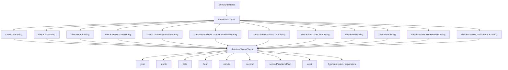

# バリデータ

## 概要

`@markuplint/types` パッケージは、HTML属性値を検証するための階層的なバリデーションシステムを提供しています。バリデータとは、与えられた文字列がWeb標準（WHATWG, W3C, RFC）やプリミティブ型の定義に準拠しているかどうかを検査する関数です。

### 型システムにおける位置づけ

バリデータは型チェックパイプラインの中核を担っています。markuplintが属性値を評価する際、以下の手順で処理が進みます。

1. スキーマから属性の期待される型を解決する（例: `DateTime`、`BCP47`、`Uint`）
2. `defs` レジストリ（`src/defs.ts`）で該当するバリデータを参照する
3. バリデータを呼び出し、結果として `MatchedResult`（適合）または `UnmatchedResult`（不適合、詳細なエラー情報付き）を得る

### バリデータのパターン

バリデータには2つの主要なパターンがあります。

- **`FormattedPrimitiveTypeCreator`** -- 真偽値を返す述語関数 `(value: string) => boolean` を生成するファクトリ。`isInt` や `isAbsURL`、`isCustomElementName` のようなシンプルな検証に使われます。`defs.ts` に登録する際は `matches()` ヘルパーでラップします。
- **`CustomSyntaxChecker`** -- `(value: string) => Result` を返すファクトリ。エラーの位置・理由・修正候補まで含めた詳細な結果を返します。`checkDateTime` や `checkAutoComplete`、`checkSerializedPermissionsPolicy` のような複雑なバリデータに使われます。

### カテゴリ

バリデータは、準拠する仕様に基づいて4つのカテゴリに分類されています。

| カテゴリ  | ディレクトリ     | 説明                                                 |
| --------- | ---------------- | ---------------------------------------------------- |
| Primitive | `src/primitive/` | 基本的な数値・文字列フォーマットの検証               |
| WHATWG    | `src/whatwg/`    | HTML Living Standardで定義されたマイクロシンタックス |
| RFC       | `src/rfc/`       | IETFのRFCで定義されたフォーマット                    |
| W3C       | `src/w3c/`       | W3C仕様で定義されたフォーマット                      |

---

## プリミティブバリデータ

プリミティブバリデータは、数値や単位付き値の基本的なフォーマット検証を行います。単体で使用されるだけでなく、上位のバリデータの構成要素としても利用されます。

**ソース:** `src/primitive/index.ts`

| 関数            | ファイル                        | 説明                      | パラメータ                                                                    | 戻り値                          |
| --------------- | ------------------------------- | ------------------------- | ----------------------------------------------------------------------------- | ------------------------------- |
| `isInt`         | `primitive/is-int.ts`           | 符号付き整数の検証        | `value: string`                                                               | `boolean`                       |
| `isFloat`       | `primitive/is-float.ts`         | 浮動小数点数の検証        | `value: string`                                                               | `boolean`                       |
| `isUint`        | `primitive/is-uint.ts`          | 非負整数の検証            | `value: string`, `options?: { gt?: number }`                                  | `boolean`                       |
| `isNonZeroUint` | `primitive/is-non-zero-uint.ts` | 0より大きい非負整数の検証 | `value: string`                                                               | `boolean`                       |
| `isQuantity`    | `primitive/is-quantity.ts`      | 数値＋単位の検証          | `value: string`, `units: string[]`, `numberType?: 'int' \| 'uint' \| 'float'` | `boolean`                       |
| `range`         | `primitive/range.ts`            | 数値範囲の検証            | `value: string`, `from: number`, `to: number`                                 | `boolean`                       |
| `splitUnit`     | `primitive/split-unit.ts`       | 数値部と単位部への分割    | `value: string`                                                               | `{ num: string, unit: string }` |

### 各バリデータの検証ロジック

**`isInt`** -- 正規表現 `/^-?\d+$/` で、省略可能なマイナス記号に続く1桁以上の数字にマッチするかを判定します。WHATWGの[符号付き整数](https://html.spec.whatwg.org/dev/common-microsyntaxes.html#signed-integers)マイクロシンタックスに対応しています。

```typescript
// src/primitive/is-int.ts
export function isInt(value: string) {
  return /^-?\d+$/.test(value);
}
```

**`isFloat`** -- 値をトリムした上で `Number.parseFloat()` で解析し、結果が有限であるかを確認します。科学的記数法を含む標準的な浮動小数点表記に対応します。WHATWGの[浮動小数点数](https://html.spec.whatwg.org/dev/common-microsyntaxes.html#floating-point-numbers)マイクロシンタックスに基づいた緩やかな実装です。`Number.parseFloat()` はWHATWGの厳密な文法よりも寛容であり、先頭ドット（`".5"` など）や末尾の非数値文字を許容する点に注意してください。

```typescript
// src/primitive/is-float.ts
export function isFloat(value: string) {
  return value === value.trim() && Number.isFinite(Number.parseFloat(value));
}
```

**`isUint`** -- `/^\d+$/` で非負整数にマッチさせます。オプションで `gt` 制約を指定でき、その場合はパースした値が指定値より厳密に大きいことを要求します。WHATWGの[非負整数](https://html.spec.whatwg.org/dev/common-microsyntaxes.html#non-negative-integers)マイクロシンタックスに対応します。

**`isNonZeroUint`** -- `/^\d+$/` にマッチすることに加え、ゼロのみで構成される文字列（`/^0+$/`）を拒否します。つまり正の整数であることを保証します。

**`isQuantity`** -- `splitUnit` を使って数値部と単位部に分割した後、単位が許可リストに含まれているか（大文字小文字を区別しない）を確認し、数値部を指定された `numberType`（`'int'`、`'uint'`、`'float'`）に従って検証します。`"10px"` や `"1.5em"` のような値の検証に使います。

**`range`** -- 値を浮動小数点数としてパースし、`[from, to]` の範囲内（両端を含む）に収まるかを判定します。数値にパースできない場合は `false` を返します。

**`splitUnit`** -- 正規表現 `/(^-?\.\d+|^-?\d+(?:\.\d+(?:e[+-]\d+)?)?)([a-z]+$)/i` を使い、`"10px"` を `{ num: "10", unit: "px" }` のように分割します。単位が見つからない場合は `{ num: value, unit: "" }` を返します。

---

## WHATWGバリデータ

WHATWGバリデータは、[HTML Living Standard](https://html.spec.whatwg.org/multipage/common-microsyntaxes.html)で定義されたマイクロシンタックスを実装しています。

### DateTimeサブシステム

DateTimeサブシステムは、WHATWG仕様が定義するすべての日時フォーマットを検証します。12個の個別フォーマットチェッカーで構成されており、共通のトークン検証レイヤーを共有する最も複雑なバリデータ群です。

**エントリポイント:** `src/whatwg/check-datetime/index.ts`

トップレベルの `checkDateTime` 関数は、`checkMultiTypes` を使ってすべてのフォーマットを試行し、最も適合度の高い結果を返します。

```typescript
// src/whatwg/check-datetime/index.ts
const checks = [
  checkDateString(),
  checkTimeString(),
  checkMonthString(),
  checkYearlessDateString(),
  checkLocalDateAndTimeString(),
  checkNormalizedLocalDateAndTimeString(),
  checkTimeZoneOffsetString(),
  checkGlobalDateAndTimeString(),
  checkWeekString(),
  checkYearString(),
  checkDurationISO8601LikeString(),
  checkDurationComponentListString(),
];

export const checkDateTime: CustomSyntaxChecker = () => value => {
  return checkMultiTypes(value, checks);
};
```

#### 日時フォーマットチェッカー一覧

| 関数                                    | ファイル                         | フォーマット                            | 例                     | 仕様参照                                                                                                                           |
| --------------------------------------- | -------------------------------- | --------------------------------------- | ---------------------- | ---------------------------------------------------------------------------------------------------------------------------------- |
| `checkDateString`                       | `date-string.ts`                 | `YYYY-MM-DD`                            | `2024-01-15`           | [日付](https://html.spec.whatwg.org/multipage/common-microsyntaxes.html#dates)                                                     |
| `checkMonthString`                      | `month-string.ts`                | `YYYY-MM`                               | `2024-01`              | [月](https://html.spec.whatwg.org/multipage/common-microsyntaxes.html#valid-month-string)                                          |
| `checkWeekString`                       | `week-string.ts`                 | `YYYY-Www`                              | `2024-W03`             | [週](https://html.spec.whatwg.org/multipage/common-microsyntaxes.html#weeks)                                                       |
| `checkTimeString`                       | `time-string.ts`                 | `HH:MM[:SS[.sss]]`                      | `14:30:00`             | [時刻](https://html.spec.whatwg.org/multipage/common-microsyntaxes.html#times)                                                     |
| `checkYearlessDateString`               | `yearless-date-string.ts`        | `MM-DD`                                 | `01-15`                | [年なし日付](https://html.spec.whatwg.org/multipage/common-microsyntaxes.html#yearless-dates)                                      |
| `checkYearString`                       | `year-string.ts`                 | `YYYY`（4桁以上、0より大きい）          | `2024`                 | [共通マイクロシンタックス](https://html.spec.whatwg.org/multipage/common-microsyntaxes.html)                                       |
| `checkLocalDateAndTimeString`           | `local-date-and-time-string.ts`  | `YYYY-MM-DDThh:mm[:ss[.sss]]`           | `2024-01-15T14:30`     | [ローカル日時](https://html.spec.whatwg.org/multipage/common-microsyntaxes.html#valid-local-date-and-time-string)                  |
| `checkNormalizedLocalDateAndTimeString` | `local-date-and-time-string.ts`  | 正規化されたローカル日時                | `2024-01-15T14:30`     | [正規化ローカル日時](https://html.spec.whatwg.org/multipage/common-microsyntaxes.html#valid-normalised-local-date-and-time-string) |
| `checkGlobalDateAndTimeString`          | `global-date-and-time-string.ts` | 日付＋時刻＋タイムゾーン                | `2024-01-15T14:30:00Z` | [グローバル日時](https://html.spec.whatwg.org/multipage/common-microsyntaxes.html#global-dates-and-times)                          |
| `checkTimeZoneOffsetString`             | `time-zone-offset-string.ts`     | `Z` または `+HH:MM` / `-HH:MM`          | `+09:00`               | [タイムゾーン](https://html.spec.whatwg.org/multipage/common-microsyntaxes.html#time-zones)                                        |
| `checkDurationISO8601LikeString`        | `duration-string.ts`             | ISO 8601形式（`PnDTnHnMnS`）            | `PT1H30M`              | [期間](https://html.spec.whatwg.org/multipage/common-microsyntaxes.html#durations)                                                 |
| `checkDurationComponentListString`      | `duration-string.ts`             | コンポーネントリスト形式（`1h 30m 5s`） | `1h 30m 5s`            | [期間](https://html.spec.whatwg.org/multipage/common-microsyntaxes.html#durations)                                                 |

#### 共有トークン定義

すべての日時チェッカーは、`datetime-tokens.ts` で定義された共通のトークン検証レイヤーを共有しています。`datetimeTokenCheck` オブジェクトが、各日時コンポーネントに対応する再利用可能な `TokenEachCheck` 関数を提供します。



共有トークンチェックの一覧:

| トークンチェック                   | 検証対象               | 制約                             |
| ---------------------------------- | ---------------------- | -------------------------------- |
| `year`                             | 年                     | 4桁以上のASCII数字、値 > 0       |
| `month`                            | 月                     | 2桁、1--12の範囲                 |
| `date`                             | 日                     | 2桁、1--maxday（うるう年を考慮） |
| `hour`                             | 時                     | 2桁、0--23の範囲                 |
| `minute`                           | 分                     | 2桁、0--59の範囲                 |
| `second`                           | 秒                     | 2桁、0--59の範囲                 |
| `secondFractionalPart`             | 秒の小数部             | 1--3桁のASCII数字                |
| `week`                             | ISO週番号              | 2桁、1--maxweek（年による）      |
| `hyphen`                           | `-` セパレータ         | U+002D固定                       |
| `colon`                            | `:` セパレータ         | U+003A固定                       |
| `colonOrEnd`                       | `:` または入力の終わり | コロンは省略可                   |
| `decimalPointOrEnd`                | `.` または入力の終わり | ピリオドは省略可                 |
| `localDateTimeSeparator`           | `T` またはスペース     | 日付と時刻の境界                 |
| `normalizedlocalDateTimeSeparator` | `T` のみ               | 正規化形式での厳密な区切り       |
| `plusOrMinusSign`                  | `+` または `-`         | タイムゾーンの符号               |
| `weekSign`                         | `W`                    | 週文字列のマーカー               |
| `extra`                            | 末尾の余分な内容       | 空でなければ拒否                 |

`datetimeTokenCheck` オブジェクトは、検証の過程で `_year` と `_month` をミュータブルな状態として保持します。これにより `date` チェッカーが、対象の年月に対する正確な最大日数を計算できます（うるう年の判定を含む）。

### オートコンプリートバリデータ

**ソース:** `src/whatwg/check-autocomplete.ts`

[WHATWGオートフィル仕様](https://html.spec.whatwg.org/multipage/form-control-infrastructure.html#attr-fe-autocomplete)に基づいて `autocomplete` 属性値を検証します。

トークンベースのアプローチを採用しており、属性値をスペース区切りの順序付きトークン集合として解析します。認識されるトークンは以下のとおりです。

- **キーワード:** `on`、`off`（単独使用、他のトークンとの共存不可）
- **名前付きグループ:** `section-` で始まるトークン（省略可能な接頭辞）
- **住所区分:** `shipping`、`billing`（省略可能）
- **連絡手段トークン:** `home`、`work`、`mobile`、`fax`、`pager`（省略可能、後に連絡先フィールド名が必須）
- **オートフィルフィールド名:** `name`、`given-name`、`postal-code`、`cc-number` など（44種類）
- **連絡先フィールド名:** `tel`、`tel-country-code`、`email`、`impp` など（10種類）
- **WebAuthn:** `webauthn`（省略可能な末尾トークン）

WHATWGが定義する順序制約を適用します: `[section-*] [shipping|billing] [home|work|...] <フィールド名> [webauthn]`。重複トークンや不正な順序は、タイプミス候補を含む詳細なエラー結果を生成します。

### リンクタイプバリデータ

**ソース:** `src/whatwg/check-link-type.ts`

`rel` 属性のリンクタイプ値を、[WHATWGリンクタイプレジストリ](https://html.spec.whatwg.org/multipage/links.html#linkTypes)と[Microformatsのexisting-rel-values](https://microformats.org/wiki/existing-rel-values)レジストリに照らし合わせて検証します。

要素のコンテキストに応じたパラメータを受け取ります。

| オプション        | コンテキスト           | 説明                                        |
| ----------------- | ---------------------- | ------------------------------------------- |
| `el: 'link'`      | `<head>` 内の `<link>` | link要素で許可されるすべてのリンクタイプ    |
| `el: 'body link'` | `<body>` 内の `<link>` | `body-ok` フラグのあるリンクタイプのみ      |
| `el: 'a, area'`   | `<a>`、`<area>`        | アンカー/エリア要素で許可されるリンクタイプ |
| `el: 'form'`      | `<form>`               | form要素で許可されるリンクタイプ            |

Microformatsのdropped、rejected、non-HTML、dropped-without-prejudiceリストに含まれるキーワードは明示的に拒否されます。指定されたコンテキストに応じた許可キーワードの列挙を構築し、最終的な検証は `checkList` に委譲します。

`defs.ts` には `LinkTypeForLinkElement`、`LinkTypeForLinkElementInBody`、`LinkTypeForAnchorAndAreaElement`、`LinkTypeForFormElement` の4つの型定義として登録されています。

### MIMEタイプバリデータ

**ソース:** `src/whatwg/check-mime-type.ts`

[WHATWG MIME Sniffing仕様](https://mimesniff.spec.whatwg.org/#valid-mime-type)に準拠してMIMEタイプ文字列を検証します。

npmパッケージ `whatwg-mimetype` を組み込んで解析を行います。処理の流れは以下のとおりです。

1. `MIMEType.parse()` で値のパースを試みる
2. パースに成功した場合、シリアライズされたessenceが入力と一致するか確認する
3. `withoutParameters` オプションが指定されている場合、パラメータのないMIMEタイプに制限する
4. 余分なトークンや構文エラーは適切な修正候補とともに報告する

```typescript
// defs.ts での呼び出し
MIMEType: {
  ref: 'https://mimesniff.spec.whatwg.org/#valid-mime-type',
  is: checkMIMEType(),
},
```

### URL・名前系バリデータ

WHATWGが定義する各種名前フォーマットに対する、シンプルな述語ベースの検証を行います。

| 関数                    | ファイル                             | 検証対象                     | ロジック                                                                         |
| ----------------------- | ------------------------------------ | ---------------------------- | -------------------------------------------------------------------------------- |
| `isAbsURL`              | `whatwg/is-abs-url.ts`               | 絶対URL                      | `new URL(value)` コンストラクタを使用。`ERR_INVALID_URL` エラーで `false` を返す |
| `isBrowserContextName`  | `whatwg/is-browser-context-name.ts`  | 閲覧コンテキスト名（非推奨） | 空でなく `_` で始まらない                                                        |
| `isCustomElementName`   | `whatwg/is-custom-element-name.ts`   | カスタム要素名               | `[a-z]` で始まり、`-` を含み、PCENCharのみで構成され、予約名でないこと           |
| `isItempropName`        | `whatwg/is-itemprop-name.ts`         | itempropプロパティ名         | `:`、`.`、スペースを含まない                                                     |
| `isNavigableTargetName` | `whatwg/is-navigable-target-name.ts` | ナビゲーブルターゲット名     | 空でなく、ASCIIタブ/改行を含まず、`_` で始まらない                               |

**`isCustomElementName`** は最も複雑で、[PotentialCustomElementName](https://html.spec.whatwg.org/multipage/custom-elements.html#prod-potentialcustomelementname)プロダクションルールを実装しています。8つの予約名（`annotation-xml`、`color-profile`、`font-face`、`font-face-src`、`font-face-uri`、`font-face-format`、`font-face-name`、`missing-glyph`）を拒否し、先頭がASCII小文字アルファベットであること、ハイフンが必須であること、すべての文字がPCENChar文字クラスに属することを検証します。

**`isBrowserContextName`** は非推奨であり、代わりに `isNavigableTargetName` を使用してください。

これらはすべて `FormattedPrimitiveTypeCreator` ファクトリであり、`() => (value: string) => boolean` の形式を返します。

---

## RFCバリデータ

### BCP 47（言語タグ）

**ソース:** `src/rfc/is-bcp-47.ts`

[BCP 47](https://tools.ietf.org/rfc/bcp/bcp47.html)（RFC 5646 + RFC 4647）に準拠した言語タグの検証を行います。

npmパッケージ `bcp-47` を組み込んでパースし、有効な `language` サブタグが含まれているかを確認します。

```typescript
// src/rfc/is-bcp-47.ts
export const isBCP47: FormattedPrimitiveTypeCreator = () => {
  return value => {
    const { language } = parse(value);
    return !!language;
  };
};
```

`defs.ts` では `BCP47` 型として登録されており、HTML要素の `lang` 属性の検証に使用されます。

---

## W3Cバリデータ

### シリアライズドパーミッションポリシー

**ソース:** `src/w3c/check-serialized-permissions-policy.ts`

[W3C Permissions Policy仕様](https://w3c.github.io/webappsec-permissions-policy/#serialized-permissions-policy)に準拠した、シリアライズされたパーミッションポリシー文字列を検証します。

以下のABNF文法を解析します。

```abnf
serialized-permissions-policy = serialized-policy-directive *(";" serialized-policy-directive)
serialized-policy-directive   = feature-identifier [RWS allow-list]
feature-identifier            = 1*( ALPHA / DIGIT / "-")
allow-list                    = allow-list-value *(RWS allow-list-value)
allow-list-value              = serialized-origin / "*" / "'self'" / "'src'" / "'none'"
```

> **注記:** 上記のABNFは実装のものであり、`allow-list` を省略可能（`[RWS allow-list]`）としています。W3C仕様では `serialized-policy-directive = feature-identifier RWS allow-list` と定義されており、`allow-list` は必須です。この差異は意図的なもので、実装ではfeature identifierのみのディレクティブも受け入れます。

検証の主な手順は以下のとおりです。

1. 値を `;` で分割してポリシーディレクティブのリストを得る
2. 各ディレクティブからfeature identifierを取り出し、`/^[\da-z-]+$/i` にマッチするか検証する
3. allow-listの各値について、キーワード（`*`、`'self'`、`'src'`、`'none'`）との一致か、シリアライズドオリジンとしての妥当性を確認する
4. シリアライズドオリジンは `URL` コンストラクタで検証し、パス、クエリ、ハッシュ、ユーザー名、パスワードが含まれていないことを確認する。また、パーセントエンコードが必要な文字（`'`、`*`、`,`、`;`）の存在もチェックする

---

## 新しいバリデータの追加方法

以下の手順で、新しいバリデータをシステムに追加できます。

### ステップ1: バリデータファイルの作成

準拠する仕様に応じて、適切なディレクトリにファイルを配置します。

- `src/primitive/` -- 基本的なフォーマット検証
- `src/whatwg/` -- WHATWG HTML仕様のバリデータ
- `src/rfc/` -- RFC定義のフォーマット
- `src/w3c/` -- W3C仕様のフォーマット

**`FormattedPrimitiveTypeCreator` のテンプレート:**

```typescript
// src/whatwg/is-my-format.ts
import type { FormattedPrimitiveTypeCreator } from '../types.js';

/**
 * Checks whether a string is a valid my-format value.
 *
 * @see https://spec.example.org/my-format
 */
export const isMyFormat: FormattedPrimitiveTypeCreator = () => {
  return value => {
    // 真偽値を返す検証ロジック
    return /^[a-z]+-[a-z]+$/.test(value);
  };
};
```

**`CustomSyntaxChecker` のテンプレート:**

```typescript
// src/whatwg/check-my-syntax.ts
import type { CustomSyntaxChecker } from '../types.js';

import { matched, unmatched } from '../match-result.js';

/**
 * Validates a my-syntax value.
 *
 * @see https://spec.example.org/my-syntax
 */
export const checkMySyntax: CustomSyntaxChecker = () => value => {
  if (!value) {
    return unmatched(value, 'empty-token');
  }
  // Resultを返す検証ロジック
  return matched();
};
```

### ステップ2: ディレクトリインデックスからのエクスポート

バリデータを配置したディレクトリに `index.ts` がある場合は、エクスポートを追加します。

```typescript
// src/primitive/index.ts
export { isMyFormat } from './is-my-format.js';
```

### ステップ3: defs.tsへの登録

バリデータをインポートし、`defs` オブジェクトに追加します。

```typescript
// src/defs.ts
import { isMyFormat } from './whatwg/is-my-format.js';
// または
import { checkMySyntax } from './whatwg/check-my-syntax.js';

export const defs: Defs = {
  // ... 既存の定義 ...

  // FormattedPrimitiveTypeCreator の場合（matches() でラップ）:
  MyFormat: {
    ref: 'https://spec.example.org/my-format',
    expects: [
      {
        type: 'format',
        value: 'my format',
      },
    ],
    is: matches(isMyFormat()),
  },

  // CustomSyntaxChecker の場合（そのまま使用）:
  MySyntax: {
    ref: 'https://spec.example.org/my-syntax',
    expects: [
      {
        type: 'format',
        value: 'my syntax',
      },
    ],
    is: checkMySyntax(),
  },
};
```

### ステップ4: テストの追加

バリデータと同じ場所にテストファイルを作成します。

```typescript
// src/whatwg/is-my-format.spec.ts
import { isMyFormat } from './is-my-format.js';

const check = isMyFormat();

test('valid values', () => {
  expect(check('foo-bar')).toBe(true);
  expect(check('hello-world')).toBe(true);
});

test('invalid values', () => {
  expect(check('')).toBe(false);
  expect(check('UPPER-CASE')).toBe(false);
});
```

### 具体例: 仮想的な `isDataURL` バリデータの追加

`data:` URLを個別に検証するバリデータを追加するケースを想定します。

**1. ファイルを作成する:**

```typescript
// src/whatwg/is-data-url.ts
import type { FormattedPrimitiveTypeCreator } from '../types.js';

/**
 * Checks whether a string is a valid data URL.
 *
 * @see https://fetch.spec.whatwg.org/#data-urls
 */
export const isDataURL: FormattedPrimitiveTypeCreator = () => {
  return value => {
    return /^data:[^,]*,/.test(value);
  };
};
```

**2. `defs.ts` に登録する:**

```typescript
import { isDataURL } from './whatwg/is-data-url.js';

// defs オブジェクト内:
DataURL: {
  ref: 'https://fetch.spec.whatwg.org/#data-urls',
  expects: [
    {
      type: 'format',
      value: 'data URL',
    },
  ],
  is: matches(isDataURL()),
},
```

**3. テストを追加する:**

```typescript
// src/whatwg/is-data-url.spec.ts
import { isDataURL } from './is-data-url.js';

const check = isDataURL();

test('valid data URLs', () => {
  expect(check('data:text/plain,Hello')).toBe(true);
  expect(check('data:text/html,<h1>Hello</h1>')).toBe(true);
  expect(check('data:image/png;base64,abc123...')).toBe(true);
});

test('invalid data URLs', () => {
  expect(check('https://example.com')).toBe(false);
  expect(check('data:')).toBe(false);
});
```
