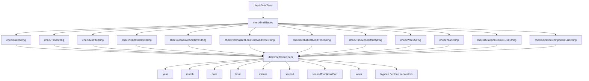

# Validators

## Overview

The `@markuplint/types` package provides a layered validation system for HTML attribute values. Validators are functions that check whether a given string conforms to a specific type defined by web standards (WHATWG, W3C, RFC) or common primitive formats.

### Role in the Type System

Validators sit at the core of the type-checking pipeline. When markuplint evaluates an attribute value, it:

1. Resolves the attribute's expected type from the schema (e.g., `DateTime`, `BCP47`, `Uint`)
2. Looks up the corresponding validator in the `defs` registry (`src/defs.ts`)
3. Invokes the validator, which returns a `Result` -- either `MatchedResult` or `UnmatchedResult` with detailed error information

### Validator Patterns

Validators follow two primary patterns:

- **`FormattedPrimitiveTypeCreator`** -- A factory that returns a boolean predicate `(value: string) => boolean`. Used for simpler checks like `isInt`, `isAbsURL`, `isCustomElementName`. These are wrapped with the `matches()` helper when registered in `defs.ts`.
- **`CustomSyntaxChecker`** -- A factory that returns `(value: string) => Result`, providing detailed match/unmatch information with error positions, reasons, and suggestions. Used for complex validators like `checkDateTime`, `checkAutoComplete`, `checkSerializedPermissionsPolicy`.

### Categories

Validators are organized into four categories by the specification they implement:

| Category  | Directory        | Description                            |
| --------- | ---------------- | -------------------------------------- |
| Primitive | `src/primitive/` | Basic numeric and string format checks |
| WHATWG    | `src/whatwg/`    | HTML Living Standard microsyntaxes     |
| RFC       | `src/rfc/`       | IETF RFC-defined formats               |
| W3C       | `src/w3c/`       | W3C specification formats              |

---

## Primitive Validators

Primitive validators handle fundamental numeric and unit-based format checks. They are used both directly and as building blocks for higher-level validators.

**Source:** `src/primitive/index.ts`

| Function        | File                            | Description                                | Parameters                                                                    | Return                          |
| --------------- | ------------------------------- | ------------------------------------------ | ----------------------------------------------------------------------------- | ------------------------------- |
| `isInt`         | `primitive/is-int.ts`           | Checks for valid signed integer            | `value: string`                                                               | `boolean`                       |
| `isFloat`       | `primitive/is-float.ts`         | Checks for valid floating-point number     | `value: string`                                                               | `boolean`                       |
| `isUint`        | `primitive/is-uint.ts`          | Checks for valid non-negative integer      | `value: string`, `options?: { gt?: number }`                                  | `boolean`                       |
| `isNonZeroUint` | `primitive/is-non-zero-uint.ts` | Checks for valid non-negative integer > 0  | `value: string`                                                               | `boolean`                       |
| `isQuantity`    | `primitive/is-quantity.ts`      | Checks for number + unit suffix            | `value: string`, `units: string[]`, `numberType?: 'int' \| 'uint' \| 'float'` | `boolean`                       |
| `range`         | `primitive/range.ts`            | Checks if value is within a numeric range  | `value: string`, `from: number`, `to: number`                                 | `boolean`                       |
| `splitUnit`     | `primitive/split-unit.ts`       | Splits a value into numeric and unit parts | `value: string`                                                               | `{ num: string, unit: string }` |

### Validation Logic Details

**`isInt`** -- Uses the regex `/^-?\d+$/` to match an optional leading minus sign followed by one or more digits. Implements the [WHATWG signed integers](https://html.spec.whatwg.org/dev/common-microsyntaxes.html#signed-integers) microsyntax.

```typescript
// src/primitive/is-int.ts
export function isInt(value: string) {
  return /^-?\d+$/.test(value);
}
```

**`isFloat`** -- Trims the value and parses it with `Number.parseFloat()`, checking that the result is finite. This allows standard floating-point notation including scientific notation. Loosely based on the [WHATWG floating-point numbers](https://html.spec.whatwg.org/dev/common-microsyntaxes.html#floating-point-numbers) microsyntax. Note that `Number.parseFloat()` is more permissive than the strict WHATWG grammar (e.g., it accepts leading-dot values like `".5"` and ignores trailing non-numeric characters).

```typescript
// src/primitive/is-float.ts
export function isFloat(value: string) {
  return value === value.trim() && Number.isFinite(Number.parseFloat(value));
}
```

**`isUint`** -- Matches `/^\d+$/` for non-negative integers. Optionally accepts a `gt` constraint to require the parsed value to be strictly greater than a given number. Implements the [WHATWG non-negative integers](https://html.spec.whatwg.org/dev/common-microsyntaxes.html#non-negative-integers) microsyntax.

**`isNonZeroUint`** -- Matches `/^\d+$/` and additionally rejects strings consisting entirely of zeros (`/^0+$/`). This ensures the value is a positive integer.

**`isQuantity`** -- Composes `splitUnit` with `isInt`/`isUint`/`isFloat` to validate strings like `"10px"` or `"1.5em"`. First splits the value into numeric and unit parts, checks the unit against a list of allowed suffixes (case-insensitive), then validates the numeric part according to the specified `numberType`.

**`range`** -- Parses the value as a float and checks whether it falls within the inclusive range `[from, to]`. Returns `false` if the value cannot be parsed as a number.

**`splitUnit`** -- Uses the regex `/(^-?\.\d+|^-?\d+(?:\.\d+(?:e[+-]\d+)?)?)([a-z]+$)/i` to separate a value like `"10px"` into `{ num: "10", unit: "px" }`. If no unit suffix is found, returns `{ num: value, unit: "" }`.

---

## WHATWG Validators

WHATWG validators implement the microsyntaxes defined in the [HTML Living Standard](https://html.spec.whatwg.org/multipage/common-microsyntaxes.html).

### DateTime Subsystem

The DateTime subsystem validates all date and time formats defined by the WHATWG specification. It is the most complex validator group, consisting of 12 individual format checkers that share a common token validation layer.

**Entry point:** `src/whatwg/check-datetime/index.ts`

The top-level `checkDateTime` function tries all formats using `checkMultiTypes` and returns the best match:

```typescript
// src/whatwg/check-datetime/index.ts
const checks = [
  checkDateString(),
  checkTimeString(),
  checkMonthString(),
  checkYearlessDateString(),
  checkLocalDateAndTimeString(),
  checkNormalizedLocalDateAndTimeString(),
  checkTimeZoneOffsetString(),
  checkGlobalDateAndTimeString(),
  checkWeekString(),
  checkYearString(),
  checkDurationISO8601LikeString(),
  checkDurationComponentListString(),
];

export const checkDateTime: CustomSyntaxChecker = () => value => {
  return checkMultiTypes(value, checks);
};
```

#### DateTime Format Checkers

| Function                                | File                             | Format                        | Example                | Spec Reference                                                                                                                                   |
| --------------------------------------- | -------------------------------- | ----------------------------- | ---------------------- | ------------------------------------------------------------------------------------------------------------------------------------------------ |
| `checkDateString`                       | `date-string.ts`                 | `YYYY-MM-DD`                  | `2024-01-15`           | [Dates](https://html.spec.whatwg.org/multipage/common-microsyntaxes.html#dates)                                                                  |
| `checkMonthString`                      | `month-string.ts`                | `YYYY-MM`                     | `2024-01`              | [Months](https://html.spec.whatwg.org/multipage/common-microsyntaxes.html#valid-month-string)                                                    |
| `checkWeekString`                       | `week-string.ts`                 | `YYYY-Www`                    | `2024-W03`             | [Weeks](https://html.spec.whatwg.org/multipage/common-microsyntaxes.html#weeks)                                                                  |
| `checkTimeString`                       | `time-string.ts`                 | `HH:MM[:SS[.sss]]`            | `14:30:00`             | [Times](https://html.spec.whatwg.org/multipage/common-microsyntaxes.html#times)                                                                  |
| `checkYearlessDateString`               | `yearless-date-string.ts`        | `MM-DD`                       | `01-15`                | [Yearless dates](https://html.spec.whatwg.org/multipage/common-microsyntaxes.html#yearless-dates)                                                |
| `checkYearString`                       | `year-string.ts`                 | `YYYY` (4+ digits, > 0)       | `2024`                 | [Common microsyntaxes](https://html.spec.whatwg.org/multipage/common-microsyntaxes.html)                                                         |
| `checkLocalDateAndTimeString`           | `local-date-and-time-string.ts`  | `YYYY-MM-DDThh:mm[:ss[.sss]]` | `2024-01-15T14:30`     | [Local dates and times](https://html.spec.whatwg.org/multipage/common-microsyntaxes.html#valid-local-date-and-time-string)                       |
| `checkNormalizedLocalDateAndTimeString` | `local-date-and-time-string.ts`  | Normalized local date-time    | `2024-01-15T14:30`     | [Normalized local dates and times](https://html.spec.whatwg.org/multipage/common-microsyntaxes.html#valid-normalised-local-date-and-time-string) |
| `checkGlobalDateAndTimeString`          | `global-date-and-time-string.ts` | Date + time + time-zone       | `2024-01-15T14:30:00Z` | [Global dates and times](https://html.spec.whatwg.org/multipage/common-microsyntaxes.html#global-dates-and-times)                                |
| `checkTimeZoneOffsetString`             | `time-zone-offset-string.ts`     | `Z` or `+HH:MM` / `-HH:MM`    | `+09:00`               | [Time zones](https://html.spec.whatwg.org/multipage/common-microsyntaxes.html#time-zones)                                                        |
| `checkDurationISO8601LikeString`        | `duration-string.ts`             | ISO 8601-like (`PnDTnHnMnS`)  | `PT1H30M`              | [Durations](https://html.spec.whatwg.org/multipage/common-microsyntaxes.html#durations)                                                          |
| `checkDurationComponentListString`      | `duration-string.ts`             | Component list (`1h 30m 5s`)  | `1h 30m 5s`            | [Durations](https://html.spec.whatwg.org/multipage/common-microsyntaxes.html#durations)                                                          |

#### Shared Token Definitions

All datetime checkers share a common token validation layer defined in `datetime-tokens.ts`. The `datetimeTokenCheck` object provides reusable `TokenEachCheck` functions for each datetime component:



The shared token checks validate:

| Token Check                        | Validates              | Constraints                                   |
| ---------------------------------- | ---------------------- | --------------------------------------------- |
| `year`                             | Year component         | 4+ ASCII digits, value > 0                    |
| `month`                            | Month component        | Exactly 2 digits, 1--12                       |
| `date`                             | Day-of-month component | Exactly 2 digits, 1--maxday (leap-year aware) |
| `hour`                             | Hour component         | Exactly 2 digits, 0--23                       |
| `minute`                           | Minute component       | Exactly 2 digits, 0--59                       |
| `second`                           | Second component       | Exactly 2 digits, 0--59                       |
| `secondFractionalPart`             | Fractional seconds     | 1--3 ASCII digits                             |
| `week`                             | ISO week number        | Exactly 2 digits, 1--maxweek for the year     |
| `hyphen`                           | `-` separator          | Exactly U+002D                                |
| `colon`                            | `:` separator          | Exactly U+003A                                |
| `colonOrEnd`                       | `:` or end of input    | Optional colon                                |
| `decimalPointOrEnd`                | `.` or end of input    | Optional period                               |
| `localDateTimeSeparator`           | `T` or space           | Date-time boundary                            |
| `normalizedlocalDateTimeSeparator` | `T` only               | Strict normalized form                        |
| `plusOrMinusSign`                  | `+` or `-`             | Time-zone sign                                |
| `weekSign`                         | `W`                    | Week string marker                            |
| `extra`                            | Trailing content       | Must be empty (rejects extra tokens)          |

The `datetimeTokenCheck` object also maintains `_year` and `_month` as mutable state during validation, enabling the `date` checker to compute the correct maximum day for the given year and month (including leap year logic).

### Autocomplete Validator

**Source:** `src/whatwg/check-autocomplete.ts`

Validates the `autocomplete` attribute value according to the [WHATWG autofill specification](https://html.spec.whatwg.org/multipage/form-control-infrastructure.html#attr-fe-autocomplete).

The validator uses a token-based approach, parsing the attribute value as an ordered set of space-separated tokens. It recognizes:

- **Keywords:** `on`, `off` (standalone, no other tokens allowed)
- **Named groups:** Tokens starting with `section-` (optional prefix)
- **Address parts:** `shipping`, `billing` (optional)
- **Contacting tokens:** `home`, `work`, `mobile`, `fax`, `pager` (optional, must be followed by a contactable field name)
- **Autofill field names:** `name`, `given-name`, `postal-code`, `cc-number`, etc. (44 names)
- **Contactable field names:** `tel`, `tel-country-code`, `email`, `impp`, etc. (10 names)
- **WebAuthn:** `webauthn` (optional trailing token)

The validation enforces the WHATWG-defined ordering: `[section-*] [shipping|billing] [home|work|...] <field-name> [webauthn]`. Duplicate tokens and incorrect ordering produce detailed error results with candidates for typo correction.

### Link Type Validator

**Source:** `src/whatwg/check-link-type.ts`

Validates link type values (the `rel` attribute) against the [WHATWG link types registry](https://html.spec.whatwg.org/multipage/links.html#linkTypes) and the [Microformats existing-rel-values](https://microformats.org/wiki/existing-rel-values) registry.

The validator is parameterized by element context:

| Option            | Context              | Description                                |
| ----------------- | -------------------- | ------------------------------------------ |
| `el: 'link'`      | `<link>` in `<head>` | All link types allowed on the link element |
| `el: 'body link'` | `<link>` in `<body>` | Only link types with `body-ok` flag        |
| `el: 'a, area'`   | `<a>`, `<area>`      | Link types allowed on anchor/area elements |
| `el: 'form'`      | `<form>`             | Link types allowed on form elements        |

The validator explicitly rejects keywords from the Microformats dropped, rejected, non-HTML, and dropped-without-prejudice lists. It builds an enumeration of allowed keywords for the given context and delegates to `checkList` for final validation.

This is registered in `defs.ts` as four separate type definitions: `LinkTypeForLinkElement`, `LinkTypeForLinkElementInBody`, `LinkTypeForAnchorAndAreaElement`, and `LinkTypeForFormElement`.

### MIME Type Validator

**Source:** `src/whatwg/check-mime-type.ts`

Validates MIME type strings according to the [WHATWG MIME Sniffing specification](https://mimesniff.spec.whatwg.org/#valid-mime-type).

The validator integrates the `whatwg-mimetype` npm package for parsing. It:

1. Attempts to parse the value using `MIMEType.parse()`
2. If parsing succeeds, checks whether the serialized essence matches the input
3. Optionally restricts to MIME types with no parameters (via the `withoutParameters` option)
4. Reports extra tokens or syntax errors with appropriate candidates

```typescript
// Invocation in defs.ts
MIMEType: {
  ref: 'https://mimesniff.spec.whatwg.org/#valid-mime-type',
  is: checkMIMEType(),
},
```

### URL and Name Validators

These validators implement simple predicate-based checks for various WHATWG-defined name formats.

| Function                | File                                 | Validates                          | Logic                                                                               |
| ----------------------- | ------------------------------------ | ---------------------------------- | ----------------------------------------------------------------------------------- |
| `isAbsURL`              | `whatwg/is-abs-url.ts`               | Absolute URL                       | Uses `new URL(value)` constructor; returns `false` on `ERR_INVALID_URL`             |
| `isBrowserContextName`  | `whatwg/is-browser-context-name.ts`  | Browsing context name (deprecated) | Non-empty and does not start with `_`                                               |
| `isCustomElementName`   | `whatwg/is-custom-element-name.ts`   | Custom element name                | Must start with `[a-z]`, contain `-`, use only PCENChar, and not be a reserved name |
| `isItempropName`        | `whatwg/is-itemprop-name.ts`         | Itemprop property name             | Must not contain `:`, `.`, or space                                                 |
| `isNavigableTargetName` | `whatwg/is-navigable-target-name.ts` | Navigable target name              | Non-empty, no ASCII tab/newline, does not start with `_`                            |

**`isCustomElementName`** is the most complex, implementing the [PotentialCustomElementName](https://html.spec.whatwg.org/multipage/custom-elements.html#prod-potentialcustomelementname) production rule. It rejects the eight reserved names (`annotation-xml`, `color-profile`, `font-face`, `font-face-src`, `font-face-uri`, `font-face-format`, `font-face-name`, `missing-glyph`), requires a leading ASCII lowercase alpha, a mandatory hyphen, and validates all characters against the PCENChar character class.

**`isBrowserContextName`** is deprecated in favor of `isNavigableTargetName`.

All of these are `FormattedPrimitiveTypeCreator` factories -- they return `() => (value: string) => boolean`.

---

## RFC Validators

### BCP 47 (Language Tags)

**Source:** `src/rfc/is-bcp-47.ts`

Validates language tags according to [BCP 47](https://tools.ietf.org/rfc/bcp/bcp47.html) (RFC 5646 + RFC 4647).

The validator integrates the `bcp-47` npm package. It parses the value and checks that a valid `language` subtag is present:

```typescript
// src/rfc/is-bcp-47.ts
export const isBCP47: FormattedPrimitiveTypeCreator = () => {
  return value => {
    const { language } = parse(value);
    return !!language;
  };
};
```

This is registered in `defs.ts` as the `BCP47` type, used for the `lang` attribute on HTML elements.

---

## W3C Validators

### Serialized Permissions Policy

**Source:** `src/w3c/check-serialized-permissions-policy.ts`

Validates serialized permissions policy strings according to the [W3C Permissions Policy specification](https://w3c.github.io/webappsec-permissions-policy/#serialized-permissions-policy).

The validator parses the ABNF grammar:

```abnf
serialized-permissions-policy = serialized-policy-directive *(";" serialized-policy-directive)
serialized-policy-directive   = feature-identifier [RWS allow-list]
feature-identifier            = 1*( ALPHA / DIGIT / "-")
allow-list                    = allow-list-value *(RWS allow-list-value)
allow-list-value              = serialized-origin / "*" / "'self'" / "'src'" / "'none'"
```

> **Note:** The ABNF above reflects the implementation's grammar, which makes `allow-list` optional (`[RWS allow-list]`). The W3C specification defines `serialized-policy-directive = feature-identifier RWS allow-list` with a mandatory `allow-list`. This deviation is intentional -- the implementation accepts feature identifiers without an explicit allow-list.

Key validation steps:

1. Splits the value on `;` into policy directives
2. For each directive, extracts the feature identifier and validates it matches `/^[\da-z-]+$/i`
3. For each allow-list value, checks against the keywords `*`, `'self'`, `'src'`, `'none'`, or validates as a serialized origin
4. Serialized origins are validated using the `URL` constructor, rejecting pathnames, queries, hashes, usernames, passwords, and characters that must be percent-encoded (`'`, `*`, `,`, `;`)

---

## Adding New Validators

Follow these steps to add a new validator to the system.

### Step 1: Create the Validator File

Place the file in the appropriate directory based on the specification:

- `src/primitive/` for basic format checks
- `src/whatwg/` for WHATWG HTML spec validators
- `src/rfc/` for RFC-defined formats
- `src/w3c/` for W3C specification formats

**Template for a `FormattedPrimitiveTypeCreator`:**

```typescript
// src/whatwg/is-my-format.ts
import type { FormattedPrimitiveTypeCreator } from '../types.js';

/**
 * Checks whether a string is a valid my-format value.
 *
 * @see https://spec.example.org/my-format
 */
export const isMyFormat: FormattedPrimitiveTypeCreator = () => {
  return value => {
    // Validation logic returning boolean
    return /^[a-z]+-[a-z]+$/.test(value);
  };
};
```

**Template for a `CustomSyntaxChecker`:**

```typescript
// src/whatwg/check-my-syntax.ts
import type { CustomSyntaxChecker } from '../types.js';

import { matched, unmatched } from '../match-result.js';

/**
 * Validates a my-syntax value.
 *
 * @see https://spec.example.org/my-syntax
 */
export const checkMySyntax: CustomSyntaxChecker = () => value => {
  if (!value) {
    return unmatched(value, 'empty-token');
  }
  // Validation logic returning Result
  return matched();
};
```

### Step 2: Export from the Directory Index

If you placed the validator in a directory with an `index.ts`, add the export:

```typescript
// src/primitive/index.ts
export { isMyFormat } from './is-my-format.js';
```

### Step 3: Register in defs.ts

Import the validator and add it to the `defs` object:

```typescript
// src/defs.ts
import { isMyFormat } from './whatwg/is-my-format.js';
// or
import { checkMySyntax } from './whatwg/check-my-syntax.js';

export const defs: Defs = {
  // ... existing definitions ...

  // For FormattedPrimitiveTypeCreator (wrap with matches()):
  MyFormat: {
    ref: 'https://spec.example.org/my-format',
    expects: [
      {
        type: 'format',
        value: 'my format',
      },
    ],
    is: matches(isMyFormat()),
  },

  // For CustomSyntaxChecker (use directly):
  MySyntax: {
    ref: 'https://spec.example.org/my-syntax',
    expects: [
      {
        type: 'format',
        value: 'my syntax',
      },
    ],
    is: checkMySyntax(),
  },
};
```

### Step 4: Add Tests

Create a test file alongside the validator:

```typescript
// src/whatwg/is-my-format.spec.ts
import { isMyFormat } from './is-my-format.js';

const check = isMyFormat();

test('valid values', () => {
  expect(check('foo-bar')).toBe(true);
  expect(check('hello-world')).toBe(true);
});

test('invalid values', () => {
  expect(check('')).toBe(false);
  expect(check('UPPER-CASE')).toBe(false);
});
```

### Concrete Example: Adding a Hypothetical `isDataURL` Validator

Suppose you need to validate `data:` URLs specifically.

**1. Create the file:**

```typescript
// src/whatwg/is-data-url.ts
import type { FormattedPrimitiveTypeCreator } from '../types.js';

/**
 * Checks whether a string is a valid data URL.
 *
 * @see https://fetch.spec.whatwg.org/#data-urls
 */
export const isDataURL: FormattedPrimitiveTypeCreator = () => {
  return value => {
    return /^data:[^,]*,/.test(value);
  };
};
```

**2. Register in `defs.ts`:**

```typescript
import { isDataURL } from './whatwg/is-data-url.js';

// Inside the defs object:
DataURL: {
  ref: 'https://fetch.spec.whatwg.org/#data-urls',
  expects: [
    {
      type: 'format',
      value: 'data URL',
    },
  ],
  is: matches(isDataURL()),
},
```

**3. Add tests:**

```typescript
// src/whatwg/is-data-url.spec.ts
import { isDataURL } from './is-data-url.js';

const check = isDataURL();

test('valid data URLs', () => {
  expect(check('data:text/plain,Hello')).toBe(true);
  expect(check('data:text/html,<h1>Hello</h1>')).toBe(true);
  expect(check('data:image/png;base64,abc123...')).toBe(true);
});

test('invalid data URLs', () => {
  expect(check('https://example.com')).toBe(false);
  expect(check('data:')).toBe(false);
});
```
