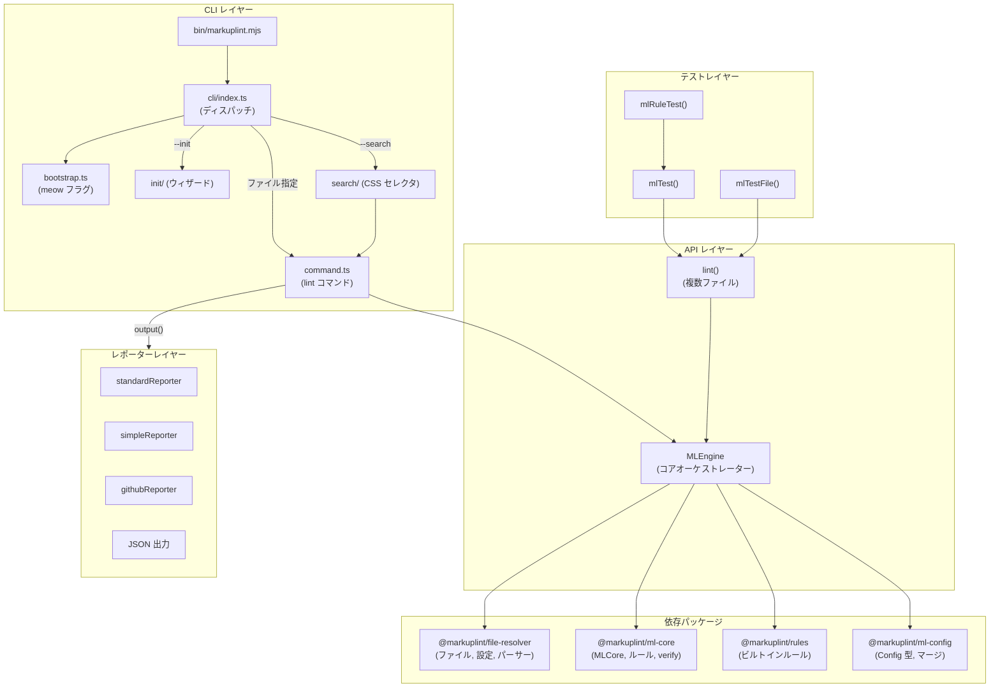
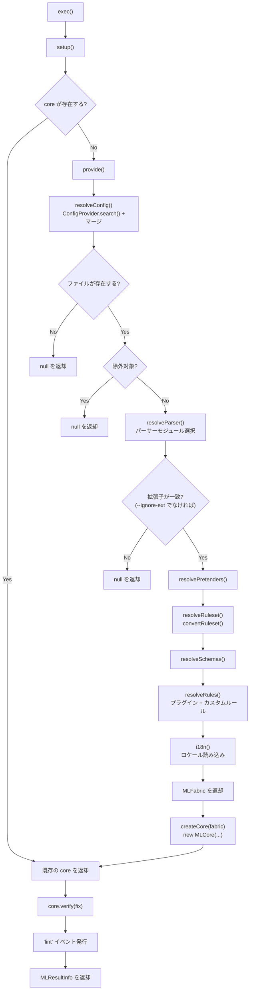
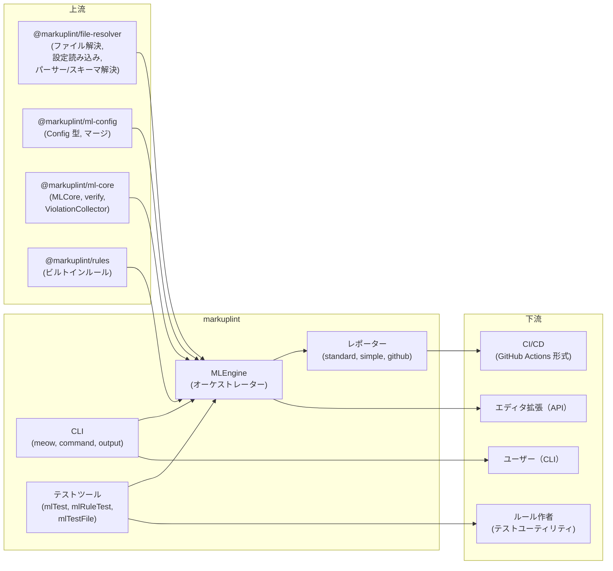

# markuplint

## 概要

`markuplint` は markuplint リンティングエコシステムのメイン統合パッケージです。CLI ツール、プログラマティック API、テストユーティリティを提供します。コアの `MLEngine` クラスがリンティングパイプライン全体をオーケストレーションし、ファイル解決→設定ロード→パーサー選択→ルール実行→結果出力を統括します。`@markuplint/file-resolver`、`@markuplint/ml-core`、`@markuplint/rules` 等のパッケージをエンドユーザー、エディタ拡張、CI/CD 環境向けの統一インターフェースに統合しています。

## ディレクトリ構成

```
bin/
└── markuplint.mjs            -- CLI 実行可能エントリーポイント
src/
├── index.ts                  -- パッケージエクスポート（MLEngine, テストツール, 型, i18n）
├── types.ts                  -- MLResultInfo 型定義
├── version.ts                -- パッケージバージョン文字列（package.json から取得）
├── i18n.ts                   -- ロケール検出とメッセージ読み込み
├── debug.ts                  -- デバッグログ（名前空間: markuplint-cli）
├── global-settings.ts        -- グローバル設定管理（ロケール）
├── get-json-module.ts        -- 動的 JSON モジュールローダー（安全な require ラッパー）
├── v1.ts                     -- 非推奨 v1 API の再エクスポート
├── api/
│   ├── index.ts              -- API エクスポート（MLEngine, lint）
│   ├── types.ts              -- APIOptions, MLEngineEventMap
│   ├── ml-engine.ts          -- MLEngine クラス（コアオーケストレーター）
│   ├── ml-engine.spec.ts     -- MLEngine テスト
│   ├── lint.ts               -- スタンドアロン lint() 関数
│   └── v1.ts                 -- 非推奨 v1 lint 関数
├── cli/
│   ├── index.ts              -- CLI エントリ（引数解析、コマンドディスパッチ）
│   ├── bootstrap.ts          -- meow CLI 定義（フラグ、ヘルプテキスト）
│   ├── command.ts            -- lint コマンド実装
│   ├── output.ts             -- レポーターディスパッチ（format → reporter）
│   ├── index.spec.ts         -- CLI 統合テスト
│   ├── init/                 -- --init サブコマンド（対話式ウィザード）
│   │   ├── index.ts          -- 初期化フロー制御
│   │   ├── types.ts          -- Langs, Category, RuleSettingMode 型
│   │   ├── create-config.ts  -- ユーザー選択からの設定生成
│   │   ├── get-default-rules.ts -- ビルトインルールメタデータ抽出
│   │   ├── select-modules.ts -- 言語選択からの npm モジュールリスト
│   │   └── *.spec.ts         -- 初期化ウィザードテスト
│   └── search/               -- --search サブコマンド（CSS セレクタ検索）
│       └── index.ts          -- 一時ルールを使った要素検索
├── reporter/
│   ├── index.ts              -- レポーターエクスポート
│   ├── standard-reporter.ts  -- 詳細マルチライン形式（ソースコンテキスト付き）
│   ├── simple-reporter.ts    -- コンパクト1行/違反形式
│   ├── github-reporter.ts    -- GitHub Actions アノテーション形式（::error, ::warning）
│   └── github-reporter.spec.ts
└── testing-tool/
    └── index.ts              -- mlTest(), mlRuleTest(), mlTestFile()
```

## アーキテクチャ図



## MLEngine クラス

リンティングパイプラインをオーケストレーションする中核クラス。`strict-event-emitter` の `Emitter<MLEngineEventMap>` を継承し、型安全なイベント発行を実現。

### 静的メソッド

| メソッド                         | 説明                                                                         |
| -------------------------------- | ---------------------------------------------------------------------------- |
| `fromCode(sourceCode, options?)` | インラインソースコードから MLEngine を生成。内部で MLFile を解決             |
| `toMLFile(target)`               | `Target`（ファイルパスまたはインラインソース）を `MLFile` インスタンスに変換 |

### インスタンスメソッド

| メソッド               | 説明                                                                                                  |
| ---------------------- | ----------------------------------------------------------------------------------------------------- |
| `exec()`               | linting を実行: `setup()` → `core.verify(fix)` を呼び出し、`MLResultInfo` を返却。スキップ時は `null` |
| `setCode(code)`        | ソースコードを更新し再パース。設定の再解決は行わない                                                  |
| `watchMode(enable)`    | chokidar によるファイル監視の有効/無効。変更時: 設定再解決 → core 更新 → 再 lint                      |
| `close()`              | すべてのイベントリスナーを除去しファイルウォッチャーを停止                                            |
| `resolveConfig(cache)` | 設定を解決（`--show-config` サポート用に公開）                                                        |

### パイプライン: setup -> provide -> exec



### 設定解決の優先順位

`resolveConfig()` メソッドは複数のソースから以下の優先順位（高い順）で設定を解決します:

```
1. options.config         -- API 経由で渡されたインライン設定オブジェクト
2. options.configFile     -- 明示的な設定ファイルパス（--config フラグ）
3. ConfigProvider.search()-- ファイル位置からの自動探索（--no-search-config でなければ）
4. options.defaultConfig  -- フォールバック設定
5. markuplint:recommended -- 設定が一切見つからない場合のデフォルト
```

これらは `ConfigProvider.resolve()` で結合され、`@markuplint/ml-config` の `mergeConfig()` を使用して全レイヤーをマージします。

### イベントシステム

| イベント        | ペイロード                                         | 発行タイミング         |
| --------------- | -------------------------------------------------- | ---------------------- |
| `log`           | phase, message                                     | 各処理段階             |
| `config`        | filePath, configSet                                | 設定解決後             |
| `exclude`       | filePath, setting                                  | ファイルが除外された時 |
| `parser`        | filePath, parserName                               | パーサー解決後         |
| `ruleset`       | filePath, ruleset                                  | ルールセット変換後     |
| `schemas`       | filePath, schemas                                  | スキーマ解決後         |
| `rules`         | filePath, rules                                    | ルール解決後           |
| `i18n`          | filePath, locale                                   | ロケール読み込み後     |
| `code`          | filePath, sourceCode                               | ソースコード取得後     |
| `lint`          | filePath, sourceCode, violations, fixedCode, debug | lint 完了後            |
| `lint-error`    | filePath, sourceCode, error                        | lint エラー時          |
| `config-errors` | filePath, errors                                   | 設定解決エラー時       |

### Watch モード

有効時、エンジンは `chokidar.FSWatcher` で設定ファイルを監視します（対象ファイル自体はエディタ/言語サーバーが管理するため監視しません）:

1. `resolveConfig()` が `configSet.files` をウォッチャーに追加
2. ファイル変更時: `onChange()` が発火
3. `provide(false)` でキャッシュなしの設定再解決
4. `core.update(fabric)` で core を新しい設定で更新
5. `exec()` でファイルを再 lint

## CLI アーキテクチャ

### エントリーポイントフロー

```
bin/markuplint.mjs
  -> import cli/index.ts
    |-- -v            -> cli.showVersion()   (exit 0)
    |-- -h            -> cli.showHelp(0)     (exit 0)
    |-- --verbose     -> verbosely()
    |-- --init        -> initialize()        (exit 0/1)
    |-- --create-rule -> エラーメッセージ    (exit 1, @markuplint/create-rule を使用)
    |-- files + --search -> search()         (exit 0)
    |-- files         -> command()           (exit 0/1)
    |-- stdin (pipe)  -> command([{sourceCode}]) (exit 0/1)
    `-- (引数なし)    -> cli.showHelp(1)     (exit 1)
```

### command() の処理フロー

1. `resolveFiles()` でファイル glob を `MLFile` リストに展開
2. `ViolationCollector` を `maxCount` 制限付きで作成
3. 各ファイルに対して:
   - オプション付きで `MLEngine` を作成
   - `--show-config` の場合: 計算済み設定を JSON で出力して終了
   - `engine.exec()` で lint を実行
   - `--progressive-output` かつ JSON 以外: 即座に出力
   - それ以外: メモリに結果を蓄積
   - 違反を `ViolationCollector` に収集
   - `--fix` の場合: 修正済みコードでファイルを上書き
4. 結果を出力（JSON: `collector.toArray()`、その他: ファイルごとに `output()` 経由）
5. `--max-warnings` しきい値をチェック
6. `hasError` を返却（終了コードとして使用）

### CLI オプション

| フラグ                     | 型      | デフォルト   | 説明                                          |
| -------------------------- | ------- | ------------ | --------------------------------------------- |
| `--config`, `-c`           | string  | --           | 設定ファイルパス                              |
| `--fix`                    | boolean | `false`      | 違反を自動修正                                |
| `--format`, `-f`           | string  | `"Standard"` | 出力形式: Standard, Simple, GitHub, JSON      |
| `--no-search-config`       | boolean | `false`      | 設定ファイルの自動探索を無効化                |
| `--ignore-ext`             | boolean | `false`      | 拡張子に関係なくファイルを lint               |
| `--no-import-preset-rules` | boolean | `false`      | ビルトインルールを読み込まない                |
| `--locale`                 | string  | OS ロケール  | 違反メッセージのロケール                      |
| `--no-color`               | boolean | `false`      | ANSI エスケープコードを除去                   |
| `--problem-only`, `-p`     | boolean | `false`      | 違反のあるファイルのみ表示                    |
| `--allow-warnings`         | boolean | `false`      | 警告があっても終了コード 0                    |
| `--allow-empty-input`      | boolean | `true`       | ファイルリストが空でもエラーにしない          |
| `--show-config`            | string  | --           | 計算済み設定を出力（`""` または `"details"`） |
| `--verbose`                | boolean | `false`      | デバッグ出力を有効化                          |
| `--include-node-modules`   | boolean | `false`      | node_modules 内のファイルを含める             |
| `--severity-parse-error`   | string  | `"error"`    | パースエラーの重大度: error, warning, off     |
| `--max-count`              | number  | `0`          | 表示する違反数の上限（0 = 制限なし）          |
| `--max-warnings`           | number  | `-1`         | 非ゼロ終了の警告数しきい値（-1 = 制限なし）   |
| `--progressive-output`     | boolean | `false`      | 各ファイル処理後に即座に結果を出力            |
| `--init`                   | boolean | `false`      | 対話式セットアップウィザードを実行            |
| `--search`                 | string  | --           | CSS セレクタで要素を検索                      |

## レポーターシステム

| 形式     | レポーター         | 出力先                         | 特徴                                                              |
| -------- | ------------------ | ------------------------------ | ----------------------------------------------------------------- |
| Standard | `standardReporter` | stderr（違反）/ stdout（合格） | マルチライン: ソースコンテキスト、行番号、ハイライト領域          |
| Simple   | `simpleReporter`   | stderr / stdout                | コンパクト: 1行/違反、重大度アイコン付き                          |
| GitHub   | `githubReporter`   | stderr / stdout                | GitHub Actions: `::error`, `::warning`, `::notice` アノテーション |
| JSON     | （command.ts 内）  | stdout                         | 構造化 JSON、`ViolationCollector.toArray()` 経由                  |

`cli/output.ts` の `output()` 関数が `--format` に応じて適切なレポーターにディスパッチします。違反は stderr に書き込み（`process.exitCode = 1` を設定）、問題のない結果は stdout に出力します。`--no-color` 時は `strip-ansi` で ANSI コードを除去します。

## テストツール

| 関数                                                   | 用途                                    |
| ------------------------------------------------------ | --------------------------------------- |
| `mlTest(sourceCode, config, rules?, locale?, fix?)`    | インラインソースコードをフル設定で lint |
| `mlRuleTest(rule, sourceCode, config?, fix?, locale?)` | 個別ルール実装のユニットテスト          |
| `mlTestFile(target, config?, rules?, locale?, fix?)`   | ファイルターゲットの統合テスト lint     |

### mlRuleTest の内部動作

`mlRuleTest()` は `<current-rule>` という名前の一時的な `MLRule` を作成し、簡略化されたテスト設定を完全な markuplint `Config` に変換します:

- `config.rule` → `rules: { '<current-rule>': value }`
- `config.nodeRule` → `nodeRules`（`<current-rule>` 配下にルール設定）
- `config.childNodeRule` → `childNodeRules`（同様）
- lint 後、violations から `ruleId` を除去し、テストアサーションをルール名に非依存にする

## 初期化ウィザード（--init）

対話フロー:

1. テンプレートエンジンを複数選択（JSX, Vue, Svelte, Pug, PHP 等）
2. npm 依存パッケージのインストールを確認
3. 選択: カテゴリごとにルールをカスタマイズ or recommended プリセット使用
4. カスタマイズの場合: 各カテゴリを確認（validation, a11y, naming-convention, maintainability, style）
5. パーサー/スペックマッピングと選択ルール付きで `.markuplintrc` を生成
6. 確認されていれば npm パッケージを自動インストール

`createConfig()` 関数は以下のように設定を構築:

- 各言語をパーサーモジュールとファイル拡張子パターンにマッピング
- Vue（`@markuplint/vue-spec`）、React（`@markuplint/react-spec`）、Svelte（`@markuplint/svelte-spec`）、Alpine 用のスペックパッケージを追加
- 選択カテゴリまたは `markuplint:recommended` プリセットからルールを設定

## Search サブコマンド（--search）

ファイル群から CSS セレクタに一致する要素を検索:

1. `__CLI_SEARCH__` という名前の一時 `MLRule` を作成
2. ルールの `verify()` が `document.querySelectorAll(selectors)` でマッチを検索
3. マッチしたノードから `{file, line, col}` の位置情報を収集
4. `file:line:col` 形式で stdout に結果を出力

`command()` を `importPresetRules: false`、`problemOnly: true` で呼び出し、完全な lint パイプラインを再利用します。

## 主要ソースファイル

| ファイル                            | 目的                                                                        |
| ----------------------------------- | --------------------------------------------------------------------------- |
| `src/api/ml-engine.ts`              | `MLEngine` クラス: パイプラインオーケストレーション、設定解決、watch モード |
| `src/api/lint.ts`                   | `lint()`: 複数ファイル lint の便利関数                                      |
| `src/api/types.ts`                  | `APIOptions`、`MLEngineEventMap` 型定義                                     |
| `src/cli/index.ts`                  | CLI エントリーポイント: 引数解析とコマンドディスパッチ                      |
| `src/cli/bootstrap.ts`              | `meow` CLI 定義（全フラグとヘルプテキスト）                                 |
| `src/cli/command.ts`                | `command()`: ファイルイテレーション、違反収集、出力                         |
| `src/cli/output.ts`                 | `output()`: レポーター選択と結果フォーマット                                |
| `src/reporter/standard-reporter.ts` | ソースコンテキスト付き詳細レポーター                                        |
| `src/reporter/simple-reporter.ts`   | コンパクト1行レポーター                                                     |
| `src/reporter/github-reporter.ts`   | GitHub Actions アノテーションレポーター                                     |
| `src/testing-tool/index.ts`         | `mlTest()`、`mlRuleTest()`、`mlTestFile()`                                  |
| `src/cli/init/index.ts`             | 対話式初期化ウィザード制御                                                  |
| `src/cli/init/create-config.ts`     | ウィザード選択からの設定生成                                                |
| `src/cli/search/index.ts`           | CSS セレクタ検索サブコマンド                                                |
| `src/types.ts`                      | `MLResultInfo` 型定義                                                       |
| `src/i18n.ts`                       | ロケール検出とメッセージセット読み込み                                      |
| `src/debug.ts`                      | デバッグロガー（名前空間: `markuplint-cli`）と `verbosely()`                |
| `src/global-settings.ts`            | グローバル設定（ロケール）管理                                              |

## 外部依存関係

| 依存パッケージ              | 用途                                                           |
| --------------------------- | -------------------------------------------------------------- |
| `@markuplint/file-resolver` | ファイル解決、設定読み込み、パーサー/スキーマ/ルール解決       |
| `@markuplint/ml-config`     | `Config` 型、`mergeConfig()`                                   |
| `@markuplint/ml-core`       | `MLCore`、`MLRule`、`ViolationCollector`、`convertRuleset()`   |
| `@markuplint/rules`         | ビルトイン lint ルール                                         |
| `@markuplint/html-parser`   | デフォルト HTML パーサー                                       |
| `@markuplint/html-spec`     | HTML 仕様定義                                                  |
| `@markuplint/i18n`          | ロケールセット型と翻訳メッセージ                               |
| `@markuplint/cli-utils`     | CLI 出力ユーティリティ、対話プロンプト、モジュールインストーラ |
| `@markuplint/shared`        | 共有ユーティリティ関数                                         |
| `chokidar`                  | ファイルシステム監視（watch モード）                           |
| `debug`                     | 名前空間付きデバッグログ                                       |
| `meow`                      | CLI 引数パーサー                                               |
| `os-locale`                 | OS ロケール検出                                                |
| `strict-event-emitter`      | 型安全イベントエミッター基底クラス                             |
| `strip-ansi`                | ANSI エスケープコード除去（--no-color）                        |

## 統合ポイント



### 上流

- **`@markuplint/file-resolver`** -- ファイルターゲットの解決、設定ファイルの探索と読み込み、パーサー/スキーマモジュールの解決
- **`@markuplint/ml-config`** -- `Config` 型と設定レイヤー統合用の `mergeConfig()` を提供
- **`@markuplint/ml-core`** -- ドキュメントのパースとルール検証用の `MLCore`、結果集約用の `ViolationCollector` を提供
- **`@markuplint/rules`** -- デフォルトで読み込まれるビルトインルールセットを提供

### 下流

- **ユーザー** -- CLI 経由で呼び出し（`npx markuplint`）
- **エディタ拡張** -- リアルタイム linting 用に `MLEngine` API をプログラマティックに使用
- **CI/CD** -- インラインアノテーション用の GitHub Actions レポーター形式を使用
- **ルール作者** -- カスタムルール実装のユニットテストに `mlRuleTest()` を使用

## ドキュメントマップ

- [メンテナンスガイド](docs/maintenance.ja.md) -- コマンド、レシピ、トラブルシューティング
