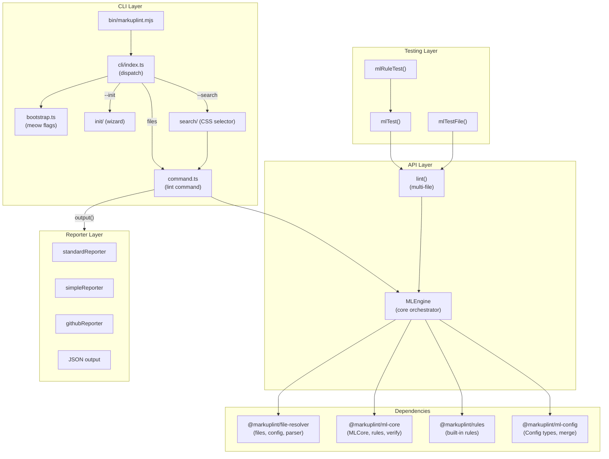
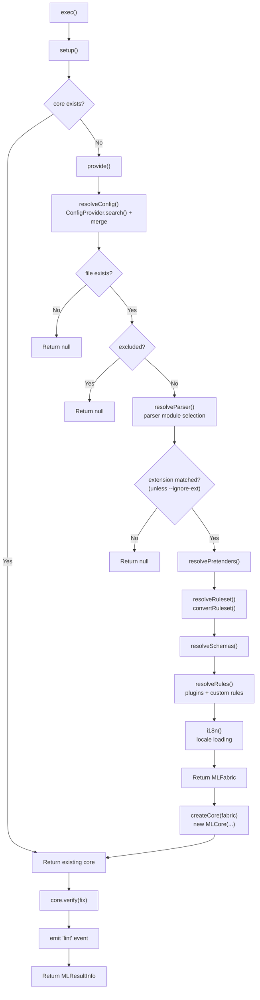
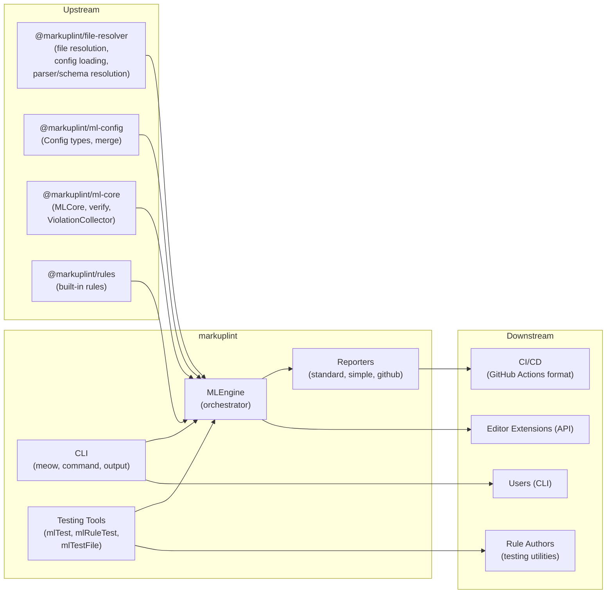

# markuplint

## Overview

`markuplint` is the main integration package for the markuplint linting ecosystem. It provides a CLI tool, a programmatic API, and testing utilities. The core `MLEngine` class orchestrates the entire linting pipeline: file resolution, configuration loading, parser selection, rule execution, and result output. It integrates `@markuplint/file-resolver`, `@markuplint/ml-core`, `@markuplint/rules`, and other packages into a unified interface for end users, editor extensions, and CI/CD environments.

## Directory Structure

```
bin/
└── markuplint.mjs            -- CLI executable entry point
src/
├── index.ts                  -- Package exports (MLEngine, testing tools, types, i18n)
├── types.ts                  -- MLResultInfo type definition
├── version.ts                -- Package version string (from package.json)
├── i18n.ts                   -- Locale detection and message loading
├── debug.ts                  -- Debug logging (namespace: markuplint-cli)
├── global-settings.ts        -- Global settings management (locale)
├── get-json-module.ts        -- Dynamic JSON module loader (safe require wrapper)
├── v1.ts                     -- Deprecated v1 API re-exports
├── api/
│   ├── index.ts              -- API exports (MLEngine, lint)
│   ├── types.ts              -- APIOptions, MLEngineEventMap
│   ├── ml-engine.ts          -- MLEngine class (core orchestrator)
│   ├── ml-engine.spec.ts     -- MLEngine tests
│   ├── lint.ts               -- Standalone lint() function
│   └── v1.ts                 -- Deprecated v1 lint function
├── cli/
│   ├── index.ts              -- CLI entry (arg parsing, command dispatch)
│   ├── bootstrap.ts          -- meow CLI definition (flags, help text)
│   ├── command.ts            -- Lint command implementation
│   ├── output.ts             -- Reporter dispatch (format -> reporter)
│   ├── index.spec.ts         -- CLI integration tests
│   ├── init/                 -- --init subcommand (interactive wizard)
│   │   ├── index.ts          -- Initialization flow orchestration
│   │   ├── types.ts          -- Langs, Category, RuleSettingMode types
│   │   ├── create-config.ts  -- Config generation from user selections
│   │   ├── get-default-rules.ts -- Built-in rule metadata extraction
│   │   ├── select-modules.ts -- npm module list from language selections
│   │   └── *.spec.ts         -- Init wizard tests
│   └── search/               -- --search subcommand (CSS selector search)
│       └── index.ts          -- Element search using temporary rule
├── reporter/
│   ├── index.ts              -- Reporter exports
│   ├── standard-reporter.ts  -- Detailed multi-line format with source context
│   ├── simple-reporter.ts    -- Compact one-line-per-violation format
│   ├── github-reporter.ts    -- GitHub Actions annotation format (::error, ::warning)
│   └── github-reporter.spec.ts
└── testing-tool/
    └── index.ts              -- mlTest(), mlRuleTest(), mlTestFile()
```

## Architecture Diagram



## MLEngine Class

The central class that orchestrates the linting pipeline. Extends `Emitter<MLEngineEventMap>` from `strict-event-emitter` for type-safe event emission.

### Static Methods

| Method                           | Description                                                                |
| -------------------------------- | -------------------------------------------------------------------------- |
| `fromCode(sourceCode, options?)` | Creates an MLEngine from inline source code. Resolves an MLFile internally |
| `toMLFile(target)`               | Converts a `Target` (file path or inline source) to an `MLFile` instance   |

### Instance Methods

| Method                 | Description                                                                                         |
| ---------------------- | --------------------------------------------------------------------------------------------------- |
| `exec()`               | Runs linting: calls `setup()`, then `core.verify(fix)`. Returns `MLResultInfo` or `null` if skipped |
| `setCode(code)`        | Updates the source code and re-parses without re-resolving configuration                            |
| `watchMode(enable)`    | Enables/disables file watching via chokidar. On change: re-resolve config, update core, re-lint     |
| `close()`              | Removes all event listeners and stops the file watcher                                              |
| `resolveConfig(cache)` | Resolves configuration (public for `--show-config` support)                                         |

### Pipeline: setup -> provide -> exec



### Configuration Resolution Priority

The `resolveConfig()` method resolves configuration from multiple sources with the following priority (highest to lowest):

```
1. options.config         -- Inline config object passed via API
2. options.configFile     -- Explicit config file path (--config flag)
3. ConfigProvider.search()-- Auto-discovery from file location (unless --no-search-config)
4. options.defaultConfig  -- Fallback config
5. markuplint:recommended -- Default when no config is found at all
```

These are combined via `ConfigProvider.resolve()` which merges all layers using `@markuplint/ml-config`'s `mergeConfig()`.

### Event System

| Event           | Payload                                            | Emitted When                |
| --------------- | -------------------------------------------------- | --------------------------- |
| `log`           | phase, message                                     | At each processing stage    |
| `config`        | filePath, configSet                                | After config resolution     |
| `exclude`       | filePath, setting                                  | When a file is excluded     |
| `parser`        | filePath, parserName                               | After parser resolution     |
| `ruleset`       | filePath, ruleset                                  | After ruleset conversion    |
| `schemas`       | filePath, schemas                                  | After schema resolution     |
| `rules`         | filePath, rules                                    | After rule resolution       |
| `i18n`          | filePath, locale                                   | After locale loading        |
| `code`          | filePath, sourceCode                               | After source code retrieval |
| `lint`          | filePath, sourceCode, violations, fixedCode, debug | After lint completion       |
| `lint-error`    | filePath, sourceCode, error                        | On lint error               |
| `config-errors` | filePath, errors                                   | On config resolution errors |

### Watch Mode

When enabled, the engine uses `chokidar.FSWatcher` to monitor configuration files (not the target file itself, which is managed by editors/language servers):

1. `resolveConfig()` adds `configSet.files` to the watcher
2. On file change: `onChange()` fires
3. `provide(false)` re-resolves config without cache
4. `core.update(fabric)` updates the core with new settings
5. `exec()` re-lints the file

## CLI Architecture

### Entry Point Flow

```
bin/markuplint.mjs
  -> import cli/index.ts
    |-- -v            -> cli.showVersion()   (exit 0)
    |-- -h            -> cli.showHelp(0)     (exit 0)
    |-- --verbose     -> verbosely()
    |-- --init        -> initialize()        (exit 0/1)
    |-- --create-rule -> error message       (exit 1, use @markuplint/create-rule)
    |-- files + --search -> search()         (exit 0)
    |-- files         -> command()           (exit 0/1)
    |-- stdin (pipe)  -> command([{sourceCode}]) (exit 0/1)
    `-- (no args)     -> cli.showHelp(1)     (exit 1)
```

### command() Processing Flow

1. `resolveFiles()` expands file globs into `MLFile` list
2. Create `ViolationCollector` with `maxCount` limit
3. For each file:
   - Create `MLEngine` with options
   - If `--show-config`: output computed config as JSON and return
   - `engine.exec()` to lint
   - If `--progressive-output` and not JSON: output immediately
   - Otherwise: accumulate results in memory
   - Collect violations into `ViolationCollector`
   - If `--fix`: overwrite file with fixed code
4. Output results (JSON format: `collector.toArray()`, others: per-file via `output()`)
5. Check `--max-warnings` threshold
6. Return `hasError` (used as exit code)

### CLI Options

| Flag                       | Type    | Default      | Description                                              |
| -------------------------- | ------- | ------------ | -------------------------------------------------------- |
| `--config`, `-c`           | string  | --           | Configuration file path                                  |
| `--fix`                    | boolean | `false`      | Auto-fix violations                                      |
| `--format`, `-f`           | string  | `"Standard"` | Output format: Standard, Simple, GitHub, JSON            |
| `--no-search-config`       | boolean | `false`      | Disable automatic config file discovery                  |
| `--ignore-ext`             | boolean | `false`      | Lint files regardless of extension                       |
| `--no-import-preset-rules` | boolean | `false`      | Do not load built-in rules                               |
| `--locale`                 | string  | OS locale    | Locale for violation messages                            |
| `--no-color`               | boolean | `false`      | Strip ANSI escape codes from output                      |
| `--problem-only`, `-p`     | boolean | `false`      | Only show files with violations                          |
| `--allow-warnings`         | boolean | `false`      | Exit 0 even with warnings                                |
| `--allow-empty-input`      | boolean | `true`       | Do not error on empty file list                          |
| `--show-config`            | string  | --           | Output computed config (`""` or `"details"`)             |
| `--verbose`                | boolean | `false`      | Enable debug output                                      |
| `--include-node-modules`   | boolean | `false`      | Include files in node_modules                            |
| `--severity-parse-error`   | string  | `"error"`    | Severity for parse errors: error, warning, off           |
| `--max-count`              | number  | `0`          | Limit total violations shown (0 = no limit)              |
| `--max-warnings`           | number  | `-1`         | Warning count threshold for nonzero exit (-1 = no limit) |
| `--progressive-output`     | boolean | `false`      | Output results as each file is processed                 |
| `--init`                   | boolean | `false`      | Run interactive setup wizard                             |
| `--search`                 | string  | --           | Search for elements by CSS selector                      |

## Reporter System

| Format   | Reporter           | Output Target                         | Characteristics                                                |
| -------- | ------------------ | ------------------------------------- | -------------------------------------------------------------- |
| Standard | `standardReporter` | stderr (violations) / stdout (passed) | Multi-line: source context, line numbers, highlighted regions  |
| Simple   | `simpleReporter`   | stderr / stdout                       | Compact: one line per violation with severity icon             |
| GitHub   | `githubReporter`   | stderr / stdout                       | GitHub Actions: `::error`, `::warning`, `::notice` annotations |
| JSON     | (in command.ts)    | stdout                                | Structured JSON via `ViolationCollector.toArray()`             |

The `output()` function in `cli/output.ts` dispatches to the appropriate reporter based on `--format`. Violations are written to stderr (setting `process.exitCode = 1`), clean results to stdout. When `--no-color` is set, ANSI codes are stripped via `strip-ansi`.

## Testing Tool

| Function                                               | Purpose                                           |
| ------------------------------------------------------ | ------------------------------------------------- |
| `mlTest(sourceCode, config, rules?, locale?, fix?)`    | Lint inline source code with a full configuration |
| `mlRuleTest(rule, sourceCode, config?, fix?, locale?)` | Unit test a single rule implementation            |
| `mlTestFile(target, config?, rules?, locale?, fix?)`   | Lint a file target for integration testing        |

### mlRuleTest Internals

`mlRuleTest()` creates a temporary `MLRule` named `<current-rule>` and translates the simplified test config format into a full markuplint `Config`:

- `config.rule` maps to `rules: { '<current-rule>': value }`
- `config.nodeRule` maps to `nodeRules` with rule settings under `<current-rule>`
- `config.childNodeRule` maps to `childNodeRules` similarly
- After linting, `ruleId` is removed from violations to make test assertions rule-name-independent

## Initialization Wizard (--init)

Interactive flow:

1. Multi-select template engines (JSX, Vue, Svelte, Pug, PHP, etc.)
2. Confirm npm dependency installation
3. Choose: customize rules per category or use recommended preset
4. If customizing: confirm each category (validation, a11y, naming-convention, maintainability, style)
5. Generate `.markuplintrc` with parser/spec mappings and selected rules
6. Auto-install npm packages if confirmed

The `createConfig()` function builds the config by:

- Mapping each language to its parser module and file extension pattern
- Adding spec packages for Vue (`@markuplint/vue-spec`), React (`@markuplint/react-spec`), Svelte (`@markuplint/svelte-spec`), and Alpine
- Populating rules from selected categories or the `markuplint:recommended` preset

## Search Subcommand (--search)

Searches for elements matching a CSS selector across files:

1. Creates a temporary `MLRule` named `__CLI_SEARCH__`
2. The rule's `verify()` uses `document.querySelectorAll(selectors)` to find matches
3. Collects `{file, line, col}` locations from matched nodes
4. Outputs results in `file:line:col` format to stdout

This reuses the full lint pipeline via `command()` with `importPresetRules: false` and `problemOnly: true`.

## Key Source Files

| File                                | Purpose                                                                 |
| ----------------------------------- | ----------------------------------------------------------------------- |
| `src/api/ml-engine.ts`              | `MLEngine` class: pipeline orchestration, config resolution, watch mode |
| `src/api/lint.ts`                   | `lint()`: multi-file linting convenience function                       |
| `src/api/types.ts`                  | `APIOptions`, `MLEngineEventMap` type definitions                       |
| `src/cli/index.ts`                  | CLI entry point: argument parsing and command dispatch                  |
| `src/cli/bootstrap.ts`              | `meow` CLI definition with all flags and help text                      |
| `src/cli/command.ts`                | `command()`: file iteration, violation collection, output               |
| `src/cli/output.ts`                 | `output()`: reporter selection and result formatting                    |
| `src/reporter/standard-reporter.ts` | Detailed reporter with source context                                   |
| `src/reporter/simple-reporter.ts`   | Compact single-line reporter                                            |
| `src/reporter/github-reporter.ts`   | GitHub Actions annotation reporter                                      |
| `src/testing-tool/index.ts`         | `mlTest()`, `mlRuleTest()`, `mlTestFile()`                              |
| `src/cli/init/index.ts`             | Interactive initialization wizard orchestration                         |
| `src/cli/init/create-config.ts`     | Config generation from wizard selections                                |
| `src/cli/search/index.ts`           | CSS selector search subcommand                                          |
| `src/types.ts`                      | `MLResultInfo` type definition                                          |
| `src/i18n.ts`                       | Locale detection and message set loading                                |
| `src/debug.ts`                      | Debug logger (namespace: `markuplint-cli`) and `verbosely()`            |
| `src/global-settings.ts`            | Global settings (locale) management                                     |

## External Dependencies

| Dependency                  | Purpose                                                        |
| --------------------------- | -------------------------------------------------------------- |
| `@markuplint/file-resolver` | File resolution, config loading, parser/schema/rule resolution |
| `@markuplint/ml-config`     | `Config` types, `mergeConfig()`                                |
| `@markuplint/ml-core`       | `MLCore`, `MLRule`, `ViolationCollector`, `convertRuleset()`   |
| `@markuplint/rules`         | Built-in lint rules                                            |
| `@markuplint/html-parser`   | Default HTML parser                                            |
| `@markuplint/html-spec`     | HTML specification definitions                                 |
| `@markuplint/i18n`          | Locale set types and translated messages                       |
| `@markuplint/cli-utils`     | CLI output utilities, interactive prompts, module installer    |
| `@markuplint/shared`        | Shared utility functions                                       |
| `chokidar`                  | File system watching (watch mode)                              |
| `debug`                     | Debug logging with namespaces                                  |
| `meow`                      | CLI argument parser                                            |
| `os-locale`                 | OS locale detection                                            |
| `strict-event-emitter`      | Type-safe event emitter base class                             |
| `strip-ansi`                | ANSI escape code removal (--no-color)                          |

## Integration Points



### Upstream

- **`@markuplint/file-resolver`** -- Resolves file targets, discovers and loads config files, resolves parser/schema modules
- **`@markuplint/ml-config`** -- Provides `Config` types and `mergeConfig()` for combining config layers
- **`@markuplint/ml-core`** -- Provides `MLCore` for document parsing and rule verification, `ViolationCollector` for result aggregation
- **`@markuplint/rules`** -- Provides the built-in rule set loaded by default

### Downstream

- **Users** -- Invoke via CLI (`npx markuplint`)
- **Editor Extensions** -- Use `MLEngine` API programmatically for real-time linting
- **CI/CD** -- Use GitHub Actions reporter format for inline annotations
- **Rule Authors** -- Use `mlRuleTest()` to unit test custom rule implementations

## Documentation Map

- [Maintenance Guide](docs/maintenance.md) -- Commands, recipes, and troubleshooting
